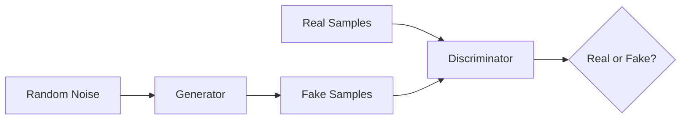

# 生成对抗网络GAN原理与代码实例讲解

关键词：生成对抗网络、GAN、深度学习、无监督学习、图像生成

## 1. 背景介绍
### 1.1 问题的由来
近年来，随着深度学习的飞速发展，生成模型成为了人工智能领域的研究热点之一。传统的生成模型如变分自编码器（VAE）在生成图像方面取得了一定的成果，但生成的图像质量和多样性仍有待提高。2014年，Goodfellow等人提出了生成对抗网络（Generative Adversarial Network，GAN）[1]，开创了生成模型的新纪元。
### 1.2 研究现状
GAN自提出以来，引起了学术界和工业界的广泛关注。大量研究者投入到GAN的理论研究和应用探索中，GAN已经成为了无监督学习领域最具代表性的模型之一。GAN在图像生成、图像翻译、超分辨率、图像修复等方面取得了瞩目的成果。同时，GAN也被应用到语音、视频、自然语言等其他领域，展现出了广阔的应用前景。
### 1.3 研究意义  
GAN作为一种全新的生成模型范式，其研究意义主要体现在以下几个方面：

1. 开辟了生成模型的新思路，为无监督学习提供了新的解决方案。
2. 生成效果出色，可以生成高质量、高分辨率的逼真图像。
3. 具有广泛的应用前景，可应用于多个领域，具有重要的理论和实践价值。
4. 对深度学习理论研究具有重要意义，促进了对抗学习、博弈论等理论与深度学习的结合。

### 1.4 本文结构
本文将全面介绍GAN的原理和代码实现。第2部分介绍GAN的核心概念；第3部分详细阐述GAN的算法原理和训练过程；第4部分给出GAN的数学模型和公式推导；第5部分通过代码实例讲解GAN的实现细节；第6部分总结GAN的典型应用场景；第7部分推荐GAN相关的学习资源；第8部分对GAN的研究现状和未来趋势进行总结展望。

## 2. 核心概念与联系
生成对抗网络实际上包含两个核心概念：生成器（Generator）和判别器（Discriminator）。

- 生成器：生成器是一个生成模型，其目的是捕获真实数据的分布，从随机噪声中生成尽可能逼真的假样本。
- 判别器：判别器是一个分类模型，其目的是判断一个样本是来自真实数据的分布还是由生成器生成的。

生成器和判别器在训练过程中形成了一种竞争对抗关系。生成器努力生成以假乱真的样本来欺骗判别器，而判别器则努力去区分真实样本和生成样本。两个网络相互博弈，最终达到一个纳什均衡，此时生成器可以生成足以以假乱真的样本，而判别器也难以判断生成样本与真实样本的区别。

GAN的核心思想可以用下图来表示：

## 3. 核心算法原理 & 具体操作步骤
### 3.1 算法原理概述
GAN的训练过程可以看作是生成器和判别器之间的极小极大博弈。生成器的目标是最小化其生成样本被判别器识别为假样本的概率，而判别器的目标是最大化对真实样本和生成样本的正确分类概率。用数学语言描述如下：

$$\min_{G} \max_{D} V(D,G) = \mathbb{E}_{x \sim p_{data}(x)}[\log D(x)] + \mathbb{E}_{z \sim p_{z}(z)}[\log (1 - D(G(z)))]$$

其中，$G$ 表示生成器，$D$ 表示判别器，$x$ 表示真实样本，$z$ 表示随机噪声，$p_{data}$ 表示真实数据的分布，$p_z$ 表示随机噪声的分布。

### 3.2 算法步骤详解
GAN的训练过程可以分为以下几个步骤：

1. 初始化生成器 $G$ 和判别器 $D$ 的参数。
2. 从真实数据分布 $p_{data}$ 中采样一批真实样本 $\{x^{(1)}, \ldots, x^{(m)}\}$。
3. 从随机噪声分布 $p_z$ 中采样一批噪声样本 $\{z^{(1)}, \ldots, z^{(m)}\}$。
4. 利用生成器 $G$ 将噪声样本映射为生成样本 $\{\tilde{x}^{(1)}, \ldots, \tilde{x}^{(m)}\}$，其中 $\tilde{x}^{(i)} = G(z^{(i)})$。
5. 利用判别器 $D$ 对真实样本和生成样本进行二分类，得到相应的输出概率。
6. 计算判别器的损失函数：
$$\mathcal{L}_D = -\frac{1}{m}\sum_{i=1}^m [\log D(x^{(i)}) + \log (1 - D(\tilde{x}^{(i)}))]$$
7. 通过反向传播算法更新判别器 $D$ 的参数，最小化判别器损失 $\mathcal{L}_D$。
8. 计算生成器的损失函数：
$$\mathcal{L}_G = -\frac{1}{m}\sum_{i=1}^m \log D(\tilde{x}^{(i)})$$
9. 通过反向传播算法更新生成器 $G$ 的参数，最小化生成器损失 $\mathcal{L}_G$。
10. 重复步骤2-9，直到达到预设的训练轮数或满足收敛条件。

### 3.3 算法优缺点
GAN算法的优点主要包括：

1. 生成效果出色，可以生成高质量、高分辨率的逼真图像。
2. 无需先验知识，可以从无监督数据中学习数据分布。
3. 具有广泛的应用前景，可应用于多个领域。

GAN算法的缺点主要包括：

1. 训练不稳定，容易出现模式崩溃、梯度消失等问题。
2. 评估困难，缺乏有效的定量评估指标。
3. 生成多样性不足，容易出现模式塌陷现象。

### 3.4 算法应用领域
GAN在多个领域都有广泛应用，主要包括：

1. 图像生成：利用GAN可以生成逼真的人脸、动物、风景等图像。
2. 图像翻译：利用GAN可以实现图像风格迁移、图像去噪、超分辨率等任务。
3. 语音合成：利用GAN可以实现语音转换、语音合成等任务。
4. 视频生成：利用GAN可以生成连贯的视频序列。
5. 自然语言处理：利用GAN可以实现文本生成、对话生成等任务。

## 4. 数学模型和公式 & 详细讲解 & 举例说明
### 4.1 数学模型构建
GAN的数学模型可以表示为一个极小极大博弈问题：

$$\min_{G} \max_{D} V(D,G) = \mathbb{E}_{x \sim p_{data}(x)}[\log D(x)] + \mathbb{E}_{z \sim p_{z}(z)}[\log (1 - D(G(z)))]$$

其中，$V(D,G)$ 表示判别器和生成器的博弈目标函数，$D(x)$ 表示判别器将样本 $x$ 判别为真实样本的概率，$G(z)$ 表示生成器将随机噪声 $z$ 映射为生成样本的过程。

### 4.2 公式推导过程
为了更好地理解GAN的数学模型，我们对其进行详细推导。首先，我们定义判别器的优化目标为最大化以下期望：

$$\mathbb{E}_{x \sim p_{data}(x)}[\log D(x)] + \mathbb{E}_{z \sim p_{z}(z)}[\log (1 - D(G(z)))]$$

其中第一项表示对真实样本的正确分类概率，第二项表示对生成样本的正确分类概率。将两项合并可得判别器的优化目标：

$$\max_{D} V(D,G) = \mathbb{E}_{x \sim p_{data}(x)}[\log D(x)] + \mathbb{E}_{z \sim p_{z}(z)}[\log (1 - D(G(z)))]$$

接下来我们考虑生成器的优化目标。生成器希望自己生成的样本能够以假乱真，即希望判别器将生成样本误判为真实样本。因此，生成器的优化目标可以表示为：

$$\min_{G} \mathbb{E}_{z \sim p_{z}(z)}[\log (1 - D(G(z)))]$$

将判别器和生成器的优化目标结合，即得到了GAN的完整数学模型：

$$\min_{G} \max_{D} V(D,G) = \mathbb{E}_{x \sim p_{data}(x)}[\log D(x)] + \mathbb{E}_{z \sim p_{z}(z)}[\log (1 - D(G(z)))]$$

### 4.3 案例分析与讲解
下面我们以图像生成任务为例，对GAN的数学模型进行讲解。假设我们希望利用GAN生成人脸图像，真实样本 $x$ 为高清人脸图像，随机噪声 $z$ 为服从高斯分布的 100 维向量。

生成器 $G$ 将随机噪声 $z$ 映射为生成图像 $\tilde{x} = G(z)$，其中 $\tilde{x}$ 与真实人脸图像 $x$ 具有相同的尺寸。判别器 $D$ 接收一张图像作为输入，输出该图像为真实图像的概率。

在训练过程中，我们交替优化生成器和判别器的参数。对于判别器，我们希望最大化以下目标：

$$\mathbb{E}_{x \sim p_{data}(x)}[\log D(x)] + \mathbb{E}_{z \sim p_{z}(z)}[\log (1 - D(G(z)))]$$

即希望判别器能够正确区分真实人脸图像和生成图像。对于生成器，我们希望最小化以下目标：

$$\mathbb{E}_{z \sim p_{z}(z)}[\log (1 - D(G(z)))]$$

即希望生成器能够生成以假乱真的人脸图像，使得判别器将其误判为真实图像。

通过不断的训练和优化，生成器和判别器的性能都会不断提升，最终生成器可以生成高质量、逼真的人脸图像。

### 4.4 常见问题解答
**问题1：GAN训练过程中出现模式崩溃怎么办？**

模式崩溃是指生成器只生成少数几种特定模式的样本，导致生成样本缺乏多样性。解决模式崩溃的常见方法包括：

1. 采用改进的损失函数，如Wasserstein GAN、LSGAN等。
2. 在生成器的目标函数中加入多样性正则项，鼓励生成器生成多样化的样本。
3. 采用渐进式增长的网络结构，从低分辨率开始逐步增加生成图像的分辨率。

**问题2：GAN的收敛性如何判断？**

GAN的收敛性判断是一个难题，目前尚无公认的最优判据。常见的收敛性判断方法包括：

1. 人工视觉评估生成样本的质量和多样性。
2. 利用Inception Score、FID等指标定量评估生成样本的性能。
3. 观察判别器和生成器损失函数的变化趋势，一般来说，收敛时两个损失函数趋于稳定。

**问题3：如何平衡生成器和判别器的训练？**

平衡生成器和判别器的训练是GAN的关键。如果判别器训练得太强，会导致生成器梯度消失；如果生成器训练得太强，会导致判别器无法提供有效的监督信号。常见的平衡技巧包括：

1. 调整生成器和判别器的更新频率，例如每更新一次生成器就更新多次判别器。
2. 在生成器的损失函数中加入正则项，限制生成器的能力。
3. 采用梯度惩罚、谱归一化等技术，