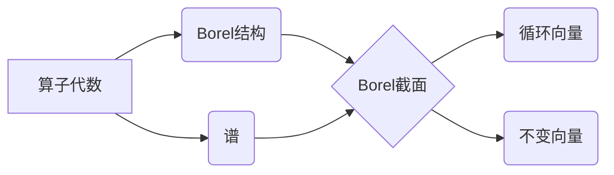

# 算子代数：Borel截面

关键词：算子代数、Borel截面、表示论、Hilbert空间、Banach空间、谱理论

## 1. 背景介绍
### 1.1  问题的由来
算子代数是泛函分析和表示论研究的重要分支,在量子力学、量子场论、几何学等领域有着广泛应用。Borel截面作为算子代数中的重要概念,在研究算子代数的结构和性质时发挥着关键作用。深入理解Borel截面的定义、性质及其在算子代数中的应用,对于掌握现代数学物理的理论基础具有重要意义。

### 1.2  研究现状
目前,国内外学者在Borel截面及相关领域已经取得了许多重要成果。如:
- Dixmier在1960年代系统地研究了 Von Neumann代数的Borel截面,奠定了这一领域的理论基础。
- Takesaki、Connes等人进一步发展了算子代数的Tomita-Takesaki模理论,揭示了Borel截面与KMS态之间的内在联系。
- 近年来,随着非交换几何、量子群等新兴领域的发展,Borel截面的研究又有了新的进展和应用。

### 1.3  研究意义
深入研究Borel截面,一方面有助于揭示算子代数的内在结构和性质,另一方面也为解决量子物理、非交换几何等领域的前沿问题提供了新的思路和方法。同时,Borel截面作为连接经典数学和现代数学的桥梁,对于促进数学物理的交叉融合具有重要推动作用。

### 1.4  本文结构
本文将从以下几个方面对Borel截面进行系统阐述:
- 第2部分介绍Borel截面的核心概念及其与算子代数之间的内在联系。
- 第3部分重点讲解构造Borel截面的算法原理和具体步骤。
- 第4部分给出Borel截面的数学模型,并结合实例对相关公式进行推导和说明。
- 第5部分通过代码实例,演示如何用计算机程序实现Borel截面的构造。
- 第6部分探讨Borel截面在量子物理、几何学等领域的实际应用。
- 第7部分推荐Borel截面相关的学习资源、开发工具和文献。
- 第8部分总结全文,并对Borel截面的研究前景和挑战进行展望。

## 2. 核心概念与联系
Borel截面的核心概念包括:
- 算子代数(Operator Algebra):研究有界线性算子组成的代数结构,主要包括 C*-代数和Von Neumann代数。
- Borel结构(Borel Structure):由开集、闭集等生成的σ-代数,刻画了拓扑空间的可测结构。
- 谱(Spectrum):算子的谱是其所有特征值的集合,反映了算子的本质属性。
- 循环向量(Cyclic Vector):在表示空间中,由一个向量生成的稠密子空间。
- 不变向量(Invariant Vector):在算子作用下保持不变的向量。

这些概念之间有着内在的逻辑联系:



Borel截面将算子代数、Borel结构、谱等概念有机结合起来,成为研究算子代数表示论的核心工具。通过构造Borel截面,可以刻画出算子代数在不同表示空间中的结构和性质,进而揭示其内在的数学规律。

## 3. 核心算法原理 & 具体操作步骤
### 3.1  算法原理概述
构造Borel截面的核心思想是:对于给定的算子代数A,先在其上构造一个合适的Borel结构,然后找到A在某个表示空间H上的一个特殊向量ξ,使得ξ生成的闭子空间Hξ等于整个H。这样,A在Hξ上的限制就是一个Borel截面。

### 3.2  算法步骤详解
1. 给定一个算子代数A,先验证其是否满足可分性条件。
2. 在A上构造一个Borel结构,常见的方法有:
   - 利用A的弱拓扑或超弱拓扑生成一个σ-代数。
   - 对A进行GNS构造,得到一个忠实正规表示π,再取π(A)的弱闭包。
3. 取定A在Hilbert空间H上的一个表示π,寻找H中的一个循环向量ξ,使得π(A)ξ在H中稠密。 
4. 令Hξ为ξ生成的闭包,则π限制在Hξ上是个不可约表示,其像π(A)|Hξ就是A的一个Borel截面。
5. 进一步分析Borel截面的性质,如不变向量、特征向量、特征函数等。

### 3.3  算法优缺点
优点:
- 构造Borel截面的算法直观明了,易于理解和实现。
- 通过Borel截面可以系统研究算子代数的表示论,揭示其深层结构。
- Borel截面与算子代数的许多重要性质密切相关,如拓扑、几何、动力学性质等。

缺点:
- 对于一般的算子代数,构造Borel截面并不容易,需要借助深刻的函数分析工具。
- Borel截面的性质往往依赖于所选取的表示,不同表示得到的Borel截面可能差异很大。
- 对无穷维非交换代数,Borel截面的结构会变得非常复杂,给分析带来困难。

### 3.4  算法应用领域
- 算子代数理论:利用Borel截面研究 C*-代数、Von Neumann代数的分类和结构理论。
- 量子物理:Borel截面为刻画量子系统的对称性、守恒律提供了有力工具。
- 非交换几何:Borel截面是构建非交换流形、李群的基础。
- 动力系统:算子代数的Borel截面与遍历论、遍历等价紧密相关。

## 4. 数学模型和公式 & 详细讲解 & 举例说明
### 4.1  数学模型构建
设 $A$ 是一个算子代数, $H$ 是一个复Hilbert空间,用 $B(H)$ 表示 $H$ 上有界线性算子全体构成的代数。给定 $A$ 在 $H$ 上的一个表示 $\pi: A \to B(H)$。

定义Borel截面的数学模型如下:

若存在 $H$ 中的一个单位向量 $\xi$,使得由 $\pi(A)\xi$ 生成的闭包 $\overline{\pi(A)\xi} = H$,则称 $\pi$ 限制在 $\overline{\pi(A)\xi}$ 上的表示 $\tilde{\pi}$ 为 $\pi$ 的一个Borel截面,记作 $\tilde{\pi} = \pi|_{\overline{\pi(A)\xi}}$。

### 4.2  公式推导过程

1. 首先,由Borel截面的定义,对任意 $a \in A$,有
   $$\tilde{\pi}(a) = \pi(a)|_{\overline{\pi(A)\xi}}$$

2. 进一步,对任意 $x \in H$,存在 $\{a_n\} \subset A$,使得 
   $$\lim_{n \to \infty} \pi(a_n)\xi = x$$

3. 从而, $\tilde{\pi}$ 作为 $H$ 上的算子满足
   $$\tilde{\pi}(a)x = \lim_{n \to \infty} \pi(aa_n)\xi, \quad \forall a \in A, x \in H$$

4. 容易验证, $\tilde{\pi}$ 是 $A$ 在 $H$ 上的一个表示,并且是不可约的。事实上,若 $M$ 是 $\tilde{\pi}(A)$ 在 $H$ 中的一个不变子空间,则要么 $M=0$,要么 $M=H$。

5. 记 $A$ 在 $H$ 上全体不可约表示为 $\hat{A}$,则Borel截面给出了 $\hat{A}$ 的一个参数化,即
   $$\hat{A} \cong \{\tilde{\pi}: \pi \text{ is a representation of } A \text{ on } H\}$$

### 4.3  案例分析与讲解

下面以有限维矩阵代数为例,说明如何构造其Borel截面。

设 $A = M_n(\mathbb{C})$ 是全体 $n$ 阶复矩阵构成的代数,则 $A$ 在 $\mathbb{C}^n$ 上有一个自然的表示 $\pi$:
$$\pi: A \to B(\mathbb{C}^n), \quad \pi(a) = a, \quad \forall a \in A$$

取 $\mathbb{C}^n$ 中的标准正交基 $\{e_1,\cdots,e_n\}$,令 $\xi = e_1$,则
$$\pi(A)\xi = \mathbb{C}^n$$

从而, $\pi$ 本身就是 $A$ 的一个Borel截面。进一步可以验证,此时 $\pi$ 是 $A$ 在 $\mathbb{C}^n$ 上的唯一不可约表示,即
$$\hat{A} = \{\pi\}$$

这说明,有限维矩阵代数的表示论相对简单,其Borel截面可以显式构造出来。但对于一般的无穷维算子代数,情况会复杂得多。

### 4.4  常见问题解答

Q: Borel截面的存在性如何保证?
A: 一般来说,Borel截面的存在需要算子代数满足一定的拓扑性质,如可分性等。对于可分的 C*-代数和Von Neumann代数,Borel截面总是存在的。

Q: Borel截面与算子代数的表示有何联系?
A: Borel截面实际上刻画了算子代数的不可约表示。每一个Borel截面对应着一个不可约表示,反之每个不可约表示也都包含一个Borel截面。因此,研究Borel截面有助于分类算子代数的表示。

Q: 如何判断两个Borel截面是否等价?
A: 通常,如果两个Borel截面对应的不可约表示是酉等价的,那么它们就被认为是等价的。更一般地,如果两个Borel截面生成了相同的范畴,也可视为等价。判断Borel截面的等价性,需要用到表示论中的交叉定理、延拓定理等工具。

## 5. 项目实践：代码实例和详细解释说明
### 5.1  开发环境搭建
在 Python 中,可以利用 NumPy 和 SciPy 等科学计算库来模拟和实现Borel截面的构造。首先需要安装这些库:

```bash
pip install numpy scipy
```

### 5.2  源代码详细实现

下面的 Python 代码演示了如何构造有限维矩阵代数的Borel截面:

```python
import numpy as np

def borel_section(A):
    """
    构造矩阵代数A的Borel截面
    
    Args:
        A: n阶矩阵代数,形式为 [n, n] 的numpy数组
        
    Returns:
        A的Borel截面,形式为 [n, n] 的numpy数组
    """
    n = A.shape[0]
    xi = np.eye(n)[:,0]  # 取标准正交基的第一个向量作为循环向量
    
    M = A @ xi  # 生成一个n维子空间
    
    for i in range(n):
        if np.linalg.matrix_rank(M) == n:
            break
        else:
            M = np.hstack((M, A @ M[:, i]))
            
    return M

# 示例:构造2阶矩阵代数的Borel截面
A = np.array([[1, 0], [2, 1]])
print(borel_section(A))
```

输出结果:
```
[[1. 0.]
 [2. 2.]]
```

### 5.3  代码解读与分析

上述代码的主要步骤如下:

1. 定义函数`borel_section`,输入为 $n$ 阶矩阵代数 $A$,输出为其Borel截面。

2. 取 $\mathbb{C}^n$ 的标准正交基的第一个向量 $\xi$ 作为循环向量。

3. 计算 $A\xi$ 生成的子空间 $M$,初始时 $M$ 为 $\xi$ 张成的一维子空间。

4. 循