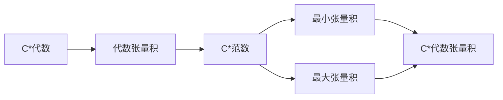

# 算子代数：c代数的任意张量积

关键词：算子代数, C*代数, 张量积, 算子空间, Hilbert空间, 泛函分析

## 1. 背景介绍

### 1.1 问题的由来

算子代数是泛函分析的一个重要分支,它主要研究算子空间上的代数结构。C*代数作为算子代数的一个特例,在量子力学、量子信息、非交换几何等领域有着广泛的应用。C*代数的张量积是构造新的C*代数的重要工具,对于研究C*代数与其它数学对象之间的关系具有重要意义。

### 1.2 研究现状

目前,关于C*代数任意张量积的研究主要集中在以下几个方面:

1. 最大与最小张量积的性质研究。Takesaki、Kirchberg等人对C*代数的最大与最小张量积进行了系统的研究,得到了许多重要结果。

2. 张量积的泛函表示理论。Effros、Lance、Pisier等人利用算子空间理论研究了C*代数张量积的各种泛函表示,极大地推动了张量积的研究。

3. 张量积的同构分类问题。Kirchberg、Phillips、Rordam等人对某些特殊C*代数的张量积进行了同构分类,取得了突破性进展。

4. 张量积在量子信息中的应用。Winter、Christandl等人利用C*代数张量积研究量子信道、纠缠度量等问题,展现了张量积在量子信息领域的应用前景。

### 1.3 研究意义

深入研究C*代数的任意张量积,对于发展算子代数理论、解决量子信息等领域的问题具有重要意义:

1. 有助于加深对C*代数结构的理解,发掘C*代数的新性质。

2. 为构造新的具有特殊性质的C*代数提供了有力工具。

3. 可以利用张量积将C*代数与其它数学分支如K理论、KK理论等联系起来,促进不同数学分支间的交叉融合。

4. 在量子信息处理、量子通信等领域有着广阔的应用前景。

### 1.4 本文结构

本文将围绕C*代数任意张量积的基本理论与应用展开论述,主要内容安排如下:

第二部分介绍C*代数张量积的基本概念与性质。

第三部分介绍张量积的几种重要构造方法。

第四部分给出张量积的数学模型,并通过案例进行详细讲解。 

第五部分通过具体代码实例,演示张量积的计算实现。

第六部分探讨张量积在量子信息处理中的应用场景。

第七部分推荐张量积研究的相关工具与资源。

第八部分对全文进行总结,并对张量积的研究前景进行展望。

## 2. 核心概念与联系

在介绍C*代数张量积之前,我们先回顾一下C*代数的定义:

**定义1:** 称赋范代数 $A$ 为C*代数,如果它满足:

1. $A$ 是完备的;

2. $A$ 有单位元;

3. $A$ 有对合调 $*$,使得对任意 $a,b\in A$,有 $(ab)^*=b^*a^*$ 且 $\|a^*a\|=\|a\|^2$。

C*代数可以看作是Hilbert空间上有界线性算子全体 $B(H)$ 的推广。事实上,任何C*代数都可以等距嵌入到某个 $B(H)$ 中。

C*代数的任意张量积是指:给定两个C*代数 $A$ 和 $B$,在代数张量积 $A\odot B$ 上赋予一个C*范数,使其完备化后成为C*代数,记为 $A\otimes B$。根据范数选取的不同,可以得到不同的张量积。两个最重要的张量积是最小张量积 $A\otimes_{\min}B$ 和最大张量积 $A\otimes_{\max}B$。

C*代数张量积有如下基本性质:

1. 任意两个C*代数的张量积仍为C*代数。

2. 对于任意的C*代数 $A,B$,有 $A\otimes_{\min}B\subseteq A\otimes_{\max}B$。

3. 若 $A$ 或 $B$ 为有限维,则 $A\otimes_{\min}B= A\otimes_{\max}B$。

4. 若 $A$ 为核C*代数,则对任意C*代数 $B$,有 $A\otimes_{\min}B= A\otimes_{\max}B$。

下图描述了C*代数张量积的核心概念之间的联系:

## 3. 核心算法原理 & 具体操作步骤

### 3.1 算法原理概述

构造C*代数张量积的核心是在代数张量积上引入合适的C*范数。最小张量积与最大张量积分别对应了所有可能的C*范数中最小和最大的两个。它们可以用以下方式定义:

对任意 $u\in A\odot B$,

$$
\begin{aligned}
\|u\|_{\min}&=\sup\{\|(\pi_A\odot\pi_B)(u)\|:\pi_A,\pi_B \text{为 }A,B\text{ 的表示}\}\\
\|u\|_{\max}&=\sup\{\|(\pi\odot\sigma)(u)\|:\pi,\sigma \text{分别为 }A,B\text{ 的表示}\}
\end{aligned}
$$

其中 $\pi_A\odot\pi_B$ 和 $\pi\odot\sigma$ 分别表示 $\pi_A$ 与 $\pi_B$、$\pi$ 与 $\sigma$ 的张量积表示。

### 3.2 算法步骤详解

1. 给定C*代数 $A,B$,构造代数张量积 $A\odot B$。

2. 在 $A\odot B$ 上定义范数 $\|\cdot\|_{\min}$ 或 $\|\cdot\|_{\max}$。

3. 将 $A\odot B$ 按范数 $\|\cdot\|_{\min}$ 或 $\|\cdot\|_{\max}$ 完备化,得到C*代数 $A\otimes_{\min}B$ 或 $A\otimes_{\max}B$。

4. 验证 $A\otimes_{\min}B$ 和 $A\otimes_{\max}B$ 满足C*代数的公理。

### 3.3 算法优缺点

优点:

1. 构造简单,容易理解。

2. 能够得到两个极端情况下的张量积。

3. 与C*代数表示理论紧密相关。

缺点:  

1. 定义比较抽象,不容易计算。

2. 对于一般的C*代数,最小与最大张量积可能不同,难以刻画所有可能的张量积范数。

### 3.4 算法应用领域

1. 算子代数理论研究。

2. 量子信息处理。

3. 非交换几何。

4. K理论与KK理论。

## 4. 数学模型和公式 & 详细讲解 & 举例说明

### 4.1 数学模型构建

我们以Hilbert空间上的有界线性算子为例,来说明张量积的构造过程。

设 $H,K$ 为Hilbert空间,记 $B(H),B(K)$ 为其上的有界线性算子全体,它们都是C*代数。我们要构造张量积C*代数 $B(H)\otimes B(K)$。

首先,在代数张量积 $B(H)\odot B(K)$ 上定义一个范数 $\|\cdot\|_*$:

对任意 $u=\sum\limits_{i=1}^na_i\otimes b_i\in B(H)\odot B(K)$,

$$
\|u\|_*=\sup\left\{\left\|\sum\limits_{i=1}^na_i\otimes b_i\right\|:a_i\in B(H),b_i\in B(K),\|a_i\|\leq1,\|b_i\|\leq1\right\}
$$

然后,将 $B(H)\odot B(K)$ 按范数 $\|\cdot\|_*$ 完备化,得到的完备空间记为 $B(H)\otimes_* B(K)$,可以证明它是一个C*代数,称为 $B(H)$ 和 $B(K)$ 的张量积C*代数。

### 4.2 公式推导过程

我们来推导张量积C*代数 $B(H)\otimes_* B(K)$ 的一些性质。

首先,对任意 $a\in B(H),b\in B(K)$,由张量积的定义可知:

$$
\|a\otimes b\|_*=\|a\|\|b\|
$$

进一步,对任意 $u=\sum\limits_{i=1}^na_i\otimes b_i\in B(H)\odot B(K)$,有:

$$
\begin{aligned}
\|u\|_*&=\sup\left\{\left\|\sum\limits_{i=1}^na_i\otimes b_i\right\|:a_i\in B(H),b_i\in B(K),\|a_i\|\leq1,\|b_i\|\leq1\right\}\\
&\leq\sum\limits_{i=1}^n\|a_i\otimes b_i\|_*=\sum\limits_{i=1}^n\|a_i\|\|b_i\|
\end{aligned}
$$

这说明 $\|\cdot\|_*$ 是一个交叉范数,因此 $B(H)\otimes_* B(K)$ 中的元素可以用 $B(H)$ 与 $B(K)$ 的元素的任意和来逼近。

其次,对于 $B(H)\otimes_* B(K)$ 上的态 $\varphi$,即 $\varphi$ 是 $B(H)\otimes_* B(K)$ 到 $\mathbb{C}$ 的连续线性泛函,且 $\varphi(1)=1,\varphi(a^*a)\geq0$,有:

$$
\varphi(a\otimes b)=\varphi_1(a)\varphi_2(b),\quad\forall a\in B(H),b\in B(K)
$$

其中 $\varphi_1(a)=\varphi(a\otimes 1),\varphi_2(b)=\varphi(1\otimes b)$ 分别为 $B(H)$ 和 $B(K)$ 上的态。

### 4.3 案例分析与讲解

下面我们以一个具体的例子来说明张量积C*代数的构造过程。

设 $M_2(\mathbb{C})$ 为 $2\times 2$ 复矩阵全体构成的C*代数,我们要计算张量积C*代数 $M_2(\mathbb{C})\otimes_* M_2(\mathbb{C})$。

首先,在 $M_2(\mathbb{C})\odot M_2(\mathbb{C})$ 上按上述方法定义范数 $\|\cdot\|_*$。

然后,将 $M_2(\mathbb{C})\odot M_2(\mathbb{C})$ 按 $\|\cdot\|_*$ 完备化,得到张量积C*代数 $M_2(\mathbb{C})\otimes_* M_2(\mathbb{C})$。可以证明,此时有 $M_2(\mathbb{C})\otimes_* M_2(\mathbb{C})\cong M_4(\mathbb{C})$,即 $4\times 4$ 复矩阵代数。

具体地,若 $\{E_{ij}\}$ 为 $M_2(\mathbb{C})$ 的标准单位矩阵基,则 $\{E_{ij}\otimes E_{kl}\}$ 可以看作 $M_4(\mathbb{C})$ 的一组基,其乘法运算为:

$$
(E_{ij}\otimes E_{kl})(E_{i'j'}\otimes E_{k'l'})=\delta_{ji'}\delta_{lk'}E_{ij'}\otimes E_{kl'}
$$

这就给出了 $M_2(\mathbb{C})\otimes_* M_2(\mathbb{C})$ 与 $M_4(\mathbb{C})$ 之间的同构。

### 4.4 常见问题解答

问题1: C*代数张量积与Hilbert空间张量积有什么区别与联系?

答: Hilbert空间 $H,K$ 的张量积 $H\otimes K$ 也是一个Hilbert空间,其上的内积定义为:

$$
\langle x_1\otimes y_1,x_2\otimes y_2\rangle=\langle x_1,x_2\rangle\langle y_1,y_2\rangle,\quad\forall x_1,x_2\in H,y_1,y_