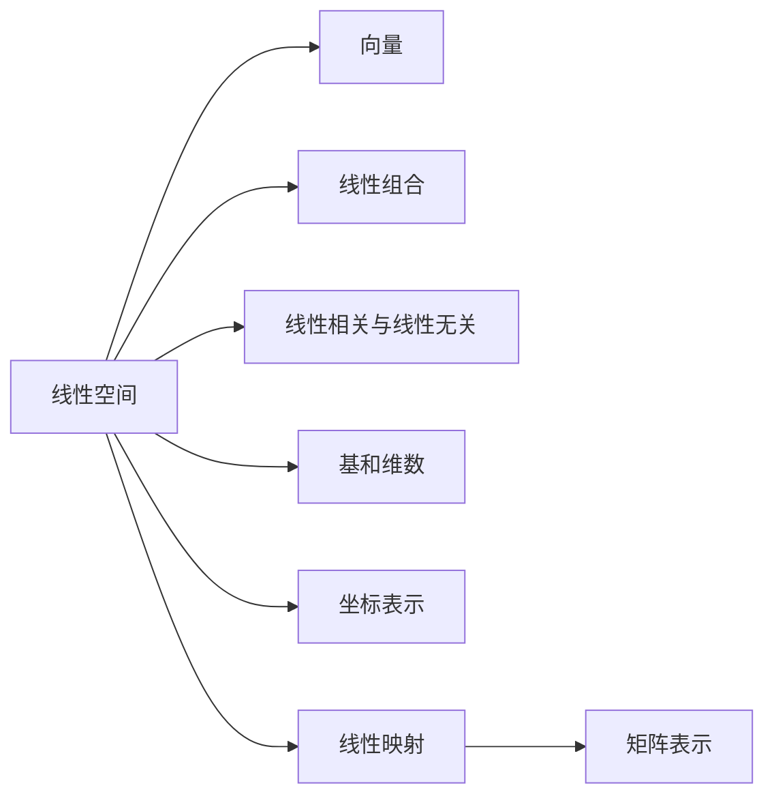

# 线性代数导引：线性空间

关键词：线性空间、向量空间、线性组合、线性相关、线性无关、基、维数、线性映射

## 1. 背景介绍
### 1.1  问题的由来
线性代数是数学的一个分支,它的中心概念是向量空间(也称线性空间)和线性映射。线性代数在数学的许多分支中都有广泛的应用,如解析几何、微分方程、概率论、抽象代数等。同时,线性代数也是计算机科学、物理学、工程学等领域的重要数学工具。

### 1.2  研究现状
目前,线性代数已经发展成为一个非常成熟的数学分支。从19世纪开始,线性代数就开始引起数学家们的关注。随着向量空间、矩阵、线性映射、特征值等概念的引入和发展,线性代数逐渐形成了自己独特的理论体系。20世纪中后期,泛函分析、算子理论等现代数学分支的发展,进一步丰富和深化了线性代数的内容。

### 1.3  研究意义  
线性代数不仅是数学的重要分支,在计算机科学和工程实践中也有着广泛的应用。比如计算机图形学、数值分析、信号处理、密码学、机器学习、量子计算等领域,线性代数都发挥着不可或缺的作用。深入学习和掌握线性代数,对于从事这些领域的科研人员和工程技术人员来说是非常必要的。

### 1.4  本文结构
本文将重点介绍线性代数中的核心概念——线性空间。全文分为9个部分：第1部分是背景介绍；第2部分介绍线性空间的定义和基本性质；第3部分讨论线性空间的基和维数；第4部分给出线性空间的坐标表示；第5部分通过具体的代码实例来展示线性空间的应用；第6部分分析线性空间在实际中的应用场景；第7部分推荐线性代数的学习资源；第8部分对全文进行总结；第9部分是附录,列出一些常见问题。

## 2. 核心概念与联系
线性空间(Linear Space)是线性代数中最核心的概念。线性空间又称向量空间(Vector Space),是由向量组成的集合,这个集合对向量加法和数量乘法运算封闭,并满足一些特定公理。线性空间的概念抽象了向量的基本性质,与线性方程组、矩阵等概念紧密相关。理解线性空间,是学习线性代数的基础。

在线性空间中,向量之间存在线性组合(Linear Combination)关系,即一组向量可以用其他一组向量的线性组合表示。如果一个向量组的任意向量不能用其他向量线性表示,则称这个向量组线性无关(Linearly Independent)；反之则称其线性相关(Linearly Dependent)。

线性空间中的一个线性无关向量组,如果能表示该空间中任意向量,则称其为该线性空间的一个基(Basis)。基的向量个数称为线性空间的维数(Dimension)。通过基,可以建立线性空间的坐标表示,将抽象的线性空间与具体的数域相联系。

线性空间之间的映射称为线性映射(Linear Mapping) 或线性变换(Linear Transformation)。线性映射保持向量加法和数量乘法运算,因此是一种结构保持映射。线性映射可用矩阵表示。矩阵乘法实际上反映了线性映射的复合。

下图展示了线性空间中的一些核心概念之间的联系:



## 3. 核心算法原理 & 具体操作步骤
### 3.1  算法原理概述
在线性空间的理论和应用中,基和维数是最核心的概念。求一个向量组的极大线性无关组,进而确定一个线性空间的基和维数,是线性代数中的一个基本问题。常用的算法有逐次筛选法、施密特正交化方法等。

### 3.2  算法步骤详解
以下详细介绍求向量组的极大线性无关组的逐次筛选法：

输入：向量组 $\{α_1,\cdots,α_n\}$
输出：向量组的极大线性无关组
步骤：
1. 取 $η_1=α_1$,若 $η_1=0$ 则 $\{η_1\}$ 为空集,算法结束；否则令 $\{η_1\}$ 为初始线性无关组,转步骤2。
2. 在 $\{α_2,\cdots,α_n\}$ 中依次取向量 $α_i$,判断 $α_i$ 是否可由 $\{η_1,\cdots,η_k\}$ 线性表示：
   (1) 若可以,则 $α_i$ 舍去,取下一个向量；
   (2) 若不可以,则令 $η_{k+1}=α_i$,更新线性无关组为 $\{η_1,\cdots,η_{k+1}\}$。
3. 依次判断完所有向量后,终止。此时 $\{η_1,\cdots,η_m\}$ 即为 $\{α_1,\cdots,α_n\}$ 的一个极大线性无关组。

### 3.3  算法优缺点
逐次筛选法的优点是思路清晰,操作简单,容易实现。但是该方法需要进行大量的线性判断,计算量较大。施密特正交化方法可以在构造极大线性无关组的同时,得到一组正交基,计算量相对较小。但是施密特正交化方法的推导和理解相对困难一些。

### 3.4  算法应用领域
求极大线性无关组的算法在线性代数的理论和应用中都有着广泛的应用。在理论上,它是研究线性空间结构的基础。在应用上,求极大线性无关组算法可用于线性方程组的求解、特征值计算、奇异值分解等问题。同时,该算法思想也被广泛应用于信号处理、图像压缩、量子纠错等领域。

## 4. 数学模型和公式 & 详细讲解 & 举例说明
### 4.1  数学模型构建
线性空间的数学模型可以用五元组 $(V,F,+,·,\mathbb{R})$ 来描述。其中：
- $V$ 表示由向量组成的集合；
- $F$ 表示数域,通常取实数域 $\mathbb{R}$ 或复数域 $\mathbb{C}$；
- $+$ 表示 $V$ 上的加法运算；
- $·$ 表示数乘运算,即 $F$ 中的数与 $V$ 中的向量相乘；
- $\mathbb{R}$ 表示数域 $F$ 取实数域。

如此构建的数学模型需要满足以下8条公理：

设 $α,β,γ$ 为 $V$ 中任意向量,$k,l$ 为 $F$ 中任意数,则：
1. $α+β∈V$（加法封闭性）
2. $α+β=β+α$（加法交换律）
3. $(α+β)+γ=α+(β+γ)$（加法结合律）
4. 在 $V$ 中存在零向量 $0$,使得 $α+0=α$（零元存在性）
5. 任意 $α∈V$,在 $V$ 中存在 $-α$,使得 $α+(-α)=0$（负元存在性）
6. $k·α∈V$（数乘封闭性）
7. $(kl)·α=k·(l·α)$（数乘结合律）
8. $1·α=α$（数乘单位元）

满足以上8条公理的 $(V,F,+,·,\mathbb{R})$ 就构成一个线性空间。

### 4.2  公式推导过程
在线性空间中,向量组 $\{α_1,\cdots,α_n\}$ 的一个线性组合可以表示为：

$$k_1α_1+k_2α_2+\cdots+k_nα_n$$

其中 $k_1,\cdots,k_n$ 为数域 $F$ 中的数。如果存在不全为零的 $k_1,\cdots,k_n$ 使得：

$$k_1α_1+k_2α_2+\cdots+k_nα_n=0$$

则称向量组 $\{α_1,\cdots,α_n\}$ 线性相关；否则称其线性无关。

如果向量组 $\{α_1,\cdots,α_n\}$ 线性无关,且线性空间 $V$ 中的任意向量 $β$ 都可以由 $\{α_1,\cdots,α_n\}$ 唯一线性表示：

$$β=k_1α_1+k_2α_2+\cdots+k_nα_n$$

则称 $\{α_1,\cdots,α_n\}$ 是线性空间 $V$ 的一个基,向量个数 $n$ 称为 $V$ 的维数,记为 $\dim(V)=n$。

### 4.3  案例分析与讲解
考虑向量组 $\{(1,0,1),(0,1,1),(1,1,0)\}$,判断其是否为线性空间 $\mathbb{R}^3$ 的一个基。

首先判断向量组的线性相关性。假设存在不全为零的 $k_1,k_2,k_3$ 使得：

$$k_1(1,0,1)+k_2(0,1,1)+k_3(1,1,0)=(0,0,0)$$

即：

$$\begin{cases}
k_1+k_3=0 \\
k_2+k_3=0 \\
k_1+k_2=0
\end{cases}$$

解得 $k_1=k_2=k_3=0$。因此该向量组线性无关。

再判断该向量组是否能表示出 $\mathbb{R}^3$ 中任意向量 $(x,y,z)$。即是否存在 $k_1,k_2,k_3$ 使得：

$$(x,y,z)=k_1(1,0,1)+k_2(0,1,1)+k_3(1,1,0)$$

即：

$$\begin{cases}
k_1+k_3=x \\
k_2+k_3=y \\
k_1+k_2=z
\end{cases}$$

解得：

$$\begin{cases}
k_1=x-z \\
k_2=z-x \\
k_3=x+y-z
\end{cases}$$

因此 $(x,y,z)$ 可由该向量组唯一线性表示。

综上,向量组 $\{(1,0,1),(0,1,1),(1,1,0)\}$ 是 $\mathbb{R}^3$ 的一个基,从而 $\dim(\mathbb{R}^3)=3$。

### 4.4  常见问题解答
问：线性相关和线性无关有何直观理解？

答：可以将向量看成空间中的箭头。如果一个向量可以由其他向量的线性组合表示,那么它的方向可以由其他向量合成,因此是"多余"的,这就是线性相关。反之,如果一个向量的方向无法由其他向量合成,就是线性无关。线性无关的向量组中,每个向量的方向都是"不可或缺"的。

问：基可以取多个吗？

答：一个线性空间可以有多个不同的基。但是无论取哪组基,它们所包含的向量个数总是相同的,这个数就是该线性空间的维数。比如对于线性空间 $\mathbb{R}^3$,除了案例中的基 $\{(1,0,1),(0,1,1),(1,1,0)\}$,我们熟知的基还有标准单位基 $\{(1,0,0),(0,1,0),(0,0,1)\}$。

## 5. 项目实践：代码实例和详细解释说明
### 5.1  开发环境搭建
本项目使用Python语言,依赖NumPy库进行向量和矩阵运算。读者需要安装Python 3.x 以及NumPy库方可运行代码。

安装NumPy库可以使用pip命令：

```bash
pip install numpy
```

### 5.2  源代码详细实现
以下是使用Python和NumPy实现的求向量组极大线性无关组的代码：

```python
import numpy as np

def max_linear_independent_group(vectors):
    """
    求向量组的极大线性无关组
    
    Args:
        vectors: list, 向量组，每个向量为NumPy数组
    
    Returns:
        list, 