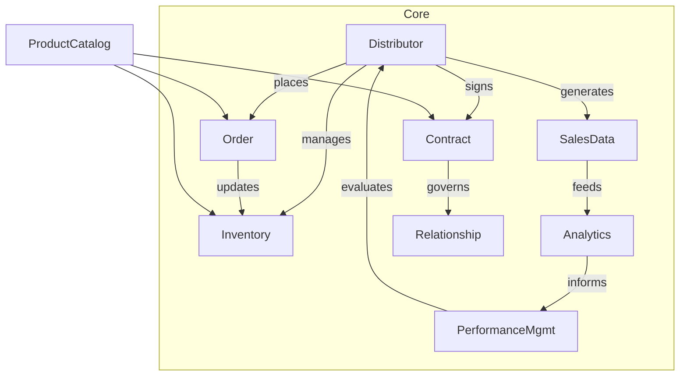

# 经销商管理系统架构设计方案

## 1. 背景介绍

### 1.1 问题的由来

在当今快节奏的商业环境中，企业需要高效管理其经销商网络以保持竞争优势。传统的手工管理方式已经无法满足现代企业对于精细化管理、实时数据访问和协作的需求。因此,构建一个全面的经销商管理系统(DMS)以支持企业与经销商之间的无缝集成和高效协作变得至关重要。

### 1.2 研究现状 

目前市场上存在一些经销商管理解决方案,但它们大多局限于特定行业或功能。一些解决方案仅关注库存管理,而忽视了销售渠道的优化;另一些则缺乏灵活性,无法适应不同企业的特定需求。此外,这些解决方案通常采用传统的单体架构,缺乏可扩展性和敏捷性,难以应对不断变化的业务需求。

### 1.3 研究意义

设计一个全面、灵活且可扩展的经销商管理系统架构对于企业的长期发展至关重要。它不仅可以提高企业与经销商之间的协作效率,优化供应链管理,还能为企业提供宝贵的业务洞察,支持数据驱动的决策。此外,这种架构还应具备良好的可维护性和可扩展性,以适应不断变化的技术和业务环境。

### 1.4 本文结构

本文将首先介绍经销商管理系统的核心概念和它们之间的关系。然后,我们将深入探讨系统的核心算法原理、数学模型和公式推导。接下来,我们将通过一个实际项目实践来演示系统的实现细节,包括代码示例和运行结果。此外,我们还将讨论系统在不同场景下的应用,以及相关的工具和学习资源。最后,我们将总结系统的未来发展趋势和面临的挑战。

## 2. 核心概念与联系

经销商管理系统(DMS)是一个复杂的系统,涉及多个核心概念及其相互关系。以下是一些关键概念:

1. **经销商(Distributor)**: 经销商是指代表制造商销售产品的中间商。他们负责在特定地区内推广和销售产品,并与最终客户建立直接联系。

2. **产品目录(Product Catalog)**: 产品目录是制造商提供的所有产品的集合,包括产品详细信息、定价、库存等。它是经销商进行销售和管理的基础。

3. **订单管理(Order Management)**: 订单管理涉及从经销商接收订单、验证库存、处理付款、安排交付等一系列流程。它确保订单能够高效、准确地履行。

4. **库存管理(Inventory Management)**: 库存管理跟踪产品的库存水平,并根据需求进行补货。它还涉及库存优化,以降低存货成本并提高资金周转率。

5. **销售数据分析(Sales Data Analytics)**: 销售数据分析从经销商销售活动中收集数据,并对其进行分析,以发现趋势、识别机会并支持决策。

6. **绩效管理(Performance Management)**: 绩效管理跟踪和评估经销商的销售表现,确保他们达到预期目标。它还可以识别出色的经销商并为他们提供奖励。

7. **合同管理(Contract Management)**: 合同管理涉及与经销商签订和管理合同,包括定义条款、追踪合同执行情况等。

这些核心概念相互关联并共同构建了一个完整的经销商管理系统。下图展示了它们之间的关系:

## 3. 核心算法原理 & 具体操作步骤  

### 3.1 算法原理概述

经销商管理系统的核心算法包括库存优化算法、订单履行算法和绩效评估算法等。

**库存优化算法**的目标是确定每个产品在每个经销商处的最佳库存水平,以最小化总体库存成本,同时满足客户需求。这通常被建模为一个约束优化问题,需要考虑多个因素,如预测需求、运输成本、存储成本等。

**订单履行算法**负责根据客户订单、产品库存和运输时间等因素,计算出最优的履行方案。它需要解决库存分配、运输路线规划等问题,以最大限度地提高履行效率和客户满意度。

**绩效评估算法**则根据预先设定的关键绩效指标(KPI),如销售额、利润率、客户满意度等,对经销商的表现进行评分和排名。这为制定奖惩措施和优化经销商网络提供了依据。

### 3.2 算法步骤详解

#### 库存优化算法

假设有 $N$ 种产品, $M$ 个经销商, $D_{i,j}$ 表示第 $j$ 个经销商对第 $i$ 种产品的需求, $C_i$ 表示第 $i$ 种产品的单位存储成本, $T_{i,j}$ 表示将第 $i$ 种产品运送到第 $j$ 个经销商的单位运输成本, $Q_{i,j}$ 表示第 $j$ 个经销商对第 $i$ 种产品的库存量, 目标是最小化总成本:

$$\min \sum_{i=1}^{N}\sum_{j=1}^{M} C_iQ_{i,j} + T_{i,j}(D_{i,j}-Q_{i,j})^+$$

其中 $(x)^+$ 表示 $\max(x,0)$。我们可以使用拉格朗日乘子法求解这个优化问题。

算法步骤如下:

1. 初始化所有产品在所有经销商处的库存量 $Q_{i,j}$ 为 0
2. 对每个产品 $i$, 计算其在每个经销商 $j$ 处的理想库存量 $Q^*_{i,j} = D_{i,j} - \frac{C_i}{T_{i,j}}$
3. 将理想库存量 $Q^*_{i,j}$ 修剪到最近的可行整数解
4. 更新实际库存量 $Q_{i,j}$
5. 重复步骤 2-4,直到收敛

#### 订单履行算法

订单履行算法的目标是在满足交付期限的前提下,最小化履行成本。我们可以将其建模为一个带时间窗的车辆路由问题。

设有 $K$ 辆车,每辆车的容量为 $C_k$。有 $N$ 个客户订单,每个订单 $i$ 的需求量为 $d_i$,服务时间为 $s_i$,距离中心仓库的距离为 $c_i$,并且有一个时间窗口 $[e_i,l_i]$ 需要满足。我们的目标是:

$$\min \sum_k \sum_{(i,j) \in N_k} c_{ij}$$

其中 $N_k$ 表示分配给第 $k$ 辆车的订单集合, $c_{ij}$ 表示从订单 $i$ 到订单 $j$ 的距离。

我们可以使用分支定界法或其他启发式算法来求解这个 NP 难问题。算法步骤如下:

1. 初始化一个空的路线集合
2. 选择一个未分配的订单作为种子,构建一条初始路线
3. 反复将未分配的订单插入当前路线中,直到无法插入为止
4. 将当前路线加入路线集合,转到步骤2构建新路线
5. 在所有订单都被分配后,返回最优路线集合

#### 绩效评估算法

绩效评估算法的目标是根据多个关键绩效指标(KPI)对经销商进行打分和排名。我们可以使用加权求和的方法将多个 KPI 综合为一个总分数。

设有 $M$ 个经销商, $N$ 个 KPI, $w_i$ 表示第 $i$ 个 KPI 的权重。对于第 $j$ 个经销商, 我们计算其在第 $i$ 个 KPI 上的标准化分数 $s_{i,j}$,则其总分为:

$$S_j = \sum_{i=1}^{N} w_i s_{i,j}$$

我们可以根据总分 $S_j$ 对经销商进行排名。

算法步骤如下:

1. 对每个 KPI,计算所有经销商的最小值 $\min_i$ 和最大值 $\max_i$
2. 对每个经销商 $j$,每个 KPI $i$,计算标准化分数 $s_{i,j} = \frac{x_{i,j} - \min_i}{\max_i - \min_i}$
3. 根据权重 $w_i$ 计算每个经销商的总分 $S_j$  
4. 对经销商按总分 $S_j$ 降序排序

### 3.3 算法优缺点

上述算法在解决经销商管理系统的核心问题时具有以下优点:

- **准确性**:通过建模和优化,可以得到最优或近似最优的解,提高决策的准确性。
- **高效性**:算法可以快速处理大量数据,支持实时决策。
- **灵活性**:可以根据不同的约束和目标调整算法参数,适应不同场景。

但它们也存在一些缺点和局限性:

- **复杂性**:算法往往涉及复杂的数学建模和计算,需要专业知识。
- **数据质量依赖**:算法的效果很大程度上依赖于输入数据的质量和完整性。
- **动态环境适应性**:算法通常基于静态数据,难以完全反映动态变化的实际环境。

### 3.4 算法应用领域

上述算法不仅适用于经销商管理系统,在供应链管理、运输优化、资源调度等领域也有广泛应用。以库存优化算法为例,它可以用于制定适当的安全库存水平,平衡库存成本和缺货风险。订单履行算法则可用于规划快递配送路线、调度服务人员等。绩效评估算法的思路也可以扩展到评估员工、项目等其他对象的绩效。

## 4. 数学模型和公式 & 详细讲解 & 举例说明

### 4.1 数学模型构建

在经销商管理系统中,我们需要构建数学模型来描述和优化各种决策过程。以库存优化为例,我们将问题建模为一个约束优化问题:

$$\begin{aligned}
\min \quad & \sum_{i=1}^{N}\sum_{j=1}^{M} C_iQ_{i,j} + T_{i,j}(D_{i,j}-Q_{i,j})^+\\
\text{s.t.} \quad & Q_{i,j} \geq 0 \quad \forall i,j\\
             & \sum_{j=1}^{M}Q_{i,j} \leq S_i \quad \forall i
\end{aligned}$$

其中:
- $N$ 是产品种类数
- $M$ 是经销商数量
- $Q_{i,j}$ 是第 $j$ 个经销商对第 $i$ 种产品的库存量
- $C_i$ 是第 $i$ 种产品的单位存储成本
- $T_{i,j}$ 是将第 $i$ 种产品运送到第 $j$ 个经销商的单位运输成本
- $D_{i,j}$ 是第 $j$ 个经销商对第 $i$ 种产品的需求量
- $S_i$ 是第 $i$ 种产品的总供应量

目标函数是最小化总成本,包括存储成本和运输成本。约束条件确保库存量非负,并且每种产品的总库存量不超过供应量。

### 4.2 公式推导过程

我们以订单履行问题为例,推导出相关公式。假设有 $N$ 个客户订单,每个订单 $i$ 的需求量为 $d_i$,服务时间为 $s_i$,距离中心仓库的距离为 $c_i$,并且有一个时间窗口 $[e_i,l_i]$ 需要满足。我们的目标是最小化总行驶距离:

$$\min \sum_{i=1}^{N}\sum_{j=1}^{N} c_{ij}x_{ij}$$

其中 