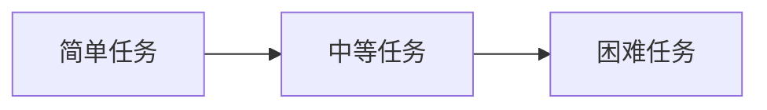

# 维护学习 (Curriculum Learning) 原理与代码实例讲解

作者：禅与计算机程序设计艺术 / Zen and the Art of Computer Programming

关键词：维护学习、课程学习、机器学习、深度学习、神经网络、迁移学习、代码实现

## 1. 背景介绍

### 1.1 问题的由来

在机器学习和深度学习领域,我们经常面临复杂任务的学习问题。对于这些复杂任务,如果我们直接使用随机初始化的模型从头开始学习,往往会遇到收敛速度慢、性能不佳等问题。针对这一现象,研究者们提出了一种启发式的学习策略——维护学习(Curriculum Learning),来帮助模型更高效地学习复杂任务。

### 1.2 研究现状

自从 Bengio 等人于 2009 年首次提出维护学习的概念以来,这一领域已经得到了广泛的关注和研究。许多研究者在不同的任务和场景下验证了维护学习的有效性,如计算机视觉、自然语言处理、强化学习等。目前,维护学习已成为机器学习领域的重要研究方向之一。

### 1.3 研究意义  

维护学习为训练复杂模型提供了一种新的思路。通过合理地设计学习任务的先后顺序,维护学习能够加速模型的收敛速度,提高模型的泛化性能,降低训练难度。这对于解决现实世界中的许多复杂问题具有重要意义。

### 1.4 本文结构

本文将从以下几个方面对维护学习进行详细阐述:

- 第二部分介绍维护学习的核心概念与联系
- 第三部分讲解维护学习的核心算法原理和具体操作步骤
- 第四部分建立维护学习的数学模型,并给出公式推导与案例分析
- 第五部分提供维护学习的代码实例与详细解释
- 第六部分探讨维护学习的实际应用场景
- 第七部分推荐维护学习相关的工具和学习资源
- 第八部分总结全文,展望维护学习的未来发展趋势与挑战
- 第九部分列举维护学习的常见问题与解答

## 2. 核心概念与联系

维护学习的核心思想是:在训练机器学习模型时,先学习简单的概念和任务,再逐步过渡到复杂的概念和任务。这种由易到难、循序渐进的学习策略,可以帮助模型更高效地学习和泛化。

具体来说,维护学习涉及以下几个关键概念:

- 课程(Curriculum):指的是将学习任务按照难易程度进行排序后得到的序列。通常,课程中的任务是由简单到复杂逐步过渡的。
- 学习者(Learner):指的是要完成学习任务的机器学习模型,如神经网络。
- 教师(Teacher):指的是负责设计课程并引导学习者完成学习的角色,可以是人工设计的规则,也可以是另一个机器学习模型。

维护学习与以下机器学习范式也有着密切的联系:

- 迁移学习(Transfer Learning):维护学习可以看作是一种特殊的迁移学习,即将简单任务学到的知识迁移到复杂任务中,以提高后者的学习效率。
- 多任务学习(Multi-task Learning):维护学习与多任务学习都涉及到多个不同的子任务,但维护学习更强调这些子任务之间的先后关系和递进关系。
- 元学习(Meta Learning):元学习旨在学习如何更好地学习,而维护学习则提供了一种具体的学习策略,二者可以互相结合。

下图展示了维护学习的基本流程:



## 3. 核心算法原理 & 具体操作步骤

### 3.1 算法原理概述

维护学习的核心是设计一个合理的课程,让模型按照从简单到复杂的顺序来学习任务。具体来说,给定一系列难度不同的任务 $\{T_1, T_2, ..., T_n\}$,我们的目标是找到一个最优的任务排列 $\{T_{\pi(1)}, T_{\pi(2)}, ..., T_{\pi(n)}\}$,使得模型按照这个顺序学习时,最终在目标任务上取得最好的性能。

形式化地,我们可以将维护学习表述为一个优化问题:

$$
\min_{\pi} \mathcal{L}(\theta^*, T_{\text{target}}) \\
\text{s.t. } \theta^* = \arg\min_{\theta} \sum_{i=1}^n \mathcal{L}(\theta, T_{\pi(i)})
$$

其中 $\pi$ 表示任务的排列, $\mathcal{L}$ 表示损失函数, $\theta$ 表示模型参数, $T_{\text{target}}$ 表示目标任务。

### 3.2 算法步骤详解

维护学习的具体步骤如下:

1. 准备一系列难度不同的任务 $\{T_1, T_2, ..., T_n\}$。
2. 设计一个评估函数 $f(T_i)$ 来衡量每个任务 $T_i$ 的难度。
3. 根据评估函数的结果,对任务进行排序,得到一个课程 $\{T_{\pi(1)}, T_{\pi(2)}, ..., T_{\pi(n)}\}$。
4. 初始化模型参数 $\theta$。
5. 按照课程的顺序,依次在每个任务 $T_{\pi(i)}$ 上训练模型,更新参数 $\theta$。
6. 在目标任务 $T_{\text{target}}$ 上评估模型的最终性能。

其中,任务难度的评估函数 $f(T_i)$ 的设计是维护学习的关键。一个好的评估函数应该能够准确反映任务的难易程度,并且易于计算。常见的评估函数包括:

- 基于任务特征的评估函数,如样本数量、类别数量、噪声水平等。
- 基于模型性能的评估函数,如在任务上的损失值、准确率等。
- 基于人工设定的评估函数,如专家知识、领域经验等。

### 3.3 算法优缺点

维护学习的主要优点包括:

- 能够加速模型的收敛速度,减少训练时间。
- 能够提高模型的泛化性能,特别是在复杂任务上。
- 能够降低模型训练的难度,减少调参的工作量。

但维护学习也存在一些局限性:

- 课程的设计需要依赖领域知识和经验,缺乏通用的原则。
- 课程的自动生成仍然是一个开放的研究问题,现有方法的适用范围有限。
- 在某些任务上,维护学习的效果可能并不明显,甚至会带来负面影响。

### 3.4 算法应用领域

维护学习在许多领域都有着广泛的应用,例如:

- 计算机视觉:如物体检测、语义分割、图像分类等任务。
- 自然语言处理:如机器翻译、文本分类、语言模型等任务。
- 强化学习:如 Atari 游戏、机器人控制、自动驾驶等任务。

总的来说,维护学习适用于那些具有明显难度差异的子任务、需要大量训练时间和计算资源的复杂任务。

## 4. 数学模型和公式 & 详细讲解 & 举例说明

### 4.1 数学模型构建

我们可以使用以下数学符号来描述维护学习:

- $\mathcal{T} = \{T_1, T_2, ..., T_n\}$:表示一系列难度不同的任务。
- $\pi$:表示任务的一个排列,即课程。
- $f(T_i)$:表示评估任务 $T_i$ 难度的函数。
- $\theta$:表示模型的参数。
- $\mathcal{L}(\theta, T_i)$:表示模型 $\theta$ 在任务 $T_i$ 上的损失函数。

基于这些符号,我们可以将维护学习表述为以下优化问题:

$$
\min_{\pi} \mathcal{L}(\theta^*, T_{\text{target}}) \\
\text{s.t. } \theta^* = \arg\min_{\theta} \sum_{i=1}^n \mathcal{L}(\theta, T_{\pi(i)})
$$

其中, $T_{\text{target}}$ 表示我们最终要解决的目标任务。这个优化问题的目标是找到一个最优的课程 $\pi$,使得模型按照这个课程学习时,最终在目标任务上取得最小的损失。

### 4.2 公式推导过程

为了求解上述优化问题,我们可以采用以下两步策略:

1. 固定模型参数 $\theta$,优化课程 $\pi$:

$$
\pi^* = \arg\min_{\pi} \mathcal{L}(\theta, T_{\text{target}}) \\
\text{s.t. } \theta = \arg\min_{\theta} \sum_{i=1}^n \mathcal{L}(\theta, T_{\pi(i)})
$$

这一步的目标是找到一个最优的课程 $\pi^*$,使得模型按照这个课程学习时,在目标任务上的损失最小。

2. 固定课程 $\pi$,优化模型参数 $\theta$:

$$
\theta^* = \arg\min_{\theta} \sum_{i=1}^n \mathcal{L}(\theta, T_{\pi(i)})
$$

这一步的目标是找到一组最优的模型参数 $\theta^*$,使得模型在给定课程下的总损失最小。

通过交替执行这两个步骤,我们可以同时优化课程和模型,最终得到一个性能优异的模型。

### 4.3 案例分析与讲解

下面我们以图像分类任务为例,来说明如何应用维护学习。

假设我们要训练一个模型来识别图片中的动物,我们可以按照以下步骤设计一个维护学习方案:

1. 准备数据集:收集一系列动物图片,并按照动物类别进行标注,如猫、狗、鸟等。

2. 设计评估函数:我们可以使用图片的分辨率作为评估函数,即 $f(T_i) = \text{resolution}(T_i)$。分辨率越低,图片质量越差,识别难度越大。

3. 生成课程:根据评估函数的结果,我们可以将图片按照分辨率从高到低排序,得到一个课程 $\{T_{\pi(1)}, T_{\pi(2)}, ..., T_{\pi(n)}\}$。

4. 训练模型:按照课程的顺序,我们依次在每个任务 $T_{\pi(i)}$ 上训练模型,并在验证集上评估模型性能。

5. 评估结果:在测试集上评估模型的最终性能,并与其他方法进行比较。

通过这个案例,我们可以看到维护学习的整个流程。关键在于设计一个合理的评估函数,并根据评估结果生成一个有效的课程。

### 4.4 常见问题解答

问:维护学习和迁移学习有什么区别?

答:维护学习和迁移学习都利用了不同任务之间的知识迁移,但二者的侧重点不同。维护学习更强调任务之间的先后关系和递进关系,目的是帮助模型更高效地学习复杂任务。而迁移学习更强调不同任务之间的相似性,目的是提高模型在新任务上的性能。

问:如何自动设计维护学习的课程?

答:自动课程设计是维护学习领域的一个重要研究问题。目前主要有两类方法:

- 基于启发式规则的方法,如根据任务的难度、样本的多样性等因素来设计课程。
- 基于强化学习的方法,即将课程设计看作一个序列决策问题,通过优化一个回报函数来自动生成最优课程。

但总的来说,自动课程设计仍然是一个开放的挑战,有待进一步研究。

## 5. 项目实践：代码实例和详细解释说明

### 5.1 开发环境搭建

我们将使用 Python 语言和 PyTorch 深度学习框架来实现维护学习。首先,我们需要安装以下依赖包:

```bash
pip install torch torchvision numpy matplotlib
```

### 5.2 源代码详细实现

下面是一