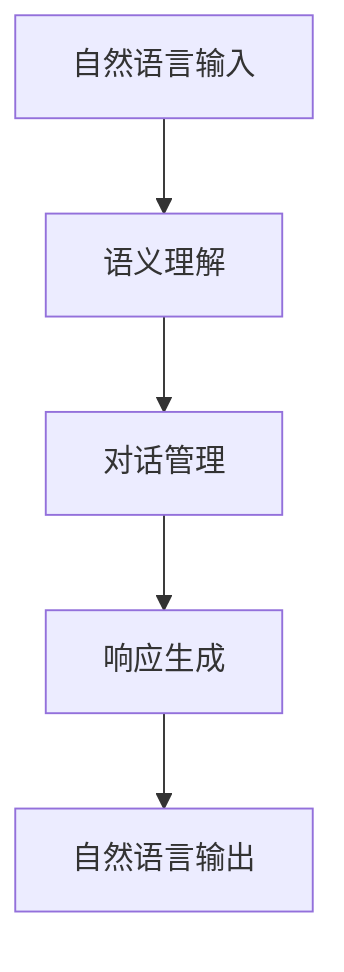
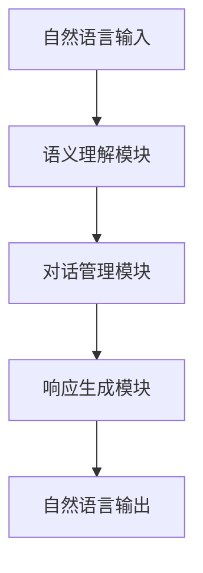

# 自然语言交互与对话系统原理与代码实战案例讲解

## 1. 背景介绍

### 1.1 问题的由来

在当今信息时代,人机交互已经成为了一种必不可少的技术。随着人工智能和自然语言处理(NLP)技术的不断发展,人们对于更加自然、流畅的人机交互方式有了更高的期望。传统的基于图形用户界面(GUI)的交互方式已经无法满足人们对于更加智能化、个性化的交互体验的需求。因此,自然语言交互(Natural Language Interaction,NLI)和对话系统(Dialogue System)应运而生。

自然语言交互旨在让人机交互变得更加自然、无缝,就像人与人之间的对话一样流畅。对话系统则是实现自然语言交互的关键技术,它能够理解人类的自然语言输入,并给出相应的响应。这种交互方式不仅可以应用于智能助手、客服机器人等领域,还可以为语音识别、机器翻译等任务提供支持。

### 1.2 研究现状

自然语言交互和对话系统一直是人工智能和自然语言处理领域的热门研究方向。近年来,随着深度学习技术的飞速发展,基于神经网络的自然语言处理模型取得了突破性的进展,为自然语言交互和对话系统的发展注入了新的动力。

目前,主流的对话系统可以分为以下几种类型:

1. **基于检索的对话系统**: 这种系统通过检索预先构建的问答对库来响应用户的查询。虽然实现简单,但缺乏上下文理解能力和生成性响应能力。

2. **基于生成的对话系统**: 这种系统通过语言生成模型(如seq2seq、transformer等)直接生成响应,具有更强的上下文理解能力和生成性响应能力,但容易产生不相关、不连贯的响应。

3. **基于知识库的对话系统**: 这种系统在生成响应时会参考外部知识库,从而提高响应的准确性和信息量,但构建高质量知识库是一大挑战。

4. **基于任务导向的对话系统**: 这种系统旨在完成特定的任务,如预订机票、天气查询等,具有明确的目标和对话策略,但缺乏通用性。

5. **基于多模态的对话系统**: 这种系统不仅能够处理文本输入,还能够处理图像、语音等多模态输入,实现更加自然、智能的交互体验。

### 1.3 研究意义

自然语言交互和对话系统的研究对于推动人工智能技术的发展具有重要意义。一方面,它是人工智能系统向通用人工智能(AGI)迈进的关键一步,能够让机器更好地理解和运用自然语言,实现更加自然、智能的人机交互。另一方面,自然语言交互和对话系统也是人工智能技术在实际应用中的重要载体,可以广泛应用于智能助手、客服机器人、教育辅助、医疗诊断等诸多领域,为人类生活和工作带来巨大便利。

此外,自然语言交互和对话系统的研究也将推动自然语言处理、知识表示、决策理论、人机交互等多个领域的发展,促进不同领域的交叉融合,为人工智能技术的发展注入新的活力。

### 1.4 本文结构

本文将全面介绍自然语言交互和对话系统的原理和实践。首先,我们将探讨自然语言交互和对话系统的核心概念,包括语义理解、对话管理、响应生成等,并分析它们之间的联系。接下来,我们将深入剖析主流对话系统算法的原理和具体操作步骤,包括基于检索、基于生成、基于知识库等不同类型的算法。

然后,我们将介绍自然语言交互和对话系统中常用的数学模型和公式,如序列到序列模型(Seq2Seq)、注意力机制(Attention Mechanism)、transformer模型等,并通过案例分析和讲解,帮助读者更好地理解和掌握这些模型和公式。

在实践部分,我们将提供完整的代码实例,包括开发环境搭建、源代码实现、代码解读和运行结果展示,帮助读者快速上手并掌握自然语言交互和对话系统的开发流程。

此外,我们还将探讨自然语言交互和对话系统在实际应用中的场景,如智能助手、客服机器人、教育辅助等,并对未来的应用前景进行展望。

最后,我们将推荐一些有用的学习资源、开发工具和相关论文,为读者提供更多的学习和研究途径。在总结部分,我们将回顾本文的主要内容,并对自然语言交互和对话系统的未来发展趋势和面临的挑战进行展望。

## 2. 核心概念与联系

自然语言交互和对话系统涉及多个核心概念,包括语义理解(Semantic Understanding)、对话管理(Dialogue Management)和响应生成(Response Generation)等。这些概念相互关联,共同构建了一个完整的对话系统。

1. **语义理解(Semantic Understanding)**: 语义理解旨在从用户的自然语言输入中提取出有意义的语义表示,包括意图(Intent)、实体(Entity)等信息。这是对话系统理解用户输入的关键步骤。常用的语义理解技术包括基于规则的方法、基于统计的方法和基于深度学习的方法等。

2. **对话管理(Dialogue Management)**: 对话管理负责根据当前的对话状态和语义理解的结果,决策系统的下一步行为,维护对话的连贯性和逻辑性。它需要考虑对话历史、上下文信息、任务目标等多方面因素。对话管理可以基于规则、策略或机器学习等方法实现。

3. **响应生成(Response Generation)**: 响应生成模块根据对话管理的决策,生成自然语言的响应输出。这可以通过基于模板的方法、基于检索的方法或基于生成的方法等实现。基于生成的方法通常采用序列到序列(Seq2Seq)模型或transformer等神经网络模型,具有更强的生成能力和上下文理解能力。

这三个核心概念紧密相连,共同构建了一个完整的对话系统。语义理解模块从用户输入中提取出有意义的语义表示,对话管理模块根据语义表示和对话状态决策下一步行为,响应生成模块则根据决策生成自然语言响应。这个过程循环往复,直至对话结束。

除了上述三个核心概念,自然语言交互和对话系统还涉及其他重要概念,如上下文理解(Context Understanding)、知识库集成(Knowledge Base Integration)、多模态交互(Multimodal Interaction)等,这些概念将在后续章节中详细介绍。

## 3. 核心算法原理与具体操作步骤

### 3.1 算法原理概述

自然语言交互和对话系统中涉及多种核心算法,这些算法分别负责语义理解、对话管理和响应生成等不同模块。下面我们将概述这些算法的原理。

1. **语义理解算法**:
   - 基于规则的方法: 使用手工编写的规则和模板来匹配和提取语义信息,如正则表达式、有限状态机等。
   - 基于统计的方法: 使用统计机器学习模型,如条件随机场(CRF)、最大熵模型等,从大量标注数据中学习语义提取模型。
   - 基于深度学习的方法: 使用神经网络模型,如递归神经网络(RNN)、长短期记忆网络(LSTM)、注意力机制(Attention)等,端到端地学习语义提取模型。

2. **对话管理算法**:
   - 基于规则的方法: 使用手工编写的规则和状态转移图来控制对话流程,如有限状态机、框架驱动等。
   - 基于策略的方法: 将对话管理建模为马尔可夫决策过程(MDP),使用强化学习等方法学习最优对话策略。
   - 基于机器学习的方法: 使用序列标注模型、神经网络模型等,从大量对话数据中学习对话管理模型。

3. **响应生成算法**:
   - 基于模板的方法: 使用预定义的模板和规则来生成响应,简单但缺乏多样性。
   - 基于检索的方法: 从预构建的响应库中检索最匹配的响应,需要大量高质量的问答对。
   - 基于生成的方法: 使用序列到序列(Seq2Seq)模型、transformer等神经网络模型,端到端地生成响应。

### 3.2 算法步骤详解

接下来,我们将详细介绍自然语言交互和对话系统中一种广泛使用的端到端算法流程,它结合了语义理解、对话管理和响应生成三个核心模块。

1. **语义理解模块**:
   - 输入: 用户的自然语言输入
   - 步骤:
     - 文本预处理: 对输入文本进行分词、去停用词、词性标注等预处理操作。
     - 意图识别: 使用分类模型(如LSTM、Transformer等)识别输入的意图类别。
     - 实体提取: 使用序列标注模型(如BiLSTM-CRF等)提取输入中的实体信息。
   - 输出: 意图类别和实体信息的语义表示。

2. **对话管理模块**:
   - 输入: 语义理解模块输出的语义表示,以及当前对话状态和历史信息。
   - 步骤:
     - 状态跟踪: 根据语义表示和对话历史,更新当前对话状态。
     - 策略学习: 使用强化学习等方法,根据当前状态选择最优的对话行为。
     - 行为执行: 根据选择的行为,执行相应的操作,如查询数据库、调用API等。
   - 输出: 对话系统的响应动作。

3. **响应生成模块**:
   - 输入: 对话管理模块输出的响应动作,以及当前对话状态和历史信息。
   - 步骤:
     - 上下文编码: 使用Transformer等模型,对输入的对话历史进行编码,获取上下文表示。
     - 响应解码: 使用Seq2Seq或Transformer等模型,根据上下文表示和响应动作,生成自然语言响应。
   - 输出: 自然语言响应。

这种端到端的算法流程将语义理解、对话管理和响应生成三个模块无缝集成,通过深度学习模型实现端到端的训练和推理。相比传统的基于规则或模板的方法,这种方法具有更强的泛化能力和上下文理解能力,可以生成更加自然、连贯的响应。

### 3.3 算法优缺点

上述端到端算法流程具有以下优点:

1. **端到端训练**:整个流程可以通过端到端的方式进行训练,避免了传统pipeline方法中的错误传递和数据不匹配问题。

2. **上下文理解能力强**:通过编码对话历史,算法能够更好地理解上下文信息,生成更加连贯的响应。

3. **泛化能力强**:基于深度学习模型,算法具有更强的泛化能力,可以处理更多样化的输入。

4. **模块化设计**:算法流程将语义理解、对话管理和响应生成分为三个模块,便于模块化设计和优化。

同时,这种算法流程也存在一些缺点:

1. **数据饥渴**:端到端训练需要大量高质量的对话数据,否则容易过拟合。

2. **可解释性差**:深度学习模型通常被视为"黑箱",缺乏可解释性。

3. **一致性问题**:生成的响应可能与事实知识或对话历史不一致。

4. **偏移问题**:在生成长响应时,模型容易偏离主题或产生不连贯的响应。