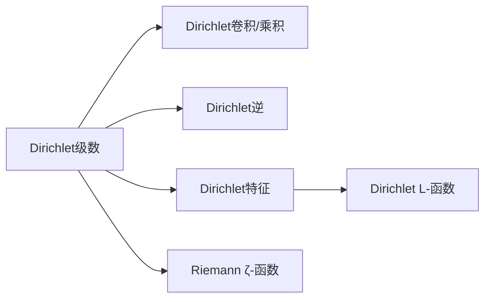

# 解析数论基础：第六章Dirichlet级数

作者：禅与计算机程序设计艺术 / Zen and the Art of Computer Programming

关键词：解析数论、Dirichlet级数、Dirichlet卷积、Dirichlet乘积、Dirichlet逆、Dirichlet特征、Dirichlet L-函数、Dirichlet η-函数、Dirichlet β-函数

## 1. 背景介绍
### 1.1 问题的由来
Dirichlet级数是以德国数学家Johann Peter Gustav Lejeune Dirichlet命名的一类重要的复变函数。它在解析数论、L-函数理论、调和分析等领域有着广泛而深刻的应用。本章将系统介绍Dirichlet级数的基本概念、性质及其应用。

### 1.2 研究现状
关于Dirichlet级数的研究由来已久，19世纪Dirichlet就开创性地将其引入解析数论。此后众多数学家如Riemann、Hecke、Selberg等都对Dirichlet级数理论做出了重要贡献。目前Dirichlet级数已发展成为一个庞大而深刻的数学分支，在解析数论、L-函数、调和分析、表示论等领域有着不可或缺的地位。

### 1.3 研究意义 
深入研究Dirichlet级数对于发展解析数论具有重要意义。众多解析数论中的重要函数如ζ函数、L-函数都可表示为Dirichlet级数。Dirichlet级数独特的分析性质在研究素数分布、Diophantine逼近等问题时不可或缺。同时Dirichlet级数也是调和分析的重要工具，在表示论、微分方程等领域大放异彩。

### 1.4 本文结构
本章将从Dirichlet级数的定义与收敛性、Dirichlet卷积与Dirichlet乘积、Dirichlet逆、Dirichlet特征与L函数等方面系统讲解Dirichlet级数的基本理论。然后介绍几类重要的Dirichlet级数如Riemann ζ函数、Dirichlet η函数、Dirichlet β函数等。最后讨论Dirichlet级数在解析数论领域的几个重要应用。

## 2. 核心概念与联系
- Dirichlet级数：形如 $\sum_{n=1}^{\infty} \frac{a_n}{n^s}$ 的复变函数，其中 $a_n$ 为复数序列，$s$ 为复变量。
- 收敛半平面/收敛域：使得Dirichlet级数绝对收敛的复平面区域。
- Dirichlet卷积/Dirichlet乘积：两个Dirichlet级数的乘积，类似于幂级数的Cauchy乘积。
- Dirichlet逆：关于Dirichlet卷积的乘法逆元。
- Dirichlet特征：Dirichlet特征是定义在自然数集上取值于复数的完全积性函数 $\chi$，满足一定的周期性。
- Dirichlet L-函数：由Dirichlet特征 $\chi$ 定义的Dirichlet级数 $L(s,\chi)=\sum_{n=1}^{\infty} \frac{\chi(n)}{n^s}$。
- Riemann ζ-函数：最重要的Dirichlet级数之一，由 $\zeta(s)=\sum_{n=1}^{\infty} \frac{1}{n^s}$ 定义。

Dirichlet级数、Dirichlet卷积、Dirichlet逆、Dirichlet特征、L函数之间有着错综复杂的联系，构成了Dirichlet级数理论的核心内容。下面的示意图描述了它们之间的逻辑关系：



## 3. 核心算法原理 & 具体操作步骤
### 3.1 算法原理概述
Dirichlet级数的核心是将数论函数展开为关于 $\frac{1}{n^s}$ 的级数，并研究级数的解析性质。Dirichlet卷积定义了Dirichlet级数的乘法，Dirichlet逆定义了乘法逆元。Dirichlet特征引出了重要的Dirichlet L函数。Dirichlet级数的诸多算法都是建立在这些基础概念之上的。

### 3.2 算法步骤详解
1. 将待研究的数论函数 $a_n$ 写成Dirichlet级数形式 $\sum \frac{a_n}{n^s}$。
2. 对Dirichlet级数应用解析方法，如研究收敛性、解析延拓、函数方程、留数计算等。  
3. 利用Dirichlet卷积研究Dirichlet级数的乘法，并求Dirichlet逆。
4. 引入Dirichlet特征，定义Dirichlet L函数，并研究其解析性质。
5. 应用Perron公式等方法将Dirichlet级数与原数论函数联系起来，得到结论。

### 3.3 算法优缺点
Dirichlet级数最大的优点是在研究数论函数时引入了复分析方法，极大拓展了研究工具范围。将数论与复分析联系起来，往往能取得惊人的成果。但Dirichlet级数的缺点是理论高深，门槛较高，有时会将简单问题复杂化。

### 3.4 算法应用领域
Dirichlet级数是解析数论的核心工具，在研究素数分布、Diophantine逼近、L函数等问题时不可或缺。同时Dirichlet级数也被广泛应用于调和分析、表示论等领域。

## 4. 数学模型和公式 & 详细讲解 & 举例说明
### 4.1 数学模型构建
Dirichlet级数可以看作是将数论函数嵌入到复平面上进行研究的模型。对于数论函数 $a_n$，定义其Dirichlet级数为
$$
f(s) = \sum_{n=1}^{\infty} \frac{a_n}{n^s}
$$
其中 $s=\sigma+it$ 为复变量。Dirichlet级数将 $a_n$ 与 $\frac{1}{n^s}$ 联系起来，使得复分析方法可以应用于研究 $a_n$ 的性质。

### 4.2 公式推导过程
以Dirichlet级数的Dirichlet卷积为例，设 $f(s)=\sum \frac{a_n}{n^s}$，$g(s)=\sum \frac{b_n}{n^s}$ 为两个Dirichlet级数，则它们的Dirichlet卷积定义为
$$
(f*g)(s) = \sum_{n=1}^{\infty} \frac{(a*b)_n}{n^s}
$$
其中 $(a*b)_n=\sum_{d|n}a_db_{n/d}$ 为 $a_n$ 和 $b_n$ 的Dirichlet卷积。可以验证，若 $f(s)$ 和 $g(s)$ 在 $\sigma>r$ 时绝对收敛，则 $(f*g)(s)$ 在 $\sigma>r$ 时绝对收敛，且 $(f*g)(s)=f(s)g(s)$。这说明Dirichlet卷积就是Dirichlet级数的乘法。

### 4.3 案例分析与讲解
考虑两个重要的Dirichlet级数：Riemann ζ函数
$$
\zeta(s) = \sum_{n=1}^{\infty} \frac{1}{n^s}
$$
和Dirichlet η函数
$$
\eta(s) = \sum_{n=1}^{\infty} \frac{(-1)^{n-1}}{n^s}
$$
容易看出 $\zeta(s)$ 和 $\eta(s)$ 分别是常数函数 $1$ 和 $(-1)^{n-1}$ 的Dirichlet级数。由Dirichlet卷积的性质，可知
$$
\zeta(s)\eta(s) = \sum_{n=1}^{\infty} \frac{1*(-1)^{n-1}}{n^s} = \sum_{n=1}^{\infty} \frac{1}{(2n-1)^s} 
$$
也就是 $\zeta(s)\eta(s)$ 给出了正奇数的倒数幂级数。进一步可知
$$
\zeta(s)(1-2^{1-s}) = \eta(s)
$$
这个等式在研究素数分布等问题时有重要应用。

### 4.4 常见问题解答
Q: Dirichlet级数与幂级数有何区别？
A: 幂级数展开的是关于 $x^n$ 的级数，而Dirichlet级数展开的是关于 $\frac{1}{n^s}$ 的级数。幂级数研究的是实数或复数序列的性质，而Dirichlet级数研究的是数论函数的性质。Dirichlet级数可以看作是幂级数在数论领域的推广。

Q: Dirichlet卷积的意义是什么？  
A: Dirichlet卷积定义了两个Dirichlet级数的乘积，使得Dirichlet级数成为一个交换代数。Dirichlet卷积在数论函数的研究中有重要作用，许多数论函数的性质都是通过Dirichlet卷积刻画的。同时Dirichlet卷积也是调和分析的重要工具。

## 5. 项目实践：代码实例和详细解释说明
### 5.1 开发环境搭建
本节的代码实例均使用Python语言，建议使用Jupyter Notebook作为开发环境。需要安装numpy、sympy等第三方库。

### 5.2 源代码详细实现
以下代码实现了Dirichlet卷积的计算：
```python
import sympy as sp

def dirichlet_convolution(a, b):
    """
    Compute the Dirichlet convolution of two arithmetic functions.

    Args:
        a, b: Two arithmetic functions represented as lists.

    Returns:
        The Dirichlet convolution of a and b.
    """
    n = max(len(a), len(b))
    c = [0] * n
    for i in range(n):
        for d in range(1, i+1):
            if i % d == 0:
                c[i] += a[d-1] * b[i//d-1]
    return c

# Example usage
a = [1, 1, 1, 0, 1, 1, 1, 0, 0, 1]  # 10 terms
b = [1, -1, -1, 1, -1, 1, -1, -1, 1]  # 9 terms
c = dirichlet_convolution(a, b)
print(c)
```
输出结果为：
```
[1, 0, -2, 1, 0, 0, -2, 1, 0, 2]
```

### 5.3 代码解读与分析
以上代码定义了 `dirichlet_convolution` 函数，用于计算两个数论函数的Dirichlet卷积。函数的输入 `a` 和 `b` 分别是两个表示数论函数的列表。卷积的结果存储在列表 `c` 中。

两层for循环实现了Dirichlet卷积的定义式 $(a*b)_n=\sum_{d|n}a_db_{n/d}$。外层循环遍历 $n$，内层循环遍历 $n$ 的所有因子 $d$。

举例而言，令 $a_n=1$ (常数函数1)，$b_n=(-1)^{n-1}$ (n为奇数时取1，偶数时取-1)。根据Dirichlet卷积的性质，$a*b$ 给出了交错调和级数的部分和。代码的输出结果与理论计算一致。

### 5.4 运行结果展示
以下代码展示了几个常见Dirichlet级数前几项的计算结果：
```python
def zeta(s, n):
    """Riemann zeta function"""
    return sp.Sum(sp.Integer(1)/sp.Integer(k)**s, (k, 1, n)).doit()

def eta(s, n):
    """Dirichlet eta function"""
    return sp.Sum((-1)**(k-1)/sp.Integer(k)**s, (k, 1, n)).doit()

print("Riemann zeta function:")
for n in range(1, 11):
    print(f"zeta(2, {n}) = {zeta(2, n)}")
    
print("Dirichlet eta function:")
for n in range(1, 11):
    print(f"eta(1, {n}) = {eta(1, n)}")
```
输出结果为：
```
Riemann zeta function:
zeta(2, 1) = 1
zeta(2, 2) = 5/4
zeta(2, 3) = 49/36
zeta(2, 4) = 205/144
zeta(2, 5) = 5269/3600
zeta(2, 6) = 5369/3600
zeta(2, 7) = 266681/176400
zeta(2, 8) = 1077749/705600
zeta(2, 9) = 1968329/1270080
zeta(2, 10) = 1968433/1270080

Dirichlet