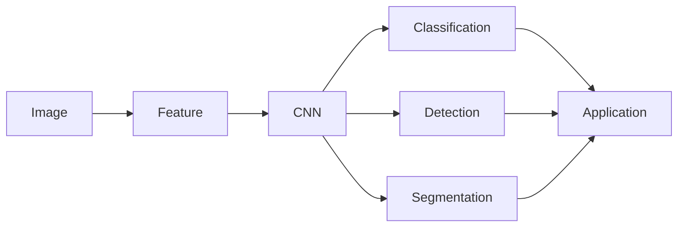

计算机视觉(Computer Vision) - 原理与代码实例讲解

作者：禅与计算机程序设计艺术 / Zen and the Art of Computer Programming 

关键词：计算机视觉、图像处理、目标检测、图像分割、卷积神经网络、深度学习

## 1. 背景介绍

### 1.1 问题的由来

计算机视觉是人工智能的一个重要分支,旨在让计算机具备类似人类视觉的感知和理解能力。随着数字图像和视频数据的爆炸式增长,以及自动驾驶、智能安防、医疗影像等领域对视觉智能的迫切需求,计算机视觉受到了学术界和工业界的广泛关注。

### 1.2 研究现状

近年来,深度学习尤其是卷积神经网络(CNN)的兴起,极大地推动了计算机视觉的发展。基于深度学习的方法在图像分类、目标检测、语义分割等任务上取得了远超传统方法的性能,成为当前计算机视觉的主流范式。但同时,深度学习也面临着可解释性差、泛化能力不足、对大规模标注数据的依赖等挑战。

### 1.3 研究意义

计算机视觉在现实世界中有着广泛的应用前景,如自动驾驶、工业质检、安防监控、医学影像分析、人机交互等。研究计算机视觉的原理和算法,有助于开发出更加智能和鲁棒的视觉系统,推动人工智能在各行各业的落地应用。同时,视觉智能也是构建类人智能的重要组成部分。

### 1.4 本文结构

本文将首先介绍计算机视觉的核心概念,然后重点讲解几个经典的视觉任务及其主流算法,包括图像分类、目标检测和图像分割。通过算法原理剖析、数学模型推导和代码实例演示,帮助读者全面深入地理解计算机视觉的原理和实现。最后,讨论计算机视觉的实际应用、发展趋势和面临的挑战。

## 2. 核心概念与联系

计算机视觉涉及到图像处理、模式识别、机器学习等多个领域的知识。以下是一些核心概念:  

- 图像:计算机视觉处理的基本对象,由像素阵列构成
- 特征:图像中对识别任务有判别性的信息,如纹理、边缘、形状等
- 卷积:提取图像局部特征的运算,是CNN的基础
- 分类:判断图像所属的类别,如猫、狗
- 检测:找出图像中感兴趣的目标及其位置,常用边界框表示  
- 分割:对图像做像素级的类别标注,常用掩码表示
- 深度学习:多层神经网络自动学习高层特征的机器学习方法

下图展示了这些概念之间的联系:



## 3. 核心算法原理 & 具体操作步骤

### 3.1 算法原理概述

当前计算机视觉的主流算法是基于深度学习的,主要采用卷积神经网络(CNN)。CNN通过卷积和池化操作提取图像的层次化特征,再经过全连接层完成分类、检测或分割任务。相比传统的手工设计特征的方法,CNN可以端到端地学习更加鲁棒和判别性的特征表示。

### 3.2 算法步骤详解

以图像分类任务为例,CNN的主要步骤如下:

1. 输入图像预处理,如缩放、归一化等
2. 卷积层提取局部特征:通过卷积核与图像做卷积,得到特征图
3. 激活函数引入非线性:ReLU等激活函数增加网络的表达能力 
4. 池化层降低分辨率:最大池化等操作减小特征图尺寸,提高运算效率
5. 全连接层映射到类别空间:将特征展平并通过全连接层映射到类别
6. Softmax层输出概率分布:对全连接层输出做Softmax归一化,得到各类别概率
7. 计算交叉熵损失:比较预测概率与真实标签,得到损失函数值
8. 反向传播更新参数:计算损失函数对各参数的梯度,用梯度下降等优化算法更新参数

目标检测和图像分割任务的CNN除了上述基本步骤,还需要针对性的改进,如加入候选区域生成、像素级预测等模块。

### 3.3 算法优缺点

CNN相比传统方法的优点在于:

1. 端到端学习,不需要手工设计特征
2. 高层语义特征提取能力强,分类性能好
3. 可以处理任意尺寸的图像
4. 模型可解释性相对较好,特征图可视化

但CNN也存在一定局限:

1. 需要大量标注数据进行训练,获取成本高
2. 模型参数量大,训练时间长,部署难度大
3. 对物体的几何变换和遮挡敏感,鲁棒性有待提高  
4. 难以处理高分辨率图像,性能受限

### 3.4 算法应用领域

CNN已在多个视觉任务上取得了瞩目成绩,主要应用包括:

- 图像分类:物体识别、场景分类、细粒度分类等
- 目标检测:行人检测、车辆检测、医学病灶检测等
- 图像分割:语义分割、实例分割、全景分割等
- 人脸识别:人脸验证、人脸聚类、人脸属性识别等
- 行为识别:动作识别、异常行为检测等

此外,CNN还被用于图像字幕生成、视觉问答、图像风格迁移等新兴任务。

## 4. 数学模型和公式 & 详细讲解 & 举例说明

### 4.1 数学模型构建

CNN的数学模型可以表示为一个函数 $f:X \rightarrow Y$,将输入图像 $X$ 映射到输出标签 $Y$。设 CNN 由 $L$ 个隐藏层组成,第 $l$ 层的输出记为 $H^{(l)}$,则 CNN 可以表示为复合函数:

$$f(X) = f^{(L)}(... f^{(2)}(f^{(1)}(X))...)$$

其中 $f^{(l)}$ 表示第 $l$ 层的变换。

### 4.2 公式推导过程

以卷积层和全连接层为例,推导其数学表达式。

卷积层的输出 $H^{(l)}$ 为:

$$H^{(l)}_{i,j,k} = \sum_m \sum_n \sum_c W^{(l)}_{m,n,c,k} \cdot H^{(l-1)}_{i+m,j+n,c} + b^{(l)}_k$$

其中 $W^{(l)}$ 为卷积核权重, $b^{(l)}$ 为偏置项。

全连接层的输出 $H^{(l)}$ 为:

$$H^{(l)}_{i} = \sum_j W^{(l)}_{i,j} \cdot H^{(l-1)}_{j} + b^{(l)}_i$$

其中 $W^{(l)}$ 为权重矩阵, $b^{(l)}$ 为偏置向量。

Softmax层将输入 $z_i$ 映射为归一化的概率:

$$p_i = \frac{e^{z_i}}{\sum_j e^{z_j}}$$

交叉熵损失 $L$ 定义为: 

$$L = -\sum_i y_i \log p_i$$

其中 $y_i$ 为真实标签的one-hot向量。

### 4.3 案例分析与讲解

下面以MNIST手写数字识别为例,讲解CNN的构建过程。

1. 输入层:将28x28的灰度图像输入CNN
2. 第一个卷积层:6个5x5的卷积核,得到6个特征图
3. 激活层:对特征图做ReLU激活
4. 池化层:2x2最大池化,降低分辨率
5. 第二个卷积层:16个5x5的卷积核,得到16个特征图
6. 激活层:对特征图做ReLU激活 
7. 池化层:2x2最大池化,进一步降低分辨率
8. 全连接层:将特征图展平,并连接到128个神经元
9. 输出层:Softmax层,输出10个类别的概率

可以看到,CNN逐层提取图像的层次化特征,从简单的边缘、纹理到复杂的物体部件,最终根据高层特征做出分类决策。

### 4.4 常见问题解答

Q: 卷积核的大小如何选择?
A: 常见的卷积核大小有3x3, 5x5, 7x7等,核大小越大,感受野越大,但参数量和计算量也越大。一般先用较小的卷积核,在网络后面使用较大的卷积核。

Q: 池化层的作用是什么?  
A: 池化层可以降低特征图的分辨率,一方面减小参数量加快计算,另一方面提高特征的平移不变性。常用的是2x2或4x4的最大池化。

Q: 如何避免过拟合?
A: 过拟合是指模型在训练集上表现很好,但在测试集上泛化性能差。可以采用以下策略避免过拟合:增大训练集、减小模型复杂度、使用正则化如L2权重衰减、dropout、早停法等。

## 5. 项目实践：代码实例和详细解释说明

### 5.1 开发环境搭建

首先需要安装深度学习框架如PyTorch或TensorFlow,可以使用Anaconda创建虚拟环境:

```bash
conda create -n cv python=3.8
conda activate cv
pip install torch torchvision 
```

### 5.2 源代码详细实现

下面以PyTorch为例,实现一个简单的CNN用于CIFAR-10图像分类。

```python
import torch
import torch.nn as nn
import torchvision
import torchvision.transforms as transforms

# 定义超参数
BATCH_SIZE = 128 
NUM_EPOCHS = 50
DEVICE = torch.device('cuda' if torch.cuda.is_available() else 'cpu')

# 数据预处理
transform = transforms.Compose([
    transforms.RandomCrop(32, padding=4),
    transforms.RandomHorizontalFlip(),
    transforms.ToTensor(),
    transforms.Normalize((0.5, 0.5, 0.5), (0.5, 0.5, 0.5))
])

# 加载CIFAR-10数据集
train_set = torchvision.datasets.CIFAR10(root='./data', train=True, 
                                         download=True, transform=transform)
train_loader = torch.utils.data.DataLoader(train_set, batch_size=BATCH_SIZE,
                                           shuffle=True, num_workers=4)

test_set = torchvision.datasets.CIFAR10(root='./data', train=False,
                                        download=True, transform=transform)
test_loader = torch.utils.data.DataLoader(test_set, batch_size=BATCH_SIZE,
                                          shuffle=False, num_workers=4)

# 定义CNN模型
class CNN(nn.Module):
    def __init__(self):
        super(CNN, self).__init__()
        self.conv1 = nn.Conv2d(3, 32, 3, padding=1) 
        self.relu1 = nn.ReLU(inplace=True)
        self.pool1 = nn.MaxPool2d(2, 2)
        self.conv2 = nn.Conv2d(32, 64, 3, padding=1)
        self.relu2 = nn.ReLU(inplace=True)
        self.pool2 = nn.MaxPool2d(2, 2)
        self.conv3 = nn.Conv2d(64, 128, 3, padding=1)
        self.relu3 = nn.ReLU(inplace=True)
        self.pool3 = nn.MaxPool2d(2, 2)
        self.fc4 = nn.Linear(128 * 4 * 4, 512)
        self.relu4 = nn.ReLU(inplace=True)
        self.fc5 = nn.Linear(512, 10)

    def forward(self, x):
        x = self.relu1(self.conv1(x))
        x = self.pool1(x)
        x = self.relu2(self.conv2(x))
        x = self.pool2(x)
        x = self.relu3(self.conv3(x))
        x = self.pool3(x)
        x = x.view(x.size(0), -1)
        x = self.relu4(self.fc4(x))
        x = self.fc5(x)
        return x

model = CNN().to(DEVICE)

# 定义损失函数和优化器
criterion = nn.CrossEntropyLoss()
optimizer = torch.optim.Adam(model.parameters())