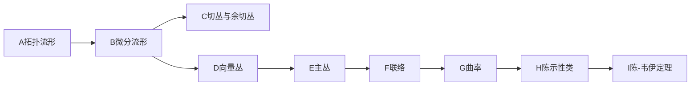
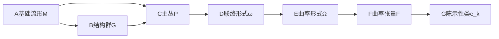

# 黎曼几何引论：主丛上联络的曲率

关键词：黎曼几何、主丛、联络、曲率、纤维丛、拓扑流形、微分流形、切丛、陈示性类、陈-韦伊定理

## 1. 背景介绍
### 1.1  问题的由来
黎曼几何作为现代微分几何的核心分支,在数学和物理等领域有着广泛而深刻的应用。它以流形为研究对象,通过在流形上引入度量、联络等附加结构,来刻画流形的几何和拓扑性质。而主丛理论则是研究流形上的对称性的有力工具。将主丛理论与黎曼几何相结合,可以得到主丛上联络的概念,进而引出主丛上联络的曲率,这是黎曼几何的核心概念之一。

### 1.2  研究现状
主丛上联络的曲率理论经过几代数学家的不懈努力,已经发展得比较成熟。陈省身、韦伊等大师级数学家在这一领域做出了开创性的贡献。目前该理论已广泛应用于数学物理、微分拓扑、代数几何等多个数学分支。但同时该理论涉及概念抽象、公式繁复,对初学者理解和掌握有一定难度。

### 1.3  研究意义 
主丛上联络曲率的研究对深入理解黎曼几何、纤维丛、规范场论等物理和几何学基本理论具有重要意义。它不仅是现代数学的核心课题之一,也是理论物理尤其是规范场论的数学基础。因此,对主丛联络曲率理论进行系统阐述和深入浅出的讲解,对于促进黎曼几何及其应用的学习和研究很有必要。

### 1.4  本文结构
本文将从流形、纤维丛、主丛等基本概念出发,系统介绍主丛联络曲率的定义、性质及其与陈示性类、陈-韦伊定理的关系,并给出主要定理的证明思路和案例分析。同时介绍该理论的应用、学习资源以及当前面临的挑战和未来的发展方向。

## 2. 核心概念与联系
要理解主丛上联络的曲率,首先需要掌握一些核心概念:

- 拓扑流形与微分流形
- 切丛与余切丛  
- 向量丛与主丛
- 联络与曲率
- 陈示性类
- 陈-韦伊定理

这些概念环环相扣,构成了主丛联络曲率理论的基础。其逻辑关系如下:

## 3. 核心算法原理 & 具体操作步骤
### 3.1  算法原理概述
主丛联络曲率的计算一般分为以下几个步骤:

1. 在流形M上构造主丛P,写出其转移函数;
2. 在主丛P上定义联络1-形式ω,并计算其局部表示矩阵;
3. 计算联络形式的外微分dω,得到曲率形式Ω;
4. 将曲率形式Ω平凡化,得到曲率张量F;
5. 用F表示出陈示性类,并写出陈-韦伊定理。

### 3.2  算法步骤详解
1. 构造主丛
设M为n维流形,G为r维李群,则M上的一个G主丛P由以下数据定义:

$$ P=\bigcup_{\alpha} U_{\alpha} \times G $$

其中$\{U_{\alpha}\}_{\alpha \in I}$为M的一个开覆盖,且满足:

$$ \begin{aligned}
\phi_{\alpha\beta}:U_{\alpha}\cap U_{\beta} &\to G \\
                                                  x &\mapsto \phi_{\alpha\beta}(x)
\end{aligned} $$

使得 $\phi_{\alpha\beta}(x)\phi_{\beta\gamma}(x)=\phi_{\alpha\gamma}(x)$,这里$\phi_{\alpha\beta}$称为转移函数。

2. 定义联络
主丛P上的一个联络由一个g值1-形式$\omega \in \Omega^1(P,\mathfrak{g})$定义,其中g为G的李代数,且满足:

$$
\begin{aligned}
R_{a}^{*}\omega&=Ad(a^{-1})\omega \\
\omega(\sigma(X))&=X,X \in \mathfrak{g}
\end{aligned}
$$

其中$R_a$为右平移,$Ad$为伴随表示,$\sigma$为g到P的垂直子丛的同构。

在局部平凡化$\phi_{\alpha}:P|_{U_{\alpha}} \to U_{\alpha} \times G$下,联络形式可以写为:

$$\phi_{\alpha}^{*}\omega=g_{\alpha}^{-1}\pi^{*}A_{\alpha}g_{\alpha}+g_{\alpha}^{-1}dg_{\alpha}$$

其中$A_{\alpha} \in \Omega^1(U_{\alpha},\mathfrak{g})$称为规范势。

3. 计算曲率
曲率形式定义为联络形式的外微分:

$$\Omega=d\omega+\frac{1}{2}[\omega \wedge \omega]$$

局部表示为:

$$\phi_{\alpha}^{*}\Omega=\pi^{*}(dA_{\alpha}+A_{\alpha} \wedge A_{\alpha})$$

令$F_{\alpha}=dA_{\alpha}+A_{\alpha} \wedge A_{\alpha}$,称为曲率张量。

4. 平凡化曲率
通过规范变换,总可以在P的局部平凡化下得到一个平凡的联络,此时$A_{\alpha}=g_{\alpha}^{-1}dg_{\alpha}$,曲率

$$F_{\alpha}=g_{\alpha}^{-1}dg_{\alpha} \wedge g_{\alpha}^{-1}dg_{\alpha}$$

在这个意义下,曲率张量F可以看作是定义在M上的2-形式,它是规范不变量。

5. 陈示性类和陈-韦伊定理
利用曲率张量F,可以构造出一系列的闭微分形式:

$$\begin{aligned}
c_0&=1 \\
c_1&=\frac{i}{2\pi}tr(F) \\ 
c_2&=\frac{1}{(2\pi)^2}tr(F \wedge F) \\
&\cdots \\
c_k&=\frac{1}{(2\pi)^k}tr(\underbrace{F \wedge \cdots \wedge F}_{\text{k}})
\end{aligned}$$

称为第k陈示性类。陈-韦伊定理指出,陈示性类$c_k$的De Rham上同调类$[c_k] \in H_{DR}^{2k}(M)$与M的拓扑不变量有关,是M上G主丛的示性类。

### 3.3  算法优缺点
主丛联络曲率的计算过程涉及大量的微分形式运算,虽然原理并不复杂,但计算量较大。

优点:
- 理论完备,适用于任意流形和李群
- 揭示了曲率与拓扑的深刻联系

缺点:
- 计算繁琐,需要借助数学软件
- 概念抽象,学习曲线陡峭

### 3.4  算法应用领域
主丛联络曲率广泛应用于以下领域:

- 微分几何:黎曼几何的基础理论
- 代数拓扑:示性类理论
- 数学物理:规范场论的数学基础
- 理论物理:广义相对论、量子场论

## 4. 数学模型和公式 & 详细讲解 & 举例说明
### 4.1  数学模型构建
主丛联络曲率的数学模型可以概括为以下几个要素:

- 基础流形M:通常为光滑的、有向的、连通的n维流形
- 结构群G:r维李群,刻画丛的对称性
- 主丛P:M上的G主丛,由转移函数$\phi_{\alpha\beta}$定义
- 联络形式$\omega$:P上取值于g的1-形式,满足一定的性质
- 曲率形式$\Omega$:由$\omega$诱导,刻画丛的曲率
- 曲率张量F:$\Omega$在局部平凡化下的表示,是M上的2-形式
- 陈示性类$c_k$:由F构造,生成M上G主丛的示性类

它们之间的逻辑关系如下图所示:

### 4.2  公式推导过程
以下给出主丛联络曲率理论的主要公式推导过程:

1. 主丛的定义
$$ P=\bigcup_{\alpha} U_{\alpha} \times G,\quad \phi_{\alpha\beta}:U_{\alpha}\cap U_{\beta} \to G $$

2. 联络形式的定义
$$
\begin{aligned}
\omega &\in \Omega^1(P,\mathfrak{g}) \\
R_{a}^{*}\omega&=Ad(a^{-1})\omega \\
\omega(\sigma(X))&=X,X \in \mathfrak{g}
\end{aligned}
$$

3. 联络形式的局部表示
$$\phi_{\alpha}^{*}\omega=g_{\alpha}^{-1}\pi^{*}A_{\alpha}g_{\alpha}+g_{\alpha}^{-1}dg_{\alpha}$$

4. 曲率形式的定义
$$\Omega=d\omega+\frac{1}{2}[\omega \wedge \omega]$$

5. 曲率形式的局部表示
$$\phi_{\alpha}^{*}\Omega=\pi^{*}(dA_{\alpha}+A_{\alpha} \wedge A_{\alpha})=\pi^{*}F_{\alpha}$$

6. 平凡化的曲率张量
$$F_{\alpha}=g_{\alpha}^{-1}dg_{\alpha} \wedge g_{\alpha}^{-1}dg_{\alpha}$$

7. 陈示性类的定义
$$c_k=\frac{1}{(2\pi)^k}tr(\underbrace{F \wedge \cdots \wedge F}_{\text{k}})$$

8. 陈-韦伊定理
主丛P的第k陈类$c_k(P) \in H^{2k}(M,\mathbb{R})$可以用曲率张量F表示为:

$$c_k(P)=[\frac{1}{(2\pi)^k}tr(\underbrace{F \wedge \cdots \wedge F}_{\text{k}})]$$

其中$[·]$表示De Rham上同调类。

### 4.3  案例分析与讲解
下面以复数域上的霍普丛为例,演示主丛联络曲率的计算过程。

设 $M=S^2=\mathbb{C}\cup \{\infty\}$ 为复射影直线,$G=U(1)$ 为复数的单位圆周群,则 $S^2$ 上存在一个 $U(1)$ 主丛 $P=S^3$,称为霍普丛,其中 $S^3$ 表示三维球面。

1. 转移函数
霍普丛的转移函数为:

$$\phi_{01}(z)=\frac{z}{|z|},z \in \mathbb{C}-\{0\}$$

2. 联络形式
取霍普丛上的联络形式为:

$$\omega=\frac{i}{2}(\overline{z}dz-zd\overline{z})$$

其中 $z$ 为 $S^3$ 上的复坐标。

3. 曲率形式
计算 $\omega$ 的外微分得曲率形式:

$$\Omega=d\omega=i dz \wedge d\overline{z}$$

4. 曲率张量
令 $z=x+iy$,则曲率张量为:

$$F=i(dx \wedge dy)$$

这恰好是 $S^2$ 上的体积元。

5. 第一陈类
霍普丛的第一陈类为:

$$c_1(P)=[\frac{i}{2\pi}F]=[\frac{i}{2\pi}dx \wedge dy] \in H^2(S^2,\mathbb{R})$$

生成了 $S^2$ 的二维整系数上同调群 $H^2(S^2,\mathbb{Z})=\mathbb{Z}$。

由此可见