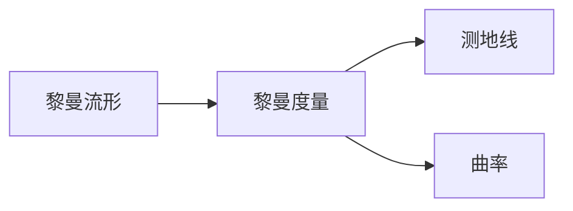

# 黎曼几何引论：黎曼度量

关键词：黎曼几何、黎曼度量、黎曼流形、测地线、曲率

## 1. 背景介绍
### 1.1 问题的由来
黎曼几何是数学的一个重要分支,它研究的是具有黎曼度量的流形。黎曼几何的基本概念是由德国数学家黎曼(Bernhard Riemann)在1854年提出的。他在研究复变函数论时,引入了黎曼面的概念,这实际上就是二维黎曼流形。后来,黎曼几何被广泛应用到物理学、工程学等领域。

### 1.2 研究现状
目前,黎曼几何已经成为现代几何学的核心内容之一。许多数学家和物理学家都对黎曼几何进行了深入的研究,取得了丰硕的成果。比如,爱因斯坦的广义相对论就是建立在黎曼几何的基础之上的。近年来,随着计算机技术的发展,黎曼几何在计算机视觉、图像处理、机器学习等领域也得到了广泛的应用。

### 1.3 研究意义 
黎曼几何不仅在数学领域有着重要的地位,在物理学、计算机科学等领域也有着广泛的应用前景。深入研究黎曼几何,对于拓展我们的数学视野,深化对物理世界的认识,促进计算机科学的发展都具有重要意义。

### 1.4 本文结构
本文将围绕黎曼几何中的核心概念——黎曼度量展开讨论。首先介绍黎曼几何的核心概念以及它们之间的联系；然后重点讲解黎曼度量的定义、性质以及与测地线、曲率的关系；接着通过具体的数学模型和代码实例说明如何计算黎曼度量；最后总结黎曼几何的发展历程,展望它的未来研究方向与应用前景。

## 2. 核心概念与联系
黎曼几何的核心概念包括：黎曼流形、黎曼度量、测地线、曲率等。它们之间的逻辑关系如下图所示：



- 黎曼流形：一个局部类似欧氏空间的光滑流形,且具有黎曼度量。
- 黎曼度量：黎曼流形上的一种特殊的度量,用来衡量曲面上两点之间的距离。
- 测地线：黎曼流形上的"直线",是两点之间距离最短的曲线。
- 曲率：描述黎曼流形偏离欧氏空间的程度,与黎曼度量密切相关。

## 3. 核心算法原理 & 具体操作步骤
### 3.1 算法原理概述
在黎曼流形上,我们通过黎曼度量来计算两点之间的距离。黎曼度量实际上是一个二次型,它把切向量映射到实数。对于流形上的任意一点,黎曼度量都可以写成一个对称正定矩阵的形式。

### 3.2 算法步骤详解
给定一个n维黎曼流形M,其局部坐标系为$(x^1,\cdots,x^n)$。设$g_{ij}$是黎曼度量在该坐标系下的分量,则M上任意一点处的黎曼度量可以写成:

$$
\mathrm{d}s^2 = \sum_{i,j=1}^n g_{ij}\mathrm{d}x^i\mathrm{d}x^j
$$

其中$g_{ij}$满足:
1. 对称性: $g_{ij}=g_{ji}$
2. 正定性: 对任意非零向量$(v^1,\cdots,v^n)$,有$\sum_{i,j=1}^n g_{ij}v^iv^j > 0$

计算黎曼度量的一般步骤如下:
1. 选取一个局部坐标系$(x^1,\cdots,x^n)$；
2. 求出该坐标系下的度量分量$g_{ij}$；  
3. 将$g_{ij}$代入黎曼度量的表达式$\mathrm{d}s^2 = \sum_{i,j=1}^n g_{ij}\mathrm{d}x^i\mathrm{d}x^j$。

### 3.3 算法优缺点
优点:
- 黎曼度量完整地刻画了黎曼流形的几何性质,是研究黎曼几何的基础工具。
- 许多物理问题可以用黎曼几何的语言来描述,黎曼度量在其中扮演了重要角色。

缺点:  
- 计算黎曼度量需要选取合适的坐标系,有时候找到这样的坐标系并不容易。
- 黎曼度量的表达式可能非常复杂,给计算带来困难。

### 3.4 算法应用领域
黎曼度量广泛应用于以下领域:
- 物理学：广义相对论、弦理论等
- 计算机视觉：形状分析、三维重建等  
- 机器学习：流形学习、度量学习等
- 医学成像：脑成像分析、心脏形状分析等

## 4. 数学模型和公式 & 详细讲解 & 举例说明
### 4.1 数学模型构建
我们以二维黎曼流形为例,来说明如何构建黎曼度量的数学模型。设流形M的局部坐标系为$(x,y)$,则M上任意一点的黎曼度量可以写成:

$$
\mathrm{d}s^2 = E\mathrm{d}x^2 + 2F\mathrm{d}x\mathrm{d}y + G\mathrm{d}y^2
$$

其中,$E,F,G$是关于$x,y$的函数,称为度量系数。写成矩阵形式为:

$$
g = \begin{pmatrix}
E & F \\\\
F & G
\end{pmatrix}
$$

### 4.2 公式推导过程
下面我们来推导二维黎曼流形上测地线方程的公式。测地线是使得黎曼度量在其上的积分取极小值的曲线,它满足欧拉-拉格朗日方程:

$$
\frac{\mathrm{d}}{\mathrm{d}t}\left(\frac{\partial L}{\partial \dot{x}^i}\right) - \frac{\partial L}{\partial x^i} = 0
$$

其中$L = \sqrt{E\dot{x}^2 + 2F\dot{x}\dot{y} + G\dot{y}^2}$是黎曼度量的拉格朗日量,$\dot{x} = \frac{\mathrm{d}x}{\mathrm{d}t},\dot{y} = \frac{\mathrm{d}y}{\mathrm{d}t}$。将$L$代入欧拉-拉格朗日方程,经过一系列推导,可以得到测地线方程为:

$$
\begin{aligned}
\ddot{x} + \Gamma_{11}^1\dot{x}^2 + 2\Gamma_{12}^1\dot{x}\dot{y} + \Gamma_{22}^1\dot{y}^2 &= 0 \\\\
\ddot{y} + \Gamma_{11}^2\dot{x}^2 + 2\Gamma_{12}^2\dot{x}\dot{y} + \Gamma_{22}^2\dot{y}^2 &= 0
\end{aligned}
$$

其中$\Gamma_{ij}^k$是克氏符号,它们可以用度量系数$E,F,G$表示:

$$
\Gamma_{ij}^k = \frac{1}{2}g^{km}\left(\frac{\partial g_{im}}{\partial x^j} + \frac{\partial g_{jm}}{\partial x^i} - \frac{\partial g_{ij}}{\partial x^m}\right)
$$

这里$g^{ij}$是度量矩阵$g_{ij}$的逆矩阵。

### 4.3 案例分析与讲解
下面我们以球面为例,来说明如何求球面上的黎曼度量。球面可以用球坐标系$(r,\theta,\varphi)$参数化:

$$
\begin{aligned}
x &= r\sin\theta\cos\varphi \\\\
y &= r\sin\theta\sin\varphi \\\\
z &= r\cos\theta
\end{aligned}
$$

其中$r>0,0\leq\theta\leq\pi,0\leq\varphi<2\pi$。球面上任意一点的切平面由$\frac{\partial}{\partial\theta}$和$\frac{\partial}{\partial\varphi}$张成。计算它们的内积可得球面的黎曼度量为:

$$
\mathrm{d}s^2 = r^2(\mathrm{d}\theta^2 + \sin^2\theta\mathrm{d}\varphi^2)
$$

写成矩阵形式为:

$$
g = \begin{pmatrix}
r^2 & 0 \\\\
0 & r^2\sin^2\theta
\end{pmatrix}
$$

可见,球面的度量系数为$E=r^2,F=0,G=r^2\sin^2\theta$。

### 4.4 常见问题解答
Q: 黎曼度量和欧氏度量有什么区别?
A: 欧氏度量是定义在欧氏空间中的,它是一种"平直"的度量；而黎曼度量是定义在黎曼流形上的,它可以是"弯曲"的。黎曼度量是欧氏度量的推广。

Q: 黎曼度量和测地线有什么联系?
A: 测地线是黎曼流形上的"直线",它们是使得黎曼度量在其上的积分取极小值的曲线。测地线的方程可以用黎曼度量的度量系数表示出来。

Q: 如何判断一个流形是否具有黎曼度量?
A: 对于一个流形,如果它的切丛上存在一个光滑的正定二次型场,那么这个流形就是黎曼流形,该二次型场就是它的黎曼度量。

## 5. 项目实践：代码实例和详细解释说明
### 5.1 开发环境搭建
我们使用Python语言和NumPy、SciPy等库来实现黎曼度量的计算。首先导入所需的库:

```python
import numpy as np
import scipy.linalg as sl
```

### 5.2 源代码详细实现
下面是计算黎曼度量的Python代码实现:

```python
def riemann_metric(x, y):
    """
    计算二维黎曼流形上的黎曼度量
    :param x: 自变量x
    :param y: 自变量y
    :return: 黎曼度量矩阵
    """
    # 度量系数E,F,G
    E = 1 + x**2
    F = x*y
    G = 1 + y**2
    
    # 度量矩阵
    g = np.array([[E, F], 
                  [F, G]])
    
    return g

def christoffel_symbols(x, y):
    """
    计算二维黎曼流形上的克氏符号  
    :param x: 自变量x
    :param y: 自变量y
    :return: 克氏符号Γ_ij^k
    """
    # 度量矩阵
    g = riemann_metric(x, y)
    # 度量矩阵的逆矩阵
    g_inv = sl.inv(g)
    
    # 度量系数E,F,G的偏导数
    E_x = 2*x
    E_y = 0
    F_x = y  
    F_y = x
    G_x = 0
    G_y = 2*y
    
    # 克氏符号Γ_ij^k
    Gamma_11_1 = g_inv[0,0]*E_x/2 + g_inv[0,1]*(F_x - E_y)/2
    Gamma_11_2 = g_inv[1,0]*E_x/2 + g_inv[1,1]*(F_x - E_y)/2
    Gamma_12_1 = g_inv[0,0]*F_y/2 + g_inv[0,1]*(G_x - F_y)/2  
    Gamma_12_2 = g_inv[1,0]*F_y/2 + g_inv[1,1]*(G_x - F_y)/2
    Gamma_22_1 = g_inv[0,0]*(F_y - G_x)/2 + g_inv[0,1]*G_y/2
    Gamma_22_2 = g_inv[1,0]*(F_y - G_x)/2 + g_inv[1,1]*G_y/2
    
    return Gamma_11_1, Gamma_11_2, Gamma_12_1, Gamma_12_2, Gamma_22_1, Gamma_22_2
```

### 5.3 代码解读与分析
上面的代码定义了两个函数:
- `riemann_