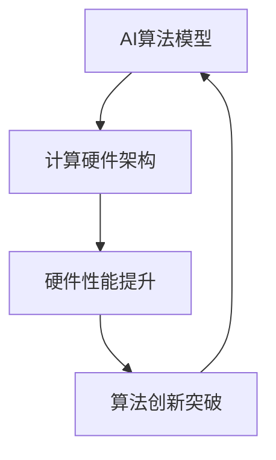

# AI Agent: AI的下一个风口 硬件进化对软件的影响

关键词：AI Agent, 硬件进化, 软件影响, 人工智能, 计算机架构, 算法优化

## 1. 背景介绍 

### 1.1 问题的由来

人工智能(Artificial Intelligence, AI)技术的飞速发展，正在深刻影响和改变着我们的生活。从智能语音助手、自动驾驶汽车，到智能医疗诊断、金融风控等，AI已经渗透到各行各业。而支撑AI技术发展的核心动力，来自于算法模型的创新和计算硬件的突破。

近年来，AI芯片和专用硬件的研发如火如荼，从谷歌的TPU、英伟达的GPU，到寒武纪、比特大陆等初创公司推出的AI芯片，都在为AI算法的运行提供强大的计算力。与此同时，AI算法尤其是深度学习的发展，也在倒逼着计算架构的变革优化。可以说，AI软硬件是相辅相成、互为促进的。

### 1.2 研究现状

当前，学术界和工业界都在AI软硬件协同设计方面开展了大量研究。一方面，针对AI算法尤其是神经网络的特点，研究人员提出了一系列的专用计算芯片和加速器，如谷歌TPU、寒武纪思元等。这些硬件在矩阵运算、数据吞吐、功耗效率等方面进行了专门的架构设计和优化，极大提升了AI应用的性能表现。

另一方面，AI算法尤其是深度学习模型也在不断evolving，从最早的全连接网络，到卷积神经网络CNN、循环神经网络RNN，再到注意力机制、Transformer等新范式的出现，对计算架构提出了新的要求。研究人员需要根据模型的特点，去优化硬件的设计，最大限度发挥算力。同时也要考虑算法和硬件的匹配性，用软件定义硬件，用硬件倒逼软件优化。

一些有代表性的研究成果包括:
- 谷歌TPU：为机器学习定制的ASIC芯片，内置大容量高带宽内存HBM，支持低精度量化计算，性能功耗比大幅领先传统GPU/CPU。 
- 英伟达GPU：支持通用计算的图形处理器，凭借强大的并行计算能力，成为当前深度学习训练和推理的主流硬件平台。
- 寒武纪思元：国产AI芯片，基于RISC-V指令集，支持INT4/8等低精度计算，对标英伟达GPU。
- AI编译器：TVM/Glow等深度学习编译器项目，能够自动优化神经网络计算图，提升硬件利用率。
- AI模型压缩：剪枝、量化、蒸馏等技术，在尽量保持模型性能的同时，极大降低模型尺寸和计算量，更适合端侧硬件部署。

### 1.3 研究意义

AI软硬件协同设计关系到人工智能产业化落地的成败，具有重大的理论和实践意义：

理论上，AI软硬件协同设计是一个复杂的系统工程，涉及人工智能、计算机体系结构、编译优化、微电子等多个交叉学科，是计算机科学基础研究的前沿热点。通过软硬件协同设计，可以从更高的维度审视AI系统的性能瓶颈，有利于算法模型和计算架构的创新突破。

实践上，只有软硬件的深度融合，才能充分发挥人工智能的效能，让AI走出实验室走向大规模应用。当前AI芯片和系统的主要方向包括云端训练芯片、端侧推理芯片、端云协同芯片等，与垂直行业应用相结合形成了智慧城市、自动驾驶、智能制造等一系列场景。软硬件协同设计能够显著提升产品性能、降低部署成本，对产业升级和科技进步具有重要的促进作用。

### 1.4 本文结构

本文将重点探讨AI软硬件协同设计的核心理念、关键技术、发展趋势，以及对AI产业的影响。内容安排如下：

第2节介绍AI软硬件协同设计的核心概念，以及软件和硬件的相互影响和制约关系。

第3节重点阐述AI软硬件协同设计采用的核心技术方法，包括硬件架构、编译优化、混合精度量化等。

第4节建立AI软硬件协同设计的数学模型，分析软硬件影响因子，并给出一些具体案例。

第5节给出一个AI软硬件协同设计的实践项目，分享代码实现和性能优化的经验。

第6节展望AI软硬件协同设计的实际应用场景和发展前景。

第7节推荐一些业界常用的AI软硬件开发工具和学习资源。

第8节总结全文，评述AI软硬件协同设计的发展趋势和挑战。

第9节列举一些读者关心的常见问题，并给出解答。

## 2. 核心概念与联系

人工智能的软件和硬件是一个互相依存、相互促进的关系。

从最底层看，人工智能算法的运行需要计算硬件作为载体，如CPU、GPU、FPGA、ASIC等处理器。不同的硬件具有不同的计算架构和性能特点，直接决定了其适用的算法类型和规模。比如，GPU凭借大量的运算核心和显存带宽，非常适合大规模矩阵运算，因此成为深度学习的主流硬件平台。

从软件的角度看，人工智能算法尤其是神经网络模型也在快速迭代。从最早的感知机到BP网络，从浅层网络到深度学习，从CNN、RNN到GAN、Transformer，新的范式层出不穷。这些算法变革对硬件提出了更高的要求，比如更大的内存容量、更高的带宽、更强的并行计算能力、更低的功耗等。于是催生了一系列的AI专用芯片，如谷歌TPU、寒武纪思元等。

因此，AI软件和硬件是一个"鸡生蛋、蛋生鸡"的循环。如下图所示：

AI软硬件协同设计，就是要在这个循环中找到最佳的平衡点和结合方式，发挥软件和硬件的最大效能。核心理念包括：

- 软硬协同：根据AI算法的特点，量身定制计算芯片和系统架构，做到软硬一体。
- 软件定义硬件：用软件定义硬件逻辑和互连，构建灵活可重构的计算架构。
- 硬件倒逼软件：发掘硬件的性能瓶颈，倒逼优化算法和编程实现。
- 异构计算：采用CPU、GPU、FPGA等多种异构器件，发挥各自优势。
- 云边端协同：合理分工云端训练和边缘推理任务，实现端云协同。

## 3. 核心算法原理 & 具体操作步骤

### 3.1 算法原理概述

AI软硬件协同设计涉及多个层面的算法优化。

在硬件层面，需要根据AI算法的计算模式和数据流，设计定制化的计算单元、存储结构、互连拓扑等。以TPU为例，其核心是一个超大规模的矩阵乘法器(Matrix Multiply Unit, MXU)，可以在一个时钟周期内完成65536个8位整数的乘加运算。TPU还集成了大容量的片上内存，与MXU采用脉动阵列(Systolic Array)互连，保证了数据的高效调度和复用。

在编译层面，需要将神经网络模型表示为计算图，并进行一系列图优化操作，如算子融合、常量折叠、内存规划等，最大限度减少数据移动和访存开销。以TVM为例，其将深度学习模型的部署流程抽象为一个端到端的优化问题，通过Relay IR、自动调优、代码生成等模块，能够将模型高效编译到不同的硬件后端。

在算法层面，需要针对硬件的特性对AI模型进行优化改进，如模型压缩、低精度量化、稀疏化等。以INT8量化为例，通过将32位浮点数压缩为8位整数，可以把模型尺寸减小4倍，内存带宽和能耗也大幅降低，但如何在保证精度的前提下完成量化是一个关键问题，需要精心设计量化策略。

### 3.2 算法步骤详解

下面以TPU为例，详细讲解其软硬件协同设计的步骤。

步骤1：分析目标AI算法的计算特征。以卷积神经网络CNN为例，其主要计算是卷积、池化等，而卷积本质上可以转化为矩阵乘法。因此，TPU的核心是设计一个高效的矩阵乘法器。

步骤2：设计矩阵乘法器MXU的架构。MXU采用脉动阵列架构，包含256x256个乘加单元，可以在一个周期内完成65536次乘加。并且MXU支持多种数据类型，如INT8、INT16、FP16、bfloat16等。

步骤3：设计片上存储系统。TPU集成了大容量的片上SRAM（24MB），用于缓存重用数据。同时采用智能的内存管理，将权重提前载入芯片进行复用，尽量避免片外数据访问。

步骤4：编写低精度量化算法。TPU支持多种低精度数据类型，可以显著提升性能和能效。但需要在训练过程中加入量化感知(Quantization-Aware Training)，即模拟量化误差对模型进行微调。推理过程中，还需要对数据做好量化/反量化、数据重排等处理。

步骤5：使用XLA编译器优化。TPU配套了基于LLVM的XLA(Accelerated Linear Algebra)编译器，能够将高层算法表达式自动映射到底层指令。编译过程中会做大量优化，如算子融合、显存规划、指令调度等。

步骤6：使用TensorFlow开发。TPU原生支持TensorFlow框架，用户可以无缝迁移原有TensorFlow代码，在TPU上进行加速。

### 3.3 算法优缺点

TPU软硬件协同设计的优点包括：
- 通过定制化设计，TPU在CNN等AI算法上可以获得较通用芯片10-30倍的性能提升。
- 采用脉动阵列、片上内存等技术，最小化数据移动，提高能效。  
- 支持多种低精度数据类型，可以在精度损失很小的情况下，大幅提升速度。
- 配套强大的软件栈，包括XLA编译器、bfloat16数据类型、TensorFlow集成等。

但TPU也存在一些局限性：
- 适用范围有限，主要针对CNN、LSTM等常见的模型，对图神经网络等新模型支持不足。
- 可编程性不够灵活，难以处理控制流密集的任务。
- 缺乏标准化生态，对深度学习框架和第三方库的支持有限。
- 价格昂贵，主要在云端部署，边缘端方案仍在探索中。

### 3.4 算法应用领域

TPU代表了AI软硬件协同设计的一种范式，已经在学术界和工业界得到了广泛应用。

在学术研究中，TPU加速了AlphaGo、Meena、GPT-3等里程碑式的AI系统，让超大规模模型训练成为可能。谷歌大脑、OpenAI等顶尖实验室也在探索TPU的边界。

在工业应用中，TPU支撑了谷歌云、淘宝搜索、腾讯广告等大规模在线服务。一些初创公司如商汤、第四范式等，也基于类TPU架构开发了自己的AI芯片。可以预见，随着AI规模化应用的深入，会有越来越多的场景采用定制化的AI芯片。

## 4. 数学模型和公式 & 详细讲解 & 举例说明

### 4.1 数学模型构建

为了更好地理解AI软硬件协同设计的内在机理，我们尝试建立一个数学模型。该模型的目标是，给定一个特定的AI算法，如何