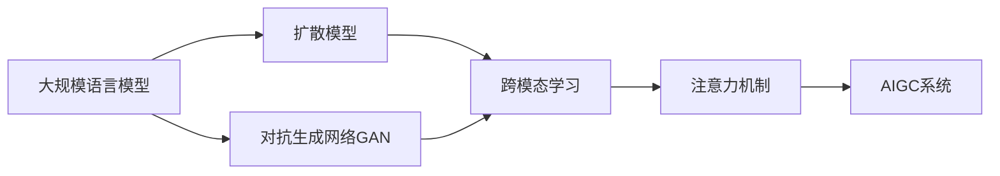

# AIGC从入门到实战：变化：活用 Midjourney，你也能成为神笔马良

作者：禅与计算机程序设计艺术 / Zen and the Art of Computer Programming 

## 1. 背景介绍

### 1.1 问题的由来

随着人工智能技术的飞速发展，AI生成内容(AIGC)正在席卷全球。从文本、图像到音频、视频，AI正在重塑内容创作的方方面面。其中，以Midjourney、Stable Diffusion、DALL-E等为代表的AI绘画工具，更是掀起了一股"AI绘画"热潮。它们能够根据用户输入的文本提示，快速生成栩栩如生的图像，令人叹为观止。

### 1.2 研究现状

目前，AI绘画领域的研究主要集中在以下几个方面：

1. 大规模预训练模型：如Midjourney所使用的自回归语言模型、扩散模型等，通过在海量数据上进行预训练，学习图像与文本之间的对应关系。

2. 文本-图像跨模态理解：研究如何将文本信息有效地转化为视觉表征，引导图像生成过程。这涉及自然语言处理、计算机视觉等多个领域。

3. 图像质量与分辨率提升：通过对抗生成网络(GAN)、高分辨率图像合成等技术，不断提升生成图像的真实感和清晰度。

4. 艺术风格与美学控制：探索如何通过文本提示控制生成图像的艺术风格，如写实、卡通、油画等，以满足用户的审美需求。

### 1.3 研究意义

AI绘画的研究具有重要意义：

1. 降低内容创作门槛：AI绘画工具使得普通用户无需专业绘画技能，即可快速创作出高质量的视觉内容，大大降低了创作门槛。

2. 提高创作效率：传统绘画需要耗费大量时间和精力，而AI绘画可在短时间内生成多样化的图像，极大提升了创作效率。

3. 激发创意灵感：AI绘画为创作者提供了新的思路和灵感源泉，有助于拓展创意空间，催生更多创新性作品。

4. 推动技术进步：AI绘画的研究推动了人工智能、计算机图形学等领域的发展，催生出更多先进的算法和模型。

### 1.4 本文结构

本文将围绕Midjourney这一代表性AI绘画工具，深入探讨AIGC的原理和实践。全文分为以下几个部分：

1. 背景介绍：介绍AIGC的发展现状、研究意义等。
2. 核心概念与联系：阐述AIGC的核心概念及其内在联系。
3. 核心算法原理与操作步骤：详细讲解AIGC的关键算法，并给出Midjourney的具体操作指南。 
4. 数学模型与公式推导：介绍AIGC所涉及的数学原理，并通过公式推导加深理解。
5. 项目实践：通过代码实例，演示如何利用Midjourney API进行二次开发。
6. 应用场景：展望AIGC技术的实际应用前景。
7. 工具和资源推荐：推荐AIGC学习和实践的各类资源。
8. 总结与展望：总结全文，并对AIGC的未来发展趋势和挑战进行展望。

## 2. 核心概念与联系

要深入理解AIGC，首先需要了解其核心概念：

- **大规模语言模型**：如GPT-3、PaLM等，通过在海量文本数据上进行预训练，学习自然语言的统计规律和语义表征，是AIGC的基石。

- **扩散模型**：一种生成模型，通过逐步去噪的过程，将随机噪声转化为清晰图像。Midjourney正是基于扩散模型实现文本到图像的生成。

- **对抗生成网络(GAN)**：由生成器和判别器组成，通过两者的博弈学习，不断提升生成图像的真实性。GAN可用于提升AIGC生成图像的质量。

- **跨模态学习**：研究如何在不同模态(如文本、图像)间建立联系，实现模态间的信息转换。AIGC需要实现文本-图像的跨模态对齐。

- **注意力机制**：一种聚焦于关键信息的机制，广泛应用于自然语言处理和计算机视觉领域。Self-Attention和Cross-Attention分别用于提取图像和文本的上下文信息。

这些概念之间环环相扣，共同构建起AIGC的技术框架：

大规模语言模型通过学习文本数据，为扩散模型和GAN提供文本编码；扩散模型和GAN分别从不同角度生成高质量图像；跨模态学习将文本信息与图像特征对齐；注意力机制提取关键信息。它们相互配合，最终构建出强大的AIGC系统。

## 3. 核心算法原理 & 具体操作步骤

### 3.1 算法原理概述

Midjourney所采用的扩散模型，是当前AIGC的主流算法范式之一。其核心思想是：从纯随机噪声开始，通过逐步去噪得到清晰图像。

具体来说，扩散模型包含正向(扩散)和反向(去噪)两个过程：

- 正向过程：从真实图像出发，通过逐步添加高斯噪声，最终得到纯噪声图像。
- 反向过程：从纯噪声图像出发，通过逐步去噪(预测噪声并将其从图像中减去)，最终得到干净的合成图像。

Midjourney在此基础上引入了文本条件，使得去噪过程受到文本提示的指导，最终生成与文本相关的图像。

### 3.2 算法步骤详解

下面我们详细介绍Midjourney的图像生成步骤：

1. **文本编码**：将用户输入的文本提示通过预训练的语言模型(如GPT-3)进行编码，得到文本嵌入向量 $\mathbf{e}_t$。

2. **初始化噪声**：随机采样高斯噪声 $\mathbf{x}_T$，作为反向去噪过程的起点。

3. **去噪迭代**：对 $t=T,T-1,\dots,1$ 进行如下迭代：

   a. 将当前图像 $\mathbf{x}_t$ 与文本嵌入 $\mathbf{e}_t$ 拼接，输入去噪网络(U-Net)：

   $$\mathbf{h}_t = \text{U-Net}([\mathbf{x}_t, \mathbf{e}_t])$$

   b. 预测噪声：$\mathbf{n}_t = f_\theta(\mathbf{x}_t, \mathbf{h}_t, t)$

   c. 去噪更新图像：$\mathbf{x}_{t-1} = \frac{1}{\sqrt{\alpha_t}} (\mathbf{x}_t - \frac{1-\alpha_t}{\sqrt{1-\bar{\alpha}_t}} \mathbf{n}_t)$

4. **输出结果**：最终得到的 $\mathbf{x}_0$ 即为生成的图像。

其中，$\alpha_t$ 和 $\bar{\alpha}_t$ 为噪声调度超参数，控制每一步去噪的强度。

### 3.3 算法优缺点

扩散模型相比其他生成式模型(如GAN)，具有以下优点：

- 样本质量高：生成的图像清晰、连贯，细节丰富。
- 训练稳定：不易出现GAN中的模式崩溃问题。
- 适用任务广：可用于图像、语音、视频等多种数据形态。

但扩散模型也存在一定局限性：

- 推理速度慢：需要较长的迭代过程才能生成图像。
- 资源消耗大：训练和推理都需要大量算力。

### 3.4 算法应用领域

基于扩散模型的AIGC技术已在多个领域崭露头角：

- 艺术创作：如Midjourney、Stable Diffusion等，辅助艺术家进行创作。
- 设计辅助：应用于服装、工业、UI等设计领域，提供设计灵感和素材。
- 虚拟形象生成：如虚拟主播、游戏角色等，自动生成逼真的虚拟形象。
- 数字营销：自动生成产品图片、广告图等，提高营销效率。

未来，随着算法的不断进步，AIGC有望在更广阔的领域大放异彩。

## 4. 数学模型和公式 & 详细讲解 & 举例说明

### 4.1 数学模型构建

扩散模型可以用如下数学语言进行描述。

正向扩散过程定义为马尔可夫链：

$$q(\mathbf{x}_{1:T}|\mathbf{x}_0) = \prod_{t=1}^T q(\mathbf{x}_t|\mathbf{x}_{t-1})$$

其中，$\mathbf{x}_0$ 为真实图像，$\mathbf{x}_1,\dots,\mathbf{x}_T$ 为添加噪声后的中间状态，$q(\mathbf{x}_t|\mathbf{x}_{t-1})$ 定义为高斯分布：

$$q(\mathbf{x}_t|\mathbf{x}_{t-1}) = \mathcal{N}(\mathbf{x}_t; \sqrt{1-\beta_t}\mathbf{x}_{t-1}, \beta_t\mathbf{I})$$

反向去噪过程通过学习逆转上述马尔可夫链：

$$p_\theta(\mathbf{x}_{0:T}) = p(\mathbf{x}_T)\prod_{t=1}^T p_\theta(\mathbf{x}_{t-1}|\mathbf{x}_t)$$

其中，$p(\mathbf{x}_T)$ 为标准高斯分布，$p_\theta(\mathbf{x}_{t-1}|\mathbf{x}_t)$ 为去噪网络，参数为 $\theta$。

### 4.2 公式推导过程

为了训练去噪网络，我们需要最大化似然函数：

$$\max_\theta \mathbb{E}_{q(\mathbf{x}_{0:T})}[\log p_\theta(\mathbf{x}_{0:T})]$$

根据变分推断，上式可以转化为最小化变分下界(ELBO)：

$$\min_\theta \mathbb{E}_{q(\mathbf{x}_{0:T})}[\log q(\mathbf{x}_{1:T}|\mathbf{x}_0) - \log p_\theta(\mathbf{x}_{0:T})]$$

展开可得：

$$\min_\theta \sum_{t=1}^T \mathbb{E}_{q(\mathbf{x}_t|\mathbf{x}_0)}[D_{KL}(q(\mathbf{x}_{t-1}|\mathbf{x}_t,\mathbf{x}_0)||p_\theta(\mathbf{x}_{t-1}|\mathbf{x}_t))]$$

其中，$D_{KL}$ 为KL散度，衡量两个分布之间的差异。最小化KL散度，即可训练出最优的去噪网络 $p_\theta(\mathbf{x}_{t-1}|\mathbf{x}_t)$。

### 4.3 案例分析与讲解

下面我们以一个简单的案例来说明扩散模型的生成过程。

假设我们要生成一张猫的图像，输入的文本提示为"a cute cat"。

1. 首先，将文本提示编码为嵌入向量 $\mathbf{e}_t$。

2. 随机采样高斯噪声 $\mathbf{x}_T$，作为去噪的起点。

3. 迭代去噪过程：

   - 第一步：将 $\mathbf{x}_T$ 与 $\mathbf{e}_t$ 输入去噪网络，预测噪声 $\mathbf{n}_T$，更新图像为 $\mathbf{x}_{T-1}$。此时图像仍是噪声，但隐约可见一些纹理。
   
   - 第二步：将 $\mathbf{x}_{T-1}$ 与 $\mathbf{e}_t$ 输入去噪网络，预测噪声 $\mathbf{n}_{T-1}$，更新图像为 $\mathbf{x}_{T-2}$。图像开始出现一些粗略的猫的轮廓。
   
   - ...
   
   -