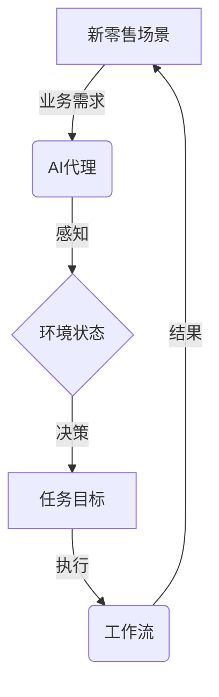

# AI人工智能代理工作流 AI Agent WorkFlow：在新零售中的应用

关键词：AI代理、工作流、新零售、人工智能、自动化

## 1. 背景介绍
### 1.1 问题的由来
随着人工智能技术的快速发展,越来越多的企业开始探索将AI应用于实际业务场景中。新零售作为近年来备受关注的业态,正在成为人工智能落地的重要领域之一。在新零售场景下,如何利用AI技术优化业务流程,提升运营效率,改善用户体验,已成为亟待解决的关键问题。

### 1.2 研究现状
目前,国内外已有不少学者和企业开始研究AI在新零售领域的应用。例如,阿里巴巴推出了"犀利宝"等智能客服系统,利用自然语言处理、知识图谱等技术提升客服效率。京东则探索利用AI算法优化仓储物流、动态定价等环节。但总体而言,AI在新零售领域的应用还处于起步阶段,尚未形成成熟的解决方案。

### 1.3 研究意义
深入研究AI代理工作流在新零售中的应用,对于推动新零售的智能化转型具有重要意义:

1. 通过引入AI代理,可以显著提升新零售场景下的运营效率,节约人力成本。 
2. AI代理可24小时不间断工作,大幅改善客户服务质量和响应速度,提升用户体验。
3. 利用AI优化业务决策,可以帮助企业及时把握市场动向,提高经营的精准度。
4. 研究AI在新零售的应用,有助于探索人工智能技术的商业化落地路径,推动AI产业发展。

### 1.4 本文结构
本文将重点探讨一种基于AI代理工作流的新零售智能化解决方案。内容安排如下:

首先,介绍新零售中的核心业务场景和面临的挑战,阐述AI代理的基本概念和优势。

其次,详细讲解AI代理工作流的技术原理,包括核心算法、系统架构、关键模块等,并给出具体的工作流程。

然后,通过实际项目案例,演示AI代理工作流在新零售场景下的应用效果,并分享代码实现细节。 

最后,总结AI代理工作流的应用价值和未来发展方向,提出进一步优化的思路。

## 2. 核心概念与联系
在新零售场景下,引入AI代理工作流的核心概念主要包括:

- **AI代理(AI Agent):** 一种基于人工智能算法的自动化软件系统,可以执行特定的任务,如客户服务、销售助理、业务流程自动化等。它们通过感知环境状态,进行决策和行动,不断优化完成任务的策略。

- **工作流(Workflow):** 一系列相互关联的活动,按照一定的规则和顺序进行,从而完成特定的业务目标。工作流管理系统负责定义、执行和监控工作流,保证高效协同。

- **新零售(New Retail):** 一种数据驱动的泛零售形态,以消费者体验为中心,实现线上线下全渠道融合发展。新零售强调数字化运营,利用大数据、人工智能等技术赋能业务创新。

这三个概念相互关联,共同构成了智能化的新零售解决方案:

- 引入AI代理,赋予新零售业务流程智能化的能力,实现自动化运营和优化决策。
- 通过工作流的形式,定义AI代理在新零售不同业务场景下的职责和协作方式,使其高效协同。
- AI代理工作流与新零售场景深度融合,针对性地解决实际业务痛点,创造全新的智能化体验。

下图展示了AI代理工作流在新零售中应用的总体概念:

AI代理通过感知新零售业务环境,基于数据和算法进行决策,确定任务目标,并通过执行工作流来完成任务,最终优化新零售业务运营。这是一个闭环系统,AI代理可以不断从结果中学习,持续迭代优化。

## 3. 核心算法原理 & 具体操作步骤
### 3.1 算法原理概述
AI代理工作流的核心是智能算法,主要涉及以下几个方面:

1. **强化学习:** 一种重要的机器学习范式,通过智能体(Agent)与环境的交互,学习最优策略以完成特定目标。常用算法包括Q-Learning、SARSA、DQN等。

2. **自然语言处理:** 赋予AI代理理解和生成自然语言的能力,广泛应用于客服对话、语音助手等场景。主要技术包括分词、词性标注、命名实体识别、句法分析、语义理解等。

3. **知识图谱:** 一种结构化的知识表示和存储方式,描述实体及其关系。在客户服务、商品推荐等场景发挥重要作用。构建方法包括知识抽取、知识融合、知识推理等。

4. **计算机视觉:** 使AI代理具备图像理解和分析能力,在货架识别、人脸支付、无人店等方面应用广泛。涉及的技术包括目标检测、图像分类、语义分割等。

### 3.2 算法步骤详解
以客服对话场景为例,详细说明AI代理工作流的算法步骤:

1. **对话理解:**
   - 对用户输入进行分词、词性标注、命名实体识别,提取关键信息
   - 利用意图识别模型判断用户意图,如咨询、投诉、购买等
   - 使用槽位填充模型提取关键实体,如商品名称、订单号等
2. **对话管理:**
   - 基于对话状态追踪,记录上下文信息
   - 结合知识图谱进行语义理解和查询扩展
   - 使用强化学习算法(如DQN)选择最佳对话动作  
3. **回复生成:**
   - 根据对话动作,从知识库检索相关答案
   - 使用文本生成模型(如Seq2Seq)生成自然流畅的回复文本
   - 结合业务规则和模板进行回复优化
4. **对话优化:**
   - 记录用户反馈,如满意度评分、是否解决问题等
   - 通过强化学习算法(如PPO)在线优化对话策略
   - 离线分析对话日志,持续迭代优化模型和知识库

通过以上步骤,AI代理可以与用户进行多轮对话,理解用户需求,提供智能化服务。同时不断从数据中学习,优化对话质量。

### 3.3 算法优缺点
AI代理工作流算法的优点包括:

- 自动化程度高,可24小时不间断服务,显著提升效率
- 通过机器学习不断优化,服务质量持续提升
- 多模态交互,支持语音、图像等输入,体验更自然
- 个性化服务,可根据用户画像提供定制化内容

但也存在一些局限性:

- 对训练数据质量要求高,需要大量标注数据
- 对话理解和生成的准确性有待提高,应对复杂对话有难度
- 缺乏常识推理能力,难以处理超出知识库的问题
- 算法模型训练成本高,部署和维护也需要专业技术人员  

### 3.4 算法应用领域
除了客服对话,AI代理工作流算法还可应用于新零售的其他场景,例如:

- 销售助理:根据用户喜好,推荐合适商品,提供购买咨询
- 智能导购:分析用户行为,判断购买意向,进行商品推荐
- 库存管理:预测商品销量,优化库存策略,减少积压
- 物流调度:智能规划配送路线,优化运输成本
- 动态定价:根据市场供需变化,实时调整商品价格

通过将算法与不同业务场景相结合,AI代理工作流可以为新零售的方方面面赋能,实现全链路智能化升级。

## 4. 数学模型和公式 & 详细讲解 & 举例说明
### 4.1 数学模型构建
以强化学习中的DQN算法为例,说明AI代理工作流中的数学模型。

DQN的目标是学习一个最优策略$\pi^*$,使得期望累积奖励最大化:

$$\pi^* = \arg\max_\pi \mathbb{E}[\sum_{t=0}^{\infty} \gamma^t r_t | \pi]$$

其中,$\gamma$是折扣因子,$r_t$是在时间步$t$获得的奖励。

为了逼近最优Q函数,DQN使用深度神经网络$Q(s,a;\theta)$作为值函数的近似,其中$s$为状态,$a$为动作,$\theta$为网络参数。网络的训练目标是最小化时序差分误差:

$$L(\theta) = \mathbb{E}[(r + \gamma \max_{a'}Q(s',a';\theta^-) - Q(s,a;\theta))^2]$$

其中,$s'$为下一状态,$\theta^-$为目标网络参数。

### 4.2 公式推导过程
DQN的训练分为两个阶段:采样和训练。

在采样阶段,智能体与环境交互,根据当前策略选择动作,并存储转移元组$(s_t, a_t, r_t, s_{t+1})$到经验回放缓冲区中。

在训练阶段,从经验回放中随机采样一批转移样本,计算Q值目标:

$$y_i = r_i + \gamma \max_{a'}Q(s_i',a';\theta^-)$$

然后,最小化预测Q值与目标值的均方误差:

$$\nabla_\theta L(\theta) = \mathbb{E}[(y_i - Q(s_i,a_i;\theta)) \nabla_\theta Q(s_i,a_i;\theta)]$$

通过梯度下降算法更新网络参数$\theta$,不断提升值函数估计的准确性。

### 4.3 案例分析与讲解
我们以客服对话场景为例,说明如何应用DQN算法优化AI代理工作流。

首先,定义强化学习环境:
- 状态$s$:对话历史记录,包括用户问题、AI代理回答等
- 动作$a$:AI代理可选的对话动作,如提问、解释、建议等
- 奖励$r$:基于用户反馈(满意度评分)和对话目标(是否解决问题)的综合评估

然后,构建DQN模型:
- 输入层:对话历史记录的向量化表示
- 隐藏层:多层感知机或循环神经网络,用于提取对话特征
- 输出层:预测每个对话动作的Q值

在训练过程中,AI代理与用户进行多轮对话,并将对话数据存入经验回放。同时从回放中采样,计算Q值目标,更新模型参数。不断迭代,使AI代理学会更优的对话策略。

### 4.4 常见问题解答
**Q: DQN算法能否处理连续动作空间?**

A: 传统DQN只适用于离散动作空间。对于连续动作,可以考虑使用Actor-Critic系列算法,如DDPG、SAC等。

**Q: DQN如何平衡探索和利用?**

A: 可以使用$\epsilon$-贪心策略,以$\epsilon$的概率随机选择动作,以$1-\epsilon$的概率选择Q值最大的动作。随着训练的进行,$\epsilon$逐渐衰减,鼓励探索。

**Q: 如何避免DQN的过拟合问题?**

A: 可以采用以下策略:增大经验回放容量,减少更新频率;使用Double DQN,解耦动作选择和评估;应用正则化技术,如L2正则化、Dropout等。

**Q: DQN能否处理部分可观察状态?**

A: 部分可观察问题下,智能体无法获取环境的完整信息。此时可以考虑使用基于递归神经网络的DQN变体,如DRQN,将对话历史编码为隐藏状态,从而捕捉时序依赖。

## 5. 项目实践：代码实例和详细解释说明
### 5.1 开发环境搭建
首先,我们需要搭建DQN算法的开发环境