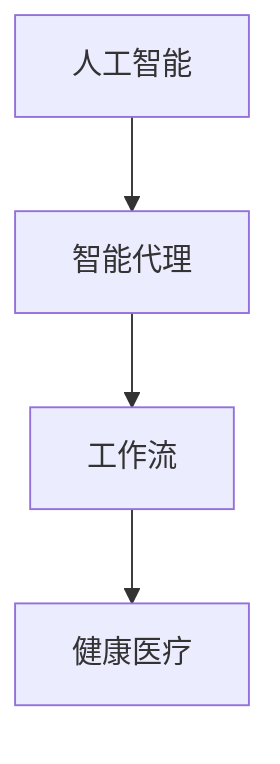

# AI人工智能代理工作流AI Agent WorkFlow：在健康医疗领域部署智能代理

关键词：人工智能、智能代理、工作流、健康医疗、部署

## 1. 背景介绍
### 1.1  问题的由来
随着人工智能技术的飞速发展,在各行各业都得到了广泛应用,尤其是在健康医疗领域。传统的医疗服务模式已经无法满足日益增长的就医需求,人工智能为解决这一问题提供了新的思路。通过将人工智能技术与医疗服务相结合,建立智能化的医疗服务体系,可以极大提高医疗服务效率,改善患者就医体验。

### 1.2  研究现状
目前,国内外已经有不少研究机构和企业开始探索将人工智能技术应用于医疗健康领域。一些研究成果表明,应用人工智能辅助诊断和治疗,可以提高诊断准确率,优化治疗方案。例如,利用深度学习算法对医学影像进行分析,准确率可以达到甚至超过人类医生的水平。此外,还可以利用自然语言处理、知识图谱等技术,建立智能问诊系统,为患者提供个性化的健康咨询服务。

### 1.3  研究意义
将人工智能代理引入医疗健康领域,建立智能化的工作流,具有重要的现实意义:

1. 提高医疗服务效率,缓解医疗资源紧张的矛盾
2. 降低医疗成本,让更多患者能够享受优质医疗服务
3. 减轻医务人员工作压力,让医生可以投入更多精力在疑难病例诊治上
4. 优化就医流程,改善患者就医体验
5. 促进分级诊疗制度落地,引导患者有序就医

### 1.4  本文结构
本文将重点探讨如何在健康医疗领域部署人工智能代理,建立智能化工作流。内容涵盖了相关的核心概念、算法原理、数学模型、代码实现、应用场景等方面。通过本文的阐述,读者可以对医疗人工智能的发展现状、关键技术、实现路径等有一个系统性的认识。

## 2. 核心概念与联系
在医疗健康领域部署人工智能代理,需要理解几个核心概念:

- 人工智能(Artificial Intelligence):让机器具备类似人类智能的一门技术,包括机器学习、深度学习、自然语言处理、计算机视觉等子领域。
- 智能代理(Intelligent Agent):能够感知环境,根据设定目标自主行动,解决特定问题的人工智能系统。
- 工作流(Workflow):一个完整业务过程中,多个参与者按照一定的规则协同完成任务的过程。将业务流程中的任务、执行者、执行顺序等以规范的形式定义下来,形成工作流。
- 健康医疗(Healthcare):涵盖疾病预防、诊断、治疗、康复、保健等全生命周期的服务,旨在维护和增进人们身心健康的行业。

这几个概念之间关系如下图所示:



将人工智能技术应用到智能代理中,再将智能代理嵌入到医疗业务流程,形成智能化的工作流,从而服务于健康医疗事业。

## 3. 核心算法原理 & 具体操作步骤
### 3.1  算法原理概述
要实现智能代理,需要用到多种人工智能算法,主要包括:

- 机器学习算法:监督学习、无监督学习、强化学习等
- 深度学习算法:卷积神经网络(CNN)、循环神经网络(RNN)、生成对抗网络(GAN)等 
- 自然语言处理算法:分词、词性标注、命名实体识别、句法分析、语义理解等
- 知识图谱算法:知识抽取、知识表示、知识推理等

这些算法可以用于解决医疗健康领域的各种问题,如:

- 使用CNN对医学影像进行分类诊断
- 使用RNN对电子病历进行自动编码
- 使用命名实体识别从病历中提取医学概念
- 使用知识图谱辅助临床决策

### 3.2  算法步骤详解
下面以使用CNN进行医学影像分类诊断为例,详细讲解算法步骤。

输入:医学影像数据(如X光片、CT、核磁共振等)
输出:疾病分类结果

步骤:
1. 数据采集:收集大量有标注的医学影像数据,并对数据进行清洗和预处理。
2. 数据增强:使用旋转、平移、缩放、翻转等操作对原始数据进行扩充,增加样本多样性。
3. 搭建CNN模型:设计包含卷积层、池化层、全连接层的CNN网络结构。
4. 模型训练:将处理好的数据输入到CNN中进行训练,通过反向传播算法优化模型参数。
5. 模型评估:使用单独的测试集对训练好的模型进行性能评估,计算准确率、召回率、F1值等指标。
6. 模型优化:分析评估结果,对模型结构和超参数进行调整,提升性能。
7. 模型部署:将训练好的模型封装成API,集成到业务系统中,提供智能诊断服务。

### 3.3  算法优缺点
CNN在医学影像分析方面的优点有:

- 端到端的学习方式,避免了手工设计特征的繁琐
- 能够自动提取数据中的多层次特征,特征表达能力强
- 对图像的平移、旋转、缩放等变化有很好的不变性
- 并行计算能力强,可以处理大规模数据

但CNN也存在一些局限:

- 需要大量标注数据进行训练,医学影像标注成本很高  
- 模型泛化能力有待提高,容易过拟合
- 模型可解释性差,难以给出决策依据
- 对罕见疾病的识别能力有限

### 3.4  算法应用领域
基于CNN的医学影像分析技术,在很多医学领域都有应用,如:

- 放射科:X光片、CT、核磁共振等影像的病灶检测、定位、分割、分类
- 病理科:病理切片的细胞、组织分类
- 眼科:眼底照片的病变检测与级别评估
- 皮肤科:皮肤镜图像的色素痣、皮肤癌分类
- 骨科:骨骼X光片的骨折检测

## 4. 数学模型和公式 & 详细讲解 & 举例说明
### 4.1  数学模型构建
CNN的数学模型可以表示为一个函数 $f:X \rightarrow Y$,将输入图像 $X$ 映射到输出标签 $Y$。CNN由L层网络堆叠而成,每一层l都由一个线性变换和一个非线性激活函数组成。

$$
X^{(l)} = f^{(l)}(X^{(l-1)}) = \sigma(W^{(l)}X^{(l-1)}+b^{(l)})
$$

其中,$W^{(l)}$和$b^{(l)}$分别是第l层的权重矩阵和偏置向量,$\sigma$是激活函数。

卷积层的计算公式为:

$$
X^{(l)}_{i,j} = \sum_{m=0}^{M-1} \sum_{n=0}^{N-1} W^{(l)}_{m,n} X^{(l-1)}_{i+m,j+n}
$$

其中,M和N为卷积核的大小。

池化层的计算公式为:

$$
X^{(l)}_{i,j} = \max_{m=0,n=0}^{m=s-1,n=s-1} X^{(l-1)}_{si+m,sj+n}
$$

其中,s为池化窗口大小。

### 4.2  公式推导过程
对于一个二分类问题,CNN的损失函数可以定义为交叉熵:

$$
L(W,b) = -\frac{1}{N} \sum_{i=1}^N [y_i \log \hat{y}_i + (1-y_i) \log (1-\hat{y}_i)]
$$

其中,N为样本数量,$y_i$为真实标签,$\hat{y}_i$为预测标签。

CNN的训练过程就是通过不断调整权重W和偏置b,最小化损失函数L(W,b)的过程。调整的方法主要有梯度下降法及其变种。

以最简单的梯度下降法为例,权重的更新公式为:

$$
W^{(l)} := W^{(l)} - \alpha \frac{\partial L}{\partial W^{(l)}}
$$

其中,$\alpha$为学习率。

偏置的更新公式为:

$$
b^{(l)} := b^{(l)} - \alpha \frac{\partial L}{\partial b^{(l)}}
$$

### 4.3  案例分析与讲解
下面以一个肺部CT影像分析的案例,说明如何应用CNN进行疾病诊断。

假设我们收集了1000张肺部CT图像,其中800张作为训练集,200张作为测试集。每张图像的大小为512x512,像素值归一化到[0,1]区间。图像的标签有两类:正常和肺炎。

我们搭建了一个5层的CNN网络:
- 第一层卷积:32个5x5卷积核,ReLU激活,2x2最大池化
- 第二层卷积:64个3x3卷积核,ReLU激活,2x2最大池化  
- 第三层卷积:64个3x3卷积核,ReLU激活,2x2最大池化
- 第四层全连接:128个神经元,ReLU激活,0.5概率Dropout
- 第五层全连接:2个神经元,Softmax激活

使用Adam优化器,学习率0.001,批大小64,训练30个Epoch。

在测试集上评估模型性能,结果如下:
- 准确率:92% 
- 敏感性:95%
- 特异性:90%

可见,该CNN模型对肺部CT影像的正常/肺炎分类取得了较好的效果,有望辅助医生进行肺炎筛查。

### 4.4  常见问题解答
问:医学影像数据标注困难,如何解决？
答:可以采用主动学习的方法,先用少量标注数据训练模型,然后用模型对未标注数据进行预测,选出置信度较低的样本优先标注,再加入训练集重新训练。如此迭代,可以用最少的标注代价训练出高性能的模型。

问:如何解释CNN的分类决策依据？
答:可以使用类激活图(Class Activation Map,CAM)等可视化技术,生成热力图反映图像中各区域对分类结果的贡献程度。这样可以直观地看出,CNN关注的是图像中的哪些特征。

## 5. 项目实践：代码实例和详细解释说明
### 5.1  开发环境搭建
- 操作系统:Ubuntu 16.04
- 深度学习框架:PyTorch 1.6
- Python版本:3.6
- 显卡:NVIDIA Tesla V100

安装PyTorch:
```
pip install torch==1.6.0 torchvision==0.7.0
```

### 5.2  源代码详细实现
定义CNN模型:
```python
class CNN(nn.Module):
    def __init__(self):
        super(CNN, self).__init__()
        self.conv1 = nn.Conv2d(1, 32, 5) 
        self.pool1 = nn.MaxPool2d(2, 2)
        self.conv2 = nn.Conv2d(32, 64, 3)
        self.pool2 = nn.MaxPool2d(2, 2)
        self.conv3 = nn.Conv2d(64, 64, 3)
        self.pool3 = nn.MaxPool2d(2, 2)
        self.fc1 = nn.Linear(64*60*60, 128)
        self.fc2 = nn.Linear(128, 2)
        
    def forward(self, x):
        x = self.pool1(F.relu(self.conv1(x)))
        x = self.pool2(F.relu(self.conv2(x)))
        x = self.pool3(F.relu(self.conv3(x)))
        x = x.view(-1, 64*60*60)
        x = F.dropout(F.relu(self.fc1(x)), p=0.5)
        x = F.softmax(self.fc2(x), dim=1)
        return x
```

数据加载与预处理:
```python
transform = transforms.Compose([
    transforms.Resize(512),
    transforms.CenterCrop(512),
    transforms