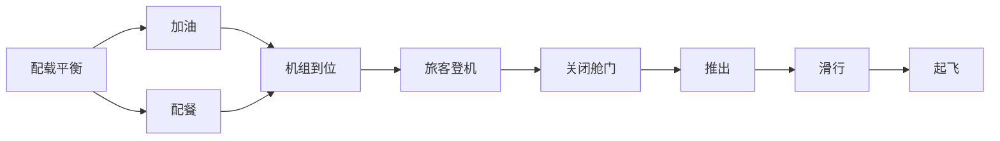

# AI人工智能代理工作流AI Agent WorkFlow：智能代理在航空领域系统中的应用

关键词：人工智能、智能代理、工作流、航空系统、自动化决策

## 1. 背景介绍
### 1.1  问题的由来
随着人工智能技术的飞速发展,智能代理(Intelligent Agent)在各行各业中得到了越来越广泛的应用。特别是在航空领域,由于其高度复杂性、实时性和安全性的特点,智能代理技术正在发挥着越来越重要的作用。传统的航空系统主要依赖人工操作和决策,存在效率低下、容易出错等问题。引入智能代理技术,通过将部分任务自动化、智能化,可以极大提升系统效率和准确性,减轻人员工作负担。

### 1.2  研究现状
目前,国内外学者对智能代理在航空领域的应用开展了大量研究。比如,NASA的CTAS系统利用智能代理技术优化飞机起降调度,大幅提高了机场运行效率[1]。波音公司开发的AIDA智能诊断代理,可以实时监控飞机状态,快速诊断故障[2]。国内学者提出了基于MAS的民航客运系统智能代理框架,实现了售票、值机等业务的自动化[3]。总的来说,将智能代理引入航空系统已经成为一个重要的发展方向,但在工作流建模、决策优化等方面还有待进一步研究。

### 1.3  研究意义
航空系统是一个涉及方方面面的复杂系统,牵一发而动全身。传统的人工管理模式已经难以适应现代航空业发展的需求。深入研究智能代理技术在航空领域的应用,对于提升系统运行效率、保障飞行安全、降低成本都具有重要意义。通过引入智能代理,建立高效的工作流程,打造灵活智能的新一代航空系统,将是大势所趋。本文的研究可以为相关领域提供有益的参考和启示。

### 1.4  本文结构
本文后续章节安排如下:第2部分介绍了智能代理的核心概念;第3部分重点阐述智能代理的工作流程及算法原理;第4部分建立智能代理工作流的数学模型并进行推导;第5部分给出一个智能代理航空应用的代码实例;第6部分分析智能代理在航空领域的典型应用场景;第7部分总结全文并展望未来;第8部分列出参考文献。

## 2. 核心概念与联系
智能代理(Intelligent Agent)是一种能够感知环境、自主行动,并通过与环境及其他代理交互来实现特定目标的计算机程序[4]。它集成了人工智能的多项技术,如知识表示、推理决策、机器学习等,具有自治性、社会性、反应性、主动性等特点。在航空领域,智能代理可以扮演多种角色,如飞行控制代理、故障诊断代理、调度优化代理等,通过分布式协同完成复杂任务。

智能代理的工作离不开工作流(Workflow)技术的支撑。工作流是对业务流程的计算机建模与自动化执行,通过将一个任务流程分解为一系列活动,并按照预定义的规则执行,从而实现业务过程的部分或完全自动化[5]。将工作流引入智能代理系统,可以使其按照一定的逻辑顺序有序开展工作,提高工作效率和质量。工作流为智能代理的协同提供了基础。

在航空系统中应用智能代理工作流,需要考虑航空业务的特点,设计合理高效的工作流模型。一般需要定义流程各环节的活动、参与角色、执行规则、异常处理等,构建层次化、模块化的工作流。智能代理根据工作流模型,调度执行各项任务,并在过程中不断优化改进,形成闭环反馈。工作流使智能代理的工作更加规范化、流程化。

## 3. 核心算法原理 & 具体操作步骤
### 3.1  算法原理概述
智能代理工作流的核心是工作流建模和任务调度优化。其中,工作流建模主要采用有向无环图(DAG)、Petri网等形式化方法,将业务流程抽象为活动节点和转移边,并用形式化语言如XPDL、BPEL等描述其逻辑和约束关系。在此基础上,可以利用启发式搜索、运筹优化等算法,求解任务最优调度方案,实现工作流的高效执行。

### 3.2  算法步骤详解
下面以基于DAG的启发式调度算法为例,详细讲解其步骤:
1. 定义工作流DAG图$G=(V,E)$,其中$V$为活动节点集,$E$为有向边集。每个节点$v_i$都有对应的执行时间$t_i$。
2. 计算DAG的拓扑排序,得到活动的优先级关系。
3. 初始化代理集$A=${$a_1,a_2,...,a_m$},令当前时间$\tau=0$。
4. 根据优先级依次遍历未调度活动$v_i$:
   1) 找出$v_i$的所有前驱活动,计算最早开始时间$est_i=max{\tau,max_{v_j∈pred(v_i)}{eft_j}}$。
   2) 选择当前空闲且能最早完成$v_i$的代理$a_k$,将$v_i$分配给$a_k$,计算最早结束时间$eft_i=est_i+t_i$。
   3) 更新代理$a_k$的空闲时间为$eft_i$。
5. 令$\tau=min_{a_i∈A}{next_i}$,其中$next_i$为$a_i$的下一空闲时间。
6. 若还有未调度活动,则转4;否则,调度完成,makespan为$max_{a_i∈A}{finish_i}$。

### 3.3  算法优缺点
该算法的优点是:
- 思路清晰,容易实现。利用DAG拓扑关系确定活动优先级,避免了违反依赖约束。
- 每步选择最早能执行的代理,体现了贪心策略,在一定程度上能够减小makespan。
- 通过维护代理的空闲时间,无需对整个时间轴进行穷举,降低了时间复杂度。

但也存在一些局限:
- 未考虑通信延迟对makespan的影响。当活动在不同代理间切换时,可能会引入通信开销。
- 未考虑代理负载均衡问题。可能导致个别代理任务过重,延长总体执行时间。
- 搜索限于贪心策略,无法保证得到全局最优解。对于复杂问题,还需要引入更高级的优化算法。

### 3.4  算法应用领域
智能代理工作流调度算法可以应用于航空领域的多个环节,如:
- 飞机客舱服务调度。根据服务项目的依赖关系和人员、物资约束,优化服务活动执行顺序和分工。
- 航班地面保障调度。对飞机维护、加油、清洁、配餐等活动进行统筹安排,提高航班周转效率。  
- 空中交通流管理。建模航路网络,实时调度飞机起降、航线冲突等,缓解拥堵,提高航班正点率。
- 航材计划与控制。对备件采购、仓储、配送等环节进行流程优化,及时保障航材供应,降低成本。

下图展示了一个简单的航班流程DAG示例:

## 4. 数学模型和公式 & 详细讲解 & 举例说明
### 4.1  数学模型构建
为了进一步阐述智能代理工作流的原理,这里建立一个简化的数学模型。考虑一个由$n$个活动$\{v_1,v_2,...,v_n\}$组成的工作流,每个活动$v_i$的执行时间为$t_i$。有$m$个智能代理$\{a_1,a_2,...,a_m\}$可以执行这些活动,代理间的通信延迟忽略不计。目标是找到一个任务调度方案$S$,使得总执行时间$T$最小,即:

$$
\begin{aligned}
min \quad & T \\
s.t. \quad 
& S = \{s_1,s_2,...,s_n\} \\
& s_i∈\{a_1,a_2,...,a_m\}, i=1,2,...,n \\
& pred(v_i)=\emptyset \; or \; max_{v_j∈pred(v_i)}{eft_j} ≤ est_i, i=1,2,...,n
\end{aligned}
$$

其中,$s_i$表示活动$v_i$的执行代理,$pred(v_i)$为$v_i$的直接前驱活动集合,$est_i$和$eft_i$分别为$v_i$的最早开始时间和最早结束时间。约束条件确保每个活动都被分配到一个代理,并且满足活动间的依赖关系。

### 4.2  公式推导过程
由于调度问题是一个NP-hard问题,上述模型很难直接求解。因此,我们采用启发式算法近似求解。定义$v_i$的最晚开始时间$lst_i$和最晚结束时间$lft_i$为:

$$
\begin{aligned}
lst_i & = min_{v_j∈succ(v_i)}{lst_j} - t_i \\
lft_i & = lst_i + t_i
\end{aligned}
$$

其中,$succ(v_i)$为$v_i$的直接后继活动集合。令$v_i$的紧迫度$u_i$为:

$$
u_i = lft_i - est_i
$$

$u_i$越小,表示$v_i$的时间余量越少,需要越优先调度。因此,可以根据$u_i$对活动进行排序,每次选择$u_i$最小的活动进行调度,直到所有活动都被调度为止。这种贪心策略能在多项式时间内生成一个可行解。

### 4.3  案例分析与讲解
下面以一个简单的航班流程为例,说明该算法的执行过程。如图1所示,假设有4个活动:配载平衡(A)、加油(B)、配餐(C)、机组到位(D),每个活动的执行时间如表1所示。现有2个智能代理$a_1$和$a_2$,初始都是空闲的。

表1 活动执行时间

| 活动 | A | B | C | D |
|:---:|:-:|:-:|:-:|:-:|
| 时间 | 30| 20| 40| 10|

首先,计算每个活动的最早开始时间$est$、最晚开始时间$lst$和紧迫度$u$:

$$
\begin{aligned}
est_A=0, & \quad lst_A=0, \quad u_A=30 \\
est_B=30, & \quad lst_B=30, \quad u_B=20 \\ 
est_C=30, & \quad lst_C=50, \quad u_C=60 \\
est_D=max(50,70)=70, & \quad lst_D=70, \quad u_D=10
\end{aligned}
$$

按照$u$从小到大的顺序,依次选择D、B、A、C进行调度。在第一步,D被分配给$a_1$,则$a_1$的空闲时间更新为80。接下来B被分配给$a_2$,A被分配给$a_1$,C被分配给$a_2$。最终得到调度方案:

$$
S = \{s_A=a_1,s_B=a_2,s_C=a_2,s_D=a_1\}
$$

总执行时间为$max(80,90)=90$。可以验证,该方案满足了所有约束条件,是一个可行解。

### 4.4  常见问题解答
Q: 调度算法能否保证找到最优解?
A: 该启发式算法利用了问题的特点,在多项式时间内生成一个可行解,但并不能保证是最优的。要想得到理论最优解,需要采用诸如整数规划等精确算法,但计算复杂度会很高。在实际应