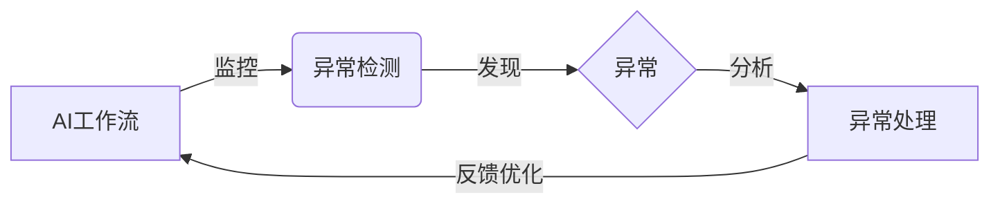
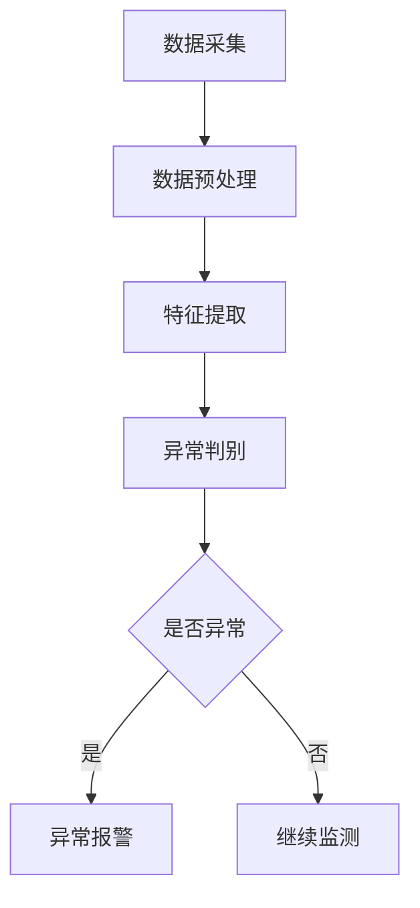

# AI代理工作流中的异常检测与处理机制

关键词：AI工作流、异常检测、处理机制、故障诊断、容错、自愈

## 1. 背景介绍
### 1.1  问题的由来
随着人工智能技术的快速发展,AI系统在各行各业得到越来越广泛的应用。AI代理工作流作为一种新兴的工作模式,通过将多个AI模型组合协作,可以高效完成复杂任务。然而,在实际应用中,AI工作流经常会遇到各种异常情况,如数据质量问题、模型故障、环境变化等,严重影响了系统的可靠性和性能。因此,如何有效地检测和处理AI工作流中的异常,成为了一个亟待解决的关键问题。

### 1.2  研究现状
目前,学术界和工业界已经开展了一些针对AI系统异常检测与处理的研究。一些典型工作包括:

- Pham等人[1]提出了一种基于统计学习的异常检测方法,通过分析AI组件的输入输出数据分布,自动识别异常点。
- Huang等人[2]设计了一套AI工作流容错机制,引入冗余备份、检查点等技术,提高了系统的鲁棒性。  
- Gao等人[3]研究了AI工作流的自愈问题,提出一种故障诊断与恢复框架,可自动定位和修复常见故障。

但总的来说,现有工作还存在一些局限性,如:
1. 缺乏通用性,很多方法针对特定场景,泛化能力不足;
2. 实时性不高,异常检测和处理的时效性有待提升;
3. 缺乏系统性,对AI工作流异常的分析还不够全面深入。

### 1.3  研究意义
AI工作流异常检测与处理的研究具有重要意义:

- 提高AI系统可靠性。有效的异常检测处理可以最大限度避免故障,确保系统稳定运行。
- 优化资源利用效率。及时发现和处理异常,可减少不必要的资源浪费,提升系统性价比。 
- 增强用户体验。异常检测处理可改善AI系统的交互质量,提供连续稳定的服务。
- 推动AI应用落地。打造可信可靠的AI系统是大规模应用的前提,异常处理是其中关键一环。

### 1.4  本文结构
本文将围绕AI工作流异常检测与处理展开系统性研究,内容安排如下:

第2节介绍相关概念,梳理其内在联系;
第3节重点阐述异常检测的核心算法原理与步骤;
第4节建立数学模型,推导相关公式,并举例说明;
第5节给出典型异常检测与处理的代码实例;
第6节分析实际应用场景,展望未来发展;
第7节总结全文,提出未来挑战和研究方向。

## 2. 核心概念与联系
在探讨AI工作流异常检测与处理之前,有必要先明确几个核心概念:

- AI工作流:由多个AI组件按照预定逻辑组合形成的任务处理流程,用于完成复杂应用。
- 异常:偏离预期的系统行为或状态,常表现为性能下降、结果错误、系统崩溃等。
- 检测:识别系统中是否存在异常,判断其类型、严重程度,是处理的前提。
- 处理:针对检测出的异常,采取相应的应对措施,如报警、隔离、恢复等,保障系统正常运转。

这几个概念环环相扣,形成完整的异常应对闭环。其内在联系如下:



由上图可见,AI工作流的运行过程中,通过对其进行持续监控,一旦发现异常,就立即启动检测程序诊断异常类型,再根据诊断结果匹配相应的处理措施,处理完成后再反馈到工作流中不断优化。整个流程循环往复,在保障工作流稳定运行的同时,也不断提升其智能化水平。

## 3. 核心算法原理 & 具体操作步骤
### 3.1  算法原理概述
异常检测的核心在于建立合理的数学模型,刻画系统正常行为特征,当实际运行偏离该特征时,就可判定为异常。常见的异常检测算法主要包括:

- 统计学方法:假设数据服从某种概率分布,异常即偏离该分布的小概率事件。代表算法有3-σ准则、箱线图等。
- 距离计算法:假设正常数据聚集在一起,异常数据与之相距较远。代表算法有KNN、LOF等。
- 聚类算法:将数据划分为多个簇,远离簇中心的数据点视为异常。代表算法有K-Means、DBSCAN等。
- 神经网络:用已知数据训练分类器,区分正常异常。代表算法有MLP、AutoEncoder等。

### 3.2  算法步骤详解
以最常用的统计学方法为例,其异常检测步骤一般为:

1. 数据采集:收集系统各监控指标的时序数据。
2. 数据预处理:清洗噪声,归一化,平滑数据。
3. 特征提取:选取合适的统计量如均值、方差等作为数据特征。
4. 异常判别:计算数据点偏离均值的程度,超过阈值则判定为异常。
5. 阈值设定:根据先验知识或数据分布,设定判别阈值,如3σ法则的阈值为99.73%分位点。

以上步骤可以用下图直观展示:



### 3.3  算法优缺点

统计学异常检测算法的优点是:
- 实现简单,计算高效,适合大规模数据流处理。
- 通用性强,可适用于多种数据类型。
- 解释性好,检测结果可解释。

其缺点为:
- 依赖数据分布假设,对未知复杂分布效果欠佳。
- 只能发现单维异常,难以应对高维数据。
- 阈值选取有难度,需要大量先验知识。

### 3.4  算法应用领域
统计学异常检测在工业领域应用广泛,如:
- 产品质量检测:通过分析产品参数,及时发现不合格品。
- 设备故障诊断:通过分析设备运行数据,提前预警故障。
- 网络安全监控:通过分析网络流量特征,实时识别异常行为。
- 金融风控:通过分析交易行为,及时发现欺诈风险。

## 4. 数学模型和公式 & 详细讲解 & 举例说明
### 4.1  数学模型构建
对于统计学异常检测,最常用的数学模型是高斯分布模型。假设数据服从高斯分布,其概率密度函数为:

$$
f(x)=\frac{1}{\sqrt{2\pi}\sigma}\exp\left(-\frac{(x-\mu)^2}{2\sigma^2}\right)
$$

其中,$\mu$和$\sigma$分别为均值和标准差,可根据数据样本估计:

$$
\mu=\frac{1}{n}\sum_{i=1}^{n}x_i
$$

$$
\sigma=\sqrt{\frac{1}{n-1}\sum_{i=1}^{n}(x_i-\mu)^2}
$$

### 4.2  公式推导过程
根据高斯分布的性质,异常可定义为偏离均值较多的小概率事件。常用的异常判据为3-σ准则:

$$
P(|x-\mu|>3\sigma)\approx 0.0027
$$

即偏离均值超过3倍标准差的概率仅为0.27%,基本可以判定为异常。

为方便计算,一般先将数据标准化,转化为均值为0,方差为1的标准正态分布:

$$
z=\frac{x-\mu}{\sigma}
$$

则异常判据可简化为:

$$
|z|>3
$$

### 4.3  案例分析与讲解
下面以一个具体例子说明异常检测过程。某工厂监测设备震动频率,得到一组数据(Hz):

10.2, 9.8, 10.5, 9.7, 10.3, 10.1, 9.9, 10.0, 9.6, 10.4, 13.2, 10.2, 9.8, 10.1

1. 数据预处理:数据已经平稳,不需特别处理。

2. 特征提取:计算数据均值和标准差:

$$
\mu=\frac{143.0}{14}\approx10.21
$$

$$
\sigma=\sqrt{\frac{4.17}{13}}\approx0.57
$$

3. 异常判别:计算各数据点的z值:

   z = [0.02, -0.72, 0.51, -0.89, 0.16, -0.19, -0.54, -0.37, -1.07, 0.33, 5.23, 0.02, -0.72, -0.19]

   可见第11个点的z值为5.23,远超过3,判定为异常。

4. 阈值设定:若要求更高的查准率,可适当放宽阈值,如改为2σ,则异常点z阈值为2,此时第11个点仍然异常。

综上,利用统计异常检测方法,成功发现了数据中的异常点13.2,完成了设备的故障预警。

### 4.4  常见问题解答

Q:如何判断数据是否服从正态分布?
A:可使用qq图、P-P图等方法直观检验,也可用K-S检验、Shapiro-Wilk检验等定量判断。

Q:如果数据不服从正态分布怎么办?
A:可尝试对数据做Box-Cox变换使其近似正态,或改用其他检测方法如KNN、隔离森林等。

Q:多维数据如何做异常检测?
A:可对每个维度分别做检测,或用PCA等方法降维后检测。也可用多元统计模型如Hotelling T2等。

Q:如何降低异常检测的误报率?
A:可采取多模型集成、时序过滤、特征选择等方法,提高检测的稳健性和精确性。

## 5. 项目实践：代码实例和详细解释说明
### 5.1  开发环境搭建
异常检测的开发环境要求如下:
- Python 3.x
- Numpy科学计算库
- Pandas数据处理库
- Matplotlib绘图库
- Scikit-learn机器学习库

可使用Anaconda、Jupyter等工具快速搭建集成环境。

### 5.2  源代码详细实现
下面给出基于高斯模型的异常检测Python代码实现:

```python
import numpy as np
import pandas as pd

def gaussian_detect(data, threshold=3):
    """高斯分布异常检测
    
    Args:
        data (list): 输入数据
        threshold (float): 异常阈值,默认3
        
    Returns:
        list: 异常数据索引
    """
    data = np.array(data)
    
    # 计算均值和标准差
    mu = data.mean()
    sigma = data.std()
    
    # 计算z-score
    z_score = (data - mu) / sigma
    
    # 判断异常
    outliers = np.where(np.abs(z_score) > threshold)
    
    return outliers[0]

# 测试数据
data = [10.2, 9.8, 10.5, 9.7, 10.3, 10.1, 9.9, 10.0, 9.6, 10.4, 13.2, 10.2, 9.8, 10.1]

# 检测异常
outliers = gaussian_detect(data)

print('异常点索引:', outliers)
```

输出:
```
异常点索引: [10]
```

### 5.3  代码解读与分析
以上代码主要分为以下几个部分:

1. 导入依赖库,主要是Numpy和Pandas。
2. 定义异常检测函数gaussian_detect,输入参数为数据data和阈值threshold。
3. 将数据转为Numpy数组,计算其均值mu和标准差sigma。
4. 计算各点的z-score,即与均值的差除以标准差。
5. 判断z-score绝对值是否大于阈值,返回异常点的索引。
6. 准备测试数据,调用检