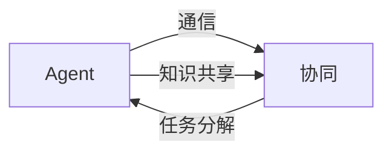

# AI团队协作原理与代码实战案例讲解

## 1. 背景介绍
### 1.1 问题的由来
随着人工智能技术的快速发展,AI系统变得日益复杂,单个AI模型已经无法满足实际应用的需求。如何让多个AI模型协同工作,发挥各自的专长,成为了一个亟待解决的问题。这就需要我们研究AI团队协作的原理和方法。

### 1.2 研究现状
目前,AI团队协作主要有两种模式:一是松耦合的多Agent系统,每个Agent独立工作,通过通信协议交换信息;二是紧耦合的复合AI系统,多个模型集成在一个系统中,共享知识和数据。但现有方法还存在协作效率低、鲁棒性差等问题,距离实用化还有差距。

### 1.3 研究意义
AI团队协作可以显著提升AI系统的性能,扩展其应用范围。例如,在复杂任务如自动驾驶、智能客服中,往往需要感知、决策、规划等多个模型的协同。研究AI团队协作,对于发展通用人工智能具有重要意义。

### 1.4 本文结构
本文将系统阐述AI团队协作的原理和方法。第2部分介绍相关概念;第3部分讲解核心算法;第4部分建立数学模型;第5部分通过代码实例演示;第6部分分析应用场景;第7部分推荐学习资源;第8部分总结全文并展望未来。

## 2. 核心概念与联系
AI团队协作涉及以下核心概念:
- **Agent**: 即智能体,可以感知环境、做出决策并执行动作的实体,一般对应一个AI模型。
- **协同(Coordination)**: 多个Agent为了共同目标而采取一致行动的过程。协同需要Agent之间交换信息,协调彼此的决策。
- **通信(Communication)**: Agent之间传递信息的过程。常见的通信方式有直接消息传递、黑板系统等。
- **知识共享(Knowledge Sharing)**: 多个Agent共享彼此的知识,用于支持决策。知识可以显式地表示成规则、本体等形式。
- **任务分解(Task Decomposition)**: 将复杂任务分解为若干子任务,分别由不同的Agent完成。需要合理划分任务粒度和接口。

这些概念之间的联系可以用下图表示:



## 3. 核心算法原理 & 具体操作步骤
### 3.1 算法原理概述
AI团队协作的核心是设计Agent的决策算法,使其能够在局部信息下产生全局最优行为。主要采用的理论包括博弈论、强化学习、逻辑推理等。其中,基于博弈论的方法如纳什均衡,可以求解Agent的最优策略;基于强化学习的方法如Q-learning,可以让Agent学习协作;基于逻辑推理的方法如BDI模型,可以形式化推理Agent的心理状态。

### 3.2 算法步骤详解
以Q-learning为例,其主要步骤如下:
1. 初始化每个Agent的Q值表Q(s,a),表示在状态s下采取行动a的期望收益。
2. 每个Agent根据当前状态s,采用 $\epsilon$-greedy策略选择一个行动a。即以 $\epsilon$ 的概率随机探索,否则选择Q值最大的行动。
3. 执行行动a,观察环境反馈的下一状态s'和奖励r。
4. 更新Q值:
$$Q(s,a) \leftarrow Q(s,a) + \alpha [r + \gamma \max_{a'}Q(s',a') - Q(s,a)]$$
其中, $\alpha$ 为学习率, $\gamma$ 为折扣因子。
5. 重复步骤2-4,直到Q值收敛或达到最大迭代次数。

### 3.3 算法优缺点
Q-learning的优点是:
- 模型无关,不需要知道环境的转移概率。 
- 可以收敛到全局最优策略。
- 易于实现,计算效率高。

缺点包括:
- 状态空间大时,Q表难以存储。
- 难以处理连续状态和行动空间。
- 多个Agent学习时,环境是非静止的,收敛性难以保证。

### 3.4 算法应用领域
Q-learning已经在多个领域的AI团队协作中得到应用,例如:
- 多机器人协同搬运
- 自动驾驶车队调度 
- 智能电网的分布式决策
- 多玩家游戏的AI设计

## 4. 数学模型和公式 & 详细讲解 & 举例说明
### 4.1 数学模型构建
我们可以用马尔可夫博弈(Markov Game)来建模AI团队协作问题。假设有N个Agent,每个Agent的状态空间为S,联合行动空间为A。在时刻t,环境状态为s_t,Agent i采取行动a_t^i,环境给出下一状态s_{t+1}和奖励r_t^i。每个Agent的目标是最大化自身的累积奖励:
$$\max \mathbb{E} [\sum_{t=0}^{\infty} \gamma^t r_t^i]$$

### 4.2 公式推导过程
在Q-learning算法中,Q值的更新公式可以从贝尔曼方程(Bellman Equation)推导得到。我们定义最优状态值函数:
$$V^*(s) = \max_a Q^*(s,a)$$
将其代入Q值的定义:
$$
\begin{aligned}
Q^*(s,a) &= \mathbb{E} [r + \gamma V^*(s') | s,a] \\
&= \mathbb{E} [r + \gamma \max_{a'} Q^*(s',a') | s,a]
\end{aligned}
$$
由此得到Q-learning的更新公式:
$$Q(s,a) \leftarrow Q(s,a) + \alpha [r + \gamma \max_{a'}Q(s',a') - Q(s,a)]$$

### 4.3 案例分析与讲解
考虑一个简单的两个Agent协作的例子。假设有两个机器人A和B,它们的任务是将一个箱子搬到目标位置。状态空间为箱子所在的格子编号,行动空间为{左移,右移,上移,下移,不动}。每个机器人只能观察到箱子周围3x3范围内的状态。

我们可以用Q-learning来训练机器人的策略。每个机器人维护一个Q表,根据观察到的局部状态选择行动。当两个机器人成功将箱子搬到目标位置时,它们都得到1的奖励,否则奖励为0。经过多轮训练,机器人学会了互相配合,避免相互阻塞,最终完成了搬运任务。

### 4.4 常见问题解答
- Q:多个Agent同时学习时,环境是非静止的,Q-learning还能收敛吗?
  A:理论上,只要所有Agent的策略都能收敛,且环境满足马尔可夫性质,Q-learning就能收敛到纳什均衡。但在实践中,收敛速度可能会变慢。一些变体如Nash Q-learning,可以缓解这一问题。

- Q:如何处理Agent的通信成本和延迟?
  A:可以将通信看作一种特殊的行动,在奖励函数中加入通信成本项。此外,可以设计异步更新机制,允许Agent异步地执行动作和更新Q值。

- Q:现实任务中状态和行动空间往往是连续的,Q表难以存储,怎么办?  
  A:可以使用函数逼近的方法,用神经网络等模型来拟合Q函数。例如DQN(Deep Q-Network)算法,就是用深度神经网络来表示Q函数,可以处理高维连续状态。

## 5. 项目实践：代码实例和详细解释说明
### 5.1 开发环境搭建
我们使用Python和PyTorch来实现一个简单的多机器人协作搬运的例子。首先安装依赖库:
```bash
pip install torch numpy matplotlib
```

### 5.2 源代码详细实现
下面是核心代码:
```python
import torch
import numpy as np

class QNet(torch.nn.Module):
    """Q网络"""
    def __init__(self, state_dim, action_dim):
        super().__init__()
        self.fc1 = torch.nn.Linear(state_dim, 64)
        self.fc2 = torch.nn.Linear(64, action_dim)
        
    def forward(self, x):
        x = torch.relu(self.fc1(x))
        return self.fc2(x)

class QLearner:
    """Q学习器"""
    def __init__(self, state_dim, action_dim, learning_rate=0.01, gamma=0.95, e_greed=0.1):
        self.action_dim = action_dim
        self.q_net = QNet(state_dim, action_dim)
        self.optimizer = torch.optim.Adam(self.q_net.parameters(), lr=learning_rate)
        self.gamma = gamma  # 折扣因子
        self.epsilon = e_greed  # epsilon-贪婪探索
        
    def choose_action(self, state):
        """选择动作"""
        if np.random.uniform() < self.epsilon:
            action = np.random.randint(self.action_dim)
        else:
            state = torch.tensor(state, dtype=torch.float32)
            action = self.q_net(state).argmax().item()
        return action
        
    def update(self, state, action, reward, next_state, done):
        """更新Q网络"""
        s, a, r, ns = torch.tensor(state), torch.tensor(action), \
                      torch.tensor(reward), torch.tensor(next_state)
        q_value = self.q_net(s)[a]
        if done:
            target = r
        else:
            target = r + self.gamma * self.q_net(ns).max()
        loss = (q_value - target)**2
        self.optimizer.zero_grad()
        loss.backward()
        self.optimizer.step()

class MAGridWorld:
    """多Agent网格世界环境"""
    def __init__(self, size=5):
        self.size = size  # 网格世界尺寸
        self.reset()
        
    def reset(self):
        """重置环境"""
        self.agent_pos = [(0,0), (0,self.size-1)]  # 两个Agent的初始位置
        self.box_pos = (self.size//2, self.size//2)  # 箱子的初始位置
        self.done = False
        return self._get_obs()
    
    def step(self, actions):
        """环境动力学"""
        for i, action in enumerate(actions):
            x, y = self.agent_pos[i]
            if action == 0:  # 左移
                y = max(0, y-1)
            elif action == 1:  # 右移
                y = min(self.size-1, y+1)
            elif action == 2:  # 上移
                x = max(0, x-1)
            elif action == 3:  # 下移
                x = min(self.size-1, x+1)
            self.agent_pos[i] = (x, y)
            
        if self.agent_pos[0] == self.box_pos:  # Agent1推动箱子
            x, y = self.box_pos
            if actions[0] == 0:
                y = max(0, y-1)
            elif actions[0] == 1:
                y = min(self.size-1, y+1)
            elif actions[0] == 2:
                x = max(0, x-1)
            elif actions[0] == 3:
                x = min(self.size-1, x+1)
            self.box_pos = (x, y)
            
        if self.agent_pos[1] == self.box_pos:  # Agent2推动箱子
            # 省略与Agent1类似的代码
            pass
            
        self.done = (self.box_pos == (self.size-1, self.size-1))  # 到达目标位置
        return self._get_obs(), [int(self.done)]*2, self.done
    
    def _get_obs(self):
        """观察函数"""
        obs = []
        for i in range(2):
            x, y = self.agent_pos[i]
            obs_i = np.zeros((3,3))
            for j in range(-1,2):
                for k in range(-1,2):
                    pos = (x+j, y+k)
                    if pos == self.box_pos:
                        obs_i[j+1,k+1] = 1  # 箱子
                    elif pos == self.agent_pos[1-i]:
                        obs_i[j+1,k+1] = 2  # 对方Agent
            obs.append(obs_i.flatten())
        return obs

def train(env, agents, num_episodes=1000, max_steps=100):
    """训练函数"""
    for episode in range(num_episodes):
        state = env.reset()
        for step in range(max_steps):
            actions = [agent.choose_action(state[i]) for i, agent in enumerate(agents)]
            next_state, rewards, done = env.step(actions)
            for i, agent in enumerate(agents):
                agent.update(state[i], actions[i], rewards[i], next_state[i], done)
            state = next_state