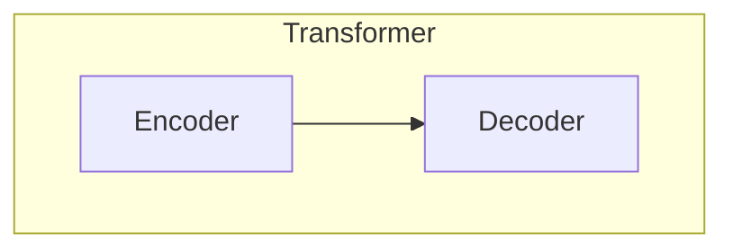
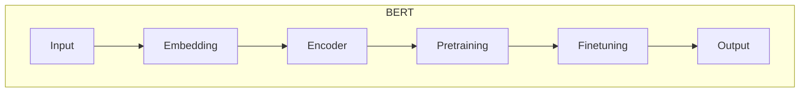
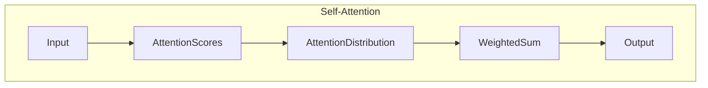

# BERT 原理与代码实战案例讲解

## 1. 背景介绍

### 1.1 问题的由来

随着深度学习技术的不断发展,自然语言处理(NLP)领域取得了长足的进步。传统的NLP模型通常基于统计机器学习方法,需要大量的人工特征工程。而随着大规模语料库和计算能力的提升,神经网络模型在NLP任务中展现出了强大的能力。

然而,早期的神经网络模型主要采用序列到序列(Sequence-to-Sequence)或者卷积神经网络(CNN)等结构,对于长期依赖问题的建模能力较差。为了解决这一问题,Google在2017年提出了Transformer模型,该模型完全基于注意力机制,能够有效地捕捉长期依赖关系。

尽管Transformer模型在机器翻译等任务上取得了卓越的成绩,但它主要是为序列到序列的生成任务而设计的,并不能直接应用于其他NLP任务,如文本分类、语义理解等。为了解决这一问题,Google在2018年发布了BERT(Bidirectional Encoder Representations from Transformers)模型,该模型基于Transformer的编码器部分,能够生成上下文敏感的词向量表示,从而为各种NLP任务提供强大的语义表示能力。

### 1.2 研究现状

自BERT模型问世以来,它在多个NLP任务上取得了state-of-the-art的成绩,包括文本分类、语义理解、问答系统等,极大地推动了NLP技术的发展。许多科技公司和研究机构都在基于BERT进行模型优化和应用开发。

目前,BERT模型的主要研究方向包括:

1. **模型优化**: 通过改进模型结构、训练策略等方式,提升BERT模型的性能和泛化能力。
2. **知识融合**: 将外部知识库与BERT模型相结合,增强模型的语义理解能力。
3. **多模态融合**: 将视觉、语音等多模态信息与BERT模型相融合,实现多模态学习。
4. **领域适应**: 针对特定领域(如医疗、法律等)的语料,对BERT模型进行领域适应性训练。
5. **模型压缩**: 通过模型压缩、蒸馏等技术,降低BERT模型的计算和存储开销。
6. **模型解释**: 探索BERT模型内部的注意力机制,提高模型的可解释性。

### 1.3 研究意义

BERT模型作为一种通用的语义表示模型,对于推动NLP技术的发展具有重要意义:

1. **提高NLP任务性能**: BERT模型能够生成上下文敏感的词向量表示,为各种NLP任务提供强大的语义表示能力,从而显著提高了任务性能。
2. **降低人工特征工程成本**: 传统的NLP模型需要大量的人工特征工程,而BERT模型能够自动学习语义表示,降低了特征工程的成本。
3. **促进模型迁移与泛化**: BERT模型具有强大的迁移学习能力,可以在少量数据的情况下快速适应新的NLP任务,提高了模型的泛化能力。
4. **推动多模态融合发展**: BERT模型为多模态融合提供了基础,有望推动视觉、语音等多模态信息与文本信息的融合,实现更智能的人机交互系统。

### 1.4 本文结构

本文将全面介绍BERT模型的原理、实现细节和应用案例。文章主要包括以下几个部分:

1. **核心概念与联系**: 介绍BERT模型的核心概念,如Transformer、自注意力机制等,并阐述它们之间的联系。
2. **核心算法原理与具体操作步骤**: 详细解释BERT模型的算法原理,包括模型结构、预训练任务、微调过程等,并给出具体的操作步骤。
3. **数学模型和公式详细讲解与举例说明**: 推导BERT模型中的关键数学公式,如自注意力计算公式、掩码语言模型损失函数等,并通过具体案例进行讲解。
4. **项目实践:代码实例和详细解释说明**: 提供BERT模型的代码实现,包括数据预处理、模型构建、训练和评估等,并对关键代码进行详细解释。
5. **实际应用场景**: 介绍BERT模型在文本分类、机器阅读理解、问答系统等领域的应用案例。
6. **工具和资源推荐**: 推荐BERT模型的相关学习资源、开发工具和论文等。
7. **总结:未来发展趋势与挑战**: 总结BERT模型的研究成果,展望其未来的发展趋势和面临的挑战。
8. **附录:常见问题与解答**: 针对BERT模型的常见问题进行解答和说明。

通过全面的理论介绍和实践指导,读者能够深入理解BERT模型的原理,掌握其实现细节,并学会将其应用于实际的NLP任务中。

## 2. 核心概念与联系

在介绍BERT模型之前,我们先来了解一些核心概念,这些概念为BERT模型的提出奠定了基础。

### 2.1 Transformer模型

Transformer是一种全新的基于注意力机制的序列到序列(Seq2Seq)模型,它完全摒弃了循环神经网络(RNN)和卷积神经网络(CNN)等结构,而是完全依赖注意力机制来捕捉输入和输出之间的长期依赖关系。

Transformer模型主要由编码器(Encoder)和解码器(Decoder)两个部分组成,如下图所示:

1. **编码器(Encoder)**:将输入序列映射为一系列连续的向量表示,用于捕捉输入序列的上下文信息。
2. **解码器(Decoder)**:基于编码器的输出和先前的输出tokens,生成最终的输出序列。

Transformer模型的核心是**自注意力机制(Self-Attention)**,它能够同时关注整个输入或输出序列中的所有位置,捕捉长期依赖关系。与RNN和CNN相比,自注意力机制具有更好的并行计算能力,能够有效利用现代硬件(如GPU)的计算能力。

### 2.2 BERT模型

BERT(Bidirectional Encoder Representations from Transformers)是一种基于Transformer编码器的双向预训练语言模型。与传统的单向语言模型(如Word2Vec、ELMo)不同,BERT能够同时捕捉输入序列中每个token的左右上下文信息,生成更加丰富和准确的语义表示。

BERT模型的核心思想是通过**掩码语言模型(Masked Language Model)**和**下一句预测(Next Sentence Prediction)**两个预训练任务,在大规模无标注语料库上进行预训练,学习通用的语义表示。预训练后的BERT模型可以在下游的NLP任务上进行**微调(Fine-tuning)**,快速适应新的任务,提高模型的性能和泛化能力。

BERT模型的整体架构如下图所示:

1. **输入层(Input)**:将原始文本序列转换为token序列,并添加特殊token(如[CLS]和[SEP])。
2. **嵌入层(Embedding)**:将token序列映射为嵌入向量表示。
3. **编码器(Encoder)**:基于Transformer编码器结构,对嵌入向量序列进行编码,生成上下文敏感的向量表示。
4. **预训练(Pretraining)**:在大规模无标注语料库上进行掩码语言模型和下一句预测两个预训练任务。
5. **微调(Fine-tuning)**:在特定的NLP任务上,对预训练模型进行微调,得到针对该任务的BERT模型。
6. **输出层(Output)**:根据不同的NLP任务,输出相应的结果(如分类标签、span等)。

BERT模型的关键创新点在于:

1. 采用双向编码,能够同时捕捉每个token的左右上下文信息。
2. 基于Transformer结构,具有更好的并行计算能力和长期依赖建模能力。
3. 通过大规模预训练和微调策略,实现了有效的迁移学习。

### 2.3 自注意力机制

自注意力机制(Self-Attention)是Transformer模型的核心组件,它能够同时关注输入序列中的所有位置,捕捉长期依赖关系。与RNN和CNN相比,自注意力机制具有更好的并行计算能力,能够有效利用现代硬件(如GPU)的计算能力。

自注意力机制的计算过程可以概括为三个步骤:

1. **计算注意力分数(Attention Scores)**:对于输入序列中的每个位置,计算它与其他所有位置的相关性得分。
2. **注意力分数归一化(Attention Distribution)**:对注意力分数进行归一化(如softmax),得到注意力分布。
3. **加权求和(Weighted Sum)**:根据注意力分布,对输入序列中的向量进行加权求和,得到该位置的注意力表示。

自注意力机制的计算过程如下图所示:

自注意力机制能够自动学习输入序列中不同位置之间的依赖关系,从而捕捉长期依赖信息。在BERT模型中,自注意力机制被应用于编码器的每一层,用于生成上下文敏感的词向量表示。

### 2.4 掩码语言模型

掩码语言模型(Masked Language Model, MLM)是BERT预训练的两个任务之一。它的目标是根据输入序列中的上下文信息,预测被掩码(即被替换为特殊token [MASK])的token的原始token。

在预训练过程中,BERT模型会随机选择输入序列中的一些token(通常为15%)进行掩码,然后学习预测这些被掩码token的原始token。通过这种方式,BERT模型能够同时捕捉输入序列中每个token的左右上下文信息,生成更加丰富和准确的语义表示。

掩码语言模型的训练目标是最小化被掩码token的预测损失,即最大化被掩码token的预测概率。损失函数通常采用交叉熵损失函数。

掩码语言模型任务的优点在于:

1. 能够同时利用左右上下文信息,生成双向的语义表示。
2. 通过随机掩码,模型需要学习捕捉更广泛的上下文信息。
3. 与传统的语言模型相比,掩码语言模型更加贴近下游NLP任务的目标。

### 2.5 下一句预测

下一句预测(Next Sentence Prediction, NSP)是BERT预训练的另一个任务。它的目标是判断两个输入句子是否为连续的句子对。

在预训练过程中,BERT模型会随机采样一对句子,有50%的概率是真实的连续句子对,另外50%是随机构造的不连续句子对。然后,BERT模型需要学习判断这对句子是否为连续的句子对。

下一句预测任务的目的是让BERT模型学习理解句子之间的关系和语义连贯性,从而提高模型在下游任务(如问答系统、自然语言推理等)中的性能。

下一句预测任务的损失函数通常采用二元交叉熵损失函数,目标是最小化句子对是否连续的预测误差。

### 2.6 微调

微调(Fine-tuning)是BERT模型在下游NLP任务上的关键步骤。通过在大规模无标注语料库上进行预训练,BERT模型已经学习到了通用的语义表示能力。但是,为了更好地适应特定的NLP任务,我们需要在该任务的标注数据集上对BERT模型进行微调。

微调过程包括以下几个步骤:

1. **添加任务特定层(Task-specific Layer)**:根据下游任务的性质,在BERT模型的输出层之后添加一些任务特定的层,如分类层、span预测层等。
2. **微调训练**:在下游任务的标注数据集上,对BERT模型(包括预训练部分和任务特定层)进行端到端的微调训练。
3. **优化策略