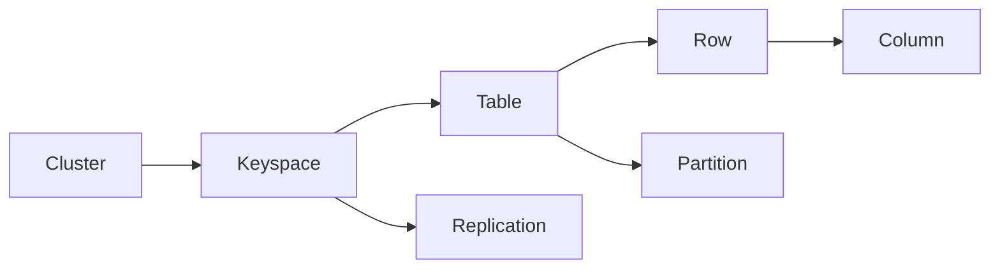
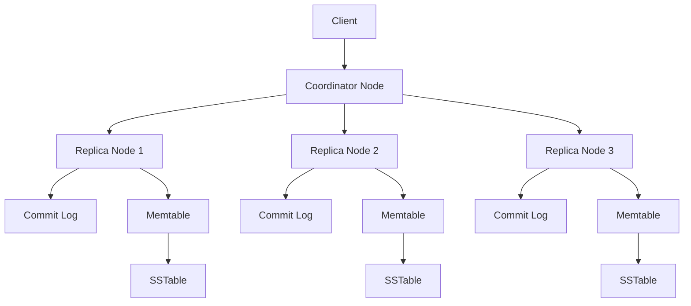

# Cassandra原理与代码实例讲解

作者：禅与计算机程序设计艺术 / Zen and the Art of Computer Programming

## 1. 背景介绍

### 1.1 问题的由来

在大数据时代,海量数据的存储和处理已成为各行各业面临的重大挑战。传统的关系型数据库在面对TB、PB级别的海量数据时,在扩展性、可用性和性能方面都遇到了瓶颈。NoSQL数据库应运而生,其中Apache Cassandra作为一款高度可扩展的分布式NoSQL数据库,以其卓越的可扩展性、可用性和性能优势,在业界得到了广泛应用。

### 1.2 研究现状

目前,国内外学术界和工业界对Cassandra的研究主要集中在以下几个方面:

(1)Cassandra的数据模型和存储引擎。Cassandra采用了宽列存储的数据模型,支持灵活的动态schema。其存储引擎基于Log-Structured Merge Tree(LSM-Tree),具有优异的写入性能。

(2)Cassandra的分布式架构。Cassandra采用去中心化的Peer-to-Peer架构,所有节点地位平等,避免了单点故障。Cassandra使用一致性哈希来实现数据分区,并通过Gossip协议实现分布式节点管理。

(3)Cassandra的数据一致性和可用性权衡。Cassandra提供了可调的一致性级别,用户可根据业务需求在强一致性(Strong Consistency)和最终一致性(Eventual Consistency)之间进行权衡,以获得更好的性能和可用性。

(4)Cassandra的查询优化。Cassandra提供了二级索引、物化视图等查询优化手段,但其查询能力与关系型数据库相比仍有差距,如何进一步优化Cassandra的查询性能仍是一个研究热点。

### 1.3 研究意义

深入研究Cassandra的原理和应用,对于掌握大数据存储和处理技术、构建高可扩展高可用的数据平台具有重要意义。通过对Cassandra内部机制的深入剖析,可以理解经典的NoSQL数据库设计思想,并将其应用到实际的系统设计中。同时,通过Cassandra代码实例的学习,可以掌握Cassandra应用开发的最佳实践,为构建基于Cassandra的大数据应用奠定基础。

### 1.4 本文结构

本文将从以下几个方面对Cassandra进行深入讲解:

- 第2部分介绍Cassandra的核心概念与内部机制。 
- 第3部分对Cassandra的核心算法原理进行剖析,并给出具体的操作步骤。
- 第4部分介绍Cassandra的数学模型和关键公式,并结合案例进行详细讲解。
- 第5部分通过代码实例,演示Cassandra应用开发的关键步骤和最佳实践。
- 第6部分讨论Cassandra的实际应用场景。
- 第7部分推荐Cassandra相关的学习资源和开发工具。
- 第8部分对Cassandra的研究现状进行总结,并对其未来的发展趋势和面临的挑战进行展望。
- 第9部分列出了一些关于Cassandra的常见问题,并给出了解答。

## 2. 核心概念与联系

在深入讲解Cassandra原理之前,我们先来了解一下Cassandra的一些核心概念:

- **Column(列)**:Cassandra中数据存储的基本单位。每个Column包含三个部分:name、value和timestamp。
- **Row(行)**:Cassandra将一组列组合在一起,称为一行数据。每行数据由一个唯一的Row Key标识。
- **Table(表)**:Cassandra中用于存储数据的逻辑结构。一个Table中包含多行数据。
- **Keyspace(键空间)**:Keyspace是Cassandra中数据对象的最外层容器,类似于关系型数据库中的database。每个Keyspace包含多个Table。
- **Cluster(集群)**:Cassandra采用masterless架构,多个对等节点组成一个集群,共同对外提供服务。
- **Partition(分区)**:为了实现数据的分布式存储,Cassandra引入了分区的概念。每行数据根据Partition Key被划分到特定的分区,不同的分区可以分布在不同的节点上。
- **Replication(复制)**:为了保证高可用和容错,Cassandra采用了数据复制机制。每个数据分区都会被复制到多个节点上,从而形成一个Replica Set。
- **Consistency Level(一致性级别)**:Cassandra提供了多种一致性级别,用户可以根据业务需求在latency和consistency之间进行权衡。

下图展示了Cassandra的核心概念之间的关系:

## 3. 核心算法原理 & 具体操作步骤

### 3.1 算法原理概述

Cassandra的核心算法主要包括以下几个方面:

- 一致性哈希(Consistent Hashing):Cassandra采用一致性哈希算法来实现数据分区。一致性哈希将整个哈希空间看作一个环,每个节点负责环上一段连续的哈希空间。数据根据Row Key进行哈希,映射到哈希环上的某个位置,然后顺时针找到第一个大于等于该哈希值的节点,数据就存储在该节点上。一致性哈希的优点是在添加或删除节点时,只需要迁移一小部分数据,避免了大规模的数据迁移。

- Gossip协议:Cassandra使用Gossip协议来实现分布式节点之间的信息交换和状态同步。Gossip协议是一种去中心化的Peer-to-Peer通信协议,每个节点定期随机选择其他节点交换状态信息,最终所有节点都能获得完整的集群状态视图。Gossip协议可以快速检测节点故障,并实现分布式的故障检测和状态同步。

- LSM-Tree存储引擎:Cassandra采用Log-Structured Merge Tree(LSM-Tree)作为其存储引擎,LSM-Tree是一种面向写优化的数据结构。写入操作首先被记录在内存中的Memtable中,当Memtable达到一定大小后,会被刷新到磁盘上的SSTable文件中。读取操作需要合并Memtable和SSTable中的数据。LSM-Tree牺牲了部分读性能,但在写密集场景下具有非常优异的性能表现。

- Bloom Filter:为了加速读取操作,Cassandra在每个SSTable文件中都维护了一个Bloom Filter。Bloom Filter是一种概率型数据结构,可以快速判断一个元素是否在集合中。在进行读取操作时,Cassandra首先查询Bloom Filter,如果Bloom Filter判断数据不存在,则可以避免磁盘IO,提高读取性能。

### 3.2 算法步骤详解

下面我们以写入操作为例,详细讲解Cassandra的核心算法步骤:

1. 客户端发起写入请求,指定写入的Table和Row Key。

2. 协调节点(Coordinator Node)根据一致性哈希算法,计算出Row Key对应的分区,并确定该分区的所有副本节点。

3. 协调节点将写入请求发送给所有副本节点。

4. 每个副本节点将写入请求添加到CommitLog中,CommitLog是一种顺序写入的日志文件,用于持久化所有的写操作,保证数据不会丢失。

5. 数据同时被写入Memtable中,Memtable是一个内存数据结构,用于缓存最近写入的数据。多个Memtable之间通过链表连接。

6. 当Memtable达到一定大小(默认是128MB)或者定期刷新时,Memtable中的数据会被刷新到磁盘上的SSTable文件中。SSTable是一种不可变的、经过排序的文件格式。

7. 随着SSTable文件的不断增加,为了控制文件数量并优化读取性能,Cassandra会定期在后台对SSTable文件进行合并(Compaction),生成更大的SSTable文件。

8. 当所有副本节点完成写入操作后,协调节点会将响应结果返回给客户端,写入操作完成。

下图展示了Cassandra写入操作的流程:

### 3.3 算法优缺点

Cassandra的核心算法具有以下优点:

- 高度可扩展:一致性哈希算法使得Cassandra可以方便地添加或删除节点,实现线性可扩展。
- 高可用:数据复制机制和Gossip协议保证了Cassandra在部分节点失效的情况下仍能提供服务。
- 写入性能优异:LSM-Tree存储引擎针对写操作进行了优化,具有非常高的写入吞吐量。

同时,Cassandra的核心算法也存在一些缺点:

- 读取性能较差:由于数据分散在多个SSTable文件中,读取操作需要进行大量的磁盘IO和内存合并操作,读延迟较高。
- 数据模型受限:Cassandra的列族数据模型虽然灵活,但缺乏强大的查询语言和二级索引支持,对复杂查询支持有限。
- 运维复杂:Cassandra的去中心化架构和复杂的内部机制使得运维和调优工作变得复杂。

### 3.4 算法应用领域

得益于其优异的可扩展性、可用性和写入性能,Cassandra被广泛应用在对写入性能要求较高的场景中,例如:

- 物联网(IoT):处理海量的传感器数据写入。
- 时序数据库:存储时间序列数据,如监控数据、日志数据等。
- 消息系统:作为消息队列的持久化存储。
- Web应用:存储用户的活动数据、会话数据等。

## 4. 数学模型和公式 & 详细讲解 & 举例说明

### 4.1 数学模型构建

Cassandra中使用了一些数学模型和概念,下面我们对其进行详细讲解。

#### 一致性哈希(Consistent Hashing)

一致性哈希是Cassandra实现数据分区的核心算法。假设我们有一个哈希函数 $hash(x)$,它将任意的键值 $x$ 映射到一个 $2^{32}$ 大小的哈希空间中。我们将整个哈希空间看作一个首尾相接的环,称为哈希环。

假设我们有 $N$ 个节点,每个节点计算其哈希值 $hash(node_i)$,将其映射到哈希环上的一个位置。一个数据对象 $object$ 根据其键值 $key$ 计算哈希值 $hash(key)$,也映射到哈希环上的一个位置。然后从数据对象的位置出发,沿着哈希环顺时针找到的第一个节点,就是该数据对象的存储节点。

数学上,我们可以定义如下:

令 $N$ 为节点数, $object$ 为数据对象, $key$ 为 $object$ 的键值, $node_i$ 为第 $i$ 个节点。则 $object$ 的存储节点 $node_j$ 满足:

$$
hash(node_j) = \min\limits_{i} \{ hash(node_i) | hash(node_i) \geq hash(key) \}
$$

其中, $hash(x)$ 为哈希函数, $\min$ 表示求最小值。

例如,假设我们有3个节点 $A$、$B$、$C$,其哈希值分别为 $hash(A)=0$、$hash(B)=1/3$、$hash(C)=2/3$。现在有两个数据对象 $object1$ 和 $object2$,其键值的哈希值分别为 $hash(key1)=1/4$、$hash(key2)=3/4$。根据上述公式,我们可以计算出:

$$
\begin{aligned}
object1: & min(1/3, 2/3, 0) = 1/3 \Rightarrow node_B