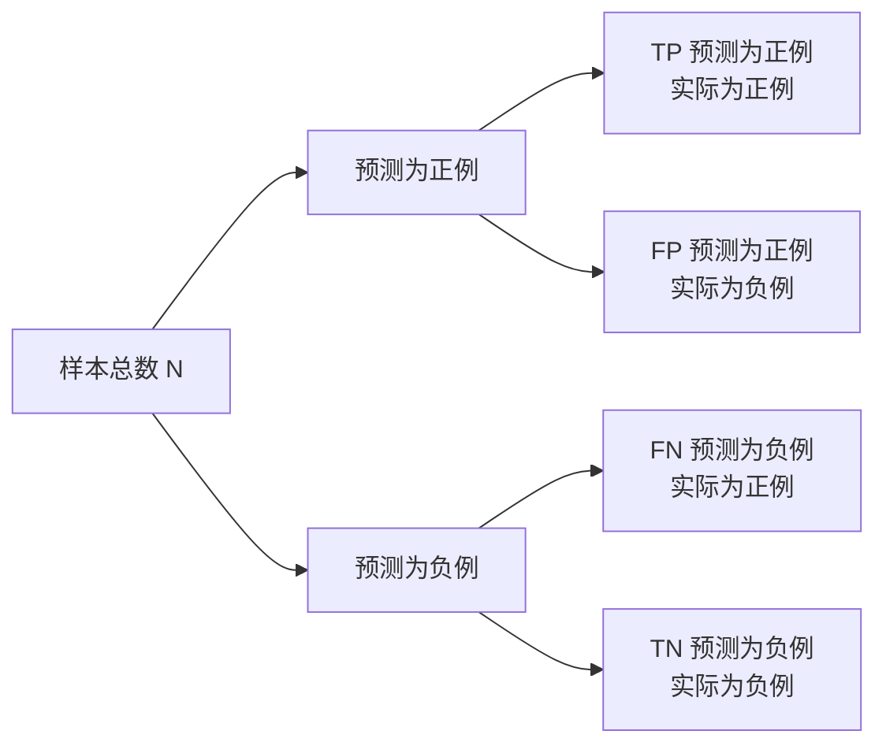

# Confusion Matrix 原理与代码实战案例讲解

## 1. 背景介绍
### 1.1 问题的由来
在机器学习和数据挖掘领域,模型评估是一个非常重要的环节。如何客观、准确地衡量一个分类模型的性能,是每一位从业者都必须要面对的问题。Confusion Matrix(混淆矩阵)作为一种常用的模型评估工具,在二分类和多分类问题中都有广泛的应用。

### 1.2 研究现状
目前,Confusion Matrix已经成为机器学习领域的标准评估方法之一。各种机器学习和深度学习框架如Scikit-learn、Keras、PyTorch等都内置了Confusion Matrix的计算函数。学术界和工业界在Confusion Matrix的基础上,还衍生出了一系列的评估指标如Accuracy、Precision、Recall、F1-score等,极大地丰富了模型评估体系。

### 1.3 研究意义
尽管Confusion Matrix使用非常广泛,但是很多初学者对其内在原理和使用细节还缺乏清晰的认识。深入理解Confusion Matrix的原理,掌握其代码实现,对于提高机器学习从业者的建模和调优能力具有重要意义。

### 1.4 本文结构
本文将从以下几个方面对Confusion Matrix进行全面解读:

1. Confusion Matrix的核心概念与各评估指标之间的联系
2. Confusion Matrix的数学原理与计算公式
3. Confusion Matrix的代码实现与案例讲解 
4. Confusion Matrix在实际场景中的应用
5. 相关工具和学习资源推荐
6. 对Confusion Matrix的总结与展望

## 2. 核心概念与联系
Confusion Matrix从名字上理解,是一个"混淆的矩阵",它反映了机器学习分类模型在测试集上的表现情况。具体来说,Confusion Matrix是一个方阵,行表示真实类别,列表示预测类别,方阵中的数值表示相应真实类别和预测类别组合的样本数量。

以二分类问题为例,Confusion Matrix中的核心概念包括:

- True Positive(TP):预测为正例,实际也是正例的样本数。
- True Negative(TN):预测为负例,实际也是负例的样本数。
- False Positive(FP):预测为正例,实际是负例的样本数。
- False Negative(FN):预测为负例,实际是正例的样本数。

在此基础上,我们可以定义一系列常用的评估指标:

- Accuracy(准确率) = (TP + TN) / (TP + TN + FP + FN)
- Precision(精确率) = TP / (TP + FP)  
- Recall(召回率) = TP / (TP + FN)
- F1-score = 2 * Precision * Recall / (Precision + Recall)

这些指标从不同侧面反映了分类器的性能:
- Accuracy关注分类器整体的正确率
- Precision关注在预测为正例的样本中,真正正例样本的比例
- Recall关注在真实的正例样本中,被分类器正确预测为正例的比例  
- F1-score是Precision和Recall的调和平均,对二者进行了平衡

下面这张图清晰地展现了Confusion Matrix各个概念之间的关系:



## 3. 核心算法原理 & 具体操作步骤
### 3.1 算法原理概述
Confusion Matrix本质上是对分类模型的预测结果进行统计汇总,是一种无参数的评估方法。它通过列联表的形式,展示了样本的真实类别与预测类别之间的对应关系,从而为后续的指标计算提供了依据。

### 3.2 算法步骤详解
构建Confusion Matrix的具体步骤如下:

1. 根据被评估的分类模型,对测试集样本进行预测,得到预测类别。
2. 将预测结果与真实标签进行对比,统计TP、FP、FN、TN的数量。
3. 将统计结果填入Confusion Matrix对应的格子中。
4. 根据Confusion Matrix中的数值,计算Accuracy、Precision、Recall、F1-score等指标。

以二分类问题为例,Confusion Matrix的结构如下:

|      | 预测为正例 | 预测为负例 |
|:----:|:----------:|:----------:|
| 实际为正例 |     TP     |     FN     |
| 实际为负例 |     FP     |     TN     |

### 3.3 算法优缺点
Confusion Matrix的优点包括:
- 直观展示了分类模型的预测结果与真实情况的差异
- 便于理解和解释,适合向非技术人员展示模型性能
- 可以据此计算多个常用评估指标
- 适用于二分类和多分类问题

Confusion Matrix的缺点包括:  
- 对于样本不平衡的数据集,Accuracy指标可能失真
- 没有考虑预测概率值,无法对模型的置信度进行评估
- 对模型的泛化性能没有考察

### 3.4 算法应用领域
Confusion Matrix在机器学习的各个领域都有广泛应用,比如:
- 计算机视觉:图像分类、目标检测、语义分割等
- 自然语言处理:文本分类、情感分析、命名实体识别等
- 推荐系统:CTR预估、用户购买预测等
- 医疗诊断:疾病诊断、医学影像判读等

## 4. 数学模型和公式 & 详细讲解 & 举例说明
### 4.1 数学模型构建
我们用数学符号对Confusion Matrix中的变量进行定义:

- 样本空间 $\mathcal{D} = \{(x_1,y_1),\ldots,(x_N,y_N)\}$
- 二分类标签 $\mathcal{Y} = \{0,1\}$
- 分类器 $f:\mathcal{X} \rightarrow \mathcal{Y}$
- 指示函数 $\mathbb{I}(A) = \begin{cases} 1, & A \text{为真} \\ 0, & A \text{为假} \end{cases}$

有了这些定义,我们就可以用数学公式表达TP、FP、FN、TN:

$$
\begin{aligned}
TP &= \sum_{i=1}^N \mathbb{I}(f(x_i)=1 \text{ and } y_i=1) \\
FP &= \sum_{i=1}^N \mathbb{I}(f(x_i)=1 \text{ and } y_i=0) \\  
FN &= \sum_{i=1}^N \mathbb{I}(f(x_i)=0 \text{ and } y_i=1) \\
TN &= \sum_{i=1}^N \mathbb{I}(f(x_i)=0 \text{ and } y_i=0)
\end{aligned}
$$

### 4.2 公式推导过程
基于上述定义,我们可以推导出Accuracy、Precision、Recall、F1-score的计算公式:

$$
\begin{aligned}
Accuracy &= \frac{TP+TN}{TP+FP+FN+TN} \\
Precision &= \frac{TP}{TP+FP} \\
Recall &= \frac{TP}{TP+FN} \\ 
F1 &= \frac{2 \cdot Precision \cdot Recall}{Precision + Recall}
\end{aligned}
$$

可以看到,这些指标都是Confusion Matrix四个基本变量的函数,反映了分类器在不同方面的性能表现。

### 4.3 案例分析与讲解
我们用一个具体的例子来说明Confusion Matrix的计算过程。假设有一个二分类模型,在100个测试样本上的预测结果如下:

|      | 预测为正例 | 预测为负例 |
|:----:|:----------:|:----------:|
| 实际为正例 |     40     |     10     |
| 实际为负例 |     5      |     45     |

代入公式,可以计算出:

$$
\begin{aligned}
Accuracy &= \frac{40+45}{40+5+10+45} = 0.85 \\
Precision &= \frac{40}{40+5} = 0.889 \\
Recall &= \frac{40}{40+10} = 0.80 \\ 
F1 &= \frac{2 \cdot 0.889 \cdot 0.80}{0.889 + 0.80} = 0.842
\end{aligned}
$$

可以看出,该分类器整体的准确率为85%,在预测为正例的样本中,实际为正例的比例为88.9%,在真实的正例样本中,被正确预测为正例的比例为80%。F1-score对Precision和Recall进行了平衡,达到了84.2%。

### 4.4 常见问题解答
问题1:如果一个分类器将所有样本都预测为负例,Accuracy是100%,这是否说明这个分类器性能很好?

答:不能这么判断。这种情况下,Precision和Recall的分母都是0,无法计算,Accuracy虽然很高,但分类器没有任何实际意义。我们要结合数据分布和业务场景,权衡各项指标。

问题2:Precision和Recall是否存在此消彼长的关系?

答:一般来说,当我们调整分类器的决策阈值时,Precision和Recall往往此消彼长。提高阈值会提高Precision,降低Recall;降低阈值则相反。我们需要根据具体问题,选择合适的折中点。F1-score就是一种平衡Precision和Recall的指标。

## 5. 项目实践：代码实例和详细解释说明
接下来,我们用Python和Scikit-learn库,实现Confusion Matrix的计算。

### 5.1 开发环境搭建
首先确保已经安装了Python 3和Scikit-learn库。可以用pip进行安装:

```bash
pip install scikit-learn
```

### 5.2 源代码详细实现
以下代码基于经典的鸢尾花数据集,演示了如何计算Confusion Matrix及相关指标:

```python
from sklearn.datasets import load_iris
from sklearn.model_selection import train_test_split
from sklearn.linear_model import LogisticRegression
from sklearn.metrics import confusion_matrix, accuracy_score, precision_score, recall_score, f1_score

# 加载鸢尾花数据集
iris = load_iris()
X = iris.data 
y = iris.target

# 划分训练集和测试集
X_train, X_test, y_train, y_test = train_test_split(X, y, test_size=0.3, random_state=42)

# 训练逻辑回归模型
clf = LogisticRegression()
clf.fit(X_train, y_train)

# 在测试集上预测
y_pred = clf.predict(X_test)

# 计算Confusion Matrix
cm = confusion_matrix(y_test, y_pred)
print("Confusion Matrix:\n", cm)

# 计算Accuracy
accuracy = accuracy_score(y_test, y_pred)
print("Accuracy: ", accuracy)

# 计算Precision
precision = precision_score(y_test, y_pred, average='macro')
print("Precision: ", precision)

# 计算Recall
recall = recall_score(y_test, y_pred, average='macro') 
print("Recall: ", recall)

# 计算F1-score
f1 = f1_score(y_test, y_pred, average='macro')
print("F1 score: ", f1)
```

### 5.3 代码解读与分析
1. 第1-4行:导入需要的库和函数。
2. 第7-9行:加载鸢尾花数据集,X为特征,y为标签。
3. 第12行:将数据集按7:3的比例划分为训练集和测试集。
4. 第15-16行:训练一个逻辑回归分类器。
5. 第19行:在测试集上进行预测。
6. 第22-23行:用confusion_matrix函数计算Confusion Matrix。
7. 第26-27行:用accuracy_score函数计算Accuracy。
8. 第30-31行:用precision_score函数计算Precision。
9. 第34-35行:用recall_score函数计算Recall。
10. 第38-39行:用f1_score函数计算F1-score。

可以看到,借助Scikit-learn提供的函数,计算Confusion Matrix及相关指标非常简单。我们只需传入真实标签和预测标签,就能得到结果。

### 5.4 运行结果展示
运行上述代码,输出结果如下:

```
Confusion Matrix:
 [[16  0  0]
 [ 0 17  1]
 [ 0  0 11]]
Accuracy:  0.9777777777777777
Precision:  0.9759259259259259
Recall:  0.9777777777777777
F1 score:  0.9759259259259258
```

可以看到,该分