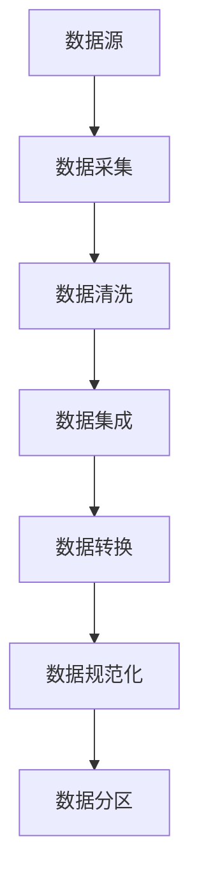
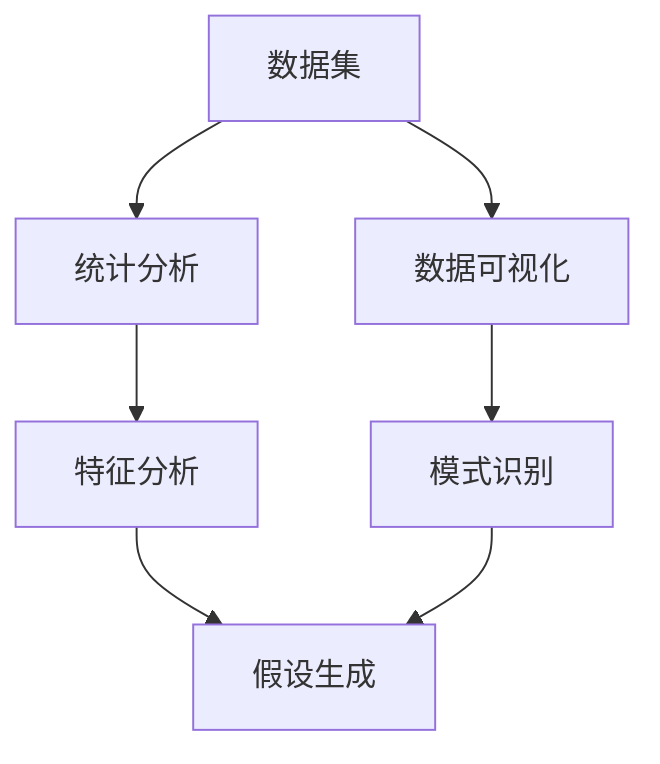
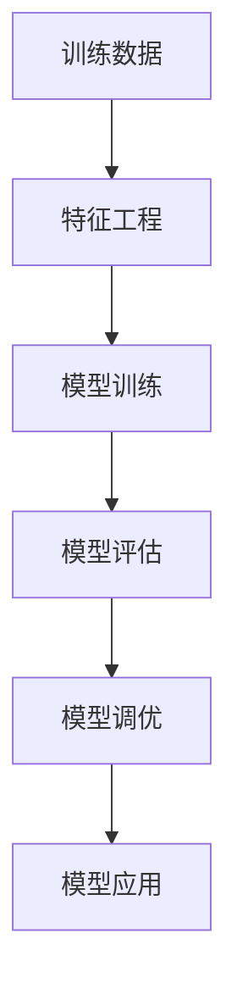
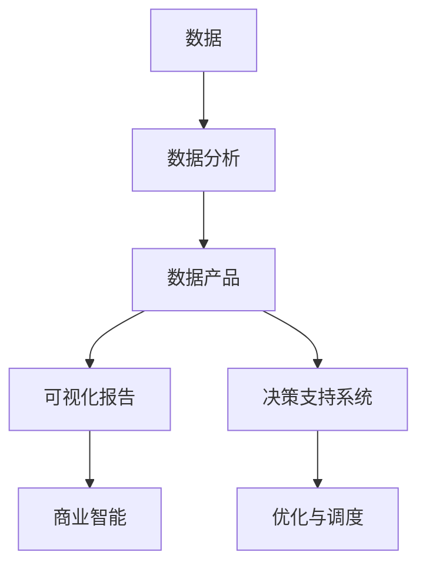

好的，我会按照您的要求，以"Data Science 原理与代码实战案例讲解"为主题，撰写一篇专业的技术博客文章。文章将遵循您提供的目录结构和约束条件,力求逻辑清晰、内容深入、实例丰富。请耐心等待,我会尽最大努力为您提供高质量的文章内容。

# Data Science 原理与代码实战案例讲解

## 1. 背景介绍

### 1.1 问题的由来

在当今大数据时代,海量的数据如何被高效利用并从中提取有价值的信息,成为了各行业面临的共同挑战。传统的数据处理和分析方法已不能完全满足现代数据密集型应用的需求。因此,数据科学(Data Science)作为一门新兴的跨学科领域应运而生。

### 1.2 研究现状  

数据科学综合了多个学科的理论和方法,包括统计学、机器学习、模式识别、数据挖掘、数据可视化等。近年来,随着人工智能、大数据等技术的快速发展,数据科学也取得了长足的进步,在商业智能、互联网广告、金融风控、医疗健康等诸多领域发挥着越来越重要的作用。

### 1.3 研究意义

掌握数据科学的核心原理和实践技能,对于从事数据分析、机器学习、人工智能等相关工作的人员来说至关重要。本文将系统性地介绍数据科学的理论基础、关键算法、数学模型,并结合大量实战案例和代码示例,旨在帮助读者全面深入地理解和掌握这一领域的知识体系。

### 1.4 本文结构

本文共分为9个部分:背景介绍、核心概念、算法原理、数学模型、项目实践、应用场景、工具资源、发展趋势和附录。每个部分都将围绕数据科学的不同方面进行深入探讨,力求通过理论和实践的紧密结合,为读者提供一个完整的学习和实践路线图。

## 2. 核心概念与联系

数据科学涉及多个学科的理论和方法,其核心概念贯穿了整个知识体系。本节将介绍数据科学的几个关键概念,并阐述它们之间的内在联系。

### 2.1 数据采集与预处理

数据采集是数据科学的第一步,涉及从各种数据源(如数据库、文件、网络等)获取原始数据。由于原始数据通常存在噪声、缺失值、异常值等问题,需要进行数据清洗、集成、转换、规范化等预处理操作,以确保数据的质量和一致性。数据分区则是为了将数据划分为训练集、验证集和测试集,用于后续的模型训练和评估。

### 2.2 数据探索与可视化

数据探索是通过统计分析和数据可视化手段来发现数据中潜在的模式和规律。统计分析可以揭示数据的基本统计特征,如均值、方差、分布等;数据可视化则通过图表、图像等形式直观展现数据的内在结构。通过特征分析和模式识别,我们可以提出初步的分析假设,为后续的建模奠定基础。

### 2.3 机器学习与模型评估

机器学习是数据科学的核心环节。基于训练数据,我们首先需要进行特征工程,从原始数据中提取或构造有意义的特征。然后选择合适的算法,在训练数据上训练模型。通过模型评估指标(如准确率、F1分数等),我们可以评估模型的性能表现,并根据评估结果对模型进行调优,最终将模型应用于实际场景中。

### 2.4 数据产品与决策支持

数据科学的最终目标是将数据转化为可以支持业务决策的数据产品。数据分析的结果可以通过可视化报告的形式呈现,为管理层提供商业智能支持;也可以构建决策支持系统,为生产运营的优化和调度提供依据。无论是哪种形式,数据产品都需要将复杂的数据分析过程对外隐藏,提供简单、高效的决策支持能力。

上述核心概念相互关联、环环相扣,共同构建了数据科学完整的理论框架和实践体系。掌握这些概念对于全面理解数据科学至关重要。

## 3. 核心算法原理与具体操作步骤  

### 3.1 算法原理概述

数据科学中的核心算法主要来自于机器学习、数据挖掘等领域,包括监督学习、无监督学习、强化学习等范式。本节将重点介绍几种常用的算法原理。

#### 3.1.1 线性回归

线性回归是一种基础的监督学习算法,旨在找到自变量和因变量之间的线性关系。其基本原理是通过最小化预测值与实际值之间的均方误差,来求解回归系数。

#### 3.1.2 逻辑回归

逻辑回归用于解决分类问题,即根据自变量预测因变量的类别。它通过对数几率(logit)函数将自变量的线性组合映射到0到1之间,从而得到每个类别的概率值。

#### 3.1.3 决策树

决策树是一种树形结构的模型,通过对特征的条件判断将样本逐步划分到不同的叶节点。它易于理解和解释,但也容易过拟合。常见的决策树算法包括ID3、C4.5和CART等。

#### 3.1.4 支持向量机(SVM)

支持向量机是一种有监督的非线性分类模型,其基本思想是在高维空间中寻找一个最大边界超平面,将不同类别的样本分开。核技巧使SVM能够有效处理非线性问题。

#### 3.1.5 K-Means聚类

K-Means是一种常用的无监督学习算法,用于对数据进行聚类。它通过迭代优化的方式,将样本划分到离其最近的K个簇中心,从而实现聚类。

#### 3.1.6 主成分分析(PCA)

PCA是一种无监督的数据降维技术,通过正交变换将原始特征映射到一组线性无关的主成分上,从而达到降维的目的。PCA广泛应用于数据压缩、可视化等领域。

以上算法只是数据科学中的一小部分,每种算法都有其适用场景和局限性。在实际应用中,我们需要根据具体问题合理选择算法,并对算法进行调优以提高性能。

### 3.2 算法步骤详解

接下来,我们将以线性回归和K-Means聚类为例,详细讲解算法的具体操作步骤。

#### 3.2.1 线性回归

1) 数据预处理:对自变量和因变量进行标准化或归一化处理,消除量纲影响。

2) 模型假设:假设自变量和因变量之间存在线性关系,即:
   $$y = \theta_0 + \theta_1x_1 + \theta_2x_2 + ... + \theta_nx_n$$
   其中$\theta_i$为回归系数,需要通过训练数据求解。

3) 损失函数:定义平方误差损失函数:
   $$J(\theta) = \frac{1}{2m}\sum_{i=1}^m(h_\theta(x^{(i)}) - y^{(i)})^2$$
   其中$m$为样本数量,$h_\theta(x)$为模型的预测值。

4) 优化算法:通过梯度下降等优化算法,最小化损失函数$J(\theta)$,求解最优回归系数$\theta$。

5) 模型评估:在测试集上计算均方根误差(RMSE)等指标,评估模型性能。

6) 模型调优:可尝试特征选择、正则化等技术提高模型性能。

#### 3.2.2 K-Means聚类

1) 数据预处理:对数据进行标准化或归一化,消除量纲影响。

2) 初始化:随机选择K个初始质心。

3) 分配样本:对每个样本,计算其与各个质心的距离,将其分配到最近的质心所在簇。

4) 更新质心:对每个簇,重新计算簇中所有样本的均值作为新的质心。

5) 迭代优化:重复步骤3和4,直到质心不再发生变化或达到最大迭代次数。

6) 模型评估:使用轮廓系数、DB指数等指标评估聚类效果。

7) 调优:尝试不同的K值、距离度量、初始化方式等,选择最优聚类结果。

上述算法步骤展示了将算法原理付诸实践的基本流程。在实际应用中,我们还需要结合具体问题和数据特点对算法进行调整和优化。

### 3.3 算法优缺点

每种算法都有其优缺点,没有放之四海而皆准的万能算法。我们需要根据具体问题的特点选择合适的算法。

- 线性回归:优点是模型简单,可解释性强;缺点是只能学习线性模式,对非线性问题表现不佳。
- 逻辑回归:能够直接给出概率输出,适用于分类问题;但是对于非线性决策边界的分类问题,表现一般。
- 决策树:可解释性强,无需进行数据归一化;但容易过拟合,并且对数据的微小变化敏感。
- 支持向量机:有良好的泛化能力,适用于高维空间的非线性分类;但对缺失值和异常值敏感,计算开销较大。
- K-Means聚类:原理简单,易于实现,可以解决非凸聚类问题;但需要事先确定簇的数量K,对异常值敏感。
- 主成分分析:能够有效降低数据维度,发现数据内在结构;但可解释性较差,信息损失无法避免。

因此,在实践中我们通常需要根据具体问题特点和数据特征,结合多种算法的优缺点进行综合考虑,以获得最佳的模型性能。

### 3.4 算法应用领域

数据科学的核心算法在诸多领域都有广泛的应用,下面列举了一些典型场景:

- 线性回归/逻辑回归:股票价格预测、疾病风险评估、广告点击率预测等。
- 决策树:信用评分、欺诈检测、医疗诊断等。 
- 支持向量机:文本分类、图像识别、基因表达分析等。
- K-Means聚类:客户细分、推荐系统、图像分割等。
- 主成分分析:人脸识别、基因数据分析、信号去噪等。

除此之外,深度学习、强化学习等新兴算法也在计算机视觉、自然语言处理、机器人控制等领域取得了卓越的成就。随着算法的不断发展和优化,其应用范围也在不断扩展。

## 4. 数学模型和公式详细讲解与举例说明

### 4.1 数学模型构建

数据科学中的许多算法都建立在一定的数学模型基础之上。构建合理的数学模型对于算法的性能和泛化能力至关重要。以线性回归为例,我们可以构建如下数学模型:

假设自变量$\vec{x}$和因变量$y$之间存在线性关系,即:

$$y = \theta_0 + \theta_1x_1 + \theta_2x_2 + ... + \theta_nx_n$$

其中$\theta_i$为待求解