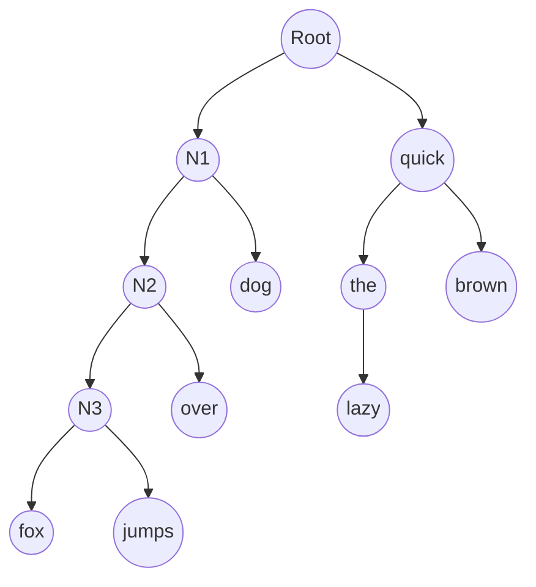

# FastText原理与代码实例讲解

## 1. 背景介绍
### 1.1  问题的由来
在自然语言处理(NLP)领域中,文本表示学习一直是一个核心问题。传统的词袋模型(Bag-of-Words)虽然简单实用,但无法捕捉词语间的语义关系。近年来,词向量(Word Embedding)模型如Word2Vec得到了广泛应用,能够学习到词语的低维实值向量表示,刻画词语间的语义相似性。然而,Word2Vec存在训练慢、内存占用大等问题。Facebook AI研究院在2016年提出了FastText模型,在保证精度的同时大幅提升了训练速度。

### 1.2  研究现状
FastText自问世以来,受到了学术界和工业界的高度关注。目前已被广泛应用于文本分类、情感分析、推荐系统等任务中,取得了优异的效果。许多研究工作在FastText的基础上进行了改进和扩展,如引入注意力机制、多任务学习等。一些开源实现如Gensim也集成了FastText模型,方便研究人员和开发者使用。

### 1.3  研究意义 
深入理解FastText的原理,对于从事NLP研究和应用的人员具有重要意义:

1. 掌握高效的文本表示学习方法,提升下游NLP任务的性能;
2. 了解FastText的核心思想,有助于开发出更加先进的词向量模型;
3. 学习FastText的工程实践,提高工业级应用系统的开发效率。

### 1.4  本文结构
本文将全面介绍FastText的原理和应用。第2节阐述FastText涉及的核心概念;第3节深入讲解FastText的算法原理;第4节给出数学模型和公式推导;第5节提供代码实例和详细解释;第6节展望FastText的实际应用场景;第7节推荐相关工具和资源;第8节总结全文并探讨未来研究方向;第9节列出常见问题解答。

## 2. 核心概念与联系
在讨论FastText之前,我们先来了解几个核心概念:

- 词向量(Word Embedding):将词语映射为实值向量的方法,通过向量捕捉词语的语义信息。词向量可以通过神经网络从文本语料中学习得到。

- Word2Vec:Google提出的经典词向量模型,包括CBOW和Skip-Gram两种架构。CBOW根据上下文词预测中心词,Skip-Gram根据中心词预测上下文词。

- 层次Softmax(Hierarchical Softmax):一种高效的多分类算法,通过构建Huffman树来降低计算复杂度。FastText使用了层次Softmax来加速训练过程。

- N-gram:一种考虑词语顺序的文本表示方法。FastText利用subword级别的N-gram特征来增强对未登录词(OOV)的建模能力。

以上概念与FastText密切相关。FastText在Word2Vec的基础上,使用层次Softmax加速训练,并引入subword信息来增强鲁棒性。这些创新点使得FastText在保证性能的同时,极大提高了训练效率。

## 3. 核心算法原理 & 具体操作步骤
### 3.1  算法原理概述
FastText模型的核心是Skip-Gram架构的神经网络。给定一个训练样本(w,c),其中w为中心词,c为上下文词,Skip-Gram的目标是最大化如下条件概率:

$P(c|w) = \frac{e^{v_c \cdot v_w}}{\sum_{c'\in C} e^{v_{c'} \cdot v_w}}$

其中,$v_c$和$v_w$分别是上下文词c和中心词w的向量表示,C是所有可能的上下文词集合。直接计算这个softmax概率需要遍历字典中的所有词,计算量非常大。

FastText采用了两个技巧来加速训练:

1. 层次Softmax:通过构建Huffman树,将复杂度从$O(|C|)$降低到$O(log|C|)$。

2. N-gram特征:在词级别的向量之外,还引入了subword级别的N-gram向量。一个词w的N-gram特征集合定义为:

$G_w = \{g_1, ..., g_{N_w}\}$

其中,$g_i$是w的第i个N-gram特征,$N_w$为特征总数。词w的向量表示为其N-gram特征向量的和:

$v_w = \sum_{g\in G_w} z_g$

其中,$z_g$为N-gram特征g的向量。引入subword可以缓解OOV问题,提高模型的泛化能力。

### 3.2  算法步骤详解
FastText的训练过程可分为以下步骤:

1. 建立词表,统计词频,过滤低频词,得到词典。

2. 对每个词,提取其subword的N-gram特征。

3. 基于词频构建Huffman树。

4. 随机初始化所有词向量和N-gram特征向量。

5. 对于每个训练样本(w,c),计算条件概率$P(c|w)$。

6. 通过随机梯度上升法(SGD)更新模型参数,最大化对数似然函数:

$\mathcal{L} = \sum_{(w,c)\in D} log P(c|w)$

其中,D为所有训练样本的集合。

7. 重复步骤5~6,直到模型收敛或达到预设的迭代次数。

8. 输出所有词的向量表示,用于下游任务。

在推理阶段,FastText可以方便地得到任意词的向量表示,包括OOV词。对于OOV词,FastText使用其N-gram特征的向量之和作为词向量。

### 3.3  算法优缺点
FastText相比传统词向量模型具有以下优点:

- 训练速度快,可扩展到大规模语料。
- 引入subword信息,增强了对OOV词的处理能力。
- 模型结构简单,易于实现和调优。

同时,FastText也存在一些局限性:

- 未考虑词序信息,无法区分语义相似但语法功能不同的词。
- 未显式建模多义词,容易混淆同形异义的词语。
- 依赖预训练的词向量,在特定领域的任务上可能需要重新训练。

### 3.4  算法应用领域
FastText在NLP领域有广泛的应用,主要包括:

- 文本分类:利用FastText学习的词向量作为特征,再结合分类器如SVM、LR等完成分类任务。

- 情感分析:将词向量输入CNN、RNN等深度模型,判断文本的情感倾向。

- 命名实体识别:将FastText词向量作为输入,结合BiLSTM-CRF等序列标注模型完成NER任务。

- 问答系统:利用问题和答案的FastText向量计算相似度,从候选答案中选出最相关的答案。

- 推荐系统:将词向量用于构建用户和物品的向量表示,进行相似度计算和个性化推荐。

除了上述任务,FastText还可用于机器翻译、关键词提取、文本聚类等多种NLP场景。

## 4. 数学模型和公式 & 详细讲解 & 举例说明
### 4.1  数学模型构建
FastText的数学模型可以用概率图模型来描述。假设语料库中有T个词$w_1, ..., w_T$,词典大小为N。定义词w的上下文为:

$Context(w) = \{w_{t-k}, ..., w_{t-1}, w_{t+1}, ..., w_{t+k}|w_t=w\}$

其中,k为上下文窗口大小。Skip-Gram模型的目标是最大化给定中心词生成其上下文词的概率:

$$\prod_{t=1}^T \prod_{c \in Context(w_t)} P(c|w_t)$$

FastText在此基础上引入了subword信息。对于词w,定义其subword集合为:

$$G_w = \{g_1, ..., g_{N_w}\}$$

其中,$g_i$为w的第i个N-gram特征。词w的向量表示为:

$$v_w = \sum_{g\in G_w} z_g$$

其中,$z_g$为N-gram特征g的d维向量。因此,FastText模型的条件概率可以表示为:

$$P(c|w) = \frac{e^{v_c \cdot v_w}}{\sum_{c'\in C} e^{v_{c'} \cdot v_w}}$$

$$= \frac{e^{v_c \cdot \sum_{g\in G_w} z_g}}{\sum_{c'\in C} e^{v_{c'} \cdot \sum_{g\in G_w} z_g}}$$

### 4.2  公式推导过程
对于给定的中心词w和上下文词c,FastText的目标是最大化$logP(c|w)$:

$$\begin{aligned}
logP(c|w) &= log\frac{e^{v_c \cdot v_w}}{\sum_{c'\in C} e^{v_{c'} \cdot v_w}} \\
&= v_c \cdot v_w - log\sum_{c'\in C} e^{v_{c'} \cdot v_w}
\end{aligned}$$

使用层次Softmax可以避免计算归一化因子$\sum_{c'\in C} e^{v_{c'} \cdot v_w}$。设$p_1, ..., p_{l_c}$为Huffman树中从根节点到上下文词c的路径,其中$l_c$为路径长度。定义$d_1, ..., d_{l_c-1} \in \{0,1\}$为二进制编码,表示每个内部节点的左右子树。假设节点n的向量为$\theta_n$,则有:

$$P(c|w) = \prod_{j=1}^{l_c-1} \sigma ([2d_j-1] \theta_{p_j} \cdot v_w)$$

其中,$\sigma(x)=\frac{1}{1+e^{-x}}$为sigmoid函数。这样,计算$P(c|w)$的复杂度从$O(|C|)$降低到$O(log|C|)$。

将N-gram特征引入,可得FastText模型的最终目标函数:

$$\mathcal{L} = \sum_{(w,c)\in D} \sum_{j=1}^{l_c-1} log\sigma ([2d_j-1] \theta_{p_j} \cdot \sum_{g\in G_w} z_g)$$

通过SGD优化上式,即可得到所有词向量和N-gram特征向量。

### 4.3  案例分析与讲解
下面以一个简单的例子来说明FastText的训练过程。假设我们有以下语料:

"the quick brown fox jumps over the lazy dog"

设置上下文窗口大小k=2,N-gram范围为3~6。对于中心词"fox",其上下文词为{quick,brown,jumps,over},N-gram特征为:

$G_{fox} = \{$<fox>, <fo, fox>, <ox, fox>, <fox>, <f, fo, fox>, <o, ox, fox>, <x, fox>, <fox>$\}$

假设词典中只包含{the, quick, brown, fox, jumps, over, lazy, dog}这8个词,Huffman树如下图所示:

对于训练样本(fox, quick),其Huffman编码为$d_1=0, d_2=0, d_3=1$。因此,FastText最大化的概率为:

$$P(quick|fox) = \sigma (\theta_{Root} \cdot v_{fox}) \cdot \sigma (-\theta_{N1} \cdot v_{fox})$$

其中,$v_{fox} = \sum_{g\in G_{fox}} z_g$。类似地,对于其他上下文词,重复以上过程即可得到完整的目标函数。

### 4.4  常见问题解答
Q: FastText中的N-gram特征是如何选取的?

A: FastText采用了一个简单的规则:将每个词的前后添加特殊字符<和>,然后枚举所有长度在3~6之间的subword。这种方式可以自动提取词缀等形态学信息,无需额外的预处理。

Q: FastText能否处理phrase或者句子?

A: FastText主要用于学习词级别的向量表示。对于phrase或句子,可以将其分解为词,然后对词向量求平均或加权平均,得到phrase向量或句子向量。这种方式虽然简单,但在实践中效果也不错。

Q: FastText的训练时间复杂度是多少?

A: FastText的时间复杂度为$O(ET\cdot log|C|)$,其中E为训练epoch