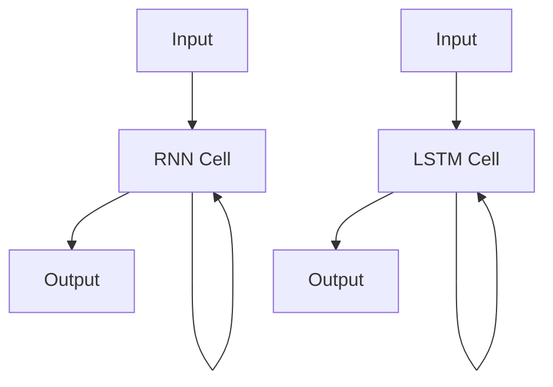

# Long Short-Term Memory 原理与代码实战案例讲解

## 1. 背景介绍

### 1.1 问题的由来
长短期记忆网络(Long Short-Term Memory,LSTM)是一种特殊的循环神经网络(Recurrent Neural Network,RNN),最早由Hochreiter和Schmidhuber于1997年提出。传统的RNN在处理长序列数据时存在梯度消失和梯度爆炸的问题,导致模型难以捕捉到长期依赖关系。LSTM通过引入门控机制和记忆单元来克服RNN的缺陷,使其能够更好地学习和记忆长期依赖信息。

### 1.2 研究现状
自LSTM提出以来,其在自然语言处理、语音识别、时间序列预测等领域取得了广泛成功。近年来,各种LSTM变体不断涌现,如Peephole LSTM、Coupled LSTM、Multidimensional LSTM等,进一步提升了模型性能。此外,LSTM与其他深度学习技术(如注意力机制、Transformer等)的结合也是研究的热点方向。尽管如此,对LSTM内部原理的理解和改进仍然是一个持续的研究课题。

### 1.3 研究意义 
深入理解LSTM的原理对于设计和优化更高效的序列学习模型具有重要意义。通过剖析LSTM内部的门控运作机制,可以洞察其捕捉长期依赖的奥秘,为算法改进提供理论指导。同时,LSTM强大的建模能力使其在工业界得到广泛应用,如智能助手、机器翻译、股票预测等,对人工智能技术的发展产生深远影响。因此,全面掌握LSTM的原理与实践对于从事AI相关研究和应用的人员来说至关重要。

### 1.4 本文结构
本文将全面阐述LSTM的原理、数学模型、代码实现以及实际应用,内容安排如下:
- 第2节介绍LSTM的核心概念及其与传统RNN的联系
- 第3节详细讲解LSTM的内部结构和运作原理
- 第4节给出LSTM的数学模型和公式推导过程,并辅以案例分析
- 第5节提供LSTM的Python代码实现,包括环境搭建、源码解读和运行结果展示
- 第6节总结LSTM在实际场景中的应用,展望其未来发展前景
- 第7节推荐LSTM相关的学习资源、开发工具和研究论文
- 第8节对全文进行总结,分析LSTM面临的挑战和研究方向
- 第9节列举LSTM常见问题解答,为读者答疑解惑

## 2. 核心概念与联系

LSTM是一种特殊类型的RNN,它通过引入门控单元和记忆单元来克服普通RNN的局限性。LSTM与传统RNN的主要区别在于:

1. 门控机制:LSTM引入了三种门控单元,即输入门(input gate)、遗忘门(forget gate)和输出门(output gate),用于控制信息的流动。这种门控机制赋予了LSTM选择性地记忆和遗忘信息的能力。

2. 记忆单元:LSTM引入了记忆单元(memory cell),用于存储长期的状态信息。记忆单元通过门控单元来更新和保存信息,使LSTM能够在较长的序列中传递信息。

3. 梯度流:由于LSTM的门控设计,梯度可以在较长的时间步内保持稳定,有效缓解了梯度消失和梯度爆炸问题。这使得LSTM能够学习到长期依赖关系。

下图展示了LSTM与传统RNN在结构上的差异:



可以看出,LSTM通过引入门控单元和记忆单元,形成了一个更加复杂和强大的循环结构。这种结构使其能够更好地捕捉序列数据中的长期依赖关系。

## 3. 核心算法原理 & 具体操作步骤

### 3.1 算法原理概述
LSTM的核心是门控单元和记忆单元。门控单元包括输入门、遗忘门和输出门,分别控制新信息的写入、旧信息的遗忘以及记忆单元状态的输出。记忆单元则用于存储长期的状态信息。LSTM通过门控单元有选择性地更新记忆单元,从而实现对长期依赖的建模。

### 3.2 算法步骤详解
LSTM的前向传播过程可以分为以下几个步骤:

1. 遗忘门:决定上一时刻的记忆单元状态有多少信息被保留到当前时刻。
$$f_t = \sigma(W_f \cdot [h_{t-1}, x_t] + b_f)$$

2. 输入门:决定当前时刻的输入有多少信息被写入记忆单元。
$$i_t = \sigma(W_i \cdot [h_{t-1}, x_t] + b_i)$$

3. 记忆单元更新:根据遗忘门和输入门的信息,更新记忆单元状态。
$$\tilde{C}_t = \tanh(W_C \cdot [h_{t-1}, x_t] + b_C)$$
$$C_t = f_t * C_{t-1} + i_t * \tilde{C}_t$$

4. 输出门:决定当前时刻的记忆单元状态有多少信息被输出。
$$o_t = \sigma(W_o \cdot [h_{t-1}, x_t] + b_o)$$

5. 隐藏状态更新:根据输出门和记忆单元状态,更新隐藏状态。
$$h_t = o_t * \tanh(C_t)$$

其中,$\sigma$表示Sigmoid激活函数,$\tanh$表示双曲正切激活函数,$*$表示逐元素相乘。

### 3.3 算法优缺点
LSTM的主要优点包括:
- 能够有效捕捉长期依赖关系
- 缓解了梯度消失和梯度爆炸问题
- 具有良好的泛化能力和鲁棒性

LSTM的主要缺点包括:  
- 计算复杂度较高,训练时间较长
- 对超参数敏感,调参难度大
- 解释性较差,内部机制不够透明

### 3.4 算法应用领域
LSTM在以下领域得到了广泛应用:
- 自然语言处理:机器翻译、情感分析、命名实体识别等
- 语音识别:声学模型、语言模型等  
- 时间序列预测:股票预测、销量预测、异常检测等
- 图像描述:根据图像生成自然语言描述
- 手写识别:基于序列的手写字符识别

## 4. 数学模型和公式 & 详细讲解 & 举例说明

### 4.1 数学模型构建
LSTM的数学模型可以用以下公式来表示:

**遗忘门:**
$$f_t = \sigma(W_f \cdot [h_{t-1}, x_t] + b_f)$$

**输入门:**
$$i_t = \sigma(W_i \cdot [h_{t-1}, x_t] + b_i)$$

**记忆单元更新:**
$$\tilde{C}_t = \tanh(W_C \cdot [h_{t-1}, x_t] + b_C)$$
$$C_t = f_t * C_{t-1} + i_t * \tilde{C}_t$$

**输出门:**
$$o_t = \sigma(W_o \cdot [h_{t-1}, x_t] + b_o)$$

**隐藏状态更新:**
$$h_t = o_t * \tanh(C_t)$$

其中:
- $x_t$表示当前时刻的输入向量
- $h_t$表示当前时刻的隐藏状态向量
- $C_t$表示当前时刻的记忆单元状态向量
- $W_f, W_i, W_C, W_o$分别表示遗忘门、输入门、记忆单元和输出门的权重矩阵
- $b_f, b_i, b_C, b_o$分别表示遗忘门、输入门、记忆单元和输出门的偏置项

### 4.2 公式推导过程
下面我们详细推导LSTM的前向传播公式:

**遗忘门:**
遗忘门用于控制上一时刻的记忆单元状态有多少信息被保留到当前时刻。它接收当前时刻的输入$x_t$和上一时刻的隐藏状态$h_{t-1}$,通过Sigmoid激活函数得到一个0到1之间的值,表示遗忘的程度。
$$f_t = \sigma(W_f \cdot [h_{t-1}, x_t] + b_f)$$

**输入门:**
输入门用于控制当前时刻的输入有多少信息被写入记忆单元。它同样接收$x_t$和$h_{t-1}$,通过Sigmoid激活函数得到一个0到1之间的值,表示写入的程度。
$$i_t = \sigma(W_i \cdot [h_{t-1}, x_t] + b_i)$$

**记忆单元更新:**
记忆单元用于存储长期的状态信息。首先,我们计算候选记忆单元状态$\tilde{C}_t$,它表示当前时刻的输入和上一时刻的隐藏状态所包含的新信息。
$$\tilde{C}_t = \tanh(W_C \cdot [h_{t-1}, x_t] + b_C)$$

然后,我们根据遗忘门和输入门的信息,更新记忆单元状态。遗忘门控制上一时刻的记忆单元状态$C_{t-1}$有多少信息被保留,输入门控制候选记忆单元状态$\tilde{C}_t$有多少信息被写入。
$$C_t = f_t * C_{t-1} + i_t * \tilde{C}_t$$

**输出门:**
输出门用于控制当前时刻的记忆单元状态有多少信息被输出到隐藏状态。它接收$x_t$和$h_{t-1}$,通过Sigmoid激活函数得到一个0到1之间的值,表示输出的程度。
$$o_t = \sigma(W_o \cdot [h_{t-1}, x_t] + b_o)$$

**隐藏状态更新:**
最后,我们根据输出门和记忆单元状态,更新隐藏状态。输出门控制记忆单元状态$C_t$有多少信息被输出,并通过tanh激活函数得到最终的隐藏状态$h_t$。
$$h_t = o_t * \tanh(C_t)$$

### 4.3 案例分析与讲解
下面我们以一个简单的例子来说明LSTM的运作过程。假设我们有一个序列"hello",我们希望通过LSTM来学习这个单词的表示。

首先,我们将单词映射为向量表示:
```
h -> [1, 0, 0, 0]
e -> [0, 1, 0, 0] 
l -> [0, 0, 1, 0]
o -> [0, 0, 0, 1]
```

然后,我们初始化LSTM的参数(权重矩阵和偏置项)以及初始状态(隐藏状态$h_0$和记忆单元状态$C_0$)。

接下来,我们将序列逐个输入到LSTM中:

1. 在时刻1,输入向量为$x_1 = [1, 0, 0, 0]$(对应字母"h")。LSTM根据当前输入和初始状态,通过门控单元和记忆单元的运算,得到新的隐藏状态$h_1$和记忆单元状态$C_1$。

2. 在时刻2,输入向量为$x_2 = [0, 1, 0, 0]$(对应字母"e")。LSTM根据当前输入和上一时刻的状态($h_1$和$C_1$),通过门控单元和记忆单元的运算,得到新的隐藏状态$h_2$和记忆单元状态$C_2$。

3. 以此类推,直到处理完整个序列。最终,我们得到了序列"hello"的LSTM表示,即最后一个时刻的隐藏状态$h_5$。

通过这个过程,LSTM学习到了单词"hello"的语义信息,并将其编码到最终的隐藏状态中。这个隐藏状态可以用于下游任务,如情感分析、命名实体识别等。

### 4.4 常见问题解答
**Q:** LSTM中的门控单元是如何工作的?
**A:** LSTM中有三种门控单元:输入门、遗忘门和输出门。它们都使用Sigmoid激活函数,输出一个0到1之间的值。这个值可以看作是一个"开关