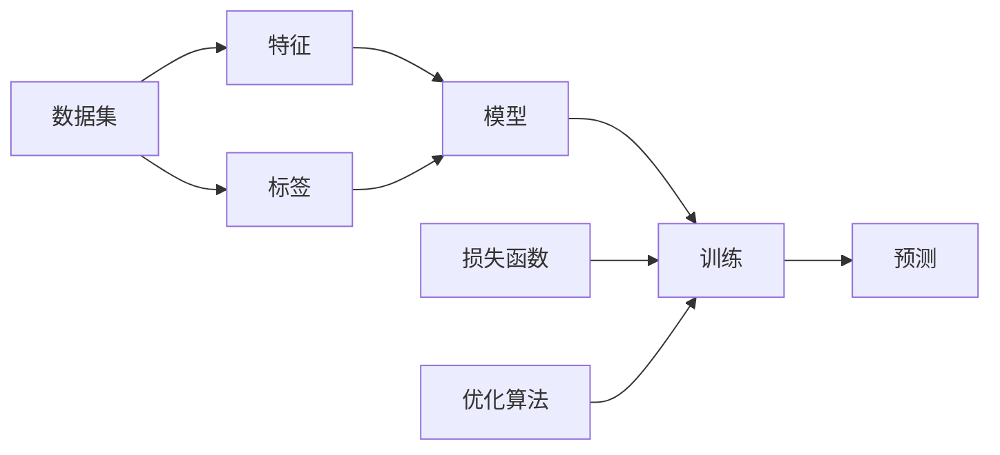

# Machine Learning (ML) 原理与代码实战案例讲解

作者：禅与计算机程序设计艺术 / Zen and the Art of Computer Programming

## 1. 背景介绍
### 1.1 问题的由来
在当今数据爆炸式增长的时代，如何从海量数据中挖掘出有价值的信息和知识，成为了各行各业面临的重大挑战。传统的数据分析方法已经无法满足日益增长的需求。机器学习作为人工智能的核心，为解决这一问题提供了新的思路和方法。

### 1.2 研究现状
机器学习经过几十年的发展，已经取得了显著的进展。从最早的感知机，到支持向量机、决策树、随机森林等经典算法，再到近年来大放异彩的深度学习，机器学习在理论和应用上都取得了长足的进步。目前，机器学习已经广泛应用于计算机视觉、自然语言处理、语音识别、推荐系统等领域，并取得了令人瞩目的成果。

### 1.3 研究意义
机器学习的研究对于推动人工智能的发展具有重要意义。通过研究机器学习的原理和算法，可以让机器具备从数据中自主学习的能力，使其在面对未知问题时能够自主地给出合理的判断和预测。这不仅可以极大地提高生产效率，还可以在许多领域取代人工，解放人力，创造更大的价值。

### 1.4 本文结构
本文将全面介绍机器学习的原理和代码实战。首先，我们将介绍机器学习的核心概念和基本原理。然后，重点讲解几种常见的机器学习算法，包括它们的数学模型、公式推导、代码实现和应用案例。接着，介绍机器学习的实际应用场景和面临的挑战。最后，总结全文并展望机器学习的未来发展方向。

## 2. 核心概念与联系
机器学习的目标是让机器从数据中学习，自主地构建模型，对未知数据进行预测或分类。其核心概念包括：

- 数据集：包含特征和标签的数据的集合，用于训练模型和评估模型性能。
- 特征：描述数据属性的变量，用于构建模型。
- 标签：数据的真实类别或值，用于训练模型。  
- 模型：根据训练数据构建的数学模型，用于对新数据进行预测。
- 训练：根据训练数据调整模型参数的过程。
- 预测：用训练好的模型对新数据进行预测的过程。
- 损失函数：评估模型预测结果与真实值之间差距的函数。
- 优化算法：用于最小化损失函数，调整模型参数的算法。

这些概念之间的关系如下图所示：



## 3. 核心算法原理 & 具体操作步骤
### 3.1 算法原理概述
机器学习算法分为监督学习、无监督学习和强化学习三大类。监督学习可以进一步分为分类和回归两类。常见的机器学习算法包括：

- 线性回归
- 逻辑回归
- 支持向量机
- 决策树与随机森林 
- 朴素贝叶斯
- K近邻
- K均值聚类
- 主成分分析
- 神经网络与深度学习

这些算法的基本原理都是通过构建数学模型，从数据中学习模型参数，然后用模型对新数据进行预测。不同算法的模型形式和学习策略不同，适用的场景也不同。

### 3.2 算法步骤详解
以线性回归为例，其算法步骤如下：

1. 准备数据集，包括特征矩阵X和标签向量y。
2. 选择模型形式，对于线性回归，模型为 $y=w^Tx+b$，其中w为权重向量，b为偏置。
3. 定义损失函数，通常使用均方误差(MSE)：$L(w,b) = \frac{1}{2m}\sum_{i=1}^m(y_i - w^Tx_i - b)^2$
4. 选择优化算法，常用梯度下降法，沿损失函数负梯度方向更新参数：

$$
w := w - \alpha \frac{\partial L}{\partial w} \\
b := b - \alpha \frac{\partial L}{\partial b}
$$

其中 $\alpha$ 为学习率。

5. 迭代优化直至收敛，得到最优参数 $w^*$ 和 $b^*$。
6. 用训练好的模型 $y=w^{*T}x+b^*$ 对新数据进行预测。

### 3.3 算法优缺点
线性回归的优点是模型简单，易于理解和实现，训练速度快。但其局限性在于只能拟合线性关系，对非线性数据拟合效果不佳。

不同算法的优缺点各不相同，需要根据具体问题选择合适的算法。一般来说，模型越复杂，拟合能力越强，但过拟合风险也越大，训练时间也越长。

### 3.4 算法应用领域
机器学习算法被广泛应用于以下领域：

- 计算机视觉：图像分类、目标检测、语义分割等
- 自然语言处理：文本分类、情感分析、机器翻译、问答系统等 
- 推荐系统：电商推荐、新闻推荐、广告推荐等
- 语音识别：语音转文字、声纹识别等
- 金融风控：贷款审批、反欺诈等
- 自动驾驶：环境感知、路径规划、决策控制等

## 4. 数学模型和公式 & 详细讲解 & 举例说明
### 4.1 数学模型构建
以逻辑回归为例，介绍其数学模型的构建过程。

逻辑回归是一种常用的二分类模型，其目标是估计某个样本属于正类的概率。模型形式为：

$$
P(y=1|x) = \frac{1}{1+e^{-(w^Tx+b)}} = \sigma(w^Tx+b)
$$

其中，$\sigma(z) = \frac{1}{1+e^{-z}}$ 为 Sigmoid 函数。如果 $P(y=1|x)>0.5$，则预测为正类，否则预测为负类。

### 4.2 公式推导过程
逻辑回归的参数估计采用极大似然估计。假设数据集 $\{(x_1,y_1), (x_2,y_2), ..., (x_m,y_m)\}$ 中的样本相互独立，则似然函数为：

$$
L(w,b) = \prod_{i=1}^m P(y_i|x_i) = \prod_{i=1}^m [\sigma(w^Tx_i+b)]^{y_i}[1-\sigma(w^Tx_i+b)]^{1-y_i}
$$

取对数得到对数似然：

$$
\log L(w,b) = \sum_{i=1}^m [y_i\log \sigma(w^Tx_i+b) + (1-y_i)\log(1-\sigma(w^Tx_i+b))]
$$

最大化对数似然等价于最小化负对数似然，即损失函数：

$$
J(w,b) = -\frac{1}{m}\log L(w,b) = -\frac{1}{m}\sum_{i=1}^m [y_i\log \sigma(w^Tx_i+b) + (1-y_i)\log(1-\sigma(w^Tx_i+b))]
$$

然后用梯度下降法最小化损失函数求解参数。

### 4.3 案例分析与讲解
下面以一个简单的二分类问题为例，说明逻辑回归的应用。

假设我们要根据学生的考试成绩和学习时间预测其是否能通过考试。数据集如下：

| 考试成绩 | 学习时间(h) | 是否通过 |
|--------|------------|--------|
| 80     | 10         | 1       |
| 75     | 8          | 1       |
| 60     | 5          | 0       |
| 90     | 12         | 1       |
| 50     | 3          | 0       |

首先，我们将数据转化为特征矩阵X和标签向量y：

$$
X = \begin{bmatrix}
    80 & 10 \\
    75 & 8 \\
    60 & 5 \\
    90 & 12 \\
    50 & 3
\end{bmatrix}, \quad
y = \begin{bmatrix}
    1 \\
    1 \\
    0 \\
    1 \\
    0
\end{bmatrix}
$$

然后，我们用梯度下降法训练逻辑回归模型。假设最终学到的参数为 $w=[0.1, 0.2], b=-12$，则模型为：

$$
P(y=1|x) = \sigma(0.1x_1 + 0.2x_2 - 12)
$$

其中，$x_1$ 为考试成绩，$x_2$ 为学习时间。

现在，我们用该模型预测一个新学生能否通过考试，假设他的考试成绩为70分，学习时间为6小时，则：

$$
P(y=1|x) = \sigma(0.1\times70 + 0.2\times6 - 12) = 0.38 < 0.5
$$

因此，我们预测该学生不能通过考试。

这个例子展示了逻辑回归的基本用法。在实际应用中，我们通常需要对数据进行预处理，如特征缩放、one-hot编码等，还要用交叉验证选择超参数，以及用F1分数、ROC曲线等指标评估模型性能。

### 4.4 常见问题解答
**问：逻辑回归能否处理多分类问题？**

答：可以。常见的方法是one-vs-rest，即训练k个二分类器，第i个分类器将第i类视为正类，其他所有类别视为负类。预测时选择k个分类器中置信度最高的那个类别。另一种方法是softmax回归，它是逻辑回归在多分类问题上的推广。

**问：逻辑回归对数据有哪些假设？**

答：逻辑回归假设数据服从伯努利分布，即每个样本只有两种可能的输出。同时，它假设样本相互独立，特征与log odds呈线性关系。

**问：如何解决逻辑回归的过拟合问题？**

答：可以采用L1或L2正则化，在损失函数中加入权重的L1范数或L2范数作为惩罚项，以限制模型复杂度。也可以通过特征选择来降维，只保留最有区分度的特征。

## 5. 项目实践：代码实例和详细解释说明
### 5.1 开发环境搭建
本项目使用Python语言和scikit-learn库实现逻辑回归。需要安装以下依赖：

- Python 3.x
- NumPy
- Matplotlib
- scikit-learn

可以使用pip安装：

```bash
pip install numpy matplotlib scikit-learn
```

### 5.2 源代码详细实现
下面是用scikit-learn实现逻辑回归的完整代码：

```python
import numpy as np
import matplotlib.pyplot as plt
from sklearn.linear_model import LogisticRegression
from sklearn.model_selection import train_test_split
from sklearn.preprocessing import StandardScaler
from sklearn.metrics import accuracy_score

# 准备数据
X = np.array([[80, 10], [75, 8], [60, 5], [90, 12], [50, 3]])
y = np.array([1, 1, 0, 1, 0])

# 划分训练集和测试集
X_train, X_test, y_train, y_test = train_test_split(X, y, test_size=0.2, random_state=42)

# 特征缩放
scaler = StandardScaler()
X_train_scaled = scaler.fit_transform(X_train)
X_test_scaled = scaler.transform(X_test)

# 训练模型
lr = LogisticRegression()
lr.fit(X_train_scaled, y_train)

# 预测并评估
y_pred = lr.predict(X_test_scaled)
accuracy = accuracy_score(y_test, y_pred)
print(f"Accuracy: {accuracy:.2f}")

# 可视化决策边界
x1_min, x1_max = X[:, 0].min() - 0.5, X[:, 0].max() + 0.5
x2_min, x2_max = X[:, 1].min() - 0.5, X[:, 1].max() + 0.5
xx1, xx2 = np.meshg