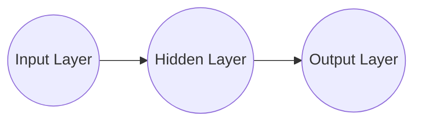

# Neural Networks 原理与代码实战案例讲解

## 1. 背景介绍
### 1.1 问题的由来
人工智能(Artificial Intelligence, AI)是计算机科学领域最令人兴奋和充满挑战的分支之一。它旨在创造能够模仿人类智能的机器,从而实现自动化、优化决策等目标。而神经网络(Neural Networks, NN)作为实现人工智能的核心技术之一,因其强大的非线性建模和学习能力,在模式识别、自然语言处理、计算机视觉等领域取得了巨大成功。

### 1.2 研究现状
近年来,随着深度学习的兴起,神经网络技术得到了飞速发展。一方面,神经网络的结构日益复杂,从最初的感知机、BP神经网络,发展到卷积神经网络(CNN)、循环神经网络(RNN)、生成对抗网络(GAN)等各种网络模型,极大地提升了神经网络的性能。另一方面,神经网络的应用领域也在不断扩展,从最初的手写数字识别,到如今的人脸识别、语音识别、自动驾驶、智能医疗等,神经网络正在深刻影响和改变着人们的生活。

### 1.3 研究意义
尽管神经网络取得了巨大成功,但对于很多初学者和非专业人士来说,神经网络仍然是一个神秘的"黑箱"。如何从直观和本质上理解神经网络的工作原理?如何利用编程工具从零开始构建一个神经网络?这些都是亟待解决的问题。只有真正掌握神经网络的原理,才能更好地应用和优化神经网络技术,设计出更加智能和高效的人工智能系统。

### 1.4 本文结构
本文将从以下几个方面来系统地介绍神经网络的原理和实战:
- 第2部分介绍神经网络的核心概念,包括神经元、网络结构、激活函数、损失函数等。
- 第3部分介绍神经网络的学习算法,重点讲解反向传播(BP)算法的原理和步骤。
- 第4部分建立神经网络的数学模型,推导相关公式,并给出具体的案例分析。
- 第5部分利用Python实现一个简单的神经网络,并进行训练和测试。
- 第6部分总结神经网络的应用场景,展望未来的发展趋势。
- 第7部分推荐神经网络的学习资源、开发工具和相关论文。
- 第8部分对全文进行总结,指出神经网络未来的挑战和研究方向。
- 第9部分列出神经网络的常见问题,并给出解答。

## 2. 核心概念与联系
神经网络是一种模仿生物神经系统结构和功能的数学模型,由大量的节点(即神经元)和它们之间的连接构成。下面介绍神经网络的几个核心概念:

- 神经元(Neuron):神经网络的基本单元。每个神经元接收一些输入,通过加权求和和非线性变换产生输出。
- 网络结构(Network Architecture):神经元按照一定的拓扑结构连接形成神经网络。最常见的是前馈网络,由输入层、隐藏层和输出层组成。
- 激活函数(Activation Function):用于给神经元的输出添加非线性变换,如Sigmoid、tanh、ReLU等。
- 损失函数(Loss Function):用于衡量神经网络的预测输出与真实值之间的差距,如均方误差、交叉熵等。

下图展示了一个简单的三层前馈神经网络结构:

神经网络通过调整神经元之间的连接权重,来学习输入与输出之间的映射关系。这个学习过程通常使用反向传播算法,即根据损失函数的梯度,反向更新网络的权重参数。

## 3. 核心算法原理 & 具体操作步骤
### 3.1 算法原理概述
反向传播(Backpropagation,BP)是训练神经网络的核心算法。其基本思想是:根据网络的预测输出与期望输出之间的误差,采用梯度下降策略,反向调整网络的权重参数,使得损失函数最小化。BP算法可以分为以下四个步骤:
1. 前向传播:根据输入数据和当前网络参数,计算每一层的输出,直到得到整个网络的输出。
2. 损失计算:将网络输出与期望输出进行比较,根据损失函数计算误差。
3. 反向传播:根据链式法则,将输出层的误差反向传播到隐藏层和输入层,计算每个参数的梯度。
4. 参数更新:根据梯度下降法,使用学习率更新网络的权重参数,使损失函数下降。

### 3.2 算法步骤详解
下面以三层网络为例,详细说明BP算法的步骤。定义如下符号:
- $x_i$:输入层第$i$个神经元的值
- $h_j$:隐藏层第$j$个神经元的值
- $o_k$:输出层第$k$个神经元的值
- $w_{ij}$:输入层到隐藏层的权重
- $w_{jk}$:隐藏层到输出层的权重
- $b_j$:隐藏层第$j$个神经元的偏置项
- $b_k$:输出层第$k$个神经元的偏置项
- $\sigma$:激活函数,这里使用Sigmoid函数 $\sigma(x)=\frac{1}{1+e^{-x}}$
- $E$:损失函数,这里使用均方误差(MSE)$E=\frac{1}{2}\sum_k(o_k-y_k)^2$

**Step 1:前向传播**
隐藏层:
$$h_j = \sigma(\sum_i w_{ij} x_i + b_j)$$
输出层:
$$o_k = \sigma(\sum_j w_{jk} h_j + b_k)$$

**Step 2:损失计算**
$$E = \frac{1}{2}\sum_k (o_k - y_k)^2$$

**Step 3:反向传播**
定义:
$$\delta_k^o = (o_k - y_k)\cdot o_k(1-o_k)$$
$$\delta_j^h = \sum_k w_{jk}\delta_k^o \cdot h_j(1-h_j)$$
则隐藏层到输出层权重的梯度为:
$$\frac{\partial E}{\partial w_{jk}} = \delta_k^o \cdot h_j$$
输入层到隐藏层权重的梯度为:
$$\frac{\partial E}{\partial w_{ij}} = \delta_j^h \cdot x_i$$
偏置项的梯度为:
$$\frac{\partial E}{\partial b_k} = \delta_k^o$$
$$\frac{\partial E}{\partial b_j} = \delta_j^h$$

**Step 4:参数更新**
设学习率为$\eta$,则权重和偏置的更新公式为:
$$w_{jk} := w_{jk} - \eta \frac{\partial E}{\partial w_{jk}}$$
$$w_{ij} := w_{ij} - \eta \frac{\partial E}{\partial w_{ij}}$$
$$b_k := b_k - \eta \frac{\partial E}{\partial b_k}$$
$$b_j := b_j - \eta \frac{\partial E}{\partial b_j}$$

重复上述四个步骤,直到损失函数收敛或达到预设的迭代次数。

### 3.3 算法优缺点
BP算法的优点主要有:
- 原理简单,易于实现。BP算法是神经网络最基础和常用的训练算法。
- 适用范围广。BP算法可以用于训练各种类型的前馈神经网络。
- 效果好。在合适的网络结构和参数设置下,BP算法可以很好地拟合复杂的非线性映射。

BP算法的缺点主要有:  
- 训练速度慢。BP算法需要迭代多次才能收敛,当网络层数加深时,训练时间会大大增加。
- 容易陷入局部最优。BP算法基于梯度下降,有可能收敛到损失函数的局部极小值点。
- 对参数初始化敏感。不同的权重初始化会影响BP算法的收敛速度和效果。

针对这些缺点,研究者提出了一些改进方法,如添加动量项、自适应学习率、权重初始化策略等,可以一定程度上加快训练速度和提高性能。

### 3.4 算法应用领域
BP神经网络在模式识别、预测控制等领域有广泛应用,如:
- 图像识别:如手写数字识别、人脸识别等。
- 语音识别:将语音信号转换为文本。  
- 自然语言处理:如情感分析、机器翻译等。
- 预测与回归:如股票趋势预测、销量预测等。
- 智能控制:如自动驾驶、机器人控制等。

## 4. 数学模型和公式 & 详细讲解 & 举例说明
### 4.1 数学模型构建
考虑一个$L$层的前馈神经网络,每层的神经元个数分别为$n_0,n_1,...,n_L$。定义:
- $\boldsymbol{x} \in \mathbb{R}^{n_0}$:网络输入向量
- $\boldsymbol{h}^l \in \mathbb{R}^{n_l}$:第$l$层的输出向量
- $\boldsymbol{y} \in \mathbb{R}^{n_L}$:网络的预测输出向量
- $\hat{\boldsymbol{y}} \in \mathbb{R}^{n_L}$:真实的标签向量
- $\boldsymbol{W}^l \in \mathbb{R}^{n_l \times n_{l-1}}$:第$l-1$层到第$l$层的权重矩阵
- $\boldsymbol{b}^l \in \mathbb{R}^{n_l}$:第$l$层的偏置向量
- $\sigma(\cdot)$:激活函数,作用于向量的每一个元素

则神经网络的前向传播过程可以表示为:
$$\boldsymbol{h}^0 = \boldsymbol{x}$$
$$\boldsymbol{h}^l = \sigma(\boldsymbol{W}^l\boldsymbol{h}^{l-1}+\boldsymbol{b}^l), \quad l=1,2,...,L-1$$
$$\boldsymbol{y} = \boldsymbol{h}^L = \sigma(\boldsymbol{W}^L\boldsymbol{h}^{L-1}+\boldsymbol{b}^L)$$

定义损失函数为均方误差:
$$E = \frac{1}{2n}\sum_{i=1}^n \Vert \boldsymbol{y}_i - \hat{\boldsymbol{y}}_i \Vert^2$$
其中$n$为样本总数,$\Vert \cdot \Vert$表示向量的$L_2$范数。

网络的训练目标是找到一组权重$\boldsymbol{W}^l$和偏置$\boldsymbol{b}^l$,使得损失函数$E$最小。

### 4.2 公式推导过程 
对神经网络的每个参数,我们需要计算损失函数$E$对它的偏导数,即梯度。利用链式法则,可以得到:

$$\frac{\partial E}{\partial \boldsymbol{W}^l} = \frac{\partial E}{\partial \boldsymbol{h}^l} \cdot \frac{\partial \boldsymbol{h}^l}{\partial \boldsymbol{W}^l}$$
$$\frac{\partial E}{\partial \boldsymbol{b}^l} = \frac{\partial E}{\partial \boldsymbol{h}^l} \cdot \frac{\partial \boldsymbol{h}^l}{\partial \boldsymbol{b}^l}$$

其中$\frac{\partial E}{\partial \boldsymbol{h}^l}$表示损失函数对第$l$层输出的梯度,记为$\boldsymbol{\delta}^l$。

对于输出层($l=L$),有:
$$\boldsymbol{\delta}^L = \frac{\partial E}{\partial \boldsymbol{h}^L} = (\boldsymbol{y}-\hat{\boldsymbol{y}}) \odot \sigma'(\boldsymbol{z}^L)$$
其中$\boldsymbol{z}^L=\boldsymbol{W}^L\boldsymbol{h}^{L-1}+\boldsymbol{b}^L$,$\odot$表示Hadamard积(逐元素相乘),$\sigma'$表示激活函数的导数。

对于隐藏层($l<L$),根据链式法则,有:
$$\boldsymbol{\delta}^l = \frac{\partial E}{\partial \bol