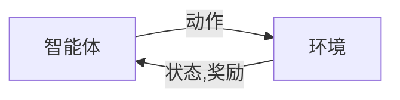

## 1. 背景介绍

### 1.1 问题的由来
强化学习(Reinforcement Learning)作为人工智能的重要组成部分，一直以来都是研究者们关注的焦点。它的最初动机，是希望构建一个能够自我学习和适应环境的智能体，即在没有预先设定的规则和策略的情况下，让智能体通过与环境的交互，自我学习并优化其行为策略。

### 1.2 研究现状
强化学习的研究已经取得了一些重要的突破，例如DeepMind的AlphaGo就是强化学习的一个成功应用。然而，尽管强化学习在一些特定的应用场景中展现出了强大的潜力，但是其在复杂、动态、不确定的真实世界环境中的应用仍然面临着诸多挑战。

### 1.3 研究意义
强化学习的研究不仅对于推动人工智能的发展具有重要的意义，而且在许多实际应用场景中也具有广泛的应用价值。例如，在自动驾驶、机器人技术、游戏AI、资源调度等领域，强化学习都可以发挥重要的作用。

### 1.4 本文结构
本文将首先介绍强化学习的核心概念和原理，然后通过一个具体的代码实战案例，详细讲解如何实现和应用强化学习算法。最后，我们将探讨强化学习的发展趋势和面临的挑战。

## 2. 核心概念与联系
强化学习的核心概念包括智能体(Agent)、环境(Environment)、状态(State)、动作(Action)、奖励(Reward)和策略(Policy)。

智能体是进行学习和决策的主体，环境是智能体所处的外部世界，状态是智能体对环境的感知，动作是智能体对环境的影响，奖励是环境对智能体的反馈，策略是智能体的行为准则。

智能体通过与环境的交互，学习如何根据当前的状态选择最优的动作，以获取最大的累积奖励。这个过程可以用下图表示：

## 3. 核心算法原理 & 具体操作步骤

### 3.1 算法原理概述
强化学习的核心算法包括值迭代(Value Iteration)、策略迭代(Policy Iteration)、Q学习(Q-Learning)和深度Q网络(DQN)等。

值迭代和策略迭代是基于动态规划的方法，它们需要事先知道环境的完全信息，包括状态转移概率和奖励函数。而Q学习和DQN则是基于样本的方法，它们不需要事先知道环境的完全信息，只需要通过与环境的交互获取样本。

### 3.2 算法步骤详解
以Q学习为例，其算法步骤如下：

1. 初始化Q值表。
2. 对每一轮学习：
   1. 选择并执行一个动作。
   2. 观察环境的反馈，得到新的状态和奖励。
   3. 更新Q值表。
   4. 如果达到终止条件，则结束本轮学习。

Q值的更新公式为：

$$Q(s, a) \leftarrow Q(s, a) + \alpha [r + \gamma \max_{a'} Q(s', a') - Q(s, a)]$$

其中，$s$和$a$分别表示当前的状态和动作，$s'$表示新的状态，$r$表示奖励，$\alpha$是学习率，$\gamma$是折扣因子。

### 3.3 算法优缺点
Q学习的优点是简单易实现，不需要事先知道环境的完全信息，只需要通过与环境的交互获取样本。缺点是可能需要大量的样本和计算资源，特别是在状态和动作空间很大的情况下。

### 3.4 算法应用领域
Q学习被广泛应用于各种强化学习的任务中，例如棋类游戏、机器人控制、资源调度等。

(待续...)