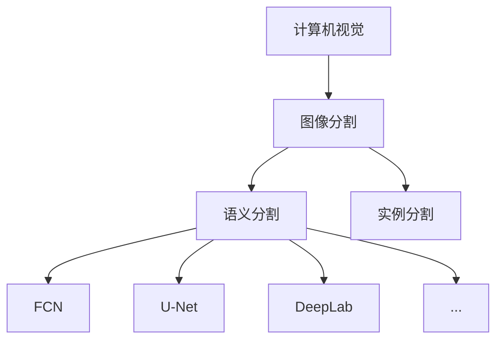
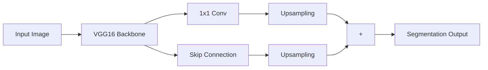

# Semantic Segmentation原理与代码实例讲解

## 1. 背景介绍
### 1.1 问题的由来
随着人工智能技术的快速发展,计算机视觉领域取得了令人瞩目的成就。其中,图像语义分割(Semantic Segmentation)作为计算机视觉的一个重要分支,在无人驾驶、医学影像分析、虚拟现实等诸多领域有着广泛的应用前景。

语义分割旨在对图像中的每个像素进行分类,预测它们所属的类别,从而实现对图像的像素级理解。与传统的图像分类和目标检测任务不同,语义分割能够获取图像中对象的精确轮廓和位置信息,对场景有更加细粒度的感知。

### 1.2 研究现状
近年来,深度学习的崛起极大地推动了语义分割技术的进步。从早期的全卷积网络(FCN)到后来的U-Net、SegNet、DeepLab系列等,研究者们提出了一系列性能卓越的语义分割模型。这些模型在Pascal VOC、Cityscapes、COCO等标准数据集上取得了state-of-the-art的表现。

然而,语义分割仍然面临着诸多挑战:

1. 像素级标注的获取需要大量的人力成本,高质量的训练数据匮乏。
2. 模型的泛化能力有待进一步提升,对复杂场景和小目标的分割效果有待改进。
3. 推理速度和资源占用问题制约了语义分割在资源受限平台上的应用。

### 1.3 研究意义
语义分割作为场景理解的关键技术,其研究进展将为多个领域带来变革性的影响:

1. 在无人驾驶领域,精准的道路和障碍物分割是实现安全自动驾驶的前提。
2. 医学影像分析中,语义分割可以辅助医生进行病灶区域的定位和测量,提高诊断效率。
3. 虚拟/增强现实场景中,语义分割是实现虚实融合的重要手段。

可以预见,语义分割技术的发展将为人类认知世界、改变生活带来深远的影响。

### 1.4 本文结构
本文将全面介绍语义分割的原理和代码实践。内容安排如下:

- 第2部分: 介绍语义分割的核心概念与关键技术
- 第3部分: 详细讲解主流语义分割算法的原理和步骤
- 第4部分: 建立语义分割的数学模型,并通过公式推导和案例分析加以说明
- 第5部分: 基于Python和PyTorch,完成一个语义分割项目的代码实践
- 第6部分: 探讨语义分割技术的实际应用场景及未来趋势
- 第7部分: 推荐语义分割的学习资源、开发工具和相关论文
- 第8部分: 总结全文,展望语义分割的发展方向和挑战
- 第9部分: 附录,解答语义分割的常见问题

## 2. 核心概念与联系
在正式介绍语义分割算法之前,我们有必要明确几个核心概念:

**图像分割(Image Segmentation)**: 将图像划分为若干个特定区域的过程,这些区域在语义上有一定的相关性,如属于同一个物体或背景。图像分割是计算机视觉的经典任务之一。

**语义分割(Semantic Segmentation)**: 图像分割的一个子任务,旨在将图像的每个像素划分到预定义的类别中。预测结果通常以掩码(mask)的形式表示,不同的类别对应不同的颜色。

**实例分割(Instance Segmentation)**: 在语义分割的基础上,进一步区分同一类别的不同个体。实例分割不仅预测每个像素的类别,还能识别出不同的个体实例。

语义分割与其他几个概念的关系如下图所示:

由图可见,语义分割是图像分割任务的细分,而图像分割又隶属于计算机视觉的范畴。FCN、U-Net、DeepLab等都是语义分割任务的代表性算法。

## 3. 核心算法原理 & 具体操作步骤
### 3.1 算法原理概述
传统的语义分割算法主要基于手工设计的特征,如颜色、纹理、SIFT等,再通过随机森林、条件随机场(CRF)等方法进行分类。这类方法依赖复杂的特征工程,泛化能力有限。

近年来,基于深度学习的语义分割算法逐渐成为主流。这类方法以端到端的方式学习分割特征,不再需要手工设计,极大地提升了性能。总的来说,深度学习语义分割网络由以下几个关键模块组成:

1. **骨干网络(Backbone)**: 用于提取图像的多尺度特征,通常采用预训练的分类网络,如ResNet、Xception等。

2. **上采样模块(Upsampling)**: 将骨干网络提取的特征图上采样到原始分辨率,恢复空间细节。代表性方法有反卷积、双线性插值等。

3. **跳跃连接(Skip Connection)**: 将编码器浅层的高分辨率特征与解码器的上采样特征融合,兼顾分割的语义信息和空间细节。

4. **多尺度特征融合**: 融合不同感受野的特征图,提升对不同尺度目标的适应性。常见的方法有空洞卷积(Dilated Convolution)、金字塔池化(Pyramid Pooling)等。

5. **辅助损失(Auxiliary Loss)**: 在网络的中间层添加辅助分类器,引入深层监督,加速收敛和提升性能。

### 3.2 算法步骤详解
下面我们以经典的语义分割网络FCN为例,详细讲解其算法步骤:

**Step1**: 选择一个预训练的分类网络作为骨干网络,如VGG16。去掉网络最后的全连接层,只保留卷积层和池化层。

**Step2**: 将骨干网络的最后一个池化层替换为1x1卷积,将通道数映射到类别数。得到粗糙的分割结果。

**Step3**: 对粗糙的分割结果进行上采样,将空间分辨率恢复到原始大小。FCN采用反卷积完成上采样。

**Step4**: 引入跳跃连接,将骨干网络中间层的特征图上采样后,与Step3的结果相加,得到融合的分割预测。

**Step5**: 计算分割预测与真值标签的像素级交叉熵损失,并进行端到端的反向传播训练。

**Step6**: 测试时,对图像进行一次前向传播,得到每个像素的类别概率,取概率最大的类别作为最终的分割结果。

FCN的网络结构如下图所示:

### 3.3 算法优缺点
FCN开创了端到端学习语义分割的先河,具有如下优点:

1. 采用全卷积结构,可以接受任意大小的输入图像,具有很好的灵活性。
2. 引入跳跃连接,在提高分割精度的同时兼顾了空间细节。
3. 端到端训练,无需复杂的后处理,简化了训练流程。

但FCN也存在一些不足:

1. 上采样过程中存在信息损失,对小目标和细节的刻画能力有限。
2. 没有考虑像素间的关联性,分割结果容易出现断裂和空洞。
3. 对不同尺度目标的适应性不足,容易漏检小目标。

后续的研究工作针对FCN的缺陷进行了改进,如采用编码器-解码器结构、引入空洞卷积、使用条件随机场后处理等,不断推动着语义分割性能的提升。

### 3.4 算法应用领域
FCN是语义分割领域的开山之作,其思想启发了一系列后续的研究工作。FCN及其变体被广泛应用于以下领域:

1. 无人驾驶:道路和车辆的分割
2. 遥感影像:土地利用分类
3. 医学影像:器官和病变区域的分割
4. 虚拟/增强现实:背景抠图和虚实融合
5. 人机交互:手势识别和人体解析

## 4. 数学模型和公式 & 详细讲解 & 举例说明
语义分割可以形式化地描述为一个像素级分类问题。给定一张输入图像 $\mathbf{I} \in \mathbb{R}^{H \times W \times 3}$,其中 $H$和$W$分别表示图像的高度和宽度,语义分割旨在预测一张与之对应的分割掩码 $\mathbf{M} \in \mathbb{R}^{H \times W \times C}$,其中$C$为类别数。$\mathbf{M}$中的每个元素 $m_{ij}$ 表示像素$(i,j)$属于各个类别的概率。

### 4.1 数学模型构建
我们用 $f_{\theta}$ 表示参数为 $\theta$ 的语义分割网络,则分割过程可以表示为:

$$
\mathbf{M} = f_{\theta}(\mathbf{I})
$$

其中,分割网络 $f_{\theta}$ 可以进一步分解为编码器 $g_{\phi}$ 和解码器 $h_{\psi}$ 两部分:

$$
f_{\theta}(\mathbf{I}) = h_{\psi}(g_{\phi}(\mathbf{I}))
$$

编码器 $g_{\phi}$ 将输入图像映射到一个低维的特征空间,解码器 $h_{\psi}$ 再将特征映射回原始分辨率,得到分割结果。

网络的训练过程就是求解最优参数 $\theta^{*}$ 使得预测的分割掩码 $\mathbf{M}$ 与真值掩码 $\mathbf{\hat{M}}$ 尽可能接近:

$$
\theta^{*} = \arg\min_{\theta} \mathcal{L}(\mathbf{M},\mathbf{\hat{M}})
$$

其中 $\mathcal{L}$ 为损失函数,常用的有交叉熵损失、Dice损失等。

### 4.2 公式推导过程
以交叉熵损失为例,我们推导语义分割网络的损失函数。对于第 $k$ 类,像素 $(i,j)$ 的交叉熵损失定义为:

$$
\ell_{ij}^{(k)} = -\hat{y}_{ij}^{(k)} \log y_{ij}^{(k)}
$$

其中 $\hat{y}_{ij}^{(k)} \in {0,1}$ 表示该像素是否属于第 $k$ 类的真值标签, $y_{ij}^{(k)}$ 表示网络预测该像素属于第 $k$ 类的概率。

对所有像素和所有类别求和,得到整张图像的交叉熵损失:

$$
\mathcal{L}_{ce} = -\frac{1}{HW} \sum_{i=1}^{H} \sum_{j=1}^{W} \sum_{k=1}^{C} \hat{y}_{ij}^{(k)} \log y_{ij}^{(k)}
$$

为了平衡不同类别之间的比例,我们可以为每个类别引入权重系数 $w_k$,得到加权交叉熵损失:

$$
\mathcal{L}_{wce} = -\frac{1}{HW} \sum_{i=1}^{H} \sum_{j=1}^{W} \sum_{k=1}^{C} w_k \hat{y}_{ij}^{(k)} \log y_{ij}^{(k)}
$$

其中权重 $w_k$ 可以根据类别频率的倒数进行设置,以缓解类别不平衡问题。

### 4.3 案例分析与讲解
下面我们以一个简单的二类语义分割任务为例,演示损失函数的计算过程。假设输入图像的尺寸为 $3 \times 3$,类别数为2。网络预测的