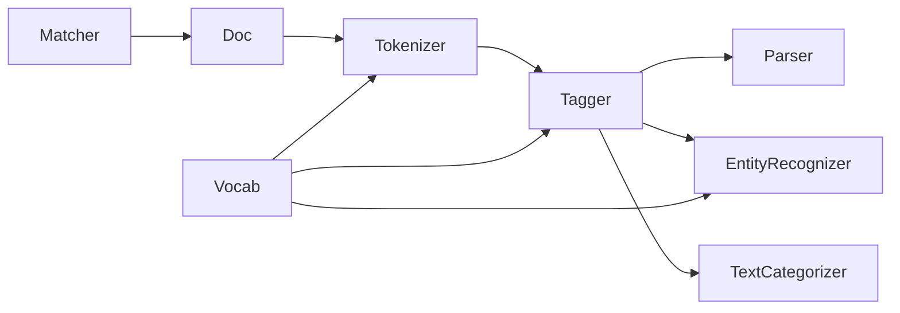

# Spacy 原理与代码实战案例讲解

## 1. 背景介绍
### 1.1 问题的由来
随着自然语言处理(NLP)技术的不断发展,对文本数据进行高效、准确地处理和分析变得越来越重要。无论是学术研究还是工业应用,都需要强大的NLP工具来支撑。而Spacy作为一个先进的自然语言处理库,以其高性能、易用性和丰富的功能,在NLP领域备受青睐。

### 1.2 研究现状
目前,自然语言处理领域的研究热点主要集中在以下几个方面:

1. 语言模型预训练,如BERT、GPT等;
2. 知识图谱与信息抽取;  
3. 机器翻译;
4. 对话系统;
5. 情感分析等。

而Spacy在这些研究方向上都有广泛的应用,特别是在工业界,Spacy以其高效的性能和友好的接口,成为了许多NLP项目的首选工具库。

### 1.3 研究意义
深入研究Spacy的原理和应用,对于推动自然语言处理技术的发展具有重要意义:

1. 有助于理解先进NLP工具的内部机制,启发新的算法思路;
2. 促进NLP技术在各领域的应用,提高文本数据处理和分析的效率;
3. 为构建更加智能化的语言模型和对话系统奠定基础。

### 1.4 本文结构
本文将从以下几个方面对Spacy进行深入探讨:

1. 介绍Spacy的核心概念与组件之间的联系;  
2. 剖析Spacy的核心算法原理,并给出具体操作步骤;
3. 构建Spacy所基于的数学模型,推导关键公式,并举例说明;
4. 通过代码实例,讲解Spacy的实际应用;
5. 分析Spacy在实际场景中的应用案例;
6. 推荐Spacy相关的学习资源、开发工具等;
7. 总结Spacy的研究现状,展望其未来发展方向和挑战;
8. 梳理Spacy学习和应用过程中的常见问题,给出解答思路。

## 2. 核心概念与联系
Spacy的整体架构由以下几个核心概念和组件构成:

- Doc:文本处理的基本单元,包含了原始文本及其语言注释。
- Vocab:存储语料库中所有单词的词典。
- Tokenizer:将文本拆分成Token序列的组件。
- Tagger:对Token进行词性标注。 
- Parser:对Token序列进行依存句法分析。
- EntityRecognizer:命名实体识别组件。
- TextCategorizer:文本分类组件。
- Matcher:基于规则的短语匹配器。

这些组件相互配合,构成了Spacy的文本处理流水线(Pipeline),对输入文本进行分词、词性标注、命名实体识别、依存句法分析、文本分类等一系列处理,最终输出结构化的文本信息。

其中,Doc贯穿整个处理流程,承载了文本在各个处理阶段的结果数据。Vocab为各组件提供词典支持。Tokenizer、Tagger、Parser、EntityRecognizer等组件则分别完成不同的文本分析任务。它们既可以单独使用,也可以灵活组合,形成定制化的文本处理流水线。

下图展示了Spacy的核心组件之间的关系:



## 3. 核心算法原理 & 具体操作步骤
### 3.1 算法原理概述
Spacy采用了统计学习和深度学习相结合的混合策略,其核心算法包括:

1. 基于规则的分词算法
2. 平均感知机词性标注算法
3. 转移系统依存句法分析算法
4. 卷积神经网络命名实体识别算法
5. 文本分类算法

这些算法在准确性和效率上进行了优化,使得Spacy能够快速处理大规模文本数据。

### 3.2 算法步骤详解
以下详细讲解Spacy Pipeline中几个关键步骤的算法实现:

#### 3.2.1 分词
Spacy使用了基于规则的分词算法,具体步骤如下:

1. 将文本按空白字符预分割为初始Token序列
2. 根据预定义的前缀、中缀、后缀规则,合并初始Token,生成新的Token
3. 处理特殊情况,如数字、标点、URL等

分词后得到Doc对象,包含Token序列。

#### 3.2.2 词性标注
Spacy采用平均感知机算法进行词性标注,步骤如下:

1. 提取Token的特征,如词本身、前后Token、前缀后缀等
2. 将特征向量输入感知机模型,计算各词性的得分
3. 选择得分最高的词性作为标注结果
4. 利用正确标注更新感知机权重,迭代优化

#### 3.2.3 依存句法分析
Spacy使用转移系统进行依存句法分析,通过一系列转移动作构建依存树,步骤如下:

1. 初始化状态,包括词栈、缓冲区、依存弧集合
2. 根据当前状态提取特征
3. 将特征输入分类器,预测下一步转移动作
4. 执行预测的转移,更新状态
5. 重复2-4,直到达到终止状态,得到完整的依存树

#### 3.2.4 命名实体识别
Spacy使用卷积神经网络进行命名实体识别,步骤如下:

1. 将Token映射为词向量
2. 使用CNN提取局部特征
3. 通过Dense层计算各实体类型的概率
4. 选择概率最大的实体类型作为标注结果

### 3.3 算法优缺点
Spacy的算法具有以下优点:

1. 规则与统计相结合,在准确性和效率上达到了很好的平衡
2. 采用了成熟的机器学习算法,如平均感知机、卷积神经网络等
3. 算法实现高度优化,速度极快

但同时也存在一些局限:

1. 规则分词对语言的适应性有限
2. 部分任务如句法分析,对长句的处理效果有待提高  
3. 预训练模型主要针对英文,其他语言的支持有待加强

### 3.4 算法应用领域
Spacy的算法在以下领域有广泛应用:

1. 信息抽取,如关键词提取、实体识别等
2. 文本分类与情感分析
3. 句法分析与语义角色标注
4. 机器翻译的预处理
5. 知识图谱构建
6. 问答系统、对话系统等

## 4. 数学模型和公式 & 详细讲解 & 举例说明
### 4.1 数学模型构建
Spacy中用到的主要数学模型包括:

#### 4.1.1 平均感知机模型
平均感知机是一种在线学习的线性分类器,其数学模型为:

$$
f(x)=sign(w \cdot x + b)
$$

其中,$w$为权重向量,$b$为偏置项,$sign$为符号函数。

训练时,对于每个样本$(x_i,y_i)$,按照以下规则更新权重:

$$
w \leftarrow w + \eta (y_i - \hat{y_i}) x_i
$$

其中,$\eta$为学习率,$\hat{y_i}$为预测值。

#### 4.1.2 卷积神经网络模型
卷积神经网络由若干卷积层、池化层和全连接层组成,其前向传播过程可以表示为:

$$
h_i = f(W_i * x_{i-1} + b_i)
$$

其中,$h_i$为第$i$层的输出,$W_i$为卷积核,$*$为卷积操作,$b_i$为偏置项,$f$为激活函数,如ReLU:

$$
ReLU(x) = max(0, x)
$$

### 4.2 公式推导过程
以下推导平均感知机的权重更新公式。

假设当前权重为$w$,对于样本$(x_i,y_i)$,模型的预测值为:

$$
\hat{y_i} = sign(w \cdot x_i + b)
$$

定义损失函数为预测值与真实值之差:

$$
L_i(w) = (y_i - \hat{y_i})^2
$$

对损失函数求梯度:

$$
\nabla L_i(w) = -2(y_i - \hat{y_i})x_i
$$

根据梯度下降法,权重更新公式为:

$$
w \leftarrow w - \eta \nabla L_i(w) = w + 2\eta (y_i - \hat{y_i}) x_i
$$

通常取$\eta=\frac{1}{2}$,即得到感知机的权重更新公式:

$$
w \leftarrow w + (y_i - \hat{y_i}) x_i
$$

### 4.3 案例分析与讲解
下面以一个简单的词性标注任务为例,说明平均感知机算法的应用。

假设词性标注任务的标签集合为{NN, VB, JJ, RB},输入句子为"I love this movie very much",正确的标注为"I/NN love/VB this/JJ movie/NN very/RB much/RB"。

首先,提取词的特征,例如:

- I: 词本身=I, 前缀=I, 后缀=I, 长度=1
- love: 词本身=love, 前缀=l, 后缀=ove, 长度=4
- this: 词本身=this, 前缀=th, 后缀=is, 长度=4
- movie: 词本身=movie, 前缀=m, 后缀=vie, 长度=5  
- very: 词本身=very, 前缀=v, 后缀=ry, 长度=4
- much: 词本身=much, 前缀=m, 后缀=ch, 长度=4

然后,对每个词,将其特征向量输入感知机模型,计算各词性的得分。以"love"为例,假设其特征向量为$x_i$,当前感知机权重为$w$,则"love"的各词性得分为:

- NN: $w_{NN} \cdot x_i$
- VB: $w_{VB} \cdot x_i$  
- JJ: $w_{JJ} \cdot x_i$
- RB: $w_{RB} \cdot x_i$

选择得分最高的词性VB作为"love"的标注结果。

最后,将预测标注与正确标注进行比较,利用误差更新感知机权重。例如,如果"movie"被误标注为VB,则更新权重:

$$
w_{NN} \leftarrow w_{NN} + x_{movie} \\
w_{VB} \leftarrow w_{VB} - x_{movie}
$$

通过多轮迭代,感知机模型不断优化,最终可以较准确地完成词性标注任务。

### 4.4 常见问题解答
**Q: 平均感知机和一般感知机有何区别?**

A: 一般感知机在每个样本上更新权重后即丢弃,而平均感知机记录每次迭代的权重,最后取其平均值作为最终模型,因此更加稳定,泛化性能更好。

**Q: 卷积神经网络相比其他模型,在命名实体识别任务上有何优势?**

A: 卷积神经网络能够自动提取词汇的局部特征,挖掘词之间的关联模式,无需复杂的特征工程,因此在命名实体识别任务上表现出色。同时CNN具有并行计算能力,训练和预测速度很快。

## 5. 项目实践：代码实例和详细解释说明
### 5.1 开发环境搭建
首先,安装Spacy库:

```bash
pip install spacy
```

然后,下载预训练模型,这里以英文模型为例:

```bash
python -m spacy download en_core_web_sm
```

### 5.2 源代码详细实现
下面通过Python代码,演示Spacy的基本用法。

#### 5.2.1 分词与词性标注

```python
import spacy

# 加载预训练模型
nlp = spacy.load("en_core_web_sm")

# 待处理文本
text = "Apple is looking at buying U.K. startup for $1 billion."

# 创建Doc对象
doc = nlp(text)

# 打印分词及词性标注结果
for token in doc:
    print(token.text, token.pos_)
```

输出结果为:

```
Apple PROPN
is AUX