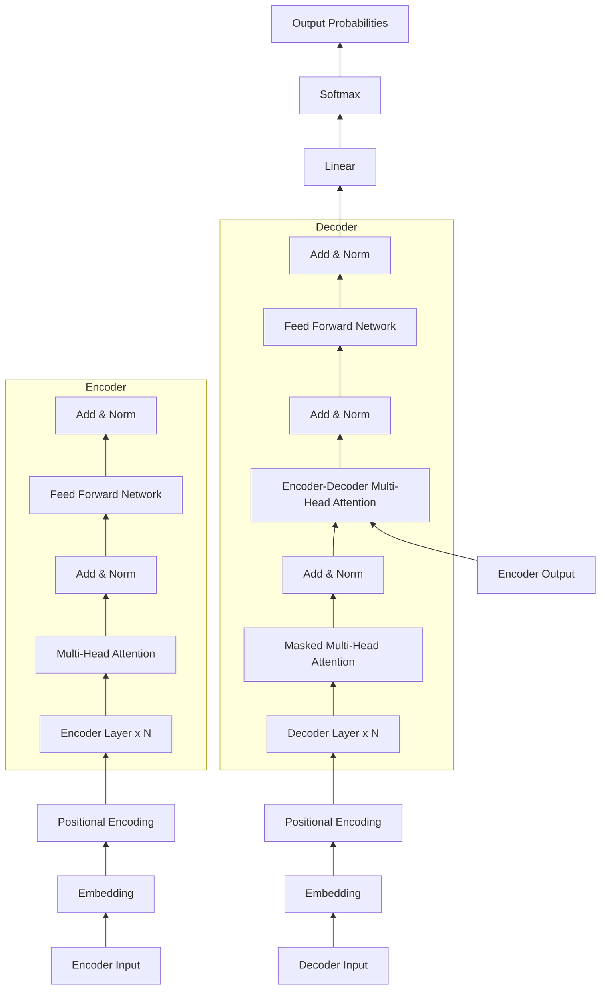

# Transformer 原理与代码实战案例讲解

## 1. 背景介绍
### 1.1 问题的由来
近年来，随着深度学习的蓬勃发展，自然语言处理(NLP)领域取得了突飞猛进的进展。然而，传统的循环神经网络(RNN)和长短期记忆网络(LSTM)在处理长序列数据时存在梯度消失和梯度爆炸等问题，限制了模型的性能。为了克服这些挑战，Google于2017年提出了Transformer模型[1]，引入了自注意力机制(Self-Attention)和位置编码(Positional Encoding)，实现了并行计算和长程依赖捕获，大大提升了模型的训练效率和性能表现。

### 1.2 研究现状 
自Transformer模型问世以来，其在机器翻译、文本摘要、情感分析等NLP任务上取得了state-of-the-art的表现，引发了学术界和工业界的广泛关注。众多研究者在Transformer的基础上进行了改进和扩展，如BERT[2]引入了双向编码器表示，进一步提升了模型的理解能力；GPT系列[3]利用Transformer的解码器实现了大规模语言模型的预训练，在文本生成任务上取得了瞩目的成绩。同时，Transformer的思想也被引入到计算机视觉、语音识别等其他领域，展现出了广阔的应用前景。

### 1.3 研究意义
深入理解Transformer的原理和实现细节，对于掌握现代NLP技术具有重要意义。一方面，Transformer已成为当前主流的NLP模型架构，其核心思想对后续的模型设计产生了深远影响。另一方面，Transformer的代码实现涉及到诸多细节，如多头注意力、残差连接、层归一化等，熟练掌握这些技巧有助于提升个人的编程和调试能力。此外，Transformer强大的建模能力为NLP应用开辟了新的可能性，深入研究其原理和应用，有望推动人工智能在更广泛领域的发展。

### 1.4 本文结构
本文将围绕Transformer模型展开详细讨论，内容涵盖以下几个方面：

1. Transformer的核心概念与模块间的联系
2. 自注意力机制和位置编码的算法原理与实现步骤
3. Transformer的数学建模与公式推导
4. 基于PyTorch的Transformer代码实战
5. Transformer在机器翻译等实际场景中的应用
6. Transformer相关的学习资源和开发工具推荐
7. Transformer的研究现状总结与未来发展趋势展望

通过系统性的讲解和实践，希望读者能够全面掌握Transformer的原理和实现，为进一步探索NLP领域的前沿技术打下坚实基础。

## 2. 核心概念与联系
Transformer模型的核心是自注意力机制和位置编码，它们分别解决了传统序列模型的两个痛点：

1. **自注意力机制(Self-Attention)**：传统的RNN/LSTM模型是顺序处理输入序列的，难以并行化，计算效率较低。自注意力机制引入了查询(Query)、键(Key)、值(Value)的概念，通过计算序列中各个位置之间的相关性，实现了并行计算，大大提升了训练速度。同时，自注意力可以捕获长距离依赖，更好地建模全局信息。

2. **位置编码(Positional Encoding)**：与RNN/LSTM不同，Transformer抛弃了循环结构，完全依赖于注意力机制进行特征提取。然而，这导致模型丢失了序列的位置信息。为了引入位置信息，Transformer使用了位置编码，通过在输入向量中加入表示位置的向量，使模型能够区分不同位置的词。

除了以上两个核心概念，Transformer还使用了以下技术：

- **多头注意力(Multi-Head Attention)**：将输入进行多次线性变换，生成多组查询/键/值向量，分别进行注意力计算，再将结果拼接起来。这种机制增强了模型的表示能力，可以从不同的子空间捕捉序列的多样化特征。

- **残差连接(Residual Connection)**：在每个子层(Self-Attention, Feed Forward)之后，将输入与输出相加。这种短路连接有助于梯度的反向传播，缓解了深层网络的优化难题。

- **层归一化(Layer Normalization)**：在残差连接之后，对神经元的激活值进行归一化，使其均值为0，方差为1。这种自适应的归一化方式可以加速模型收敛，提高训练稳定性。

- **前馈神经网络(Feed Forward Network)**：在Self-Attention之后，使用两层全连接网络对特征进行非线性变换，增强了模型的表达能力。

- **Mask机制**：在解码器的Self-Attention中，使用Mask矩阵防止模型获取未来的信息，保证了生成过程的自回归性。在Encoder-Decoder Attention中，使用Padding Mask过滤掉填充的无效token。

下图展示了Transformer模型的整体架构，各个模块之间的联系一目了然：

## 3. 核心算法原理 & 具体操作步骤

### 3.1 算法原理概述

Transformer的核心是自注意力机制和位置编码，下面分别进行介绍：

**自注意力机制**：
自注意力机制的目的是学习序列内部的依赖关系，捕获长程上下文信息。具体来说，对于输入序列的每个位置，通过与其他位置的相似度计算，得到一个注意力分布，然后根据这个分布对序列进行加权求和，得到该位置的新表示。

假设输入序列为 $X \in \mathbb{R}^{n \times d}$，其中 $n$ 为序列长度，$d$ 为特征维度。自注意力机制首先对 $X$ 进行三次线性变换，得到查询矩阵 $Q$、键矩阵 $K$ 和值矩阵 $V$：

$$
\begin{aligned}
Q &= XW^Q \\
K &= XW^K \\
V &= XW^V
\end{aligned}
$$

其中，$W^Q, W^K, W^V \in \mathbb{R}^{d \times d_k}$ 为可学习的参数矩阵，$d_k$ 为缩放维度。

然后，计算查询矩阵和键矩阵的点积，得到注意力分布：

$$
A = \text{softmax}(\frac{QK^T}{\sqrt{d_k}})
$$

其中，$A \in \mathbb{R}^{n \times n}$ 为注意力矩阵，$\sqrt{d_k}$ 为缩放因子，用于控制点积的方差。

最后，将注意力矩阵与值矩阵相乘，得到输出表示：

$$
\text{Attention}(Q, K, V) = AV
$$

上述过程可以并行计算，时间复杂度为 $O(n^2d)$。

**位置编码**：
由于自注意力机制是无序的，无法捕获序列的位置信息。为了引入位置信息，Transformer使用了位置编码。

位置编码是一个与输入序列等长的向量序列，通过将其与输入嵌入相加，使模型能够区分不同位置的词。Transformer中使用的是正余弦位置编码，公式如下：

$$
\begin{aligned}
PE_{(pos, 2i)} &= \sin(pos / 10000^{2i/d}) \\
PE_{(pos, 2i+1)} &= \cos(pos / 10000^{2i/d})
\end{aligned}
$$

其中，$pos$ 为位置索引，$i$ 为维度索引，$d$ 为嵌入维度。

将位置编码与输入嵌入相加，即可得到最终的输入表示：

$$
X_{input} = X_{embed} + PE
$$

### 3.2 算法步骤详解

结合上述原理，Transformer的编码器和解码器的具体实现步骤如下：

**编码器**：
1. 输入序列通过嵌入层和位置编码，得到初始表示 $X_{input} \in \mathbb{R}^{n \times d}$。
2. 对 $X_{input}$ 进行多头自注意力计算，得到新的表示 $X_{attn}$。
   - 将 $X_{input}$ 分别输入三个线性层，得到 $Q, K, V$。
   - 将 $Q, K, V$ 分割为 $h$ 个头，每个头的维度为 $d_k = d / h$。
   - 对每个头并行计算注意力，得到 $h$ 个输出矩阵。
   - 将 $h$ 个输出矩阵拼接，再通过一个线性层，得到 $X_{attn}$。
3. 将 $X_{attn}$ 与 $X_{input}$ 相加，再通过层归一化，得到 $X_{norm1}$。
4. 将 $X_{norm1}$ 通过两层前馈神经网络，再与 $X_{norm1}$ 相加，得到 $X_{norm2}$。
5. 重复步骤2-4，叠加 $N$ 个编码器层，得到最终的编码器输出 $X_{enc}$。

**解码器**：
1. 目标序列通过嵌入层和位置编码，得到初始表示 $Y_{input} \in \mathbb{R}^{m \times d}$。
2. 对 $Y_{input}$ 进行masked多头自注意力计算，得到新的表示 $Y_{attn1}$。
   - Mask的作用是防止解码器获取未来的信息，保证生成过程的自回归性。
3. 将 $Y_{attn1}$ 与编码器输出 $X_{enc}$ 进行多头注意力计算，得到 $Y_{attn2}$。
4. 将 $Y_{attn2}$ 通过两层前馈神经网络，再与 $Y_{attn2}$ 相加，得到 $Y_{norm2}$。
5. 重复步骤2-4，叠加 $N$ 个解码器层，得到最终的解码器输出 $Y_{dec}$。
6. 将 $Y_{dec}$ 通过线性层和softmax层，得到下一个token的概率分布。

### 3.3 算法优缺点

Transformer相比传统的RNN/LSTM模型，具有以下优点：
1. 并行计算：自注意力机制可以并行计算，大大提升了训练和推理速度。
2. 长程依赖：自注意力机制可以直接建模任意两个位置之间的依赖关系，更好地捕获长距离信息。
3. 参数高效：Transformer抛弃了循环连接，参数量相对较少，更易于优化。
4. 可解释性：注意力分布可以直观地反映输入序列之间的关联强度，提高了模型的可解释性。

同时，Transformer也存在一些局限性：
1. 计算复杂度：自注意力机制的时间和空间复杂度均为 $O(n^2)$，对长序列的处理效率较低。
2. 位置编码：Transformer依赖人工设计的位置编码来引入位置信息，缺乏灵活性。
3. 预训练难度：相比BERT等模型，Transformer在预训练阶段需要更大的数据量和计算资源。

### 3.4 算法应用领域

Transformer已成为NLP领域的主流模型架构，广泛应用于以下任务：

1. 机器翻译：Transformer是最早应用于机器翻译任务的，如Google的Neural Machine Translation系统。
2. 文本生成：GPT系列模型基于Transformer的解码器，可用于对话生成、文章写作等任务。
3. 语义理解：BERT等模型在预训练