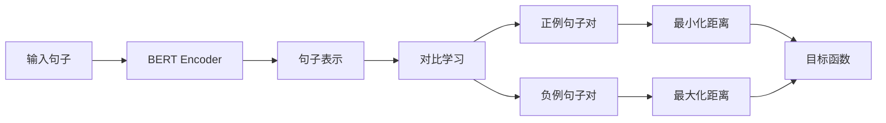

# Transformer大模型实战 用Sentence-BERT模型生成句子特征

## 1. 背景介绍
### 1.1  问题的由来
随着自然语言处理(NLP)技术的快速发展,如何有效地表示句子语义一直是NLP领域的重要研究课题。传统的词袋(Bag-of-Words)、TF-IDF等方法虽然简单高效,但无法捕捉词序关系和句法结构,导致语义表示能力有限。近年来,深度学习的兴起为这一问题带来了新的解决思路。特别是Transformer[1]模型的出现,极大地推动了预训练语言模型的发展,使得NLP任务的性能不断刷新记录。

### 1.2  研究现状
目前,基于Transformer的预训练语言模型已经成为NLP领域的主流技术。谷歌的BERT[2]、OpenAI的GPT系列[3]、Facebook的RoBERTa[4]等模型相继问世,在多个NLP任务上取得了state-of-the-art的结果。这些模型通过在大规模无监督语料上进行预训练,可以学习到丰富的语言知识,再通过fine-tuning的方式应用到下游任务中。

然而,大多数预训练语言模型的目标函数是基于单词或字符级别的语言建模,如Masked Language Model和Next Sentence Prediction等,并没有直接优化句子级别的语义表示。为了进一步提升句子表示的质量,一些研究者提出了面向句子级任务的预训练模型,如Sentence-BERT[5]、SimCSE[6]等。这些模型在通用的语言模型的基础上,引入了句子对比学习(Contrastive Learning)的思想,通过最大化正例句子对的相似度和最小化负例句子对的相似度,从而学习到更加鲁棒和有判别力的句子表示。

### 1.3  研究意义
高质量的句子表示在许多NLP任务中发挥着至关重要的作用,如文本分类、文本匹配、信息检索、机器翻译、自动问答等。传统的句子表示方法,如词袋模型、Word2Vec的句子平均等,虽然简单直观,但无法很好地刻画句子的语义信息。而基于Transformer的句子表示模型克服了这些缺陷,可以学习到更加准确、细粒度的语义表示。这不仅可以提升各类NLP任务的性能,还为句子级别的语义理解和推理铺平了道路。

### 1.4  本文结构
本文将重点介绍Sentence-BERT模型的原理和实现。第2节阐述了Sentence-BERT的核心概念和模型结构。第3节详细讲解了Sentence-BERT的训练算法和步骤。第4节给出了模型涉及的数学公式和案例分析。第5节展示了Sentence-BERT的代码实现和效果演示。第6节讨论了Sentence-BERT在实际场景中的应用。第7节总结了相关的学习资源和开发工具。第8节对全文进行了总结,并展望了句子表示技术的未来发展方向。

## 2. 核心概念与联系

Sentence-BERT的核心思想是在BERT等预训练语言模型的基础上,引入句子级别的监督信号,从而得到针对句子语义优化的Transformer编码器。具体来说,它的训练过程包含两个阶段:

(1) 第一阶段是在大规模无监督语料上进行通用语言模型的预训练,学习词法、句法、语义等多层次的语言知识。这一阶段与BERT、RoBERTa等模型相同。

(2) 第二阶段是在带有句子级别标注的数据集上进行fine-tuning。与传统的分类、匹配等任务不同,Sentence-BERT采用了对比学习的范式,通过最小化正例句子对的距离和最大化负例句子对的距离,来学习语义空间中的句子表示。正例句子对通常来自于同一个文档、同一个段落或者标注为语义相似的句子对;而负例句子对则是随机采样得到的不相关句子对。

通过这种方式,Sentence-BERT可以将语义相似的句子映射到向量空间中的邻近区域,而将语义不相关的句子映射到距离较远的区域。这使得句子编码向量可以很好地反映它们之间的语义关系,有利于下游任务的学习和推理。

Sentence-BERT与BERT最大的区别在于,前者引入了句子级别的监督信号,专门用于学习句子表示;而后者主要关注词语和句法结构的建模,对句子语义的建模能力有限。此外,Sentence-BERT去掉了BERT中的Next Sentence Prediction任务,更加聚焦于单个句子的表示学习。

下图展示了Sentence-BERT的总体架构:

## 3. 核心算法原理 & 具体操作步骤
### 3.1  算法原理概述
Sentence-BERT的训练算法本质上是一个基于对比学习的有监督fine-tuning过程。给定一个预训练的BERT编码器,我们的目标是学习一个句子级别的映射函数 $f(·)$,使得语义相似的句子对在映射后的向量空间中距离尽可能小,而不相似的句子对的距离尽可能大。

形式化地,假设我们有一个包含 $N$ 个样本的数据集 $D = {(x_i, y_i)}_{i=1}^N$,其中 $x_i$ 表示第 $i$ 个句子, $y_i$ 表示它对应的语义标签(如所属文档、段落等)。我们希望学习一个映射函数 $f(·)$,使得对于任意一对正例句子 $(x_i, x_j)$,它们的表示向量 $f(x_i)$ 和 $f(x_j)$ 之间的距离最小;而对于任意一对负例句子 $(x_i, x_k)$,它们的表示向量 $f(x_i)$ 和 $f(x_k)$ 之间的距离最大。

这个优化目标可以通过对比损失函数(Contrastive Loss)来实现,即:

$$
L = \sum_{i=1}^N \sum_{j \in P(i)} \max(0, \Vert f(x_i) - f(x_j) \Vert^2 - m_p) + \sum_{i=1}^N \sum_{k \in N(i)} \max(0, m_n - \Vert f(x_i) - f(x_k) \Vert^2)
$$

其中, $P(i)$ 表示与 $x_i$ 构成正例对的句子集合, $N(i)$ 表示与 $x_i$ 构成负例对的句子集合, $m_p$ 和 $m_n$ 分别是正例对和负例对的距离阈值。这个损失函数的含义是,对于每个正例句子对,如果它们的表示向量距离大于 $m_p$,就给出一个惩罚;对于每个负例句子对,如果它们的表示向量距离小于 $m_n$,也给出一个惩罚。通过最小化这个损失函数,模型可以学习到理想的句子表示映射。

### 3.2  算法步骤详解
Sentence-BERT的训练算法可以分为以下几个步骤:

(1) 数据准备:根据任务的需要,准备一个带有句子级别语义标注的数据集。这个数据集可以是人工标注的,也可以是自动构建的(如利用文档结构信息)。对于每个句子,我们需要构建它的正例句子集合和负例句子集合。

(2) 模型初始化:加载一个预训练的BERT模型作为句子编码器的初始参数。我们只需要用到BERT的Transformer Encoder部分,而去掉它顶层的分类和匹配任务。

(3) 句子编码:将输入的句子通过BERT编码器,得到它们的句子级别表示向量。具体地,我们取BERT输出序列中的第一个token(即[CLS]对应的向量)作为整个句子的表示。

(4) 对比学习:根据当前batch中的句子表示,计算正例句子对和负例句子对的表示向量距离,并据此计算对比损失。这里的距离度量一般选用欧氏距离或余弦相似度。

(5) 参数更新:利用反向传播算法计算损失函数对BERT参数的梯度,并使用优化器(如Adam)来更新参数。这个过程重复多个epoch,直到模型收敛。

(6) 模型评估:在验证集或测试集上评估模型的表现。对于句子表示学习任务,常用的评估指标有句子相似度计算、语义文本匹配、句子聚类等。

### 3.3  算法优缺点
Sentence-BERT相比于原始的BERT等模型,在学习句子表示方面有以下优点:

(1) 引入了直接面向句子级别语义的监督信号,使得模型更加关注整个句子的语义,而不是局限于词语级别。

(2) 采用对比学习范式,可以显式地优化句子表示在语义空间上的分布,使得语义相似的句子在向量空间中更加聚集。

(3) 相比于需要精心设计下游任务的fine-tuning方式,对比学习提供了一种更加通用的句子表示学习框架。

(4) 通过预训练语言模型来初始化,Sentence-BERT可以继承BERT学到的丰富语言知识,在此基础上进一步提炼句子语义表示。

当然,Sentence-BERT也存在一些局限性:

(1) 它需要专门构建包含句子级别语义标注的数据集,这对于某些任务可能比较困难或者成本较高。

(2) 对比学习通常需要精心设计正负例采样策略,如何选择合适的正负例对训练效果影响很大。

(3) Sentence-BERT的表示能力仍然受限于底层的预训练语言模型。如果句子包含BERT不能很好建模的语言现象,Sentence-BERT的表示质量也会受到影响。

### 3.4  算法应用领域
得益于其优质的句子表示能力,Sentence-BERT在许多NLP任务中得到了广泛应用,例如:

(1) 语义文本匹配:通过计算两个句子表示向量的相似度,可以判断它们在语义上是否匹配。这可以用于问答系统、对话系统等场景。

(2) 文本分类:将句子表示向量作为分类器的输入特征,可以对句子的类别进行预测。这在情感分析、主题分类等任务中非常有用。

(3) 文本聚类:利用句子表示向量,可以将语料库中语义相似的句子聚集在一起,发现潜在的主题结构。

(4) 信息检索:将查询和文档都映射到同一个语义空间,可以根据它们的表示向量的相似度来排序检索结果。

(5) 机器翻译:将源语言句子和目标语言句子的表示对齐,可以提高翻译模型的效果。

此外,高质量的句子表示对于自然语言推理、关系抽取、自动摘要等任务也有重要意义。

## 4. 数学模型和公式 & 详细讲解 & 举例说明
### 4.1  数学模型构建
Sentence-BERT的核心是将句子映射到一个低维稠密向量空间,并通过向量之间的距离来刻画句子之间的语义关系。形式化地,给定一个句子 $x$,我们希望学习一个映射函数 $f(·)$,将其映射为一个 $d$ 维实向量:

$$
f(x) = (v_1, v_2, ..., v_d) \in \mathbb{R}^d
$$

理想的映射函数应该满足以下性质:对于语义相似的句子 $x_i$ 和 $x_j$,它们的表示 $f(x_i)$ 和 $f(x_j)$ 应该在向量空间中距离很近;而对于语义不相关的句子 $x_i$ 和 $x_k$,它们的表示 $f(x_i)$ 和 $f(x_k)$ 应该在向量空间中距离较远。

为了学习这样的映射函数,Sentence-BERT采用了对比学习的框架。具体地,给定一个训练样本 $(x_i, y_i)