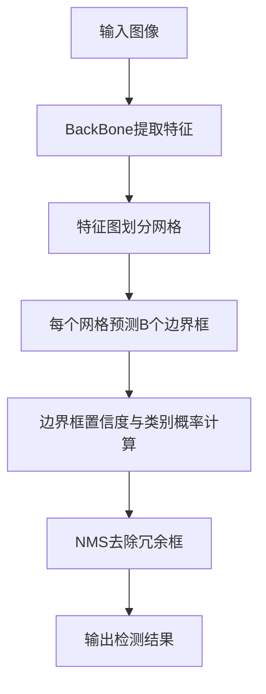

# YOLOv2原理与代码实例讲解

## 1. 背景介绍
### 1.1 问题的由来
目标检测是计算机视觉领域的一个核心问题,旨在从图像或视频中识别和定位感兴趣的目标对象。传统的目标检测方法如HOG+SVM、DPM等,存在速度慢、精度低等问题。近年来,深度学习的兴起为目标检测带来了新的突破,其中YOLO(You Only Look Once)系列算法以其速度快、精度高的优势脱颖而出。

### 1.2 研究现状 
自2015年提出以来,YOLO系列算法经历了v1到v4等多个版本的迭代。其中,YOLOv2作为v1的改进版本,在保持速度优势的同时大幅提升了检测精度,引起了学术界和工业界的广泛关注。目前YOLOv2已被广泛应用于自动驾驶、智慧安防、工业检测等领域。

### 1.3 研究意义
深入理解YOLOv2的原理和实现,对于掌握目标检测的核心技术、把握该领域的最新进展具有重要意义。通过剖析其网络结构、损失函数设计、训练优化策略等,可以为算法改进和创新提供有益启发。同时,相关代码的学习也有助于提升动手实践能力,加深对算法的理解。

### 1.4 本文结构
本文将围绕YOLOv2展开详细讨论。第2部分介绍相关概念；第3部分阐述算法原理；第4部分建立数学模型并推导公式；第5部分通过代码实例讲解其实现；第6部分分析其应用场景；第7部分推荐学习资源；第8部分总结全文并展望未来。

## 2. 核心概念与联系
在讨论YOLOv2之前,有必要先明确几个核心概念：
- 目标检测(Object Detection):给定一张图像或一段视频,识别出其中感兴趣的目标(如人脸、车辆等),并给出它们的类别和位置信息(通常用矩形框表示)。
- 卷积神经网络(CNN):一种常用于图像识别的深度学习模型,通过卷积、池化等操作提取图像特征。YOLO系列算法均基于CNN构建。
- 边界框(Bounding Box):用于定位目标的矩形框,通常由中心坐标(x,y)和宽高(w,h)表示。
- 锚框(Anchor Box):预设的若干不同尺度和宽高比的矩形框,与最终预测框进行匹配,提高检测精度。YOLOv2引入了锚框机制。
- 非极大值抑制(NMS):一种后处理策略,用于合并高度重叠的预测框,保留置信度最高者。

这些概念环环相扣,构成了YOLOv2的理论基础。在后续章节中,我们将结合这些概念深入探讨其原理和实现。

## 3. 核心算法原理 & 具体操作步骤
### 3.1 算法原理概述
YOLOv2沿袭了v1的整体思路,即将目标检测问题转化为回归问题,通过单次CNN前向传播直接预测目标的类别和位置。但v2在v1基础上做了许多改进,主要包括:
1. 引入锚框,使用聚类生成先验框 
2. 使用k-means聚类确定最优锚框尺度
3. 细粒度特征图与高分辨率分类器相结合
4. 加入批量归一化(BN)稳定训练
5. 使用Hi-Res分类器预训练模型提高收敛速度
6. 多尺度训练提高鲁棒性

这些改进使得YOLOv2在精度和速度上都有大幅提升。下面,我们将结合流程图,对其原理进行更细致的讲解。

### 3.2 算法步骤详解
YOLOv2的检测流程可概括为以下步骤:

1. 输入图像:将待检测图像缩放到固定尺寸(如416x416),并进行归一化等预处理。

2. BackBone提取特征:使用DarkNet-19作为骨干网络,通过一系列卷积、池化操作提取图像特征。与v1相比,v2采用更深的网络和更小的卷积核,并加入了BN层。

3. 特征图划分网格:将输出特征图划分为SxS个网格(如13x13),每个网格负责检测落在该区域内的目标。

4. 每个网格预测B个边界框:每个网格预测B个边界框(如5个),每个边界框由5个参数描述:(x,y,w,h,confidence),分别表示中心坐标、宽高和置信度。其中,(x,y)是相对于网格的偏移量,(w,h)是相对于锚框的缩放量。

5. 边界框置信度与类别概率计算:对每个边界框,计算其包含目标的置信度以及所属各类别的条件概率。置信度反映框内是否有目标,类别概率反映目标属于某一类的可能性。两者相乘得到最终的类别置信度。

6. NMS去除冗余框:对预测结果应用非极大值抑制,去除高度重叠的冗余检测框,仅保留置信度最高的框。

7. 输出检测结果:将NMS后的检测框与对应类别标签一并输出,得到最终的检测结果。

总的来说,YOLOv2通过特征提取、多尺度预测、边界框回归、NMS等一系列操作,实现了端到端的实时目标检测。其巧妙的网络设计和损失函数定义,使其在速度和精度上达到了很好的平衡。

### 3.3 算法优缺点
YOLOv2相比v1和其他同期算法,具有以下优点:
- 速度快:基于单次网络前向传播,可达到实时检测的速度(45FPS)。
- 精度高:引入锚框机制和聚类先验框,大幅提升检测精度(相比v1提升13%)。
- 泛化能力强:多尺度训练提高了模型的尺度不变性,可适应不同大小和宽高比的目标。
- 易于训练:加入BN使训练更稳定,分类器预训练加快收敛。
  
但YOLOv2仍存在一些局限:
- 小目标检测效果欠佳:对于像素占比很小的目标(如小物体、远景行人等),检测精度有待提高。
- 定位不够精准:特征图分辨率有限,难以准确定位目标边缘,尤其是目标密集时。
- 召回率偏低:对于同一类别的多个目标,漏检现象较为常见,主要原因是NMS策略较为激进。

针对这些不足,后续的YOLOv3、v4等版本都提出了相应的改进方案,如多尺度预测、更强的骨干网络等。总的来说,YOLOv2开启了YOLO系列的新篇章,为实时目标检测任务提供了一种简洁高效的解决方案。

### 3.4 算法应用领域
凭借速度与精度的优异表现,YOLOv2在诸多领域得到了广泛应用,主要包括:
- 自动驾驶:用于行人、车辆、交通标志等目标的实时检测与跟踪。
- 智慧安防:应用于监控视频的异常行为分析、人脸识别等。
- 工业检测:对生产线上的零部件缺陷进行自动检测。
- 无人机:用于空中目标的搜索与跟踪,如电力巡检中异常点的识别。
- 医学影像:协助医生进行病灶区域的标注与诊断。

除了这些,YOLOv2在机器人、智能家居、AR/VR等领域也有广阔的应用前景。随着算法的不断改进和硬件能力的提升,其应用范围必将进一步扩大。

## 4. 数学模型和公式 & 详细讲解 & 举例说明
### 4.1 数学模型构建
YOLOv2的数学模型主要由两部分组成:边界框预测和类别概率预测。

对于边界框预测,模型输出为一个形状为$S \times S \times (B \times 5 + C)$的张量。其中$S$为网格数,$B$为每个网格预测的边界框数,$C$为类别数。对于每个边界框,模型预测5个参数:中心坐标偏移$(t_x,t_y)$,宽高缩放$(t_w,t_h)$以及置信度$p_o$。最终边界框的位置和大小可表示为:

$$
\begin{aligned}
b_x &= \sigma(t_x) + c_x \\
b_y &= \sigma(t_y) + c_y \\
b_w &= p_w e^{t_w} \\
b_h &= p_h e^{t_h}
\end{aligned}
$$

其中,$\sigma$为sigmoid函数,$c_x,c_y$为网格左上角坐标,$p_w,p_h$为锚框宽高。

对于类别概率预测,模型输出为一个形状为$S \times S \times C$的张量,表示每个网格属于各类别的条件概率。将其与边界框置信度相乘,即可得到最终的类别置信度:

$$
\text{Pr}(\text{Class}_i|\text{Object}) \cdot \text{Pr}(\text{Object})=\text{Pr}(\text{Class}_i) \cdot \text{IOU}^{\text{truth}}_{\text{pred}}
$$

其中,$\text{IOU}^{\text{truth}}_{\text{pred}}$表示预测框与真实框的交并比。

### 4.2 公式推导过程
为使模型能够学习到合适的边界框和类别概率,YOLOv2设计了一个多部分损失函数:

$$
\begin{aligned}
\mathcal{L} &= \lambda_{\text{coord}} \sum_{i=0}^{S^2} \sum_{j=0}^B \mathbb{1}_{ij}^{\text{obj}} [(t_x-\hat{t}_x)^2 + (t_y-\hat{t}_y)^2] \\
&+ \lambda_{\text{coord}} \sum_{i=0}^{S^2} \sum_{j=0}^B \mathbb{1}_{ij}^{\text{obj}} [(\sqrt{t_w}-\sqrt{\hat{t}_w})^2 + (\sqrt{t_h}-\sqrt{\hat{t}_h})^2] \\ 
&+ \sum_{i=0}^{S^2} \sum_{j=0}^B \mathbb{1}_{ij}^{\text{obj}} (p_o - \hat{p}_o)^2 \\
&+ \lambda_{\text{noobj}} \sum_{i=0}^{S^2} \sum_{j=0}^B \mathbb{1}_{ij}^{\text{noobj}} (p_o - \hat{p}_o)^2 \\
&+ \sum_{i=0}^{S^2} \mathbb{1}_i^{\text{obj}} \sum_{c \in \text{classes}} (p(c) - \hat{p}(c))^2
\end{aligned}
$$

其中:
- 第一项和第二项是边界框中心坐标和宽高的误差,只对含有目标的网格计算。$\mathbb{1}_{ij}^{\text{obj}}$表示第$i$个网格的第$j$个边界框含有目标。
- 第三项和第四项是置信度误差,分别对含有目标和不含目标的边界框计算。
- 第五项是类别概率误差,只对含有目标的网格计算。$\mathbb{1}_i^{\text{obj}}$表示第$i$个网格含有目标。
- $\lambda_{\text{coord}}$和$\lambda_{\text{noobj}}$是平衡不同损失项的超参数。

通过最小化以上损失函数,模型可学习到最优的边界框坐标、置信度和类别概率,从而实现准确的目标检测。

### 4.3 案例分析与讲解
下面我们以一个简单的例子来说明YOLOv2的预测过程。假设输入图像大小为416x416,网格数$S=13$,每个网格预测$B=5$个边界框,类别数$C=20$。

首先,图像经过BackBone提取特征,得到一个13x13x125的特征图。对于特征图上的每个网格,模型预测5个边界框,每个边