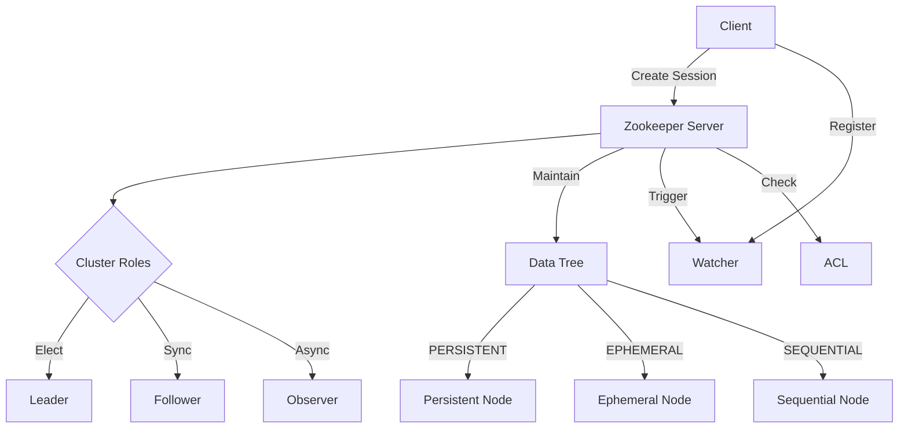

# Zookeeper原理与代码实例讲解

## 1. 背景介绍
### 1.1  问题的由来
在分布式系统中,协调服务是不可或缺的重要组成部分。随着分布式系统规模的不断扩大,如何有效地协调各个节点,保证数据一致性和可用性,成为了亟待解决的问题。传统的分布式锁、配置管理等方式已经无法满足日益复杂的分布式场景需求。
### 1.2  研究现状
目前,业界已经出现了多种分布式协调服务框架,如Google的Chubby、Apache的Zookeeper等。其中,Zookeeper凭借其简单易用、高可用、高性能等特点,在分布式领域得到了广泛应用。许多知名开源项目如Hadoop、Kafka、Hbase等都依赖Zookeeper进行分布式协调。
### 1.3  研究意义
深入研究Zookeeper的原理和应用,对于构建高可用、高性能的分布式系统具有重要意义。通过学习Zookeeper,可以掌握分布式协调的核心技术,了解如何解决分布式环境下的数据一致性问题,为设计和优化分布式系统提供有力支撑。
### 1.4  本文结构
本文将从以下几个方面对Zookeeper进行深入探讨:

1. 介绍Zookeeper的核心概念与基本原理
2. 剖析Zookeeper的核心算法,包括ZAB协议、Watcher机制等  
3. 讲解Zookeeper的数学模型,并结合实例加以说明
4. 通过代码实例,演示Zookeeper在实际项目中的应用
5. 总结Zookeeper的特点,分析其未来的发展趋势与挑战
6. 提供Zookeeper相关的学习资源与工具推荐

## 2. 核心概念与联系
在正式介绍Zookeeper原理之前,我们先来了解几个Zookeeper的核心概念:

- 集群角色:Leader、Follower、Observer
- 数据模型:类似Unix文件系统的树形结构
- 节点类型:持久节点、临时节点、顺序节点
- 会话:客户端与服务端之间的连接
- Watcher:事件监听器
- ACL:访问控制列表

下图展示了这些概念之间的关系:



Client通过创建Session连接到Zookeeper集群。集群中存在三种角色:Leader、Follower和Observer,其中Leader由选举产生,负责处理写请求并同步数据;Follower参与Leader选举,并从Leader处同步数据;Observer可以接受客户端连接,提升读性能,但不参与选举。

Zookeeper使用类似Unix文件系统的树形结构来维护数据。树中的每个节点称为Znode,Znode分为持久节点、临时节点、顺序节点三种类型。Client可以在指定Znode上注册Watcher监听器,当Znode发生变更时,Server会触发Watcher事件通知Client。同时,Zookeeper基于ACL控制每个Znode的访问权限。

## 3. 核心算法原理 & 具体操作步骤 
### 3.1 算法原理概述
Zookeeper的核心是ZAB(Zookeeper Atomic Broadcast)算法,用于保证分布式事务的顺序一致性。ZAB借鉴了Paxos算法,是一种特殊的原子广播协议。

### 3.2 算法步骤详解
ZAB主要分为两个阶段:

1. Leader选举(Leader Election)
当集群初始化或Leader失效时,所有节点进入Leader选举阶段。选举过程如下:

- 每个Server发出一个投票,由(myid,zxid)构成,其中myid是Server的唯一标识,zxid是事务id
- 接收到投票的Server会用(myid,zxid)和自己的(myid,zxid)比较,根据比较结果更新自己的投票,并重新发出
- 当Server收到超过半数Server相同的投票,则该投票对应的Server被选为Leader,Leader选举结束  

2. 消息广播(Atomic Broadcast)
Leader选举产生后,所有的写请求都由Leader处理。Leader接收到写请求后,将其转换为事务Proposal,并为其分配全局唯一的zxid,然后广播给所有Follower:

- Leader发送Proposal给所有Follower
- Follower接收到Proposal,写入本地事务日志,并发送ACK给Leader
- Leader收到半数以上Follower的ACK后,发送Commit给所有Follower,同时自身也Commit该Proposal  
- Follower接收到Commit,提交事务,并发送ACK给Leader
- Leader收到半数以上Follower的ACK,即认为该事务提交成功

通过以上两阶段,ZAB协议既保证了事务的顺序一致性,又能容忍Leader失效。

### 3.3 算法优缺点
ZAB算法的优点在于:

- 顺序一致性:全局事务按照zxid单调递增,保证了事务的顺序
- 原子性:事务在Leader和半数Follower上Commit成功才算成功
- 单一视图:同一时刻,集群中只有一个Leader,保证了数据视图的一致性
- 数据可靠:每个事务在Commit之前,都已经持久化到半数以上节点

ZAB算法的缺点包括:

- 吞吐量受限:写请求都需要经过Leader,吞吐量受Leader性能限制
- 延迟敏感:Leader选举时整个集群不可用,如果选举时间太长会影响可用性

### 3.4 算法应用领域
ZAB广泛应用于各类分布式系统,用于实现:

- 分布式锁:利用临时顺序节点,实现全局唯一的锁
- 命名服务:利用持久节点,提供统一的命名空间
- 配置管理:将配置信息保存在指定节点,供所有节点订阅
- 集群管理:利用临时节点,实现集群成员管理,故障检测等

## 4. 数学模型和公式 & 详细讲解 & 举例说明
### 4.1 数学模型构建
我们可以用一个简单的数学模型来描述ZAB协议。假设有一个由n个节点组成的Zookeeper集群,其状态可以表示为一个二维数组:

$$
S = 
\begin{bmatrix}
s_{11} & s_{12} & \cdots & s_{1n} \\
s_{21} & s_{22} & \cdots & s_{2n} \\
\vdots & \vdots & \ddots & \vdots \\
s_{t1} & s_{t2} & \cdots & s_{tn} 
\end{bmatrix}
$$

其中,$s_{ij}$表示在第i个时刻,第j个节点的状态。状态可以是Leader、Follower或Observer。

### 4.2 公式推导过程
根据ZAB协议,我们可以得出以下公式:

1. Leader选举条件:

$$
\sum_{j=1}^{n} I(s_{ij}=Leader) \leq 1, \forall i \in [1,t] 
$$

其中,$I$为指示函数。该公式表示,在任意时刻,最多只能有一个Leader。

2. 事务Commit条件:

$$
Commit(T_k) \Leftrightarrow \sum_{j=1}^{n} I(s_{ij}=Commit(T_k)) > \frac{n}{2}, \exists i \in [1,t]
$$

其中,$T_k$为第k个事务。该公式表示,一个事务被Commit当且仅当超过半数节点Commit了该事务。

### 4.3 案例分析与讲解
我们用一个具体的例子来说明上述模型和公式。假设有一个由5个节点组成的Zookeeper集群,初始状态为:

$$
S_0 = 
\begin{bmatrix}
F & F & F & F & F
\end{bmatrix}
$$

其中F表示Follower。现在Client发起一个写事务T1,Leader将其广播给所有Follower:

$$
S_1 = 
\begin{bmatrix}
L & F & F & F & F \\
L & C & C & P & P
\end{bmatrix}
$$

其中L表示Leader,C表示Commit,P表示Proposal。可以看出,事务T1满足Commit条件,因此T1可以被Commit:

$$
S_2 = 
\begin{bmatrix}
L & F & F & F & F \\
L & C & C & C & C
\end{bmatrix}
$$

此时,如果Leader失效,集群进入新一轮Leader选举:

$$
S_3 = 
\begin{bmatrix}
F & F & F & F & F \\
C & C & C & C & C
\end{bmatrix}
$$

最终,集群选出新的Leader,完成状态同步:

$$
S_4 = 
\begin{bmatrix}
F & L & F & F & F \\
C & C & C & C & C
\end{bmatrix}
$$

可以看出,尽管Leader发生变更,但已Commit的事务T1仍然保持一致。

### 4.4 常见问题解答
Q: ZAB和Paxos有什么区别?
A: ZAB是Paxos的一种变种,主要区别在于ZAB是针对主备架构设计的,Paxos是针对对等架构设计的。此外,ZAB将Paxos的Prepare和Accept阶段合并为Proposal阶段,简化了流程。

Q: Observer在ZAB中起什么作用?
A: Observer不参与投票,但可以接受Client的读请求,从而提升读性能。同时,Observer也会从Leader同步数据,保证数据一致性。引入Observer可以在不影响写性能的情况下,显著提高读性能。

Q: ZAB如何保证事务顺序?
A: ZAB中,所有事务都由Leader分配全局唯一递增的zxid,Follower按照zxid的顺序处理事务,从而保证了事务顺序。即使Leader变更,由于zxid是全局唯一的,因此事务顺序也能得到保证。

## 5. 项目实践：代码实例和详细解释说明
接下来,我们通过一个简单的代码实例,演示如何使用Zookeeper进行分布式锁的实现。
### 5.1 开发环境搭建
首先,我们需要搭建Zookeeper和Java开发环境:

- 安装JDK 8+
- 下载Zookeeper稳定版本(如3.6.3),解压到指定目录
- 配置zoo.cfg,设置dataDir和clientPort参数
- 启动Zookeeper服务:`bin/zkServer.sh start`

然后,创建一个Maven项目,引入Zookeeper依赖:

```xml
<dependency>
    <groupId>org.apache.zookeeper</groupId>
    <artifactId>zookeeper</artifactId>
    <version>3.6.3</version>
</dependency>
```

### 5.2 源代码详细实现
实现分布式锁的核心思路是利用Zookeeper的临时顺序节点。每个客户端尝试在指定路径下创建临时顺序节点,序号最小的节点获得锁。未获得锁的节点监听前一个节点,当前一个节点释放锁时,下一个节点获得锁。

首先定义一个ZkLock类,封装了加锁和解锁操作:

```java
public class ZkLock implements AutoCloseable {
    private ZooKeeper zk;
    private String lockPath;
    private String currentPath;

    public ZkLock(String connectString, String lockPath) throws IOException {
        this.zk = new ZooKeeper(connectString, 10000, null);
        this.lockPath = lockPath;
    }

    public void lock() throws KeeperException, InterruptedException {
        // 创建临时顺序节点
        currentPath = zk.create(lockPath + "/lock_", null, 
            ZooDefs.Ids.OPEN_ACL_UNSAFE, CreateMode.EPHEMERAL_SEQUENTIAL);
        // 获取所有子节点
        List<String> children = zk.getChildren(lockPath, false);
        // 对子节点排序
        Collections.sort(children);
        // 如果当前节点是第一个子节点,则获得锁
        if (currentPath.equals(lockPath + "/" + children.get(0))) {
            return;
        }
        // 否则,监听前一个子节点
        String prevPath = lockPath + "/" + children.get(
            children.indexOf(currentPath.substring(lockPath.length() + 1)) - 1);
        zk.exists(prevPath, event -> {
            try {
                lock();
            } catch (Exception e) {
                e.printStackTrace();
            }
        