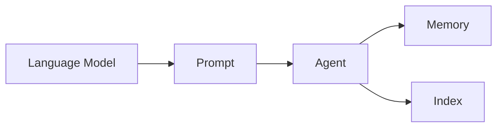

# 【LangChain编程：从入门到实践】对话场景

## 1. 背景介绍
### 1.1 问题的由来
随着人工智能技术的飞速发展,自然语言处理(NLP)领域取得了巨大的进步。人们对于与机器进行自然对话的需求日益增长。传统的对话系统通常基于规则或模板,难以应对复杂多变的对话场景。而近年来,大语言模型(LLM)的出现为构建智能对话系统带来了新的契机。LangChain作为一个强大的LLM编程框架,为开发者提供了灵活的工具来构建对话应用。

### 1.2 研究现状
目前,业界已经涌现出多个基于LLM的对话系统,如微软的XiaoIce、Google的Meena等。这些系统在特定领域取得了不错的效果,但在通用性和可扩展性方面仍有不足。LangChain的出现为开发者提供了一套标准化的工具和接口,大大降低了构建对话系统的门槛。越来越多的研究者和开发者开始关注LangChain,探索其在对话场景中的应用。

### 1.3 研究意义
探索LangChain在对话场景中的应用,具有重要的理论和实践意义:

1. 推动对话系统的发展。LangChain为构建高质量的对话系统提供了新的思路和方法,有望突破传统对话系统的局限性,实现更加智能、自然的人机交互。

2. 丰富LLM的应用场景。对话是LLM的重要应用方向之一。研究LangChain在对话中的应用,有助于进一步挖掘LLM的潜力,拓展其应用边界。

3. 指导开发者实践。通过系统梳理LangChain在对话场景中的应用模式和最佳实践,为开发者提供了宝贵的经验和指导,帮助其更高效地构建对话应用。

### 1.4 本文结构
本文将围绕LangChain在对话场景中的应用展开探讨。第2部分介绍LangChain的核心概念;第3部分重点讲解基于LangChain构建对话系统的原理和步骤;第4部分给出相关的数学模型;第5部分通过代码实例演示具体的实现过程;第6部分讨论LangChain对话系统的应用场景;第7部分推荐相关工具和资源;第8部分总结全文,并展望未来发展方向。

## 2. 核心概念与联系
在探讨LangChain在对话场景中的应用之前,我们有必要对其核心概念进行必要的了解。

LangChain的核心是语言模型(Language Model),它以自然语言文本作为输入,通过学习文本的统计规律,来预测下一个最可能出现的词。常见的语言模型有GPT、BERT等。LangChain在语言模型的基础上,提供了一系列工具和组件,用于构建LLM应用。

LangChain的另一个重要概念是提示(Prompt),它定义了如何将任务描述转化为语言模型可以理解和执行的指令。设计优质的提示是构建高质量LLM应用的关键。

除了语言模型和提示,LangChain还引入了代理(Agent)、记忆(Memory)、索引(Index)等概念。代理负责管理和编排语言模型、提示等组件,协调它们完成特定任务;记忆用于存储对话历史,供语言模型参考以保持对话的连贯性;索引使得语言模型能够高效检索海量文本信息。

下图展示了LangChain核心概念之间的关系:



LangChain通过巧妙地组织这些概念,使得开发者能够轻松构建功能丰富的LLM应用,对话系统就是其中的典型代表。

## 3. 核心算法原理 & 具体操作步骤
### 3.1 算法原理概述
基于LangChain构建对话系统的核心是语言模型。给定用户输入,语言模型根据当前的对话上下文,生成最合适的回复。这个过程可以用下面的公式表示:

$$ Response = argmax_R P(R|Context,User Input) $$

其中,$Response$表示语言模型生成的回复,$Context$表示当前的对话上下文,$User Input$表示用户的输入。$P(R|Context,User Input)$表示在给定对话上下文和用户输入的条件下,生成回复$R$的概率。语言模型的目标是找到概率最大的回复。

### 3.2 算法步骤详解
基于LangChain构建对话系统的具体步骤如下:

1. 准备语料:收集和清洗大量的对话语料,用于训练语言模型。语料的质量和数量直接影响模型的效果。

2. 训练语言模型:使用准备好的语料,训练GPT、BERT等语言模型。这一步骤通常很耗时,但可以使用预训练的模型加速。

3. 设计提示:根据对话系统的功能和场景,设计合适的提示。提示要能够引导语言模型进行有针对性的生成。

4. 构建代理:使用LangChain提供的工具,构建对话代理。代理负责接收用户输入,调用语言模型进行生成,并返回生成的回复。

5. 加入记忆和索引:为代理添加记忆和索引功能。记忆用于存储对话历史,索引用于检索相关信息,它们可以提升对话的连贯性和信息量。

6. 优化和调试:在实际对话中测试代理,不断优化提示、调节参数,提升对话质量。

7. 部署应用:将调试好的对话代理集成到实际应用中,提供智能对话服务。

### 3.3 算法优缺点
基于LangChain的对话系统具有以下优点:

1. 简单灵活:LangChain提供了高度封装的工具和接口,使得构建对话系统变得简单灵活。

2. 效果好:得益于强大的语言模型,基于LangChain的对话系统能够生成流畅、自然的回复,用户体验好。

3. 可扩展:通过优化提示和引入外部知识,LangChain对话系统可以适应各种场景,具有很强的扩展性。

同时,该方法也存在一些局限:

1. 依赖数据:训练高质量的语言模型需要大量的对话语料,数据的获取和标注成本高。

2. 计算开销大:语言模型的训练和推理都很消耗算力,对计算资源要求高。

3. 可控性差:语言模型是黑盒模型,其生成过程难以精确控制,可能产生不可预期的结果。

### 3.4 算法应用领域
基于LangChain的对话系统在多个领域都有广阔的应用前景,例如:

1. 客服:提供智能客服服务,自动解答用户咨询。

2. 教育:构建智能教学助手,为学生提供个性化的学习支持。

3. 娱乐:打造智能聊天机器人,为用户带来有趣的交互体验。

4. 商业:开发智能销售助手,为企业提供营销和销售支持。

5. 医疗:建立医疗诊断系统,辅助医生进行初步诊断。

## 4. 数学模型和公式 & 详细讲解 & 举例说明
### 4.1 数学模型构建
语言模型是一种基于概率的生成模型,对一段文本$W=\{w_1,w_2,...,w_n\}$,语言模型的目标是估计其出现的概率$P(W)$。根据贝叶斯公式,多个词共同出现的概率可以表示为:

$$P(w_1,w_2,...,w_n)=P(w_1) \cdot P(w_2|w_1) \cdot P(w_3|w_1,w_2) \cdot ... \cdot P(w_n|w_1,w_2,...,w_{n-1})$$

其中,$P(w_i|w_1,w_2,...,w_{i-1})$表示在给定前$i-1$个词的条件下,第$i$个词是$w_i$的概率。语言模型的任务就是学习这个条件概率分布。

### 4.2 公式推导过程
为了学习条件概率分布,语言模型通常使用神经网络作为参数化模型。以GPT为例,其使用Transformer的解码器结构,将词编码为向量,通过自注意力机制和前馈神经网络学习词之间的依赖关系。

具体地,设$x_i$为第$i$个词的向量表示,$h_i$为第$i$个位置的隐状态,则GPT的计算过程可以表示为:

$$h_i=Transformer(x_i,h_{<i})$$
$$P(w_i|w_{<i})=softmax(W_o \cdot h_i)$$

其中,$Transformer$表示Transformer解码器的计算过程,$W_o$为输出层的权重矩阵。

在训练过程中,模型通过最小化负对数似然损失来学习参数:

$$Loss=-\sum_{i=1}^n logP(w_i|w_{<i})$$

### 4.3 案例分析与讲解
下面我们以一个简单的例子来说明语言模型的工作原理。假设我们有一句话"I love natural language processing",语言模型的目标是估计这句话出现的概率。

首先,将这句话编码为向量序列:

$$[x_1,x_2,x_3,x_4,x_5]=[I,love,natural,language,processing]$$

然后,语言模型逐个预测每个词出现的概率:

$$P(w_1=I)=P(I)$$
$$P(w_2=love|w_1=I)=P(love|I)$$
$$P(w_3=natural|w_1=I,w_2=love)=P(natural|I,love)$$
$$...$$

通过这种自回归的方式,语言模型可以计算整个句子的出现概率:

$$P(I,love,natural,language,processing)=P(I) \cdot P(love|I) \cdot P(natural|I,love) \cdot ... \cdot P(processing|I,love,natural,language)$$

在实际应用中,我们通常不会直接计算句子的概率,而是利用语言模型的生成能力,根据前文生成后续的词,得到完整的句子。

### 4.4 常见问题解答
1. 语言模型的生成效果为什么不稳定?

语言模型的生成效果受到多个因素的影响,如训练数据的质量、模型的规模、生成策略的选择等。此外,语言本身的复杂性和多义性也给生成带来了挑战。通过优化这些因素,可以提升语言模型的生成效果。

2. 如何控制语言模型的生成内容?

可以通过设计良好的提示来引导语言模型生成特定内容。提示中可以包含关键词、句式等元素,来约束生成的方向。此外,还可以通过引入外部知识、规则等手段,对生成过程进行更精细的控制。

3. 语言模型能否理解语言的深层含义?

目前的语言模型主要基于统计规律进行建模,对语言的理解还比较浅层。它们虽然能够生成流畅、通顺的文本,但在语义理解、常识推理等方面还有待提高。未来需要引入更多的知识和推理能力,赋予语言模型更强的语言理解能力。

## 5. 项目实践：代码实例和详细解释说明
### 5.1 开发环境搭建
首先,我们需要搭建LangChain的开发环境。可以使用pip安装LangChain及其依赖:

```bash
pip install langchain openai
```

其中,openai包提供了访问OpenAI语言模型的接口,可以替换为其他语言模型。

### 5.2 源代码详细实现
下面,我们使用LangChain构建一个简单的对话代理。

```python
from langchain.llms import OpenAI
from langchain.prompts import PromptTemplate
from langchain.chains import LLMChain
from langchain.memory import ConversationBufferMemory

# 设置OpenAI API Key
os.environ["OPENAI_API_KEY"] = "your_api_key"

# 初始化语言模型
llm = OpenAI(temperature=0.9) 

# 定义提示模板
prompt = PromptTemplate(
    input_variables=["history", "input"], 
    template="The following is a friendly conversation between a human and an AI. The AI is talkative and provides lots of specific details from its context. If the AI does not know the answer to a question, it truthfully says it does not know.\n\nCurrent conversation:\n{