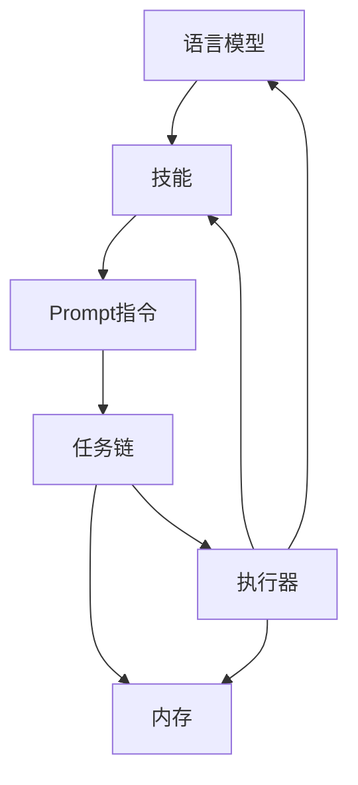

# 【大模型应用开发 动手做AI Agent】BabyAGI简介

作者：禅与计算机程序设计艺术 / Zen and the Art of Computer Programming

## 1. 背景介绍
### 1.1 问题的由来
随着人工智能技术的飞速发展,尤其是大语言模型的出现,AI已经开始在各个领域展现出巨大的潜力。然而,如何将强大的语言模型转化为实际可用的智能助手,仍然是一个巨大的挑战。开发者需要一种简单易用的框架,来帮助他们快速构建和部署AI助手应用。
### 1.2 研究现状 
目前已经出现了一些开源的AI助手开发框架,如 Langchain、AutoGPT 等,它们提供了基础的组件和工具,方便开发者搭建自己的AI应用。但这些框架的学习成本较高,且缺乏详尽的文档和教程,对新手不够友好。因此,我们需要一个更加简单易用,同时又功能完备的AI助手开发框架。
### 1.3 研究意义
BabyAGI的出现,为广大开发者提供了一个易学易用的AI助手开发框架。通过BabyAGI,即使是没有AI开发经验的新手,也能够在短时间内上手,开发出功能强大的AI助手应用。这将极大地降低AI应用开发的门槛,推动人工智能技术在更多领域的应用,为社会发展做出贡献。
### 1.4 本文结构
本文将首先介绍BabyAGI的核心概念和工作原理,然后详细讲解其关键算法和数学模型。接着通过一个具体的代码实例,演示如何使用BabyAGI进行AI助手的开发。最后,展望BabyAGI的应用前景和未来发展方向。

## 2. 核心概念与联系
BabyAGI是一个AI助手开发框架,其核心理念是:将复杂的AI系统拆分为若干个功能独立的组件,每个组件负责一个特定的子任务,组件之间通过标准接口进行通信和协作,共同完成整个AI系统的功能。

BabyAGI的核心组件包括:

- 语言模型(Language Model):负责自然语言的理解和生成,是AI助手的核心大脑。BabyAGI支持主流的语言模型如GPT-3、Claude等。
- 技能(Skill):封装了AI助手的一项特定技能或功能,如信息检索、数据分析、任务规划等。每个技能由一组Prompt指令构成。
- Prompt指令:一条Prompt指令定义了技能的一个具体操作,包括输入参数、执行逻辑、返回结果等。Prompt指令通过自然语言描述,可以调用语言模型或其他组件完成任务。
- 任务链(Task Chain):由一系列Prompt指令组成的工作流,描述了完成一项复杂任务的步骤和逻辑。
- 内存(Memory):存储AI助手执行任务过程中的中间结果和状态数据,方便在任务链的不同节点之间共享信息。
- 执行器(Executor):负责解析Prompt指令并调用相应的组件执行,也负责在任务链的节点之间传递数据。

下图是BabyAGI的核心组件及其关系:

可以看出,BabyAGI的核心组件环环相扣,共同构成了一个完整的AI助手开发框架。开发者只需要按照BabyAGI的规范,定义好每个组件,就可以快速搭建一个功能强大的AI助手应用。

## 3. 核心算法原理 & 具体操作步骤  
### 3.1 算法原理概述
BabyAGI的核心算法可以概括为"任务分解与规划求解"。具体来说,就是将一个复杂的任务分解为若干个子任务,每个子任务对应一个Prompt指令。然后,通过规划算法,将这些Prompt指令组织成一个有序的任务链。最后,由执行器依次执行任务链中的每个指令,完成整个任务。

其中,任务分解的过程可以通过语言模型自动完成。开发者只需要用自然语言描述任务的目标和约束条件,语言模型就可以根据描述,生成一系列的子任务Prompt指令。

规划求解则是一个经典的人工智能问题。BabyAGI采用了启发式搜索算法,从初始状态出发,不断扩展探索状态空间,寻找一条从初始状态到目标状态的最优路径,作为任务执行的计划。

### 3.2 算法步骤详解
下面我们详细讲解BabyAGI的核心算法步骤:

**步骤1:任务分解**
1. 开发者提供任务的目标描述G和约束条件C
2. 语言模型根据G和C,生成一系列子任务Prompt指令P1,P2,...,Pn
3. 将生成的指令封装为技能S

**步骤2:规划求解**
1. 定义状态空间:每个状态对应任务完成的一个中间结果,用内存M存储
2. 定义初始状态I:任务开始时的数据与参数
3. 定义目标状态G:任务的最终目标
4. 定义状态转移函数:执行一个Prompt指令,可以从一个状态转移到另一个状态
5. 定义代价函数:执行一个Prompt指令需要消耗的资源(如API调用次数)
6. 采用A*搜索等启发式搜索算法,寻找从初始状态I到目标状态G的最优路径,生成任务链T

**步骤3:执行任务**
1. 执行器E读取任务链T中的第一个Prompt指令P
2. 根据P的类型,调用对应的组件执行,包括:
   - 调用语言模型生成或分析自然语言
   - 调用外部API获取数据
   - 与用户交互,获取输入或反馈
   - 存储或读取内存M中的数据
   - 调用其他技能S执行子任务
3. 将P的执行结果存入内存M,更新状态
4. 取任务链T中的下一个指令,重复步骤2-3,直到任务链T全部执行完毕
5. 输出最终结果,任务完成

### 3.3 算法优缺点
BabyAGI的核心算法具有以下优点:
- 自动化:任务分解和规划求解都由算法自动完成,减轻了开发者的工作量
- 灵活性:Prompt指令可以调用不同的组件,实现各种各样的功能
- 可解释性:任务链清晰地描述了任务执行的逻辑和步骤,便于理解和调试

同时也存在一些局限性:
- 依赖语言模型的效果:任务分解的质量取决于语言模型的理解和生成能力 
- 搜索算法的性能瓶颈:状态空间过大时,搜索算法的时间开销会急剧增加
- 领域知识的引入:某些专业领域的任务需要融入额外的领域知识才能有效求解

### 3.4 算法应用领域
BabyAGI的任务分解与规划求解算法可以应用于以下领域:
- 智能客服:自动解答用户问题,提供业务咨询与操作指导
- 智能助理:执行日程管理、信息查询、简单办公等个人助理任务
- 数据分析:自动拆解数据分析需求,生成分析报告
- 编程助手:根据需求描述,自动生成代码片段或项目脚手架

## 4. 数学模型和公式 & 详细讲解 & 举例说明
### 4.1 数学模型构建
我们使用有向无环图(DAG)来建模任务链,每个节点表示一个中间状态,每条有向边表示执行一个Prompt指令。

形式化定义如下:
- 状态空间 $S$:所有可能的中间状态的集合
- 初始状态 $I \in S$ 
- 目标状态 $G \in S$
- 状态转移函数 $f: S \times P \rightarrow S$,其中$P$为Prompt指令的集合
- 代价函数 $c: S \times P \rightarrow R^+$,其中$R^+$为非负实数集

则任务链规划问题可以定义为:

在状态空间$S$中,寻找一条从初始状态$I$到目标状态$G$的路径$T$,使得路径上各边的代价之和$\sum_{i=1}^{n} c(s_i,p_i)$最小。其中,$s_i$为路径上的节点,$p_i$为连接$s_i$和$s_{i+1}$的边(即Prompt指令)。

### 4.2 公式推导过程
设计启发式函数$h(s)$,估计从状态$s$到目标状态$G$的最小代价。则状态$s$的估计总代价为:

$$ f(s) = g(s) + h(s) $$

其中,$g(s)$为从初始状态$I$到当前状态$s$的实际代价,$h(s)$为从$s$到$G$的估计代价。

在搜索过程中,每次选择$f(s)$最小的状态$s$进行扩展,直到找到目标状态$G$。

常见的启发式函数有:
- 零启发式:$h(s)=0$,即不使用任何启发信息,退化为Dijkstra算法
- 曼哈顿距离:$h(s)=\sum_{i=1}^{n} |s_i-g_i|$,其中$s_i$和$g_i$分别为状态$s$和目标状态$G$在维度$i$上的坐标
- 欧氏距离:$h(s)=\sqrt{\sum_{i=1}^{n} (s_i-g_i)^2}$

### 4.3 案例分析与讲解
下面我们以一个简单的任务为例,演示BabyAGI的任务规划过程。

假设要完成以下任务:查询某个城市明天的天气,并根据天气决定出行方式。

我们定义状态空间如下:
- 初始状态$I$:空
- 中间状态$s_1$:明天的天气情况
- 中间状态$s_2$:出行方式
- 目标状态$G$:生成出行建议

定义Prompt指令集合:
- $p_1$:查询明天天气,从$I$转移到$s_1$,代价为1次API调用
- $p_2$:分析天气,若晴天则选择骑车,否则选择打车,从$s_1$转移到$s_2$,代价为1次推理
- $p_3$:生成出行建议,从$s_2$转移到$G$,代价为1次生成

设计曼哈顿距离启发式函数:

$$
h(I) = 3 \\
h(s_1) = 2 \\ 
h(s_2) = 1 \\
h(G) = 0
$$

则搜索过程如下:
1. 初始状态$I$,f(I)=g(I)+h(I)=0+3=3
2. 扩展$I$,得到$s_1$,f(s_1)=g(s_1)+h(s_1)=1+2=3
3. 扩展$s_1$,得到$s_2$,f(s_2)=g(s_2)+h(s_2)=2+1=3
4. 扩展$s_2$,得到$G$,f(G)=g(G)+h(G)=3+0=3,搜索结束

最优任务链为:$I \stackrel{p_1}{\rightarrow} s_1 \stackrel{p_2}{\rightarrow} s_2 \stackrel{p_3}{\rightarrow} G$

### 4.4 常见问题解答
Q:BabyAGI能否处理有循环依赖的任务?
A:BabyAGI假设任务链是一个有向无环图,无法处理循环依赖。如果任务存在循环依赖,需要人工拆解为多个无循环的子任务。

Q:如何设计启发式函数?
A:启发式函数需要根据具体任务的特点来设计。一个好的启发式函数应该尽可能准确地估计到达目标的代价,且计算简单高效。可以借鉴该任务所在领域的经验法则。

Q:BabyAGI能否支持多个目标状态?
A:可以将多