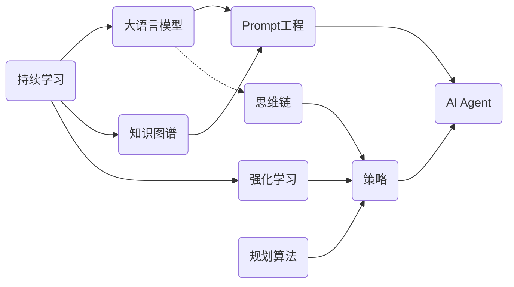

# 【大模型应用开发 动手做AI Agent】期望顶峰和失望低谷

## 1. 背景介绍
### 1.1 问题的由来
随着人工智能技术的飞速发展,尤其是以ChatGPT为代表的大语言模型(LLM)的出现,AI已经开始深入影响我们的生活。LLM强大的自然语言理解和生成能力,让人们对AI助手(Agent)充满了期待。然而,当前的AI Agent在实际应用中还存在诸多局限性,离真正智能还有很大差距。这引发了业界对于如何开发实用AI Agent的广泛讨论。
### 1.2 研究现状 
目前,主流的AI Agent开发主要基于大语言模型如GPT-3、PaLM等,通过Prompt工程等方式进行微调,以适应特定的应用场景。一些研究还尝试将大模型与知识图谱、规划算法等结合,以增强Agent的推理和决策能力。但现有方法普遍存在可控性差、鲁棒性不足、缺乏持续学习能力等问题。
### 1.3 研究意义
探索高效、可靠、实用的AI Agent开发方法,对于推动人工智能技术在各行各业的应用具有重要意义。一方面,智能Agent可以替代人力完成许多复杂任务,提高生产效率;另一方面,人机协作的AI系统有望在教育、医疗、科研等领域发挥重要作用,造福人类。
### 1.4 本文结构
本文将首先介绍AI Agent开发涉及的一些核心概念,然后重点探讨基于大模型的Agent设计原理和算法。接着,我们将通过数学建模和代码实践,讲解如何一步步构建一个智能对话Agent。最后,本文还将分享一些开发经验和思考,讨论AI Agent未来的发展方向和挑战。

## 2. 核心概念与联系
- 大语言模型(LLM):以Transformer为基础架构,在海量文本语料上训练的语言模型,具有强大的自然语言理解和生成能力,是当前AI Agent的核心。
- Prompt工程:通过设计适当的输入示例和指令,引导LLM生成符合特定意图的回复,是应用大模型的关键技术。
- 思维链(CoT):一种Prompt方法,通过诱导LLM输出连续的推理过程,可以显著提升复杂推理任务的表现。
- 知识图谱:以图网络形式表示实体及其关系的知识库,可为Agent提供结构化的领域知识。
- 规划算法:自动推理生成目标导向的行为序列,使Agent能根据环境做出决策。
- 强化学习:通过设计奖励函数,并在环境中探索和优化策略,使Agent学会目的性行为。
- 持续学习:让Agent在部署后能够根据反馈不断自我更新和提升,适应新的用户和场景。

下图展示了这些概念在AI Agent系统中的关系:


## 3. 核心算法原理 & 具体操作步骤
### 3.1 算法原理概述
基于大模型的AI Agent核心是利用LLM强大的自然语言处理能力,通过Prompt引导其生成符合要求的回复。但为了让Agent具备更强的推理、规划和学习能力,我们还需要融合其他AI技术。
### 3.2 算法步骤详解
1. 搭建大语言模型:选择合适的预训练LLM(如GPT-3、PaLM、LLaMA等),并根据应用场景在领域语料上进行微调,以提升模型的适配性。
2. 设计Prompt:根据Agent的任务目标,设计一系列示例和指令,引导LLM进行特定意图的对话生成。可使用思维链等方法增强推理能力。
3. 注入知识:从结构化数据构建知识图谱,将其通过Prompt的形式输入LLM,为Agent提供丰富的背景知识。
4. 融合规划与决策:将规划算法(如STRIPS、HTN等)的输出结果转化为Prompt,引导LLM生成目标导向的行为序列。
5. 优化策略:设计合适的奖励函数,并通过强化学习算法(如PPO、Q-Learning等)在多轮对话中优化Agent的策略。
6. 持续学习:收集用户反馈,并用于增量训练LLM、更新知识图谱、优化策略,实现Agent的持续进化。
7. 封装应用:将训练好的Agent模型封装为API服务,并开发配套的用户界面,以支撑实际应用部署。

### 3.3 算法优缺点
优点:
- 借助LLM的语言理解和生成能力,Agent可以进行自然流畅的对话交互。
- 融合知识图谱和规划决策,使Agent具备一定的常识推理和目的性行为能力。
- 采用持续学习范式,Agent可以不断适应新的用户和场景,提升性能。

缺点:
- LLM生成的内容可控性较差,存在安全和伦理风险。
- 知识图谱和规划决策依赖专家构建,成本较高且覆盖有限。
- 评估和优化Agent性能需要大量的人工反馈,周期长、成本高。

### 3.4 算法应用领域
- 智能客服:提供个性化的用户咨询和问题解答。
- 虚拟助手:执行日程管理、信息检索等个人助理任务。
- 教育陪伴:协助学生学习、答疑解惑、激发兴趣。
- 医疗助理:辅助医生进行病情分析、治疗方案推荐等。
- 金融顾问:提供投资组合推荐、风险评估等理财服务。

## 4. 数学模型和公式 & 详细讲解 & 举例说明
### 4.1 数学模型构建
我们以基于Transformer的LLM为例,介绍其数学模型。Transformer的核心是自注意力机制(Self-Attention),可以捕捉输入序列中的长距离依赖关系。

对于输入序列 $X=(x_1,\ldots,x_n)$,Self-Attention的计算过程如下:

$$
\begin{aligned}
Q &= XW^Q \\
K &= XW^K \\
V &= XW^V \\
\text{Attention}(Q,K,V) &= \text{softmax}(\frac{QK^T}{\sqrt{d_k}})V
\end{aligned}
$$

其中,$Q$、$K$、$V$分别为查询(Query)、键(Key)、值(Value)矩阵,$W^Q$、$W^K$、$W^V$为可学习的参数矩阵,$d_k$为K的维度。

Transformer中的每一层都包含多头自注意力(Multi-head Self-Attention)和前馈神经网络(Feed-Forward Network,FFN)两个子层。多头自注意力将输入线性投影到h个不同的子空间,分别进行Self-Attention计算,再将结果拼接起来:

$$
\begin{aligned}
\text{MultiHead}(X) &= \text{Concat}(\text{head}_1,\ldots,\text{head}_h)W^O \\
\text{head}_i &= \text{Attention}(XW_i^Q,XW_i^K,XW_i^V)
\end{aligned}
$$

其中,$W_i^Q$、$W_i^K$、$W_i^V$、$W^O$为可学习的参数矩阵。

前馈神经网络包含两个线性变换和一个ReLU激活函数:

$$\text{FFN}(x)=\max(0, xW_1 + b_1)W_2 + b_2$$

其中,$W_1$、$b_1$、$W_2$、$b_2$为可学习的参数。

最后,Transformer的输出通过线性变换和softmax函数转化为下一个token的概率分布:

$$P(x_{t+1}|x_{\leq t})=\text{softmax}(HW+b)$$

其中,$H$为最后一层的输出,$W$、$b$为可学习参数。

### 4.2 公式推导过程
以上公式的推导过程涉及矩阵运算、概率论等数学知识,限于篇幅这里不再展开。感兴趣的读者可以参考Transformer的原始论文《Attention Is All You Need》。

### 4.3 案例分析与讲解
我们以一个简单的情感分类任务为例,展示如何用Prompt引导LLM进行推理。假设输入文本为"I love this movie!"。

设计如下Prompt:
```
Text: I love this movie!
Q: What is the sentiment of this text?
A: Let's break it down:
1) The word "love" expresses a strong positive emotion towards the movie.
2) The exclamation mark "!" further intensifies the positive sentiment.
3) There are no negative words in the text to contradict the positive sentiment.
Therefore, the overall sentiment of the text is very positive.

Text: I am so sad after watching this movie.
Q: What is the sentiment of this text?  
A: Let's analyze it step by step:
1) The phrase "so sad" directly conveys a strong negative emotion.
2) The words "after watching this movie" indicate that the movie is the reason for feeling sad. 
3) There are no positive words to offset the negative sentiment.
In summary, the sentiment expressed in this text is highly negative.

Text: {input_text}
Q: What is the sentiment of this text?
A:
```

将示例文本替换为"I love this movie!",LLM将根据Prompt中的推理过程,判断出文本表达了非常正面的情感。

输出如下:
```
Let's analyze it step by step:
1) The word "love" is a strong positive word that expresses great affection towards the movie.
2) The exclamation mark "!" at the end further emphasizes and intensifies the positive sentiment.
3) The text contains only positive words and no negative words to contradict the sentiment.
Therefore, considering the word choice and punctuation, the sentiment expressed in this text is very positive.
```

可以看到,通过精心设计的Prompt,我们引导LLM进行了符合人类直觉的情感分析推理。这种方法避免了繁琐的特征工程,非常简洁高效。

### 4.4 常见问题解答
Q: Prompt设计是否需要机器学习专业知识?
A: 设计优质的Prompt确实需要一定的机器学习和自然语言处理领域知识,以及对LLM特性的深入理解。但随着Prompt共享平台和工具的发展,非专业人士也可以在现有Prompt的基础上进行简单调整和复用,降低了使用门槛。

Q: 推理型Prompt在哪些任务中最有效?
A: 推理型Prompt尤其适用于需要多步骤推理的复杂任务,如数学应用题、逻辑推理、代码生成等。这些任务往往需要LLM具备强大的常识推理和逻辑分析能力,单纯的问答Prompt难以胜任。通过引入中间推理步骤,可以大幅提升LLM在这些任务上的表现。

## 5. 项目实践:代码实例和详细解释说明
### 5.1 开发环境搭建
本项目使用Python语言和PyTorch深度学习框架。需要安装以下依赖库:
- `torch`: PyTorch核心库,用于搭建和训练神经网络模型。
- `transformers`: Hugging Face出品的Transformer模型库,提供了丰富的预训练模型和便捷的API。
- `datasets`: Hugging Face的NLP数据集库,可以方便地加载和预处理各种常见数据集。

可以通过以下命令安装这些库:
```bash
pip install torch transformers datasets
```

### 5.2 源代码详细实现
以下是使用Hugging Face的`transformers`库实现基于Prompt的情感分类的示例代码:

```python
from transformers import AutoTokenizer, AutoModelForCausalLM

# 加载预训练的GPT-2模型和tokenizer
model_name = "gpt2-medium"
tokenizer = AutoTokenizer.from_pretrained(model_name)  
model = AutoModelForCausalLM.from_pretrained(model_name)

# 设计Prompt模板
prompt_template = """
Text: {input_text}
Q: What is the sentiment of this text?
A: Let's analyze it step by step:
1) """

# 定义情感分类函数
def classify_sentiment(text):
    # 将输入文本填充到Prompt模板中  
    prompt = prompt_template.format(input_text=text)
    
    # 对Prompt进行编码
    input_ids = tokenizer(prompt, return_tensors="pt").input_ids
    
    # 使用LLM生成结果
    output = model.generate(input_ids, max_length=100, num_return_sequences=1