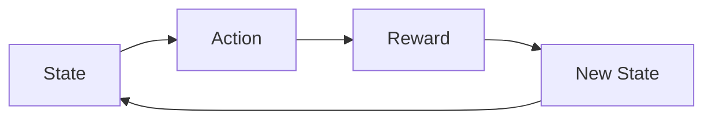

# 一切皆是映射：DQN的误差分析与性能监测方法

关键词：深度强化学习、DQN、误差分析、性能监测、映射关系

## 1. 背景介绍

### 1.1 问题的由来

深度强化学习（Deep Reinforcement Learning, DRL）是近年来人工智能领域的一个研究热点，它将深度学习（Deep Learning, DL）与强化学习（Reinforcement Learning, RL）结合起来，使得智能体（Agent）能够在复杂环境中学习到最优策略。其中，深度Q网络（Deep Q-Network, DQN）是DRL的代表性算法之一，自从2015年由DeepMind团队提出后，便受到了学术界和工业界的广泛关注。

DQN通过深度神经网络（Deep Neural Network, DNN）来逼近状态-动作值函数（Q函数），使得智能体能够在高维状态空间中学习到最优策略。然而，DQN在实际应用中仍然面临着一些挑战，如如何评估模型的性能、如何分析模型的误差等。这些问题的解决对于DQN的进一步发展和应用至关重要。

### 1.2 研究现状

目前，关于DQN的研究主要集中在算法改进、应用拓展等方面。在算法改进方面，研究者们提出了多种改进方法，如Double DQN、Dueling DQN、Prioritized Experience Replay等，以提高DQN的稳定性和收敛速度。在应用拓展方面，DQN已经被成功应用于游戏、机器人、自动驾驶等多个领域，取得了不错的效果。

然而，关于DQN的误差分析和性能监测方面的研究还比较少。现有的一些工作主要集中在理论分析方面，如收敛性分析、误差界分析等，但这些理论结果在实践中往往难以直接应用。因此，亟需一种实用的DQN误差分析和性能监测方法，以指导DQN的实际应用。

### 1.3 研究意义

DQN的误差分析和性能监测对于DQN的实际应用具有重要意义。首先，通过误差分析，我们可以深入理解DQN的工作机制，找出影响其性能的关键因素，为算法改进提供理论指导。其次，通过性能监测，我们可以实时评估DQN模型的性能，及时发现和解决潜在问题，提高模型的鲁棒性和可靠性。最后，DQN的误差分析和性能监测方法可以推广到其他DRL算法，具有一定的普适性。

### 1.4 本文结构

本文将从以下几个方面对DQN的误差分析和性能监测进行探讨：

- 第2节介绍DQN的核心概念和基本原理，为后续内容打下基础。
- 第3节详细阐述DQN的核心算法，包括算法原理、具体步骤、优缺点分析等。
- 第4节建立DQN的数学模型，推导相关公式，并给出详细的案例分析。
- 第5节通过代码实例，演示DQN的具体实现过程，并对代码进行详细解读。
- 第6节讨论DQN在实际应用场景中的表现，分析其局限性，并展望未来应用前景。  
- 第7节推荐DQN相关的学习资源、开发工具、论文等，供读者进一步研究参考。
- 第8节总结全文，评估DQN的研究现状，展望其未来发展趋势和面临的挑战。
- 第9节列举DQN的常见问题，并给出详细解答，方便读者理解和应用。

## 2. 核心概念与联系

DQN是一种基于值函数（Value-based）的深度强化学习算法，其核心思想是利用深度神经网络来逼近最优状态-动作值函数（Optimal Q-function）。在学习过程中，DQN不断与环境交互，通过试错来更新神经网络参数，最终学习到最优Q函数，进而得到最优策略。

DQN的核心概念包括：

- 状态（State）：表示智能体所处的环境状态，通常用特征向量表示。
- 动作（Action）：表示智能体在某状态下可以采取的行为，通常是离散或连续的。
- 奖励（Reward）：表示智能体采取某个动作后，环境给予的即时反馈，可正可负。
- 状态转移（State Transition）：表示智能体采取动作后，环境状态发生的变化。
- 策略（Policy）：表示智能体的行为策略，即在某状态下应该采取何种动作的映射。
- 值函数（Value Function）：表示某状态或状态-动作对的期望长期回报，分为状态值函数和动作值函数。
- Q函数（Q-function）：即动作值函数，表示在某状态下采取某动作的期望长期回报。

这些概念之间存在着紧密的联系。智能体根据当前状态，通过策略选择动作，采取动作后获得即时奖励并转移到新状态，同时更新值函数来评估当前状态或状态-动作对的好坏，最终学习到最优策略。这实际上形成了一个"状态-动作-奖励-新状态"的循环，如下图所示：

在DQN中，Q函数由深度神经网络来逼近，网络的输入为状态，输出为各个动作的Q值。通过最小化TD误差，DQN不断更新网络参数，使得网络输出的Q值不断向最优Q函数收敛，最终得到最优策略。这实际上建立了一个从状态到最优动作的映射关系，即 $a^* = \arg\max_a Q^*(s,a)$。

综上，DQN的核心是利用深度神经网络建立从状态到最优动作的映射关系，通过不断与环境交互来学习这一映射，最终得到最优策略。理解了这一核心思想，就能更好地把握DQN的工作原理和内在机制。

## 3. 核心算法原理 & 具体操作步骤

### 3.1 算法原理概述

DQN的核心是Q学习（Q-learning），它是一种无模型（Model-free）、异策略（Off-policy）的时序差分学习（Temporal Difference Learning）算法。Q学习的目标是学习最优Q函数，即 $Q^*(s,a) = \max_\pi \mathbb{E}[R_t|s_t=s, a_t=a, \pi]$，表示在状态 $s$ 下采取动作 $a$ 并之后一直遵循策略 $\pi$ 的期望长期回报。

根据Bellman最优方程，最优Q函数满足如下关系：

$$Q^*(s,a) = \mathbb{E}[r + \gamma \max_{a'}Q^*(s',a')|s,a]$$

其中，$r$ 是即时奖励，$\gamma$ 是折扣因子，$s'$ 是下一状态。这个等式表明，最优Q函数可以通过Bellman迭代来逼近，即根据当前Q函数来更新下一步的Q函数，直到收敛到最优Q函数。

在DQN中，Q函数由深度神经网络 $Q(s,a;\theta)$ 来逼近，其中 $\theta$ 为网络参数。DQN的目标是最小化如下损失函数：

$$L(\theta) = \mathbb{E}[(r + \gamma \max_{a'}Q(s',a';\theta^-) - Q(s,a;\theta))^2]$$

其中，$\theta^-$ 表示目标网络（Target Network）的参数，它是一个滞后更新的Q网络，用于计算目标Q值，以提高训练稳定性。

通过最小化损失函数，DQN不断更新Q网络参数，使其输出的Q值不断向最优Q函数收敛。在训练过程中，DQN采用了两个重要的技巧：经验回放（Experience Replay）和目标网络（Target Network）。经验回放通过缓存智能体与环境交互的轨迹数据，打破了数据的相关性，提高了样本利用效率。目标网络通过缓慢更新参数，提高了训练的稳定性。

### 3.2 算法步骤详解

DQN的具体算法步骤如下：

1. 初始化经验回放缓存 $D$，容量为 $N$。
2. 初始化Q网络 $Q(s,a;\theta)$，随机初始化参数 $\theta$。
3. 初始化目标网络 $\hat{Q}(s,a;\theta^-)$，参数 $\theta^- = \theta$。
4. for episode = 1 to M do
5.     初始化初始状态 $s_1$
6.     for t = 1 to T do
7.         根据 $\epsilon-greedy$ 策略选择动作 $a_t$
8.         执行动作 $a_t$，观察奖励 $r_t$ 和下一状态 $s_{t+1}$
9.         将转移样本 $(s_t, a_t, r_t, s_{t+1})$ 存入 $D$ 
10.        从 $D$ 中随机采样小批量转移样本 $(s_i, a_i, r_i, s_{i+1})$
11.        计算目标Q值：$y_i = \begin{cases} r_i & \text{if } s_{i+1} \text{ is terminal} \\ r_i + \gamma \max_{a'} \hat{Q}(s_{i+1},a';\theta^-) & \text{otherwise} \end{cases}$
12.        通过最小化损失函数 $L(\theta) = \frac{1}{n} \sum_i (y_i - Q(s_i,a_i;\theta))^2$ 来更新Q网络参数 $\theta$
13.        每隔 $C$ 步，将 $\theta^- = \theta$
14.    end for
15. end for

其中，$M$ 为总训练轮数，$T$ 为每轮的最大步数，$\epsilon-greedy$ 策略表示以 $\epsilon$ 的概率随机选择动作，以 $1-\epsilon$ 的概率选择Q值最大的动作，$C$ 为目标网络更新频率。

### 3.3 算法优缺点

DQN算法的主要优点包括：

- 端到端的学习方式，无需人工提取特征，自动学习状态表示和策略。
- 采用深度神经网络，可以处理高维状态空间，具有强大的函数拟合能力。
- 引入经验回放和目标网络，提高了训练的稳定性和样本利用效率。
- 收敛性有理论保证，在一定条件下能收敛到最优策略。

DQN算法的主要缺点包括：

- 训练不稳定，对超参数敏感，需要仔细调参。
- 样本利用率低，经验回放缓存中的样本不能重复利用。
- 只适用于离散动作空间，不能直接处理连续动作空间。
- 存在过估计（Overestimation）问题，可能导致次优策略。

### 3.4 算法应用领域

DQN算法在许多领域得到了成功应用，主要包括：

- 游戏：DQN在Atari游戏、围棋、星际争霸等游戏中取得了超人表现。
- 机器人控制：DQN可以用于机器人的运动规划、导航、抓取等任务。
- 自动驾驶：DQN可以用于自动驾驶的决策控制，如车道保持、避障等。
- 推荐系统：DQN可以用于推荐系统的排序、广告投放等任务。
- 通信网络：DQN可以用于通信网络的路由优化、资源分配等任务。

总的来说，DQN适用于状态空间和动作空间均为离散的序贯决策问题，尤其适合具有高维状态空间和稀疏奖励的问题。

## 4. 数学模型和公式 & 详细讲解 & 举例说明

### 4.1 数学模型构建

我们考虑一个标准的强化学习设定，即马尔可夫决策过程（Markov Decision Process, MDP）。一个MDP由一个六元组 $(\mathcal{S}, \mathcal{A}, \mathcal{P}, \mathcal{R}, \gamma, \rho_0)$ 定义，其中：

- $\mathcal{S}$ 是状态空间，$s\in\mathcal{S}$ 表示某个状态。
- $\mathcal{A}$ 是动作空间，$a\in\mathcal{A}$ 表示某个动作。
- $\mathcal{P}$ 是状态转移概率，$\mathcal{P}(s'|s,a)$ 表示在状态 $s$ 下采取动作 $a$ 后转移到状态 $s'