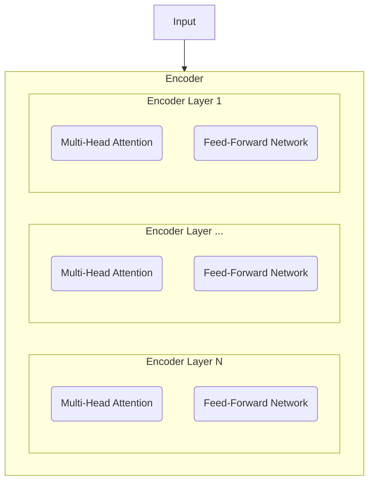
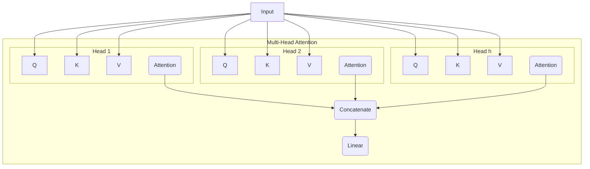

# 从零开始大模型开发与微调：编码器的实现

作者：禅与计算机程序设计艺术 / Zen and the Art of Computer Programming

## 1. 背景介绍

### 1.1 问题的由来

近年来,随着深度学习技术的飞速发展,大规模语言模型(Large Language Models, LLMs)在自然语言处理(Natural Language Processing, NLP)领域取得了令人瞩目的成就。这些大模型能够在各种NLP任务上取得与人类相当甚至超越人类的表现,如机器翻译、文本摘要、问答系统、对话生成等。然而,训练这些大模型需要海量的语料数据和计算资源,对于许多研究者和开发者来说是一个巨大的挑战。因此,如何从零开始构建和微调自己的大模型,成为了NLP领域的一个热点问题。

### 1.2 研究现状

目前,业界已经提出了多种大模型的训练范式和架构,如GPT系列[1]、BERT系列[2]、T5[3]等。这些大模型主要采用Transformer[4]作为基础架构,通过海量数据的预训练和特定任务的微调来实现强大的语言理解和生成能力。在模型训练的过程中,编码器(Encoder)作为Transformer的核心组件之一,扮演着至关重要的角色。编码器主要负责将输入的文本序列映射到一个高维语义空间,从而捕捉词与词之间、句与句之间的语义关系。因此,编码器的实现质量直接影响了整个大模型的性能表现。

### 1.3 研究意义 

尽管目前已经有许多开源的大模型实现,如Hugging Face的Transformers库[5]。但对于许多研究者和开发者来说,深入理解编码器的内部原理和实现细节,并能够从零开始搭建自己的编码器,仍然具有重要的意义:

1. 加深对大模型内部机制的理解,有助于后续模型的优化和改进。
2. 针对特定任务定制化编码器结构,有望获得更好的性能表现。
3. 解决工业界实际应用中的数据隐私和安全问题,不依赖于开源实现。
4. 有利于NLP技术在垂直领域的推广和落地。

### 1.4 本文结构

本文将重点介绍如何从零开始实现一个Transformer编码器,主要内容分为以下几个部分:

- 第2节介绍编码器的核心概念和内部结构。
- 第3节详细讲解编码器的核心算法原理和具体实现步骤。 
- 第4节给出编码器涉及的数学模型和公式推导过程。
- 第5节提供编码器的代码实现和详细解释说明。
- 第6节讨论编码器在实际应用场景中的案例。
- 第7节推荐编码器相关的学习资源和开发工具。
- 第8节总结全文,并展望编码器技术的未来发展方向和挑战。

## 2. 核心概念与联系

在介绍编码器的实现细节之前,我们首先需要理解其核心概念和内部结构。如图1所示,编码器的整体架构可以看作是一个堆叠的多层Transformer Block,每个Block内部又由多头注意力机制(Multi-Head Attention)、前馈神经网络(Feed-Forward Network)等组件组成。

图1: Transformer编码器的整体架构

其中,多头注意力机制是编码器的核心,它允许模型在不同的表示子空间中计算输入序列的注意力权重,捕捉序列中长距离的依赖关系。如图2所示,多头注意力由多个缩放点积注意力(Scaled Dot-Product Attention)组成,每个头关注输入序列的不同语义子空间,最后将各个头的输出拼接起来并经过线性变换得到最终的多头注意力输出。

图2: 多头注意力机制的内部结构

前馈神经网络则负责对多头注意力的输出进行非线性变换,提高模型的表达能力。前馈网络通常由两个线性变换层和一个非线性激活函数(如ReLU)组成。此外,编码器中还引入了残差连接(Residual Connection)和层归一化(Layer Normalization)来加速模型训练和提高泛化性能。

理解了以上核心概念和内部结构后,我们就可以着手编码器的具体实现了。下面将详细介绍编码器的核心算法原理和实现步骤。

## 3. 核心算法原理 & 具体操作步骤

### 3.1 算法原理概述

Transformer编码器的核心是基于自注意力机制(Self-Attention)的Scaled Dot-Product Attention,其数学形式如下:

$$
Attention(Q,K,V) = softmax(\frac{QK^T}{\sqrt{d_k}})V
$$

其中,$Q$,$K$,$V$分别表示查询(Query)、键(Key)、值(Value)矩阵,$d_k$为$K$的维度,用于缩放点积结果,避免softmax函数的梯度消失问题。

在自注意力机制中,$Q$,$K$,$V$都来自同一个输入序列的不同线性变换:

$$
Q = XW^Q, K = XW^K, V = XW^V
$$

其中,$X$为输入序列的嵌入表示,$W^Q$,$W^K$,$W^V$为可学习的权重矩阵。

多头注意力机制则是将$Q$,$K$,$V$线性映射到$h$个不同的子空间,然后在每个子空间中并行计算注意力,最后将结果拼接起来:

$$
MultiHead(Q,K,V) = Concat(head_1,...,head_h)W^O \\
head_i = Attention(QW^Q_i, KW^K_i, VW^V_i)
$$

其中,$W^Q_i$,$W^K_i$,$W^V_i$,$W^O$为可学习的权重矩阵。

### 3.2 算法步骤详解

基于以上原理,Transformer编码器的具体实现步骤如下:

1. 输入序列嵌入(Input Embedding):将离散的输入token映射为连续的向量表示。

2. 位置编码(Positional Encoding):为每个输入token添加位置信息,使模型能够捕捉序列的顺序关系。位置编码通常采用正余弦函数:

$$
PE_{(pos,2i)} = sin(pos/10000^{2i/d_{model}}) \\
PE_{(pos,2i+1)} = cos(pos/10000^{2i/d_{model}})
$$

其中,$pos$为token的位置索引,$i$为嵌入向量的维度索引,$d_{model}$为嵌入向量的维度。

3. 多头注意力:将嵌入向量和位置编码相加作为多头注意力的输入,并行计算$h$个注意力头。

4. 残差连接和层归一化:将多头注意力的输出与输入进行残差连接,然后进行层归一化。

$$
x = LayerNorm(x + MultiHead(x))
$$

5. 前馈神经网络:经过两个线性变换层和ReLU激活函数,对多头注意力的输出进行非线性变换。

$$
FFN(x) = max(0, xW_1 + b_1)W_2 + b_2
$$

6. 残差连接和层归一化:将前馈网络的输出与多头注意力的输出进行残差连接,然后进行层归一化。

$$
x = LayerNorm(x + FFN(x))
$$

7. 重复步骤3-6,堆叠多个编码器层。

8. 输出层:将最后一层编码器的输出传递给下游任务层,如分类、序列标注等。

### 3.3 算法优缺点

Transformer编码器相比传统的RNN/CNN编码器有以下优点:

1. 并行计算:自注意力机制允许同时计算序列中所有位置的注意力权重,避免了RNN的顺序计算瓶颈。
2. 长距离依赖:自注意力机制可以直接捕捉序列中任意两个位置之间的依赖关系,而不受距离的限制。
3. 可解释性:注意力权重矩阵直观地反映了序列中各个位置之间的相关性,提高了模型的可解释性。

但Transformer编码器也存在一些缺点:

1. 计算复杂度高:自注意力机制的时间和空间复杂度均为$O(n^2)$,其中$n$为序列长度,对于超长序列可能会导致内存爆炸。
2. 位置编码的局限性:简单的正余弦位置编码难以刻画复杂的位置关系,如相对位置等。
3. 缺乏先验知识:完全依赖数据驱动的自注意力机制可能难以学习一些显而易见的先验知识,如词序、句法等。

### 3.4 算法应用领域

Transformer编码器是大规模语言模型的核心组件,在以下NLP任务中得到了广泛应用:

1. 机器翻译:将源语言序列编码为上下文向量,再解码为目标语言序列。
2. 文本分类:将文本序列编码为固定维度的向量,再进行分类。
3. 命名实体识别:将文本序列编码为上下文向量,再对每个token进行实体标注。
4. 关系抽取:将实体对序列编码为上下文向量,再预测实体之间的关系类型。
5. 阅读理解:将问题和文章编码为上下文向量,再预测答案在文章中的位置。

此外,Transformer编码器还被用于多模态学习、图神经网络、强化学习等领域,展现出了广阔的应用前景。

## 4. 数学模型和公式 & 详细讲解 & 举例说明

### 4.1 数学模型构建

为了更好地理解Transformer编码器的内部原理,我们首先给出其数学模型的定义。设输入序列为$\mathbf{x}=(x_1,\dots,x_n)$,其中$x_i \in \mathbb{R}^{d_{model}}$为第$i$个token的嵌入向量,$n$为序列长度。编码器的目标是将$\mathbf{x}$映射为一个上下文表示序列$\mathbf{z}=(z_1,\dots,z_n)$,其中$z_i \in \mathbb{R}^{d_{model}}$编码了$x_i$的上下文信息。

具体地,第$l$层编码器可以表示为:

$$
\begin{aligned}
\mathbf{h}^{(l)} &= MultiHead(\mathbf{z}^{(l-1)}) \\
\mathbf{z}^{(l)} &= LayerNorm(\mathbf{h}^{(l)} + FFN(\mathbf{h}^{(l)}))
\end{aligned}
$$

其中,$\mathbf{z}^{(0)}$为输入序列$\mathbf{x}$与位置编码$\mathbf{p}$的加和:

$$
\mathbf{z}^{(0)} = \mathbf{x} + \mathbf{p}
$$

最终,第$L$层编码器的输出$\mathbf{z}^{(L)}$即为整个编码器的输出。

### 4.2 公式推导过程

下面我们详细推导多头注意力机制的前向计算公式。首先,对于第$i$个注意力头,其查询、键、值矩阵分别为:

$$
\begin{aligned}
\mathbf{Q}_i &= \mathbf{z}^{(l-1)} \mathbf{W}_i^Q \\
\mathbf{K}_i &= \mathbf{z}^{(l-1)} \mathbf{W}_