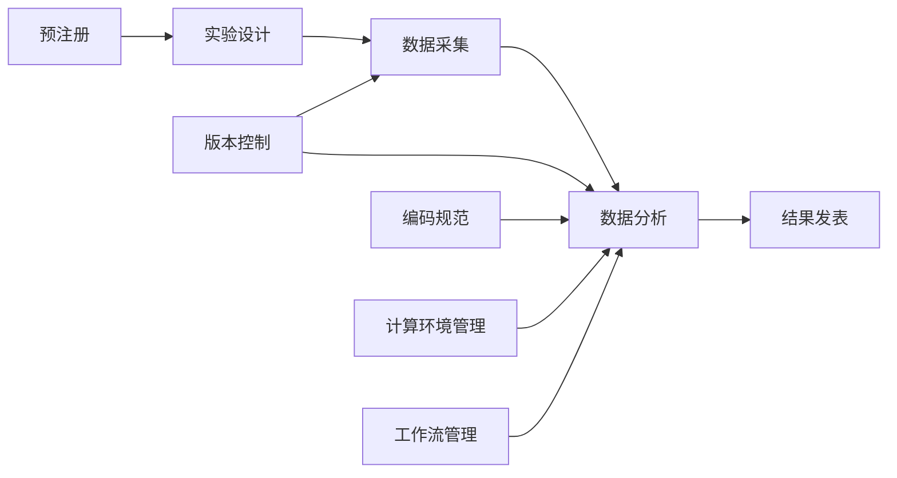
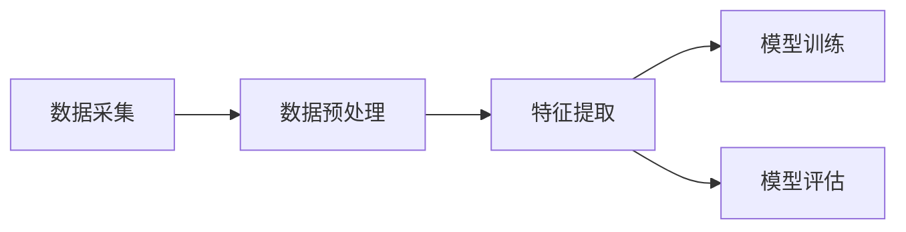

可复现性研究与实验管理原理与代码实战案例讲解

作者：禅与计算机程序设计艺术 / Zen and the Art of Computer Programming

关键词：可复现性研究、实验管理、代码实战、科研管理、可重复性

## 1. 背景介绍

### 1.1 问题的由来

随着科学研究的不断深入，科研工作的复杂度也在与日俱增。越来越多的研究需要通过大规模实验、海量数据处理和复杂模型计算等手段来验证假设、得出结论。然而，许多已发表的科研成果却难以被其他研究者复现，这严重影响了科研成果的可信度，阻碍了科学的进步。可复现性研究应运而生，旨在确保科研过程的规范化、结果的可重复性，提高科研质量和效率。

### 1.2 研究现状

目前，可复现性研究已成为国际学术界关注的热点。Nature、Science等国际顶级期刊均发文呼吁提高科研可复现性。各国政府和科研机构也相继出台相关政策，推动可复现性研究的发展。如美国国立卫生研究院（NIH）提出了"Rigor and Reproducibility"计划，欧盟提出了"Open Science"计划等。但总体而言，可复现性研究尚处于起步阶段，在实验设计规范、代码和数据管理、发表与评价机制等方面仍有诸多问题亟待解决。

### 1.3 研究意义 

可复现性研究有助于提高科研诚信，确保科研成果的可靠性，加快科研进展，提升科研质量和效率。通过规范实验流程、统一管理研究数据和代码，可以最大限度减少人为错误，确保实验过程和结果的一致性。将科研过程公开透明化，有利于同行评议和结果验证，促进学术交流，推动协同创新。此外，可复现性研究强调将科研软件作为学术贡献，并予以规范引用，将极大激励科研人员投入精力开发和维护高质量的科研软件，提升科研软件开发水平。

### 1.4 本文结构

本文将围绕可复现性研究这一主题，重点阐述实验管理的原理和方法，并通过代码实战案例加以说明。内容安排如下：

第2部分介绍可复现性研究的核心概念及其内在联系；第3部分重点阐述实验管理的核心原理和操作步骤；第4部分建立实验管理的数学模型，推导相关公式，并结合案例加以说明；第5部分通过代码实战案例，演示可复现性研究在项目中的具体应用；第6部分分析可复现性研究的实际应用场景；第7部分推荐可复现性研究的相关工具和学习资源；第8部分总结全文，分析可复现性研究的发展趋势与面临的挑战；第9部分列举可复现性研究的常见问题，并给出解答。

## 2. 核心概念与联系

可复现性研究的核心是实现科研过程和结果的可重复、可验证。这需要从实验设计、数据采集、数据分析、结果发表等各个环节入手，对科研过程进行全流程的规范化管理。其中最为关键的概念包括：

- 预注册（Preregistration）：在实验开始前，预先确定并公开实验方案，包括研究假设、实验设计、数据采集和分析方法等。这有助于防止因假设检验多次而产生的偶然性结果。
- 版本控制（Version Control）：使用Git等工具，对研究过程中产生的代码、数据、文档等进行版本管理和追踪，确保可追溯、可重现。
- 编码规范（Coding Standards）：统一的编码规范有利于提高代码质量，方便他人阅读和复用。常用的规范包括代码风格、命名约定、注释规则等。
- 计算环境管理（Computing Environment）：创建独立封装的计算环境，统一软硬件配置，确保分析结果的一致性。常用的工具包括Docker等。
- 工作流管理（Workflow Management）：采用Snakemake、Nextflow等工作流管理系统，将数据分析流程模块化、参数化，提高流程的可复用性和可移植性。

这些概念相辅相成，共同构成了可复现性研究的基础。规范的实验设计是一切的前提，版本控制和工作流管理是贯穿始终的两条主线，编码规范和计算环境管理则是确保结果一致性的两大保障。

## 3. 核心算法原理 & 具体操作步骤

### 3.1 算法原理概述

实验管理的核心是对科研过程的抽象建模和流程优化。通过引入有向无环图（DAG）模型，可以将复杂的数据分析流程拆解为若干个独立的步骤，明确数据在不同步骤间的依赖关系，实现模块化和并行化，提高分析效率。同时，将分析参数独立于代码，可实现流程的参数化，增强复用性。

### 3.2 算法步骤详解

1. 定义数据分析步骤：将整个数据分析流程划分为若干个独立的步骤，每个步骤完成一个独立的任务，如数据预处理、特征提取、模型训练、结果评估等。
2. 构建有向无环图：根据步骤间的依赖关系，构建有向无环图模型。图中每个节点表示一个步骤，有向边表示数据依赖关系。
3. 定义步骤的输入输出：对每个步骤，定义其所需的输入数据和产生的输出数据。输入数据可以是原始数据，也可以是上游步骤的输出。
4. 编写步骤对应的代码：根据每个步骤的具体任务，编写相应的代码。为了提高代码复用性，应尽量保证每个步骤功能单一，参数可配置。
5. 定义流程的配置文件：将流程涉及的参数（如输入数据路径、算法参数等）定义在独立的配置文件中，实现参数与代码解耦。
6. 执行流程：使用工作流引擎（如Snakemake）执行流程。引擎根据步骤间的依赖关系，自动确定执行顺序，调度执行资源，并行执行无依赖的步骤。

### 3.3 算法优缺点

优点：
- 模块化：将复杂流程划分为独立的步骤，每个步骤完成特定功能，易于编写和维护。
- 可复用：将参数独立于代码，提高代码复用性。统一的接口规范，利于不同步骤的组合复用。
- 可扩展：新增或删除步骤，只需修改相应的依赖关系，不影响其他步骤，易于扩展新功能。
- 高效：自动识别并行步骤，合理调度资源，显著提升执行效率。

缺点：
- 额外开销：描述步骤之间的依赖关系，编写配置文件等，会带来一定的额外工作量。
- 学习成本：需要掌握工作流引擎的使用方法，理解DAG模型，有一定的学习门槛。

### 3.4 算法应用领域

工作流管理算法在科学计算、生物信息、机器学习等领域得到了广泛应用。典型的应用场景包括：

- 科学计算：天文数据处理、气候模拟等，涉及TB级数据和复杂计算模型，需要合理组织数据处理和分析步骤。
- 生物信息：高通量测序数据分析、基因组注释等，涉及多个数据集和分析工具，需要统一的流程管理。
- 机器学习：特征工程、模型训练和评估等，涉及数据预处理、特征提取、模型训练、超参数优化等多个步骤，需要规范流程。

## 4. 数学模型和公式 & 详细讲解 & 举例说明

### 4.1 数学模型构建

数据分析流程可以抽象为一个有向无环图（DAG）模型 $G=(V,E)$。其中，$V$ 表示节点集合，每个节点 $v_i \in V$ 表示一个数据处理步骤。$E$ 表示有向边集合，若存在有向边 $e_{ij} = <v_i, v_j>$，则表示步骤 $v_j$ 依赖步骤 $v_i$ 的输出。

定义步骤 $v_i$ 的输入数据集合为 $I(v_i)$，输出数据集合为 $O(v_i)$，则有：

$$
I(v_i) = \bigcup_{e_{ki} \in E} O(v_k)
$$

即步骤 $v_i$ 的输入数据是其所有前驱节点的输出数据的并集。

定义步骤 $v_i$ 的代码为 $C(v_i)$，参数为 $P(v_i)$，则步骤 $v_i$ 的执行过程可表示为：

$$
O(v_i) = C(v_i)(I(v_i), P(v_i))
$$

即步骤 $v_i$ 根据输入数据 $I(v_i)$ 和参数 $P(v_i)$，执行代码 $C(v_i)$，产生输出数据 $O(v_i)$。

### 4.2 公式推导过程

定义流程的执行时间为 $T$，则有：

$$
T = \max_{p \in P} \sum_{v_i \in p} t(v_i)
$$

其中，$P$ 表示流程中所有可能的执行路径（即DAG中的所有路径）， $p$ 表示其中一条路径，$t(v_i)$ 表示步骤 $v_i$ 的执行时间。即流程的执行时间等于所有路径执行时间的最大值。

假设流程中有 $n$ 个步骤，则所有路径数的上限为：

$$
|P| \leq \sum_{k=1}^{n} \frac{n!}{(n-k)!} = \sum_{k=1}^{n} \frac{n!}{k!(n-k)!} \cdot k! = \sum_{k=1}^{n} \binom{n}{k} \cdot k!
$$

即在最坏情况下，路径数随步骤数呈指数增长。因此，工作流引擎需要设计高效的调度算法，避免遍历所有路径，降低时间复杂度。常用的调度算法包括：

- 拓扑排序：根据DAG的拓扑序，依次执行每个步骤，保证每个步骤的前驱步骤都已执行完毕。时间复杂度为 $O(|V|+|E|)$。
- 关键路径法：找出DAG中的关键路径（执行时间最长的路径），优先执行关键路径上的步骤，尽早启动后续步骤。时间复杂度为 $O(|V|+|E|)$。

### 4.3 案例分析与讲解

以一个简单的数据分析流程为例，该流程包括以下步骤：

1. 数据采集：从数据源采集原始数据。
2. 数据预处理：对原始数据进行清洗、转换等预处理操作。
3. 特征提取：从预处理后的数据中提取特征。
4. 模型训练：使用提取的特征训练机器学习模型。
5. 模型评估：使用测试集评估模型性能。

根据步骤之间的依赖关系，可以构建如下的DAG模型：

其中，数据预处理依赖数据采集的输出，特征提取依赖数据预处理的输出，模型训练和评估都依赖特征提取的输出。

假设各步骤的执行时间分别为：$t(A)=10, t(B)=20, t(C)=30, t(D)=40, t(E)=20$，则该流程的关键路径为 $A \rightarrow B \rightarrow C \rightarrow D$，执行时间为 $T=10+20+30+40=100$。

如果使用拓扑排序算法调度，则执行顺序为：$A \rightarrow B \rightarrow C \rightarrow D \rightarrow E$，总