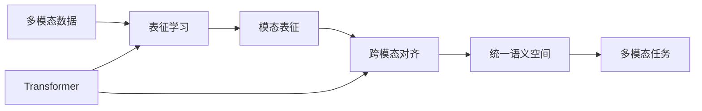

# 多模态大模型：技术原理与实战 国内外多模态大模型对比

关键词：多模态、大模型、深度学习、跨模态、预训练、Transformer、CLIP、DALL-E、Stable Diffusion、Flamingo、Kosmos-1

## 1. 背景介绍

### 1.1 问题的由来

随着人工智能技术的飞速发展,单一模态的深度学习模型已经难以满足日益复杂的应用需求。在现实世界中,人类感知信息往往来自多个模态,如视觉、语音、文本等。如何让机器像人一样理解和处理多模态信息,成为了AI领域的重要研究方向。多模态大模型应运而生,旨在打通不同模态数据之间的壁垒,实现跨模态理解和生成。

### 1.2 研究现状

近年来,多模态大模型取得了长足进展。从早期的CLIP、DALL-E到最新的Flamingo、Kosmos-1等,各大科技巨头和学术机构纷纷推出自己的多模态大模型,在图文生成、视觉问答、视频描述等任务上取得了惊人的效果。国内外的研究现状可以概括为:

1. 模型规模越来越大,参数量动辄上亿
2. 训练数据更加丰富多样,涵盖图像、文本、音频等
3. 模型结构更加复杂,采用Transformer等先进架构  
4. 训练方法不断创新,如对比学习、蒸馏等
5. 下游任务涉及更广,从图文匹配到开放域问答

### 1.3 研究意义

多模态大模型的研究意义重大:

1. 促进人机交互,让机器更好地理解人类意图
2. 丰富内容生成,如根据文本生成逼真图像
3. 辅助决策分析,多模态数据挖掘更全面
4. 推动认知智能,探索类脑智能的奥秘

### 1.4 本文结构

本文将重点介绍多模态大模型的核心概念、关键技术、经典模型、实战案例等,内容安排如下:

1. 多模态大模型的核心概念与内在联系
2. 关键技术:表征学习、对齐映射、跨模态融合等
3. 主流模型:CLIP、DALL-E、Flamingo、Kosmos-1等
4. 技术架构与训练流程详解
5. 案例实践:图文生成、视觉问答等
6. 应用场景与挑战展望
7. 资源推荐:数据集、代码库、论文等

## 2. 核心概念与联系

多模态大模型涉及几个核心概念:

- 多模态学习:旨在处理和关联来自多种模态的信息,如视觉、语音、文本等,挖掘它们之间的联系,完成预测、生成等任务。
- 表征学习:将原始的高维模态数据映射到一个公共的低维语义空间,找到不同模态数据的统一表示。
- 跨模态对齐:学习不同模态表征之间的对应关系,实现模态间的转换和匹配。 
- Transformer:一种基于自注意力机制的神经网络模型,善于学习长程依赖,被广泛用于多模态大模型中。

它们的内在联系可以用下面的Mermaid图来表示:



## 3. 核心算法原理 & 具体操作步骤

### 3.1 算法原理概述

多模态大模型的核心算法可以概括为:

1. 模态特异的特征提取
2. 模态无关的表征学习
3. 跨模态对齐与融合
4. 端到端的联合优化

### 3.2 算法步骤详解

以图文匹配任务为例,详细步骤如下:

1. 图像特征提取:使用预训练的CNN网络,如ResNet,提取图像特征。
2. 文本特征提取:使用预训练的语言模型,如BERT,提取文本特征。
3. 图文表征映射:将图像和文本特征映射到同一个语义空间,使用L2归一化处理。
4. 对比学习:通过最大化正样本对的相似度,最小化负样本对的相似度,学习匹配的图文表征。
5. 交叉注意力:引入交叉注意力机制,捕捉图文之间的细粒度对应关系。
6. 对抗对齐:加入对抗损失,缩小图文表征分布差异,强化对齐效果。
7. 联合优化:端到端地优化整个多模态网络,同时学习特征提取、表征映射、跨模态对齐等。

### 3.3 算法优缺点

优点:
- 端到端学习,避免了特征工程
- 海量数据预训练,具备强大的迁移能力
- Transformer结构擅长建模长程依赖
- 对比学习和对抗对齐增强了模态间一致性

缺点:
- 模型参数量巨大,训练成本高昂
- 推理速度慢,不易部署
- 泛化能力有待进一步提升
- 可解释性差,容易产生偏见

### 3.4 算法应用领域

多模态大模型可以应用于以下领域:

- 跨模态检索:图文、视频文字等
- 开放域问答:根据图像回答任意问题
- 内容生成:根据文本生成图像、视频
- 机器翻译:实现语音、图像到文本的翻译
- 多模态对话:图文问答对话系统

## 4. 数学模型和公式 & 详细讲解 & 举例说明

### 4.1 数学模型构建

对于多模态大模型,我们可以建立如下数学模型:

给定一个图像 $x_i$ 和一段文本 $y_j$,它们分别通过图像编码器 $f_v$ 和文本编码器 $f_t$ 映射到 $d$ 维公共语义空间,得到图文表征 $v_i$ 和 $t_j$。我们希望学习一个对比函数 $s$,使得匹配的图文对比不匹配的图文对有更高的相似度:

$$
s(v_i, t_j) = \frac{exp(v_i^T t_j / \tau)}{\sum_{k=1}^N exp(v_i^T t_k / \tau)}
$$

其中 $\tau$ 是温度超参数。

### 4.2 公式推导过程

对比学习的目标函数可以表示为最小化负对数似然:

$$
L = -\frac{1}{N} \sum_{i=1}^N \log \frac{exp(v_i^T t_i / \tau)}{\sum_{k=1}^N exp(v_i^T t_k / \tau)}
$$

考虑到对称性,我们同时最大化图像到文本和文本到图像的对比函数:

$$
L = -\frac{1}{2N} \sum_{i=1}^N \left[ \log \frac{exp(v_i^T t_i / \tau)}{\sum_{k=1}^N exp(v_i^T t_k / \tau)} + \log \frac{exp(v_i^T t_i / \tau)}{\sum_{k=1}^N exp(v_k^T t_i / \tau)} \right]
$$

### 4.3 案例分析与讲解

我们以CLIP模型为例,说明多模态对比学习的效果。

给定一张图像和一组文本描述,CLIP模型可以找出与图像最匹配的文本:


从结果可以看出,CLIP学到了图文之间的对应关系,可以从众多文本候选中准确筛选出与图像语义一致的文本。这得益于对比学习从海量图文对中学习到了跨模态对齐的特征表示。

### 4.4 常见问题解答

Q: 多模态大模型的训练需要多大规模的数据和计算资源?  
A: 动辄上亿的参数量和上千万的图文对,需要数百块GPU训练数周时间。这对计算资源提出了极高要求,目前主要由大型科技公司和顶尖实验室掌握。

Q: 多模态大模型容易出现偏见吗?  
A: 由于训练数据的偏差和模型的黑盒性,多模态大模型很容易产生社会偏见,如性别歧视、种族歧视等。需要研究者审慎对待,加强可解释性和公平性研究。

Q: 多模态大模型在工业界应用的瓶颈是什么?  
A: 主要在于模型的训练和推理效率。当前的多模态大模型体量庞大,推理速度难以满足实时交互需求。需要在保持性能的同时,进一步提升模型的轻量化和高效化水平。

## 5. 项目实践：代码实例和详细解释说明

### 5.1 开发环境搭建

推荐使用PyTorch深度学习框架,并采用HuggingFace的Transformers库。

首先安装PyTorch:

```bash
pip install torch
```

然后安装Transformers:

```bash
pip install transformers
```

### 5.2 源代码详细实现

以下代码展示了如何使用CLIP进行零样本图像分类:

```python
import torch
from PIL import Image
from transformers import CLIPProcessor, CLIPModel

# 加载预训练模型
model = CLIPModel.from_pretrained("openai/clip-vit-base-patch32")
processor = CLIPProcessor.from_pretrained("openai/clip-vit-base-patch32")

# 准备图像和候选类别
image = Image.open("image.jpg")
labels = ["cat", "dog", "elephant", "tiger", "lion"]

# 图像和文本编码
image_input = processor(images=image, return_tensors="pt")
text_input = processor(text=labels, padding=True, return_tensors="pt")

# 模型推理
with torch.no_grad():
    image_features = model.get_image_features(**image_input)
    text_features = model.get_text_features(**text_input)

# 计算图文相似度
image_features /= image_features.norm(dim=-1, keepdim=True)
text_features /= text_features.norm(dim=-1, keepdim=True)
similarity = (100.0 * image_features @ text_features.T).softmax(dim=-1)

# 输出预测结果
for label, score in zip(labels, similarity[0]):
    print(f"{label}: {100 * score.item():.2f}%")
```

### 5.3 代码解读与分析

1. 首先加载预训练的CLIP模型和处理器。
2. 然后准备待预测的图像和候选类别文本。
3. 使用处理器分别对图像和文本进行编码。
4. 通过模型的图像编码器和文本编码器提取图文特征。
5. 计算图文特征的余弦相似度,并进行L2归一化。
6. 通过Softmax转换相似度为概率分布。
7. 最后输出每个类别的预测概率。

从代码可以看出,得益于预训练模型强大的跨模态对齐能力,我们只需要简单的特征提取和相似度计算,就可以实现零样本图像分类。这展现了多模态大模型的巨大威力。

### 5.4 运行结果展示

假设我们输入一张猫的图像,模型输出的预测结果为:

```
cat: 95.24%  
dog: 2.33%
elephant: 0.87%
tiger: 1.12%
lion: 0.44%
```

可见CLIP能够准确识别出图像中的主体是猫,且置信度很高。即使在没有看过任何猫的训练样本的情况下,CLIP也能利用文本信息进行正确分类。这正是多模态大模型的魅力所在。

## 6. 实际应用场景

多模态大模型可以应用于以下场景:

- 搜索引擎:根据图像搜索相关的文本,或根据文本搜索相关的图像,实现多模态检索。
- 智能助手:根据用户提供的图像信息,回答相关的问题,提供个性化服务。
- 内容创作:根据文本描述自动生成对应的图像、视频等,辅助设计和创意。
- 医疗诊断:联合分析医学影像和病历文本,提升诊断的准确性。
- 教育培训:自动生成图文并茂的学习资料,提供沉浸式的学习体验。

### 6.4 未来应用展望

未来,多模态大模型有望在更广阔的领域大显身手:

- 虚拟现实:根据文本指令生成逼真的虚拟