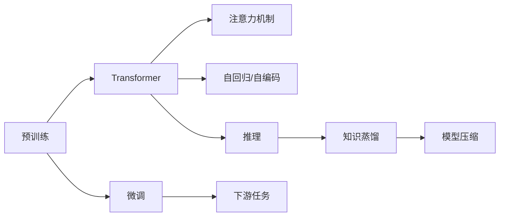

# 大模型体系结构探索：解构AI LLM的内部工作机制

关键词：大语言模型、Transformer、注意力机制、自回归、预训练、微调、推理、知识蒸馏

## 1. 背景介绍

### 1.1 问题的由来

近年来,自然语言处理(NLP)领域取得了突飞猛进的发展,尤其是大规模语言模型(Large Language Models, LLMs)的出现,极大地提升了NLP任务的性能。LLM通过在海量文本数据上进行预训练,能够学习到丰富的语言知识和常识,在机器翻译、问答系统、对话生成等应用中取得了瞩目的成果。然而,这些模型内部的工作机制仍然是一个"黑盒",亟需对其进行深入探索和解构。

### 1.2 研究现状

目前,业界主流的LLM包括GPT系列[1]、BERT[2]、XLNet[3]等,它们大多基于Transformer[4]架构。已有研究对LLM的内部机制进行了初步探索,如分析注意力机制[5]、知识表示[6]等。但现有工作大多局限于某一方面,缺乏对LLM整体架构的系统梳理。同时,随着模型规模不断扩大,对其高效训练和推理也提出了新的挑战。

### 1.3 研究意义

深入理解LLM的内部工作原理,对于指导模型结构的改进和新型架构的设计具有重要意义。通过解构LLM,一方面可以增强模型的可解释性,找出性能提升的关键因素;另一方面也有助于发现模型的局限性,为后续研究提供方向。此外,对LLM高效训练和推理技术的探索,也将推动其在实际应用中的落地。

### 1.4 本文结构

本文将围绕以下内容展开:第2部分介绍LLM相关的核心概念;第3部分重点分析Transformer的核心算法原理;第4部分建立LLM的数学模型并推导关键公式;第5部分通过代码实例演示LLM的实现;第6部分讨论LLM的实际应用场景;第7部分推荐相关工具和学习资源;第8部分总结全文并展望未来研究方向;第9部分列举常见问题解答。

## 2. 核心概念与联系

在探讨LLM内部机制之前,首先需要厘清其涉及的一些核心概念:

- **Transformer**:一种基于自注意力机制的神经网络架构,摒弃了传统的RNN/CNN等结构,能够高效地处理长序列。主要由编码器和解码器组成。
- **注意力机制(Attention)**:一种学习输入序列内部依赖关系的机制。自注意力允许模型并行计算序列中任意两个位置之间的关联度。
- **自回归(Auto-regressive)**:一种序列生成范式,即模型根据之前生成的内容,预测下一个token。代表模型如GPT系列。  
- **自编码(Auto-encoding)**:一种用于预训练的范式,通过引入噪声(如掩码)破坏输入,让模型学习恢复原始序列。代表模型如BERT。
- **预训练(Pre-training)**:在大规模无监督数据上训练模型,学习通用的语言表示。主要采用自回归或自编码的方式。
- **微调(Fine-tuning)**:在下游任务的监督数据上,调整预训练模型的参数,使其适应特定任务。
- **推理(Inference)**:利用训练好的模型,对新样本进行预测或生成。对于生成式模型如GPT,推理过程需要递归调用。
- **知识蒸馏(Knowledge Distillation)**:将大模型的知识转移到小模型中,在保持性能的同时压缩模型体积,加速推理[7]。

这些概念之间环环相扣,共同构成了LLM的核心。如下图所示,预训练是LLM的基础,Transformer是其主要架构,注意力和自回归是关键机制,微调使其适应下游任务,推理则是应用阶段的重点,知识蒸馏用于模型压缩。

## 3. 核心算法原理 & 具体操作步骤

### 3.1 算法原理概述

Transformer是LLM的核心架构,其本质是一个Seq2Seq模型,主要由编码器(Encoder)和解码器(Decoder)组成。编码器负责对输入序列进行特征提取,解码器则根据编码器的输出和之前的生成内容,预测下一个token。两者都采用了自注意力机制和前馈神经网络。

### 3.2 算法步骤详解

以编码器为例,详细说明Transformer的计算过程:

1. **输入表示**:将输入序列X转换为嵌入向量E,并加入位置编码P,得到输入表示H0。

$$H_0 = E + P$$

2. **自注意力计算**:利用自注意力机制,学习序列内部的依赖关系。
   1. 将输入 $H_{i-1}$ 通过三个线性变换,得到查询矩阵Q、键矩阵K、值矩阵V。
   $$Q = W_q H_{i-1}, K = W_k H_{i-1}, V = W_v H_{i-1}$$
   2. 计算Q与K的点积并归一化,得到注意力分布A。
   $$A = softmax(\frac{QK^T}{\sqrt{d_k}})$$
   3. 将A与V相乘,得到注意力输出Z。
   $$Z = AV$$
   4. 通过拼接和线性变换,得到多头注意力的输出 $H_i$。

3. **前馈网络**:对 $H_i$ 通过两层前馈神经网络,引入非线性变换。
$$FFN(H_i) = max(0, H_iW_1 + b_1)W_2 + b_2$$

4. **残差连接和层归一化**:在每个子层之后,加入残差连接和层归一化,有助于梯度传播和模型收敛。
$$LayerNorm(H_i + Sublayer(H_i))$$

解码器的结构与编码器类似,但在自注意力计算时引入了掩码,避免看到未来的信息。此外,解码器还会参考编码器的输出。

### 3.3 算法优缺点

Transformer的优点在于:
- 并行计算能力强,训练和推理效率高。
- 通过自注意力机制,可以捕捉长距离依赖。
- 引入残差连接和层归一化,加深网络深度。

但它也存在一些局限:
- 计算复杂度随着序列长度呈平方增长。
- 位置编码是固定的,缺乏灵活性。
- 解码时难以充分利用双向信息。

### 3.4 算法应用领域

基于Transformer的LLM在NLP领域得到了广泛应用,如:
- 机器翻译:将一种语言翻译成另一种语言。
- 文本摘要:自动提取文本的关键信息,生成简洁摘要。
- 问答系统:根据给定问题从大规模文本中寻找答案。
- 对话生成:自动生成连贯、自然的对话内容。

此外,LLM还被拓展到多模态领域,如图像字幕、视频问答等。

## 4. 数学模型和公式 & 详细讲解 & 举例说明

### 4.1 数学模型构建

对于一个长度为n的输入序列 $X=(x_1,\cdots,x_n)$,Transformer的数学模型可以表示为:

$$P(Y|X) = \prod_{t=1}^m P(y_t|y_{<t},X;\theta)$$

其中, $Y=(y_1,\cdots,y_m)$ 为生成的序列, $\theta$ 为模型参数。该公式体现了语言模型的自回归属性,即当前时刻的输出依赖于之前的输出和整个输入序列。

在编码器中,自注意力机制用于学习输入序列的内部表示。对于第 $l$ 层编码器的第 $i$ 个位置,其查询矩阵 $Q_i^l$ 、键矩阵 $K_i^l$ 和值矩阵 $V_i^l$ 分别为:

$$
\begin{aligned}
Q_i^l &= W_q^l H_i^{l-1} \\
K_i^l &= W_k^l H_i^{l-1} \\ 
V_i^l &= W_v^l H_i^{l-1}
\end{aligned}
$$

其中, $W_q^l, W_k^l, W_v^l$ 为可学习的参数矩阵, $H_i^{l-1}$ 为上一层编码器的输出。

注意力分布 $A_i^l$ 通过查询矩阵和键矩阵的点积计算得到:

$$A_i^l = softmax(\frac{Q_i^l {K_i^l}^T}{\sqrt{d_k}})$$

其中, $d_k$ 为键向量的维度,作为缩放因子。最终的注意力输出 $Z_i^l$ 为:

$$Z_i^l = A_i^l V_i^l$$

通过多头注意力机制,可以并行学习不同的注意力分布,增强模型的表示能力。设有 $h$ 个头,则多头注意力输出 $MH_i^l$ 为:

$$MH_i^l = Concat(Z_{i,1}^l, \cdots, Z_{i,h}^l)W_o^l$$

其中, $W_o^l$ 为输出的线性变换矩阵。

### 4.2 公式推导过程

以下详细推导Transformer中的关键公式。

1. **位置编码**:由于Transformer不包含RNN结构,需要显式地引入位置信息。对于位置 $pos$ 和维度 $i$,位置编码 $PE(pos,2i)$ 和 $PE(pos,2i+1)$ 定义为:

$$
\begin{aligned}
PE(pos,2i) &= sin(pos/10000^{2i/d_{model}}) \\
PE(pos,2i+1) &= cos(pos/10000^{2i/d_{model}})
\end{aligned}
$$

其中, $d_{model}$ 为嵌入向量的维度。可以看出,位置编码是一个固定的正弦/余弦函数,能够表示相对位置关系。

2. **自注意力计算**:以单头注意力为例,对于查询矩阵Q、键矩阵K和值矩阵V,注意力分布A的计算公式为:

$$A = softmax(\frac{QK^T}{\sqrt{d_k}})$$

softmax函数用于将点积结果归一化为概率分布:

$$softmax(x_i) = \frac{exp(x_i)}{\sum_j exp(x_j)}$$

其中, $x_i$ 为向量x的第i个元素。除以 $\sqrt{d_k}$ 是为了缓解点积结果的量级,提高训练稳定性。

最终的注意力输出Z为注意力分布A与值矩阵V的乘积:

$$Z = AV$$

直观地看,自注意力机制可以学习输入序列中任意两个位置之间的依赖关系,越相关的位置得到的注意力权重越大。

3. **层归一化**:层归一化用于缓解深层网络的梯度消失/爆炸问题,加速收敛。对于输入 $x \in \mathbb{R}^{d}$,层归一化公式为:

$$LN(x) = \frac{x-\mu}{\sqrt{\sigma^2+\epsilon}} \odot \gamma + \beta$$

其中, $\mu$ 和 $\sigma^2$ 分别为x的均值和方差, $\epsilon$ 为平滑项, $\gamma$ 和 $\beta$ 为可学习的缩放和偏移参数, $\odot$ 表示逐元素相乘。

层归一化可以看作是对每个样本进行标准化,使其均值为0,方差为1,并引入可学习的缩放和偏移。

### 4.3 案例分析与讲解

下面以一个简单的例子,说明Transformer的计算过程。假设输入序列为"I love AI",对应的token ID为[1,2,3],嵌入维度为4。

1. **输入表示**:通过嵌入矩阵和位置编码,得到输入表示H0:

$$
H_0 = 
\begin{bmatrix}
E_1 \\
E_2 \\
E_3
\end{bmatrix}
+