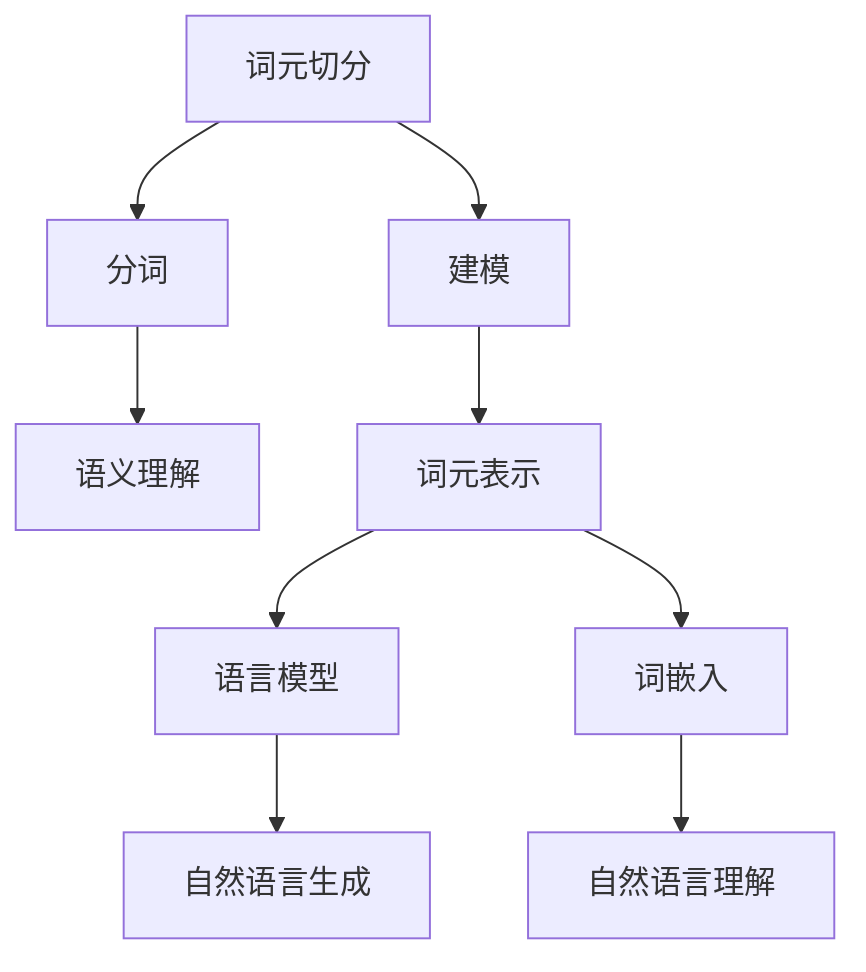

# 大规模语言模型从理论到实践 词元切分

## 1. 背景介绍

### 1.1 问题的由来

在自然语言处理(NLP)领域中,将文本分解为有意义的基本单元是一个基础且关键的任务。传统上,这个基本单元通常被称为"词元"(token)。词元切分(Tokenization)是指将原始文本字符串分割成一系列有意义的词元的过程。

随着深度学习技术在NLP领域的广泛应用,大规模语言模型(如BERT、GPT等)已成为主流方法,展现出卓越的性能表现。然而,这些模型在处理文本输入时,面临着词元切分的挑战。合理高效的词元切分方式对于语言模型的性能至关重要。

### 1.2 研究现状

早期的NLP系统通常采用基于规则的方法进行词元切分,如基于空格、标点符号等简单规则。然而,这种方法存在明显缺陷,如无法正确处理缩写、复合词等情况。

随后,基于统计的词元切分方法应运而生,如基于n-gram模型、最大熵马尔可夫模型等。这些方法通过从大量语料中学习模式,相比基于规则的方法有了一定改进,但仍然存在局限性。

近年来,随着深度学习技术的发展,基于神经网络的词元切分方法逐渐占据主导地位。这些方法通过构建复杂的神经网络模型,从大规模语料中自动学习特征表示,展现出更加优秀的性能。其中,基于字符级别的神经网络模型(如BERT的WordPiece)因其简单高效而备受关注。

### 1.3 研究意义

高质量的词元切分对于大规模语言模型的性能至关重要。合理的词元切分方式不仅能够提高模型的泛化能力,还能减少未知词元的数量,从而提升模型效率。此外,在一些特殊应用场景下(如社交媒体文本、编程代码等),高效的词元切分方法也具有重要意义。

因此,深入研究大规模语言模型的词元切分问题,探索更加高效、通用的切分方法,对于提升语言模型的性能和推动NLP技术发展具有重要意义。

### 1.4 本文结构

本文将从理论和实践两个层面,系统地介绍大规模语言模型中的词元切分技术。

理论层面,我们将重点阐述基于字符级别的神经网络词元切分模型的原理和方法,包括WordPiece、Unigram语言模型、BPE(Byte Pair Encoding)等。我们将详细解释这些模型的数学原理、训练过程,并通过案例分析其优缺点。

实践层面,我们将基于开源的大规模语言模型框架(如BERT、GPT-2等),展示如何实现高效的词元切分模块,并将其集成到语言模型的预处理流程中。我们将提供详细的代码实现、运行结果分析,帮助读者更好地掌握实践技能。

此外,我们还将探讨词元切分在特殊应用场景(如社交媒体文本、编程代码等)中的挑战,并介绍相关的最新研究进展。最后,我们将总结词元切分技术的发展趋势,并展望其未来的发展方向。

## 2. 核心概念与联系

在深入探讨词元切分的具体算法和模型之前,我们需要先了解一些核心概念,并理解它们之间的联系。



1. **分词(Word Segmentation)**: 将连续的字符序列分割成一个个有意义的单词或词元的过程。这是词元切分的核心任务。

2. **建模(Modeling)**: 基于大规模语料,构建统计模型或神经网络模型,学习词元切分的模式和规律。这是实现高效词元切分的关键。

3. **词元表示(Token Representation)**: 将切分后的词元映射为机器可以理解的数值表示,如one-hot编码或分布式向量表示(词嵌入)。这是语言模型处理词元的基础。

4. **语言模型(Language Model)**: 基于大规模语料,学习自然语言的统计规律或语义关系,用于自然语言生成或理解任务。高质量的词元切分是构建高性能语言模型的前提。

5. **自然语言生成(Natural Language Generation)**: 根据语言模型生成连贯、流畅的自然语言文本,如机器翻译、文本摘要、对话系统等。

6. **自然语言理解(Natural Language Understanding)**: 理解自然语言文本的语义含义,如情感分析、命名实体识别、关系抽取等,是人工智能系统与人类自然交互的基础。

7. **语义理解(Semantic Understanding)**: 深入理解自然语言文本的语义内涵,包括词义disambiguition、知识表示等,是实现真正的自然语言理解的核心。

可以看出,词元切分作为自然语言处理的基础任务,与分词、建模、词元表示等概念密切相关。高质量的词元切分不仅对语言模型的性能至关重要,也是实现自然语言生成和理解的基石。因此,探索高效的词元切分方法对于推动整个NLP领域的发展至关重要。

## 3. 核心算法原理 & 具体操作步骤

### 3.1 算法原理概述

大规模语言模型中常用的词元切分算法主要基于字符级别的神经网络模型,包括WordPiece、Unigram语言模型和BPE(Byte Pair Encoding)等。这些模型的核心思想是:基于大规模语料,学习字符或字符片段之间的统计规律,将文本切分为有意义的词元序列。

以WordPiece为例,其算法流程可概括为:

1. **语料预处理**: 对原始语料进行规范化处理,如转小写、去除特殊字符等。

2. **初始词元集合**: 初始化一个包含所有字符和特殊标记(如开头、结尾标记)的词元集合。

3. **词元统计**: 统计语料中所有可能的连续字符串(n-gram)及其出现频率。

4. **词元选择**: 根据一定策略(如最大化likelihood),从候选n-gram中选择一个加入词元集合。

5. **迭代训练**: 重复步骤3和4,直到词元集合达到预设大小或满足其他终止条件。

6. **文本编码**: 使用最终的词元集合,将原始文本切分并编码为词元序列。

上述算法的核心在于通过迭代训练,从语料中学习高频字符串作为词元,从而实现高效的文本切分。不同的算法(如Unigram、BPE等)在具体的统计方法和选择策略上有所不同,但总体思路是相似的。

### 3.2 算法步骤详解

接下来,我们将详细解释WordPiece算法的具体实现步骤。

#### 3.2.1 语料预处理

对原始语料进行规范化处理,主要包括:

1. 将所有文本转换为小写
2. 去除特殊字符(如标点符号、数字等)
3. 添加开头(`<s>`)和结尾(`</s>`)标记

例如,原始文本"Hello, World! 123"经过预处理后变为"`<s>hello world</s>`"。

#### 3.2.2 初始化词元集合

初始化一个包含所有字符和特殊标记的词元集合,即:

$$\text{Vocab} = \{\text{<s>}, \text{</s>}, \text{a}, \text{b}, \text{c}, \ldots, \text{z}\}$$

其中,`<s>`和`</s>`分别表示开头和结尾标记。

#### 3.2.3 词元统计

遍历语料中的所有可能的连续字符串(n-gram),统计它们的出现频率。具体步骤如下:

1. 初始化一个字典`count`,用于存储n-gram及其出现频率。
2. 遍历语料中的每个句子:
    - 将句子拆分为字符序列,例如"`<s>hello world</s>`"被拆分为`['<s>', 'h', 'e', 'l', 'l', 'o', ' ', 'w', 'o', 'r', 'l', 'd', '</s>']`。
    - 对于每个位置`i`及其后续位置`j`,将字符串`''.join(chars[i:j+1])`作为n-gram,在`count`中记录其出现频率。
3. 在`count`中保留频率大于某个阈值(如10)的n-gram。

例如,对于句子"`<s>hello world</s>`",可能的n-gram及其出现频率如下:

```
<s>: 1
</s>: 1
h: 1
e: 1
l: 3
o: 2
 : 1
w: 1
r: 1
d: 1
he: 1
el: 2
ll: 2
lo: 1
o : 1
...
```

#### 3.2.4 词元选择

根据一定策略从候选n-gram中选择一个加入词元集合。常用的策略包括:

1. **最大化likelihood**: 选择能够最大化语料likelihood的n-gram。
2. **最大化词元长度**: 优先选择较长的n-gram,以减少词元数量。

具体来说,对于每个n-gram,我们可以计算将其加入词元集合后,语料的likelihood的变化量。选择能够最大化likelihood变化量的n-gram作为新的词元加入词元集合。

假设当前词元集合为$\text{Vocab}$,语料为$C$,则likelihood可以计算为:

$$\begin{aligned}
\text{Likelihood}(\text{Vocab}, C) &= \prod_{s \in C} P(s | \text{Vocab}) \\
&= \prod_{s \in C} \prod_{i=1}^{|s|} P(s_i | s_{<i}, \text{Vocab})
\end{aligned}$$

其中,$s$表示语料中的句子,$s_i$表示句子中的第$i$个词元,$s_{<i}$表示前$i-1$个词元。

对于候选n-gram $w$,我们可以计算将其加入词元集合后likelihood的变化量:

$$\Delta \text{Likelihood}(w, \text{Vocab}, C) = \text{Likelihood}(\text{Vocab} \cup \{w\}, C) - \text{Likelihood}(\text{Vocab}, C)$$

选择能够最大化$\Delta \text{Likelihood}$的n-gram$w^*$作为新的词元加入词元集合:

$$w^* = \arg\max_{w} \Delta \text{Likelihood}(w, \text{Vocab}, C)$$

#### 3.2.5 迭代训练

重复步骤3和4,不断从候选n-gram中选择新的词元加入词元集合,直到词元集合达到预设大小(如30000)或满足其他终止条件(如likelihood增长率小于阈值)。

#### 3.2.6 文本编码

使用最终训练得到的词元集合,将原始文本切分并编码为词元序列。具体步骤如下:

1. 对原始文本进行预处理(如第3.2.1节所述)。
2. 从左到右扫描文本,找到最长的属于词元集合的字符串作为一个词元。
3. 将每个词元映射为一个数值ID,得到词元ID序列。
4. 添加开头和结尾标记的ID。

例如,对于文本"Hello World",假设词元集合为`{<s>, </s>, He, llo, Wor, ld}`,则编码结果为`[1, 2, 3, 4, 5, 6]`。

通过上述步骤,我们就可以将原始文本高效地切分并编码为词元序列,为后续的语言模型处理做好准备。

### 3.3 算法优缺点

WordPiece算法及其变体(如Unigram、BPE等)作为基于字符级别的神经网络词元切分模型,相比传统的基于规则或统计的方法,具有以下优点:

1. **无需人工规则**: 这些算法通过从大规模语料中自动学习模式,无需人工设计复杂的规则,具有很强的通用性。

2. **高效处理未知词**: 由于是基于字符级别的建模,这些算法能够高效地处理未见过的词汇,避免了传统方法中未知词的问题。

3. **开放词汇表**: 词元集合的大小可以灵活设置,不受限于