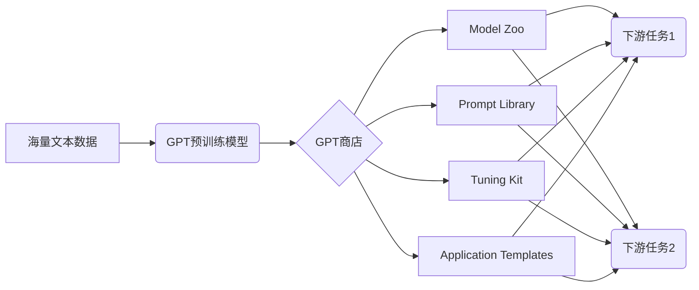

# 大语言模型应用指南：GPTs与GPT商店

## 1. 背景介绍
### 1.1 问题的由来
近年来，随着人工智能技术的飞速发展，大语言模型(Large Language Models, LLMs)成为了自然语言处理领域的研究热点。GPT(Generative Pre-trained Transformer)系列模型作为大语言模型的代表，展现出了惊人的自然语言理解和生成能力，引发了学术界和工业界的广泛关注。然而，如何有效地应用GPT模型来解决实际问题，仍然是一个值得深入探讨的话题。

### 1.2 研究现状
目前，GPT模型已经在许多自然语言处理任务上取得了显著的性能提升，如机器翻译、文本摘要、问答系统等。一些科技巨头如OpenAI、Google、Microsoft等也纷纷推出了自己的GPT模型，如GPT-3、PaLM、Megatron-Turing NLG等。这些模型在参数量和训练数据规模上不断刷新纪录，展现出了强大的语言理解和生成能力。

### 1.3 研究意义
深入研究GPT模型的应用，对于推动自然语言处理技术的发展具有重要意义。一方面，可以探索GPT模型在各个垂直领域的应用场景，如医疗、金融、教育等，提高这些领域的自动化和智能化水平。另一方面，通过总结GPT模型的应用经验和最佳实践，可以为后续的研究和应用提供有益的参考和指导。

### 1.4 本文结构
本文将围绕GPT模型的应用展开深入探讨。首先，我们将介绍GPT模型的核心概念和原理。然后，重点阐述GPT模型的应用框架和实践指南，包括如何针对特定任务微调GPT模型，如何利用GPT商店快速构建应用等。接着，通过实际案例演示GPT模型的应用流程。最后，对GPT模型的未来发展趋势和面临的挑战进行展望。

## 2. 核心概念与联系

GPT(Generative Pre-trained Transformer)是一种基于Transformer架构的大规模语言模型。它采用了无监督的预训练方式，在海量文本数据上学习通用的语言表示，然后再针对下游任务进行微调。GPT模型的关键特点包括：

- 基于Transformer的自注意力机制，能够捕捉长距离的语义依赖关系。
- 使用自回归的生成式预训练目标，可以建模任意长度的文本序列。  
- 模型规模巨大，参数量高达数百亿甚至上万亿，具有强大的语言理解和生成能力。
- 采用无监督预训练+有监督微调的范式，可以快速适应不同的下游任务。

GPT商店是围绕GPT模型构建的应用生态系统。它提供了预训练的GPT模型、微调工具、应用模板等，使得开发者可以快速搭建基于GPT的应用，而无需从头开始训练模型。GPT商店的核心组件包括：

- Model Zoo：提供各种规模和领域的预训练GPT模型，如通用模型、垂直领域模型等。
- Prompt Library：收集了不同任务的Prompt模板，可以帮助开发者设计有效的任务描述。
- Tuning Kit：提供了方便的微调工具，支持Few-shot Learning等高效的微调方式。
- Application Templates：提供了常见应用场景的模板，如对话系统、文本生成等，开发者可以快速搭建原型系统。

下图展示了GPT模型与GPT商店的关系：



## 3. 核心算法原理 & 具体操作步骤

### 3.1 算法原理概述

GPT模型的核心是基于Transformer的解码器结构。与传统的Transformer不同，GPT移除了编码器部分，只保留了解码器。在预训练阶段，GPT通过自回归的方式来建模文本序列，即通过前面的词来预测下一个词。给定一个文本序列 $x=(x_1,x_2,...,x_n)$，GPT的预训练目标是最大化下面的似然概率：

$$\mathcal{L}(\theta)=\sum_{i=1}^{n}\log P(x_i|x_{<i};\theta)$$

其中 $\theta$ 表示模型参数，$x_{<i}$ 表示位置 $i$ 之前的所有词。通过最大化上述似然函数，GPT可以学习到语言的统计规律和语义表示。

在微调阶段，GPT在下游任务的标注数据上进行监督学习。对于每个训练样本 $(x,y)$，GPT将其转化为一个文本序列，并最大化条件概率 $P(y|x;\theta)$。通过微调，GPT可以快速适应特定任务，学习到任务相关的知识。

### 3.2 算法步骤详解

1. 模型初始化：加载预训练的GPT模型参数。

2. 任务定义：将下游任务转化为文本生成任务。通常使用Prompt的方式，将任务描述和输入拼接在一起。例如，对于情感分类任务，可以使用如下的Prompt：

   ```
   Input: 这部电影很好看，我非常喜欢。
   Sentiment: Positive
   
   Input: 这次旅行体验很糟糕，我不会再来了。
   Sentiment:
   ```

3. 数据准备：将任务数据转化为GPT可以处理的格式，即 (Prompt, Completion) 对。对于上述例子，一个数据样本可以表示为：

   ```
   ("Input: 这部电影很好看，我非常喜欢。\nSentiment:", " Positive")
   ```

4. 模型微调：使用准备好的数据对GPT模型进行微调。通常使用Adam优化器，以交叉熵损失函数为目标，对模型参数进行若干轮的更新。

5. 模型评估：在验证集或测试集上评估微调后的模型性能。对于生成任务，可以使用BLEU、ROUGE等指标；对于分类任务，可以使用准确率、F1值等指标。

6. 模型推理：使用微调后的模型对新的输入进行推理。对于上述情感分类任务，给定一个新的句子，可以生成相应的情感标签。

### 3.3 算法优缺点

GPT模型的主要优点包括：

- 强大的语言理解和生成能力，可以处理各种自然语言处理任务。
- 无需大量标注数据，通过预训练和少样本学习即可快速适应新任务。
- 可以生成流畅自然的文本，适用于对话生成、文案创作等场景。

GPT模型的主要缺点包括：

- 模型参数量巨大，训练和推理成本高，对计算资源要求较高。
- 容易生成有偏见、不符合事实的内容，需要谨慎地引导和约束模型的生成过程。
- 对于一些需要推理和常识的任务，如数学计算、逻辑推理等，GPT模型的表现仍有待提高。

### 3.4 算法应用领域

GPT模型可以应用于各种自然语言处理任务，包括但不限于：

- 文本分类：如情感分析、主题分类、意图识别等。
- 文本生成：如对话生成、故事创作、文案生成等。
- 信息抽取：如命名实体识别、关系抽取、事件抽取等。
- 问答系统：根据给定的问题生成相应的答案。
- 机器翻译：将源语言文本翻译成目标语言文本。

除了上述任务外，GPT模型还可以应用于更多垂直领域，如金融、医疗、教育等，辅助人类进行各种智能化的语言处理工作。

## 4. 数学模型和公式 & 详细讲解 & 举例说明

### 4.1 数学模型构建

GPT模型的核心是基于Transformer的解码器结构。我们首先回顾一下Transformer的基本结构。

Transformer由多个编码器和解码器层堆叠而成。每个编码器层包括两个子层：多头自注意力层和前馈神经网络层。每个解码器层包括三个子层：多头自注意力层、编码-解码注意力层和前馈神经网络层。

对于第 $l$ 层解码器，其输入为上一层的输出 $\mathbf{h}^{l-1}=(\mathbf{h}_1^{l-1},...,\mathbf{h}_n^{l-1})$，每个 $\mathbf{h}_i^{l-1}$ 是一个 $d$ 维的向量。解码器的计算过程如下：

1. 多头自注意力层：
$$\mathbf{s}^{l}_i=\text{MultiHead}(\mathbf{h}^{l-1}_i,\mathbf{h}^{l-1}_{\le i},\mathbf{h}^{l-1}_{\le i})$$

2. 编码-解码注意力层：
$$\mathbf{c}^{l}_i=\text{MultiHead}(\mathbf{s}^{l}_i,\mathbf{e},\mathbf{e})$$

3. 前馈神经网络层：
$$\mathbf{h}^{l}_i=\text{FeedForward}(\mathbf{c}^{l}_i)$$

其中，$\mathbf{e}=(\mathbf{e}_1,...,\mathbf{e}_m)$ 表示编码器的输出序列。$\text{MultiHead}$ 表示多头注意力机制，$\text{FeedForward}$ 表示前馈神经网络。

GPT模型移除了编码器部分，只保留了解码器。对于第 $l$ 层的GPT解码器，其计算过程简化为：

1. 多头自注意力层：
$$\mathbf{s}^{l}_i=\text{MultiHead}(\mathbf{h}^{l-1}_i,\mathbf{h}^{l-1}_{\le i},\mathbf{h}^{l-1}_{\le i})$$

2. 前馈神经网络层：
$$\mathbf{h}^{l}_i=\text{FeedForward}(\mathbf{s}^{l}_i)$$

通过堆叠多个解码器层，GPT可以建模任意长度的文本序列，并捕捉长距离的语义依赖关系。

### 4.2 公式推导过程

下面我们详细推导GPT模型中的关键公式。

对于第 $l$ 层解码器的第 $i$ 个位置，其多头自注意力的计算过程如下：

1. 计算查询向量 $\mathbf{q}^l_i$、键向量 $\mathbf{k}^l_j$ 和值向量 $\mathbf{v}^l_j$：

$$\mathbf{q}^l_i=\mathbf{W}^Q_l\mathbf{h}^{l-1}_i$$
$$\mathbf{k}^l_j=\mathbf{W}^K_l\mathbf{h}^{l-1}_j, j\le i$$
$$\mathbf{v}^l_j=\mathbf{W}^V_l\mathbf{h}^{l-1}_j, j\le i$$

其中，$\mathbf{W}^Q_l, \mathbf{W}^K_l, \mathbf{W}^V_l$ 是可学习的参数矩阵。

2. 计算注意力得分 $\alpha^l_{ij}$：

$$\alpha^l_{ij}=\frac{\exp(\mathbf{q}^{lT}_i\mathbf{k}^l_j/\sqrt{d})}{\sum_{j'\le i}\exp(\mathbf{q}^{lT}_i\mathbf{k}^l_{j'}/\sqrt{d})}$$

其中，$d$ 是查询向量和键向量的维度。

3. 计算注意力输出 $\mathbf{s}^l_i$：

$$\mathbf{s}^l_i=\sum_{j\le i}\alpha^l_{ij}\mathbf{v}^l_j$$

前馈神经网络层的计算过程如下：

$$\mathbf{h}^l_i=\text{ReLU}(\mathbf{W}^1_l\mathbf{s}^l_i+\mathbf{b}^1_l)\mathbf{W}^2_l+\mathbf{b}^2_l$$

其中，$\mathbf{W}^1_l, \mathbf{W}^2_l, \mathbf{b}^1_l, \mathbf{b}^2_l$