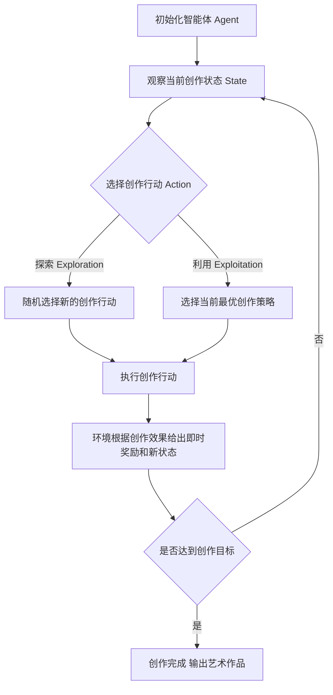

# 强化学习：在人工智能艺术创作中的应用

关键词：强化学习、人工智能、艺术创作、生成对抗网络、深度强化学习、创意生成

## 1. 背景介绍
### 1.1 问题的由来
随着人工智能技术的飞速发展，AI在各个领域都取得了令人瞩目的成就。近年来，人工智能开始涉足艺术创作领域，并展现出了惊人的创造力。人工智能艺术家已经能够创作出与人类艺术家媲美的作品，引发了人们对人工智能在艺术领域应用的广泛关注和讨论。在众多人工智能技术中，强化学习作为一种重要的机器学习范式，在人工智能艺术创作中展现出了巨大的潜力。

### 1.2 研究现状
目前，国内外学者已经开始探索强化学习在人工智能艺术创作中的应用。一些研究者将强化学习与生成对抗网络(GAN)相结合，提出了创新的艺术生成模型，如SPIRAL、CAN等。这些模型能够学习人类艺术家的创作风格，生成具有艺术美感的图像和音乐作品。另一些研究者则利用深度强化学习，让AI通过自主探索和试错来学习艺术创作技巧，如绘画、作曲等。尽管取得了一定进展，但将强化学习应用于艺术创作仍面临诸多挑战，如奖励函数设计、探索与利用平衡等，有待进一步研究。

### 1.3 研究意义
将强化学习应用于人工智能艺术创作具有重要的理论和实践意义：
1. 推动人工智能在艺术领域的发展，拓宽人工智能的应用边界。
2. 为计算机辅助艺术创作和智能设计提供新的思路和方法。 
3. 加深对人类创造力本质的理解，探索机器创造力的奥秘。
4. 催生新的艺术形式和流派，为艺术创作注入新的活力。
5. 为艺术教育和普及提供新的工具和手段。

### 1.4 本文结构
本文将全面探讨强化学习在人工智能艺术创作中的应用。第2部分介绍强化学习和艺术创作的核心概念及二者的联系。第3部分重点阐述强化学习的核心算法原理及操作步骤。第4部分建立数学模型，推导相关公式，并举例说明。第5部分给出项目实践，分享代码实例及详细解释。第6部分讨论强化学习在艺术创作中的实际应用场景。第7部分推荐相关工具和学习资源。第8部分总结全文，展望未来发展趋势与挑战。第9部分附录，解答常见问题。

## 2. 核心概念与联系
强化学习是一种重要的机器学习范式，其本质是让智能体（agent）通过与环境的交互来学习最优策略，以获得最大的累积奖励。与监督学习和无监督学习不同，强化学习更加注重智能体的主动学习和探索。智能体根据当前状态采取行动，环境根据行动给予即时奖励并转移到新的状态，智能体以此不断调整策略，最终学会在各种状态下采取最优行动。

艺术创作是人类表达思想感情、审美追求的一种方式，是创造力的体现。优秀的艺术作品往往能引起人们的情感共鸣，具有独特的艺术价值和审美魅力。传统的艺术创作主要依靠人类艺术家的才华和技巧，但随着人工智能的发展，机器也开始展现出惊人的创造力。

将强化学习应用于艺术创作，就是让人工智能通过不断探索和试错来学习艺术创作的策略和技巧。人工智能扮演智能体的角色，艺术创作过程就是智能体与环境的交互。智能体根据当前的创作状态（如画布、音符等）采取创作行动（如绘画、谱曲等），环境根据行动的效果给予评价和反馈（即奖励函数），并呈现新的创作状态。智能体以此不断优化创作策略，最终学会创作出优美的艺术作品。

强化学习与艺术创作的结合有几个关键点：
1. 奖励函数的设计：如何客观评价艺术作品的质量，给予智能体适当的奖励，是应用强化学习的关键。可借助人类反馈、对抗网络等方式构建奖励函数。
2. 探索与利用的平衡：智能体要在探索新的创作可能性和利用已有的创作经验之间权衡。需要设计合理的探索策略，鼓励创新的同时避免脱离艺术创作的范畴。
3. 状态空间和行动空间的表示：艺术创作的状态空间和行动空间是高维、连续的，需要合理的特征表示和行动参数化方法。
4. 人机交互与协作：人工智能与人类艺术家的交互和协作，可以实现优势互补，创造出更加出色的艺术作品。

下面以一个流程图来展示将强化学习应用于艺术创作的基本流程：

## 3. 核心算法原理 & 具体操作步骤
### 3.1 算法原理概述
强化学习的核心是让智能体学习一个最优策略 $\pi^*$，使得在策略 $\pi$ 的指导下智能体与环境交互能获得最大的期望累积奖励。形式化地，令 $s$ 表示状态，$a$ 表示行动，$r$ 表示即时奖励，$\gamma$ 为折扣因子。定义状态价值函数 $V^\pi(s)$ 和动作价值函数 $Q^\pi(s,a)$ 如下：

$$
V^\pi(s) = \mathbb{E}^\pi[\sum_{t=0}^{\infty} \gamma^t r_t | s_0 = s] \\
Q^\pi(s,a) = \mathbb{E}^\pi[\sum_{t=0}^{\infty} \gamma^t r_t | s_0 = s, a_0=a]
$$

最优策略 $\pi^*$ 需要满足 Bellman 最优方程：

$$
V^*(s) = \max_a Q^*(s,a) \\
Q^*(s,a) = \mathbb{E}[r + \gamma \max_{a'} Q^*(s',a') | s, a]
$$

常见的求解最优策略的算法有价值迭代、策略迭代和 Q-learning 等。在实践中，当状态和行动空间较大时，通常用函数近似的方法来表示价值函数，如深度 Q 网络（DQN）。

### 3.2 算法步骤详解
以 Q-learning 算法为例，具体步骤如下：
1. 初始化 Q 表格 $Q(s,a)$，对所有状态-行动对赋予初始值（一般为0）。
2. 重复下述过程直到收敛或达到预设的训练轮数：
   1. 初始化起始状态 $s$
   2. 重复下述步骤直到回合结束：
      1. 根据 $\epsilon$-贪婪策略选择行动 $a$，即以 $\epsilon$ 的概率随机选择行动，否则选择 $Q(s,\cdot)$ 最大的行动。
      2. 执行行动 $a$，观察奖励 $r$ 和新状态 $s'$。 
      3. 更新 Q 值：$Q(s,a) \leftarrow Q(s,a) + \alpha [r + \gamma \max_{a'} Q(s',a') - Q(s,a)]$
      4. $s \leftarrow s'$
3. 输出最优策略 $\pi^*(s) = \arg\max_a Q(s,a)$

其中，$\alpha$ 为学习率，$\epsilon$ 控制探索和利用的平衡。

### 3.3 算法优缺点
Q-learning 的优点是简单易实现，对环境的转移概率没有要求，能够从经验中学习。但其缺点是容易受到状态空间大小的影响，难以处理连续状态和行动空间。此外，异步更新可能导致训练不稳定。

为克服这些缺点，研究者提出了多种改进算法，如 DQN、Double DQN、Dueling DQN、策略梯度等。这些算法利用深度神经网络来拟合价值函数，并引入了经验回放、固定 Q 目标、双网络等技巧来提升训练的稳定性和效率。

### 3.4 算法应用领域
强化学习在众多领域都有应用，如智能控制、机器人、自然语言处理、计算机视觉等。近年来，强化学习在游戏、推荐系统、自动驾驶、金融投资等方面取得了瞩目成就。将强化学习引入艺术创作领域，为发掘人工智能在更广领域的应用潜力提供了新的思路。

## 4. 数学模型和公式 & 详细讲解 & 举例说明
### 4.1 数学模型构建
考虑将马尔可夫决策过程（MDP）作为将强化学习应用于艺术创作的数学模型。一个MDP由一个六元组 $\langle \mathcal{S}, \mathcal{A}, \mathcal{P}, \mathcal{R}, \gamma \rangle$ 定义，其中：
- $\mathcal{S}$ 是有限的状态集合，表示艺术创作过程中的各种可能状态，如画布、音符组合等。
- $\mathcal{A}$ 是有限的行动集合，表示艺术创作过程中的各种可能行动，如绘画笔触、谱曲音符等。
- $\mathcal{P}$ 是状态转移概率矩阵，$\mathcal{P}_{ss'}^a$ 表示在状态 $s$ 下采取行动 $a$ 后转移到状态 $s'$ 的概率。
- $\mathcal{R}$ 是奖励函数，$\mathcal{R}_s^a$ 表示在状态 $s$ 下采取行动 $a$ 后获得的即时奖励。
- $\gamma \in [0,1]$ 是折扣因子，表示未来奖励的重要程度。

在此基础上，我们的目标是寻找一个最优策略 $\pi^*: \mathcal{S} \rightarrow \mathcal{A}$，使得智能体在该策略指导下进行艺术创作，能够获得最大的期望累积奖励。

### 4.2 公式推导过程
根据MDP的定义，我们可以推导出求解最优策略的Bellman最优方程。首先，定义状态价值函数 $V^\pi(s)$ 和动作价值函数 $Q^\pi(s,a)$ 如下：

$$
V^\pi(s) = \mathbb{E}^\pi[\sum_{t=0}^{\infty} \gamma^t \mathcal{R}_{s_t}^{a_t} | s_0 = s] \\
Q^\pi(s,a) = \mathbb{E}^\pi[\sum_{t=0}^{\infty} \gamma^t \mathcal{R}_{s_t}^{a_t} | s_0 = s, a_0=a]
$$

其中，$\mathbb{E}^\pi$ 表示在策略 $\pi$ 指导下的期望。根据Bellman方程，我们有：

$$
V^\pi(s) = \sum_a \pi(a|s) \sum_{s'} \mathcal{P}_{ss'}^a [\mathcal{R}_s^a + \gamma V^\pi(s')] \\
Q^\pi(s,a) = \sum_{s'} \mathcal{P}_{ss'}^a [\mathcal{R}_s^a + \gamma \sum_{a'} \pi(a'|s') Q^\pi(s',a')]
$$

最优策略 $\pi^*$ 需要满足 Bellman 最优方程：

$$
V^*(s) = \max_a Q^*(s,a) \\
Q^*(s,a) = \sum_{s'} \mathcal{P}_{ss'}^a [\mathcal{R}_s^a + \gamma \max_{a'} Q^*(s',a')]
$$

### 4.3 案例分