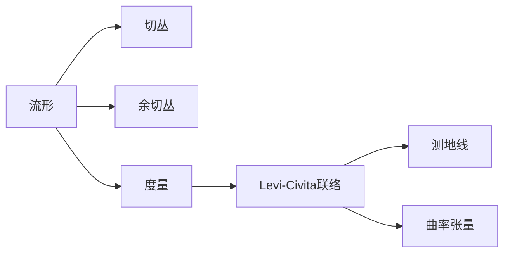

# 微分几何入门与广义相对论：截面的物理意义

关键词：微分几何、广义相对论、截面、流形、黎曼几何、爱因斯坦场方程、测地线

## 1. 背景介绍
### 1.1  问题的由来
微分几何是数学的一个分支,它研究光滑流形上的几何性质。广义相对论是爱因斯坦提出的一种描述时空和引力的理论,它利用了微分几何的工具。在广义相对论中,时空被建模为一个4维黎曼流形,引力被解释为时空几何的曲率效应。微分几何中的一些概念,如截面,在广义相对论中有重要的物理意义。

### 1.2  研究现状
目前,微分几何和广义相对论都是数学和物理学研究的热点领域。许多数学家和物理学家致力于研究微分几何的深层结构以及它在物理学中的应用。广义相对论也在不断发展,人们提出了各种广义相对论的推广理论,如高维引力理论、量子引力理论等。同时,广义相对论的许多预言,如黑洞和引力波,都得到了观测的证实。

### 1.3  研究意义 
深入理解微分几何和广义相对论对于推动数学和物理学的发展具有重要意义。微分几何为广义相对论提供了数学基础,而广义相对论又为微分几何的发展提供了动力。研究微分几何中的一些概念,如截面,在广义相对论中的物理意义,有助于加深我们对时空和引力本质的认识。这不仅具有理论意义,而且可能带来新的物理学发现和技术革新。

### 1.4  本文结构
本文将首先介绍微分几何的一些核心概念,如流形、切丛、联络、曲率等,并阐述它们之间的联系。然后,我们将重点讨论截面的概念及其几何意义。在此基础上,我们将探讨截面在广义相对论中的物理意义,特别是它与引力场和物质场的关系。我们还将给出一些数学模型和公式,并通过具体的例子加以说明。最后,我们将总结全文,并展望微分几何和广义相对论的未来发展趋势与挑战。

## 2. 核心概念与联系
微分几何的核心概念包括流形、切丛、余切丛、度量、联络、测地线、曲率等。一个n维流形是一个局部类似于n维欧氏空间的空间。切丛是附着在流形上的一个向量丛,它的每一个纤维都是流形上对应点的切空间。余切丛是切丛的对偶丛。度量给出了流形上向量的长度和角度的度量。联络是一种定义在切丛上的导数,它告诉我们如何沿着流形上的曲线平行移动向量。测地线是流形上的"直线",它们是联络的积分曲线。曲率是对流形曲率的度量,它可以用联络来表示。

这些概念之间有着密切的联系。流形上的度量诱导出一个联络,称为Levi-Civita联络。Levi-Civita联络的测地线就是流形上的最短线。Levi-Civita联络的曲率张量包含了流形的所有内蕴几何信息。下图给出了这些概念之间的逻辑关系:



## 3. 核心算法原理 & 具体操作步骤
### 3.1  算法原理概述
在微分几何中,一个重要的问题是如何在流形上做微积分。这需要引入联络的概念。联络可以看作是一种定义在切丛上的导数,它满足一些性质,如线性性、Leibniz法则等。给定一个联络,我们可以定义向量场的协变导数、测地线、曲率张量等。特别地,如果联络与流形上的度量相容,那么它就是Levi-Civita联络。Levi-Civita联络有许多优良性质,如它的测地线就是最短线,它的挠率为零等。

### 3.2  算法步骤详解
1. 给定一个流形 $M$,定义它的切丛 $TM$ 和余切丛 $T^*M$。
2. 在 $M$ 上引入一个度量张量 $g$,它给出了流形上向量的内积。  
3. 定义Levi-Civita联络 $\nabla$,它满足以下条件:
   - $\nabla$ 是对称的,即 $\nabla_X Y - \nabla_Y X = [X, Y]$,其中 $X,Y$ 是向量场, $[X,Y]$ 是它们的Lie括号。
   - $\nabla$ 与度量 $g$ 相容,即 $\nabla g=0$。
4. 计算 $\nabla$ 的Christoffel符号 $\Gamma_{ij}^k$,它们决定了联络对向量场的作用。
5. 利用 $\nabla$ 定义向量场的协变导数、测地线方程、曲率张量等。
6. 对于给定的问题,利用上述工具进行计算和分析。

### 3.3  算法优缺点
Levi-Civita联络的优点在于它完全由流形的度量决定,具有良好的几何性质,如测地线最短、挠率为零等。它是研究黎曼几何的基本工具。但是,计算Levi-Civita联络和曲率张量可能会比较复杂,特别是在高维流形上。此外,有些问题可能需要考虑更一般的联络,如挠联络等。

### 3.4  算法应用领域
微分几何的算法在广义相对论、弦理论、几何拓扑、计算机图形学等领域都有广泛应用。特别是在广义相对论中,时空连续体被建模为一个4维黎曼流形,爱因斯坦场方程就是关于度规张量的一个非线性偏微分方程组。求解爱因斯坦方程需要用到大量的微分几何工具,如Levi-Civita联络、黎曼曲率张量、测地线等。

## 4. 数学模型和公式 & 详细讲解 & 举例说明
### 4.1  数学模型构建
设 $(M,g)$ 是一个黎曼流形, $\nabla$ 是它的Levi-Civita联络。在局部坐标 $(x^i)$ 下,度量张量 $g$ 的分量为 $g_{ij}$,Levi-Civita联络 $\nabla$ 的Christoffel符号为 $\Gamma_{ij}^k$。它们满足以下关系:

$$
\Gamma_{ij}^k = \frac{1}{2}g^{km}(\partial_i g_{jm} + \partial_j g_{im} - \partial_m g_{ij})
$$

其中 $g^{ij}$ 是 $g_{ij}$ 的逆矩阵, $\partial_i$ 表示对坐标 $x^i$ 的偏导数。

给定一个向量场 $X=X^i\partial_i$,它的协变导数 $\nabla_j X^i$ 定义为:

$$
\nabla_j X^i = \partial_j X^i + \Gamma_{jk}^i X^k
$$

黎曼曲率张量 $R_{ijk}^l$ 定义为:

$$
R_{ijk}^l = \partial_i\Gamma_{jk}^l - \partial_j\Gamma_{ik}^l + \Gamma_{im}^l\Gamma_{jk}^m - \Gamma_{jm}^l\Gamma_{ik}^m
$$

它刻画了流形的曲率。黎曼曲率张量满足一些对称性,如一阶、二阶Bianchi恒等式等。

### 4.2  公式推导过程
1. 度规相容条件 $\nabla g=0$ 等价于:

$$
\partial_k g_{ij} = \Gamma_{ki}^m g_{mj} + \Gamma_{kj}^m g_{im}
$$

利用这个条件,可以推导出Christoffel符号的表达式。

2. 协变导数 $\nabla_j X^i$ 的定义可以从平行移动的概念出发。设 $\gamma(t)$ 是流形上的一条曲线,一个向量场 $X$ 沿 $\gamma$ 平行移动,如果它满足:

$$
\frac{d}{dt}X^i + \Gamma_{jk}^i \frac{d\gamma^j}{dt}X^k = 0
$$

这个方程的解就是 $X$ 在 $\gamma$ 上的平行移动。协变导数 $\nabla_j X^i$ 可以看作是 $X$ 在坐标方向 $\partial_j$ 上的平行移动。

3. 黎曼曲率张量 $R_{ijk}^l$ 可以从向量场的二阶协变导数出发推导。对任意向量场 $X,Y,Z$,定义:

$$
R(X,Y)Z = \nabla_X\nabla_Y Z - \nabla_Y\nabla_X Z - \nabla_{[X,Y]}Z
$$

其中 $[X,Y]$ 是 $X,Y$ 的Lie括号。在局部坐标下,上式等价于:

$$
R(\partial_i,\partial_j)\partial_k = R_{ijk}^l \partial_l
$$

由此可以推导出黎曼曲率张量的表达式。

### 4.3  案例分析与讲解
考虑2维单位球面 $S^2$,它的度量在球面坐标 $(\theta,\phi)$ 下的表达式为:

$$
ds^2 = d\theta^2 + \sin^2\theta d\phi^2
$$

度量张量的分量为:

$$
g_{11}=1, \quad g_{12}=g_{21}=0, \quad g_{22}=\sin^2\theta
$$

利用Christoffel符号的表达式,可以计算出:

$$
\Gamma_{12}^2 = \Gamma_{21}^2 = \cot\theta, \quad \Gamma_{22}^1 = -\sin\theta\cos\theta
$$

其他分量为0。进一步,可以计算出黎曼曲率张量的分量为:

$$
R_{1212} = \sin^2\theta
$$

其他分量为0或由对称性决定。这表明球面是一个正曲率为1的黎曼曲面。

### 4.4  常见问题解答
Q: 什么是测地线?测地线有什么性质?
A: 测地线是黎曼流形上的"直线",它们是Levi-Civita联络的积分曲线。测地线有以下性质:
  - 测地线是长度最短的曲线,即任意两点之间的测地线都是连接这两点的最短曲线。
  - 测地线的切向量沿测地线平行移动,即测地线的加速度为零。
  - 测地线的方程可以写成测地线方程:

  $$
  \frac{d^2x^i}{dt^2} + \Gamma_{jk}^i \frac{dx^j}{dt}\frac{dx^k}{dt} = 0
  $$

Q: 什么是截面?截面有什么几何意义?  
A: 截面是定义在流形上的向量从,它将流形上的每一点映射到该点的切空间中的一个向量。直观地说,截面就是流形上的一个向量场。截面有以下几何意义:
  - 截面刻画了流形上的一个方向场,它给出了流形上每一点的一个方向。
  - 截面可以用来定义流形上的微分算子,如外微分、Lie导数等。
  - 在广义相对论中,物质场和规范场都可以用截面来描述。例如,电磁场可以用1-形式的截面来描述。

## 5. 项目实践：代码实例和详细解释说明
### 5.1  开发环境搭建
本项目使用Python语言和NumPy、SciPy、SymPy等库进行开发。首先,安装以下库:

```bash
pip install numpy scipy sympy matplotlib
```

### 5.2  源代码详细实现
以下代码实现了计算2维球面 $S^2$ 的Christoffel符号和黎曼曲率张量的功能:

```python
import sympy as sp

# 定义坐标和度量张量
theta, phi = sp.symbols('theta phi')
g = sp.Matrix([[1, 0], [0, sp.sin(theta)**2]])

# 计算度规张量的逆矩阵
g_inv = g.inv()

# 计算Christoffel符号
def christoffel_symbol(i, j, k):
    return sp.simplify(0.5 * g_inv[i, k] * (sp.diff(g[j, k], theta) + sp.diff(