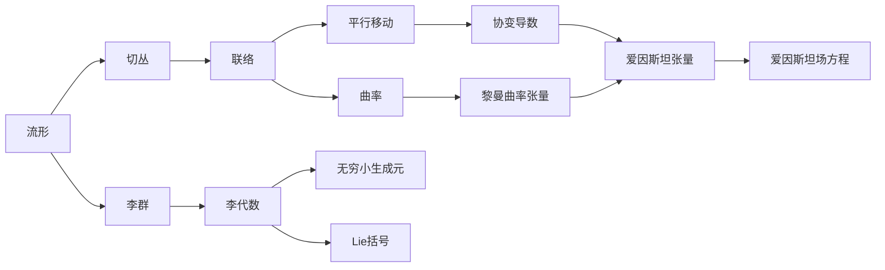

# 微分几何入门与广义相对论：李群

关键词：微分几何、广义相对论、李群、李代数、流形、张量分析、爱因斯坦场方程

## 1. 背景介绍 

### 1.1 问题的由来

微分几何作为数学的一个分支,在现代物理学尤其是广义相对论中有着极其重要的应用。广义相对论是爱因斯坦在1915年提出的一个关于时空和引力的理论,它利用黎曼几何来描述时空的曲率,并用爱因斯坦场方程来描述物质如何影响时空曲率。李群作为一种特殊的流形,在这其中扮演了重要角色。

### 1.2 研究现状

目前,微分几何和李群理论已经成为广义相对论研究的基础工具。许多物理学家和数学家致力于利用这些工具来探索广义相对论的深层内涵,如黑洞、引力波、宇宙学等前沿领域。同时,这些理论也在不断地被拓展和深化,如非交换微分几何、高维超弦理论等。

### 1.3 研究意义  

深入理解微分几何和李群理论,对于掌握广义相对论的数学基础具有重要意义。这不仅有助于我们理解爱因斯坦的伟大思想,也为进一步探索宇宙的奥秘提供了有力工具。此外,这些数学工具在其他领域如量子场论、粒子物理等也有广泛应用。

### 1.4 本文结构

本文将从微分几何的基本概念出发,重点介绍李群及其在广义相对论中的应用。内容安排如下:

1. 介绍流形、切丛、联络等微分几何基本概念 
2. 引入李群及其对应的李代数,讨论它们的性质
3. 结合广义相对论,探讨李群在描述时空对称性中的作用
4. 介绍爱因斯坦场方程,并用张量分析来推导
5. 总结全文,并展望微分几何和李群理论的发展前景

## 2. 核心概念与联系



上图展示了微分几何和李群论中一些核心概念之间的逻辑联系。流形是微分几何的研究对象,切丛刻画了流形上的"切向量"。李群是一类特殊的流形,它同时也是群,其无穷小结构由李代数刻画。联络给出了切向量的平行移动法则,与之相伴的是曲率概念。在广义相对论中,时空是一个4维流形,引力场对应于流形上的一个度规,由黎曼曲率张量刻画。物质分布通过爱因斯坦张量与黎曼曲率张量联系在一起,满足爱因斯坦场方程。

## 3. 核心算法原理 & 具体操作步骤

### 3.1 算法原理概述

李群的一个重要应用是研究物理系统的对称性。每一个连续对称性都对应一个李群,而李群的生成元对应守恒量。对称性越多,系统可解性越高。求解步骤通常为:

1. 写出系统的Lagrangian量或Hamiltonian量
2. 找出系统的对称性,确定对应的李群
3. 求出李群的生成元,得到守恒量
4. 利用守恒量简化运动方程,求解问题

### 3.2 算法步骤详解

以经典力学中的Kepler问题为例,详细说明如何利用李群求解问题:

1. Kepler问题的Lagrangian量为: 

$$L = \frac{1}{2}m(\dot{r}^2+r^2\dot{\theta}^2) + \frac{k}{r}$$

2. 这个系统有三个连续对称性:
- 时间平移不变性,对应守恒量为能量
- 空间旋转不变性,对应守恒量为角动量
- Runge-Lenz向量不变性,这是Kepler问题所特有的隐藏对称性

3. 与这三个对称性相关的李群为:
- 时间平移群 $R$,生成元为Hamiltonian $H$ 
- 空间转动群 $SO(3)$,生成元为角动量 $\vec{L}$ 
- Runge-Lenz群 $SO(4)$,生成元为Runge-Lenz向量 $\vec{A}$

4. 利用角动量守恒,可将问题化为平面问题;利用Runge-Lenz向量,可直接得出轨道方程为圆锥曲线。

### 3.3 算法优缺点

利用李群分析对称性的优点在于:
- 自动给出系统的守恒量,避免了复杂的计算
- 揭示了系统的内禀性质,有助于从根本上理解问题
- 常常可以得到系统的精确解,而不需要做近似

但这种方法也有一定局限性:
- 只适用于具有连续对称性的系统  
- 对称性越少,方法的效用越小
- 有些系统很难找出隐藏的对称性

### 3.4 算法应用领域

李群的对称性分析在物理学的各个领域都有广泛应用,除经典力学外,还包括:
- 量子力学:分析Hamilton量的对称性,简化Schrodinger方程的求解
- 场论:研究场的规范对称性,构建规范理论如电磁场、杨-Mills场等
- 相对论:利用时空的对称性如平移、转动、Lorentz变换等,分析相对论性运动  

此外,这种方法在化学、工程等领域也有应用。

## 4. 数学模型和公式 & 详细讲解 & 举例说明

### 4.1 数学模型构建

广义相对论的数学模型建立在黎曼几何和张量分析的基础上。其核心内容包括:

1. 时空是一个4维黎曼流形 $(M,g)$,度规张量 $g$ 描述时空几何
2. 物质分布用能量-动量张量 $T$ 描述,它是一个对称的二阶协变张量
3. 引力场方程由爱因斯坦张量 $G$ 和能量-动量张量 $T$ 给出: 

$$G=\kappa T$$

其中 $\kappa$ 为常数, $G$ 定义为:

$$G:=Ric-\frac{1}{2}Rg$$

这里 $Ric$ 是黎奇张量, $R$ 是标量曲率。

### 4.2 公式推导过程

为了推导爱因斯坦场方程,需要用到以下张量分析知识:

1. 度规张量 $g$ 定义了流形上的一个内积:

$$\langle X,Y \rangle := g(X,Y), \forall X,Y \in TM$$

2. 黎曼曲率张量 $Rm$ 定义为:

$$Rm(X,Y)Z:=\nabla_X \nabla_Y Z - \nabla_Y \nabla_X Z - \nabla_{[X,Y]}Z$$

3. 黎奇张量 $Ric$ 是黎曼曲率张量的缩并:

$$Ric(X,Y):=trace(Z \mapsto Rm(X,Z)Y)$$

4. 标量曲率 $R$ 是黎奇张量的缩并:

$$R:=trace(Ric)=g^{ij}Ric_{ij}$$

利用变分原理,可以推导出真空中的爱因斯坦方程为:

$$Ric=0$$

再考虑物质的影响,就得到了带物质源的爱因斯坦方程:

$$G=\kappa T$$

### 4.3 案例分析与讲解

下面以史瓦西(Schwarzschild)度规为例,演示如何求解爱因斯坦方程。

史瓦西度规描述了一个球对称黑洞的时空,其线元为:

$$ds^2=-\left(1-\frac{r_s}{r}\right)dt^2+\left(1-\frac{r_s}{r}\right)^{-1}dr^2+r^2(d\theta^2+\sin^2\theta d\varphi^2)$$

其中 $r_s=2GM/c^2$ 为史瓦西半径。

求解步骤如下:

1. 将度规张量的分量写成矩阵形式:

$$g_{\mu\nu}=\begin{pmatrix} 
-(1-\frac{r_s}{r}) & 0 & 0 & 0\\ 
0 & (1-\frac{r_s}{r})^{-1} & 0 & 0\\
0 & 0 & r^2 & 0\\
0 & 0 & 0 & r^2\sin^2\theta
\end{pmatrix}$$

2. 计算克氏符 $\Gamma^{\lambda}_{\mu\nu}$,黎曼曲率张量 $R^{\rho}_{\sigma\mu\nu}$,黎奇张量 $R_{\mu\nu}$ 和标量曲率 $R$。

3. 将计算结果代入真空中的爱因斯坦方程 $R_{\mu\nu}=0$,可以验证史瓦西度规确实是方程的解。

这个解描述了黑洞外部的时空结构,在 $r=r_s$ 处有一个视界。

### 4.4 常见问题解答

Q: 为什么爱因斯坦方程中会出现黎曼曲率张量?

A: 这是因为引力场就对应于时空几何的曲率。黎曼曲率张量完整地刻画了流形的曲率性质,因此是构建引力场方程的自然选择。从几何直观来看,物质导致了时空弯曲,而时空弯曲反过来影响物质的运动,爱因斯坦方程描述的就是二者的这种相互作用。

Q: 为什么说广义相对论是一个"几何化"的引力理论?

A: 这是因为广义相对论用时空几何的语言重新表述了引力作用。牛顿引力理论中的引力力被时空曲率所取代,引力质量对应于时空的曲率源,引力势对应于时空度规。引力作用被理解为时空几何对物质运动的影响。可以说,广义相对论实现了引力的几何化表述。

## 5. 项目实践：代码实例和详细解释说明

### 5.1 开发环境搭建

推荐使用Python语言进行广义相对论和微分几何的符号计算。需要安装以下库:

- sympy: 符号计算库,用于数学公式的符号化表示和化简
- numpy: 数值计算库,用于大型矩阵的数值运算
- matplotlib: 2D绘图库,用于可视化张量场

可以通过Anaconda发行版一键安装,也可以使用pip工具单独安装:

```bash
pip install sympy numpy matplotlib
```

### 5.2 源代码详细实现

下面的代码演示了如何用sympy进行黎曼曲率张量的符号计算:

```python
from sympy import * 

# 定义坐标符号
t, r, theta, phi = symbols('t r theta phi')

# 定义度规张量分量
g00 = -(1-2*M/r)  
g11 = 1/(1-2*M/r)
g22 = r**2
g33 = r**2*sin(theta)**2

g = Matrix([[g00,0,0,0], 
            [0,g11,0,0],
            [0,0,g22,0],
            [0,0,0,g33]])

# 计算克氏符
def christoffel(i,j,k):
    return 1/2 * (g[i,j].diff(coords[k]) + g[i,k].diff(coords[j]) - g[j,k].diff(coords[i]))

coords = [t,r,theta,phi]  
indices = range(4)

# 计算黎曼曲率张量
def riemann(i,j,k,l):
    return (christoffel(i,l,j).diff(coords[k]) - christoffel(i,k,j).diff(coords[l]) 
           + sum(christoffel(i,k,m)*christoffel(m,l,j) - christoffel(i,l,m)*christoffel(m,k,j) for m in indices))

# 计算黎奇张量
def ricci(i,j):
    return sum(riemann(k,i,k,j) for k in indices)  

# 计算标量曲率
def scalar_curvature():
    return sum(g.inv()[i,j]*ricci(i,j) for i in indices for j in indices)

# 输