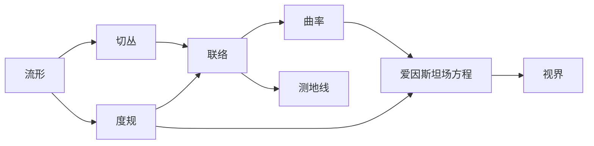

# 微分几何入门与广义相对论：非涨视界

关键词：微分几何、黎曼几何、广义相对论、时空、度规、测地线、曲率、爱因斯坦场方程、视界、黑洞

## 1. 背景介绍
### 1.1 问题的由来
自从爱因斯坦提出广义相对论以来，人们对时空的本质有了全新的认识。广义相对论告诉我们，时空不再是牛顿力学中的绝对存在，而是动态变化的、与物质场紧密相连的实体。这一理论不仅成功解释了水星近日点进动等问题，更预言了黑洞、引力波等令人惊叹的现象。然而，要真正理解广义相对论，微分几何的知识是不可或缺的。

### 1.2 研究现状
目前，广义相对论已经成为描述引力相互作用的标准理论，并在天文学、宇宙学等领域取得了巨大成功。人们利用广义相对论对黑洞、中子星、引力波、宇宙大尺度结构等进行了深入研究。同时，微分几何作为广义相对论的数学基础，其研究也日益深入。现代微分几何已经发展出了众多分支，如黎曼几何、辛几何、拓扑、复几何等，极大地丰富了我们对几何的理解。

### 1.3 研究意义
深入学习微分几何和广义相对论，不仅有助于我们理解宇宙的本质，更能启发我们用全新的视角看待世界。广义相对论改变了我们对时空的认知，揭示了时空与物质场的辩证统一关系。微分几何则为我们提供了研究曲面、流形等复杂几何对象的有力工具。这些知识不仅在物理学领域大放异彩，在计算机图形学、机器人控制、图像处理等工程领域也有广泛应用。

### 1.4 本文结构
本文将从微分几何的基本概念出发，循序渐进地介绍黎曼几何、广义相对论的核心内容。我们将重点讨论联络、曲率、测地线等概念，并用可视化的例子直观展示它们的几何意义。在此基础上，我们将引出爱因斯坦场方程，并探讨其在黑洞、宇宙学中的应用。同时，我们还将介绍视界的概念，特别是非涨视界的性质及其物理意义。在文章的最后，我们将总结微分几何和广义相对论的研究现状与未来挑战，并提供一些学习资源和常见问题解答，帮助读者进一步探索这一迷人的领域。

## 2. 核心概念与联系

在开始详细讨论之前，我们先来了解一下微分几何和广义相对论中的一些核心概念，以及它们之间的联系。

- 流形(Manifold)：一个局部类似于欧氏空间 $\mathbb{R}^n$ 的空间，是微分几何研究的基本对象。时空在广义相对论中被建模为一个4维流形。

- 切丛(Tangent Bundle)：由流形上每一点的所有切向量构成的空间，反映了流形的局部性质。物理学中的矢量场、张量场都是建立在切丛之上的。

- 度规(Metric)：一种用来衡量流形上两点之间"距离"的工具，由对称的(0,2)型张量场给出。在广义相对论中，时空度规蕴含了引力场的信息。

- 联络(Connection)：定义了流形上的平行移动和协变导数，刻画了曲面的内蕴几何性质。广义相对论中的引力场可以用时空的联络来描述。

- 曲率(Curvature)：度量流形局部弯曲程度的量，由黎曼曲率张量给出。广义相对论将引力解释为时空曲率的效应。

- 测地线(Geodesic)：流形上的"直线"，是两点之间的最短路径。自由下落的粒子在时空中运动的轨迹就是测地线。

- 爱因斯坦场方程(Einstein Field Equations)：描述了时空几何与物质分布之间的关系，是广义相对论的核心方程。

- 视界(Horizon)：指引力场中的一种边界，标志着因果结构的变化。非涨视界是一类重要的视界，与黑洞息息相关。

这些概念环环相扣，共同构成了微分几何和广义相对论的基础。在后文中，我们将更详细地讨论它们的数学定义和物理意义，并通过丰富的例子加深理解。

## 3. 核心算法原理 & 具体操作步骤
### 3.1 算法原理概述
在微分几何和广义相对论中，有许多重要的算法和计算方法，如克氏符计算、测地线方程求解、曲率张量计算等。这里我们以测地线方程的求解为例，介绍其基本原理。

测地线方程可以从哈密顿原理(Hamilton's Principle)出发推导。考虑一条参数曲线 $x^\mu(\lambda)$，其作用量(Action)为：

$$S=\int L(x,\dot{x})d\lambda=\int \sqrt{g_{\mu\nu}\dot{x}^\mu\dot{x}^\nu}d\lambda$$

其中 $L$ 是拉格朗日量(Lagrangian)，$g_{\mu\nu}$ 是度规张量，$\dot{x}^\mu=\frac{dx^\mu}{d\lambda}$。根据哈密顿原理，测地线应该使作用量取极值。利用变分法可以导出测地线方程：

$$\ddot{x}^\mu+\Gamma^\mu_{\nu\rho}\dot{x}^\nu\dot{x}^\rho=0$$

其中 $\Gamma^\mu_{\nu\rho}$ 是克氏符(Christoffel Symbol)，由度规张量及其导数决定。

### 3.2 算法步骤详解
求解测地线方程的具体步骤如下：

1. 给定度规张量 $g_{\mu\nu}$，计算克氏符 $\Gamma^\mu_{\nu\rho}$。
2. 将克氏符代入测地线方程，得到一组二阶非线性常微分方程组。
3. 指定初始条件，即测地线的起点坐标和初始切向量。
4. 利用数值方法，如龙格-库塔法(Runge-Kutta Method)，求解常微分方程组，得到测地线的参数方程。
5. 将参数方程代入度规张量，计算测地线的长度，即两点之间的"距离"。

### 3.3 算法优缺点
测地线方程求解算法的优点在于：
- 直观明了，容易理解和实现。
- 适用于任意黎曼流形，具有普适性。
- 可以与数值方法结合，高效求解复杂问题。

但该算法也存在一些局限性：
- 求解非线性方程组的计算量较大，对高维流形可能效率较低。
- 对奇点、视界等特殊结构的处理比较困难。
- 无法直接求解测地线的全局性质，如共轭点、焦点等。

### 3.4 算法应用领域
测地线方程求解算法在广义相对论、天文学等领域有广泛应用，如：
- 计算黑洞时空中的粒子运动轨迹。
- 研究引力透镜效应和光线弯曲现象。
- 分析宇宙学模型中的测地线偏离和尺度因子演化。
- 探索时空奇点、视界、因果结构等几何性质。

同时，该算法也启发了计算机图形学、最优控制等领域的相关研究，如曲面参数化、最短路径规划等。

## 4. 数学模型和公式 & 详细讲解 & 举例说明
### 4.1 数学模型构建
为了研究非涨视界的性质，我们需要建立合适的数学模型。考虑一个D维时空流形 $(M,g)$，其中 $g$ 是洛伦兹度规(Lorentzian Metric)。设 $\Sigma$ 是 $M$ 中的一个 $(D-1)$ 维空间超曲面，如果 $\Sigma$ 上任意两点的因果关系与整个时空一致，那么称 $\Sigma$ 为一个视界(Horizon)。

进一步，如果视界 $\Sigma$ 上的面积元在视界生成者(Horizon Generator)的作用下不变，即满足

$$\mathcal{L}_\xi\sqrt{\gamma}=0$$

其中 $\xi$ 是视界生成者，$\gamma$ 是 $\Sigma$ 的诱导度规，$\mathcal{L}$ 表示李导数(Lie Derivative)，那么称 $\Sigma$ 为非涨视界(Non-expanding Horizon)。

### 4.2 公式推导过程
为了刻画非涨视界的几何性质，我们引入以下量：

- 诱导度规(Induced Metric)：$\gamma_{ab}=g_{\mu\nu}e^\mu_ae^\nu_b$，其中 $e^\mu_a$ 是 $\Sigma$ 上的基向量。
- 外曲率(Extrinsic Curvature)：$K_{ab}=e^\mu_ae^\nu_b\nabla_\mu n_\nu$，其中 $n^\mu$ 是 $\Sigma$ 的法向量，$\nabla$ 是 $M$ 上的联络。
- 扩张(Expansion)：$\theta=\gamma^{ab}K_{ab}$，度量了视界面积元的变化率。

对于非涨视界，由定义可知 $\theta=0$。利用视界生成者 $\xi$ 的性质，可以进一步推导出：

$$R_{\mu\nu}\xi^\mu\xi^\nu|_\Sigma=0$$

其中 $R_{\mu\nu}$ 是 $M$ 的里奇曲率(Ricci Curvature)。这个条件称为零扩张方程(Zero Expansion Equation)，反映了非涨视界上的几何约束。

### 4.3 案例分析与讲解
下面我们以史瓦西时空(Schwarzschild Spacetime)为例，说明非涨视界的性质。史瓦西度规描述了一个球对称黑洞的时空几何，其线元为：

$$ds^2=-\left(1-\frac{2M}{r}\right)dt^2+\left(1-\frac{2M}{r}\right)^{-1}dr^2+r^2(d\theta^2+\sin^2\theta d\phi^2)$$

其中 $M$ 是黑洞质量，$(t,r,\theta,\phi)$ 是坐标。在 $r=2M$ 处存在一个视界，称为事件视界(Event Horizon)。可以验证，该视界满足非涨条件，即 $\theta=0$。视界生成者为 $\xi=\partial_t+\frac{1}{2M}\partial_r$，沿着它的积分曲线(即视界生成者)运动的观者将永远留在视界上。

此外，利用零扩张方程，可以推导出视界上的几何性质，如视界截面的面积为 $A=16\pi M^2$，高斯曲率(Gaussian Curvature)为 $K=\frac{1}{4M^2}$ 等。这些结果与黑洞热力学定律密切相关，如面积定理(Area Theorem)、黑洞熵公式等。

### 4.4 常见问题解答
问：非涨视界与视界有何区别？
答：视界是一个因果边界，标志着时空因果结构的变化。非涨视界则进一步要求视界面积元不随时间演化，反映了视界的"静止性"。所有非涨视界都是视界，但并非所有视界都是非涨的。

问：非涨视界在黑洞物理中有何重要意义？
答：非涨视界提供了描述黑洞的新视角。许多重要的黑洞性质，如黑洞热力学、霍金辐射等，都与非涨视界密切相关。非涨视界上的零扩张方程给出了视界几何与黑洞参数之间的约束关系，是研究黑洞物理的重要工具。

问：非涨视界能否用来描述真实的天体？
答：是的。许多真实天体，如黑洞、中子星等，都可以用带有非涨视界的时空模型来近似描述。当然，由于天体环境的复杂性，实际情况可能与理想模型有一定偏差。但非涨视界作