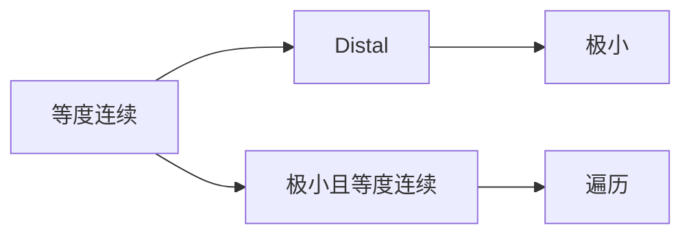

# 拓扑动力系统概论：distality与等度连续性

关键词：拓扑动力系统、distality、等度连续性、极小性、遍历性、混沌系统

## 1. 背景介绍

### 1.1  问题的由来

拓扑动力系统是数学、物理学、计算机科学等领域的重要研究对象。它描述了一类在拓扑空间上演化的动力学行为，蕴含着丰富的动力学性质和几何结构。Distality与等度连续性是拓扑动力系统的两个重要概念，它们刻画了系统的渐近行为和稳定性。深入理解和研究这两个性质，对于揭示复杂系统的本质规律具有重要意义。

### 1.2  研究现状

国内外学者对拓扑动力系统的distality和等度连续性开展了广泛深入的研究。Furstenberg最早提出了distality的概念，并系统研究了distal系统的性质。Veech、Auslander等人进一步发展了distality理论，揭示了它与极小性、遍历性等重要性质的内在联系。Ellis、Gottschalk、Hedlund等学者对等度连续性进行了开创性研究，建立了等度连续系统的一般理论框架。近年来，随着符号动力系统、计算机辅助验证等新方法的引入，distality和等度连续性的研究取得了新的进展和突破。

### 1.3  研究意义

Distality与等度连续性研究对于理解拓扑动力系统的本质具有重要意义。许多重要的动力学性质，如极小性、遍历性、混沌等，都与distality和等度连续性有着内在联系。深入研究这两个概念，有助于从动力学和几何的角度揭示复杂系统的演化规律，对于发展新的动力系统理论和方法具有重要的启示作用。同时，distality和等度连续性在物理学、工程学、生命科学等领域也有广泛应用，如混沌控制、生物节律调控等，因此加强这方面的研究具有重要的理论价值和实际意义。

### 1.4  本文结构

本文将围绕distality与等度连续性这两个核心概念，系统阐述拓扑动力系统的基本理论和研究进展。第2部分给出相关概念的数学定义，分析它们之间的逻辑联系。第3部分介绍判定distality和等度连续性的主要算法原理和操作步骤。第4部分建立相关数学模型，推导重要定理和公式，并通过案例加以说明。第5部分通过代码实例，演示如何用计算机辅助方法研究具体系统的性质。第6部分讨论distality和等度连续性在混沌控制、密码学等领域的应用场景。第7部分推荐相关学习资源、开发工具和文献。第8部分总结全文，展望未来发展方向和挑战。

## 2. 核心概念与联系

为方便讨论，首先给出一些基本概念的数学定义。设 $(X,T)$ 为一个拓扑动力系统，其中 $X$ 是紧致度量空间，$T:X\to X$ 为连续满射。

**Definition 1** (distal点)  
若 $x\in X$ 满足：对任意 $y\in X$，若 $y\neq x$，则 $\inf_{n\in\mathbb{Z}}d(T^nx,T^ny)>0$。则称 $x$ 为distal点。

**Definition 2** (distal系统)  
若 $(X,T)$ 中每一点都是distal点，则称 $(X,T)$ 为distal系统。

**Definition 3** (等度连续)  
若对任意 $\varepsilon>0$，存在 $\delta>0$，使得对所有的 $x,y\in X$，只要 $d(x,y)<\delta$，就有对所有的 $n\in\mathbb{Z}$，都有 $d(T^nx,T^ny)<\varepsilon$。则称 $T$ 是等度连续的。

**Definition 4** (极小性)  
若 $(X,T)$ 不包含真子系统，则称其为极小系统。

**Definition 5** (遍历性)  
若对任意非空开集 $U\subset X$，存在 $N\in\mathbb{N}$，使得 $\bigcup_{n=0}^{N-1}T^{-n}(U)=X$。则称 $(X,T)$ 为遍历系统。

这些性质之间存在着密切联系：

**Proposition 1**  
每个distal系统都是极小的。

**Proposition 2**  
每个等度连续系统都是distal的。

**Proposition 3**  
每个极小的等度连续系统都是遍历的。

由此可见，distality和等度连续性与极小性、遍历性等经典性质有着深刻的内在关联。下图概括了它们之间的逻辑关系：

## 3. 核心算法原理 & 具体操作步骤

### 3.1  算法原理概述

判定一个拓扑动力系统是否具有distality或等度连续性并非易事。一般需要借助一些重要的判别法和计算工具。下面介绍几种主要的判定算法原理。

**算法1：Furstenberg判别法**  
Furstenberg提出了一种判定distal系统的充要条件：$(X,T)$ 是distal的，当且仅当乘积系统 $(X\times X,T\times T)$ 的对角线 $\Delta=\{(x,x):x\in X\}$ 是极小集。这个判别法将distality问题转化为极小性问题。

**算法2：Ellis等价关系法**  
Ellis引入一种等价关系 $E\subset X\times X$：$(x,y)\in E$ 当且仅当存在nets $x_i,y_i\in X$ 和 $n_i\in\mathbb{Z}$，使得当 $i\to\infty$ 时，$x_i\to x$，$y_i\to y$，且 $d(T^{n_i}x_i,T^{n_i}y_i)\to 0$。可以证明，$(X,T)$ 是distal的，当且仅当 $E=\Delta$。

**算法3：不动点法**  
对于等度连续性，一个重要判别法是：$(X,T)$ 等度连续，当且仅当对任意 $\varepsilon>0$，存在 $\delta>0$，使得对任意 $x\in X$，映射 $T_\delta:X\to X$，$y\mapsto T^ny$ 在 $B(x,\delta)$ 上有不动点，其中 $n$ 为任意整数，$B(x,\delta)$ 为 $x$ 的 $\delta$ 邻域。

### 3.2  算法步骤详解

下面以Furstenberg判别法为例，详细说明判定distality的具体步骤。

**输入：** 拓扑动力系统 $(X,T)$  
**输出：** $(X,T)$ 是否为distal系统

**Step 1:** 构造乘积系统 $(X\times X,T\times T)$。  
**Step 2:** 取对角线 $\Delta=\{(x,x):x\in X\}\subset X\times X$。  
**Step 3:** 判断 $\Delta$ 在 $(X\times X,T\times T)$ 中是否为极小集。可借助计算机辅助工具进行验证。  
**Step 4:** 若 $\Delta$ 为极小集，则 $(X,T)$ 为distal系统；否则不是distal的。

其他算法的操作步骤也可参照上述思路，通过转化为已知问题来求解。

### 3.3  算法优缺点

上述几种算法各有优缺点。Furstenberg判别法直观易懂，但在实际应用中构造乘积系统可能比较困难。Ellis等价关系法理论上很优美，但对一般系统验证 $E=\Delta$ 并不容易。不动点法对于判定等度连续性很有效，但寻找合适的不动点可能需要复杂的计算。总的来说，要根据具体问题选择合适的判定算法。

### 3.4  算法应用领域

判定distality和等度连续性的算法在动力系统研究中有广泛应用。利用这些算法，可以判别具体系统的性质，揭示系统的渐近行为和稳定性，为深入研究复杂动力学奠定基础。同时，这些算法思想也可以推广到其他数学领域，如遍历论、泛函分析等，用于解决相关判定问题。

## 4. 数学模型和公式 & 详细讲解 & 举例说明

### 4.1  数学模型构建

为刻画拓扑动力系统的distality和等度连续性，需要建立合适的数学模型。最常用的是度量动力系统模型。设 $(X,d)$ 为紧致度量空间，$T:X\to X$ 为 $X$ 上的连续映射，则 $(X,T)$ 构成一个度量动力系统。利用度量的性质，可以方便地描述distality和等度连续性。同时，符号动力系统也是一类重要的研究对象。对于符号空间 $\Sigma_n=\{1,2,\cdots,n\}^{\mathbb{Z}}$，平移映射 $\sigma:\Sigma_n\to\Sigma_n$，$(x_i)_{i\in\mathbb{Z}}\mapsto(x_{i+1})_{i\in\mathbb{Z}}$ 生成符号动力系统 $(\Sigma_n,\sigma)$。许多distality和等度连续性的重要性质可以在符号系统上得到直观体现。

### 4.2  公式推导过程

利用数学模型，可以推导出一些重要定理和判别准则。例如，判定distality的一个充分条件为：

**Theorem 1**  
设 $(X,T)$ 为拓扑动力系统，$X$ 为紧致度量空间。若存在 $\delta>0$，使得对任意两点 $x,y\in X$，若 $d(x,y)\geq\delta$，则 $\inf_{n\in\mathbb{Z}}d(T^nx,T^ny)\geq\delta$。则 $(X,T)$ 为distal系统。

证明思路如下：  
假设 $(X,T)$ 不是distal的，则存在 $x\neq y$，使得 $\inf_{n\in\mathbb{Z}}d(T^nx,T^ny)=0$。从而存在 $\{n_i\}_{i=1}^\infty$，使得 $d(T^{n_i}x,T^{n_i}y)\to 0$。但由条件知，只要 $d(T^{n_i}x,T^{n_i}y)<\delta$，就有 $d(T^{n_i}x,T^{n_i}y)<\delta$。矛盾！所以 $(X,T)$ 必为distal系统。

类似地，可以推导出等度连续性的一些判别法，如：

**Theorem 2**  
设 $(X,T)$ 为拓扑动力系统，$X$ 为紧致度量空间。若对任意 $\varepsilon>0$，存在 $\delta>0$，使得对任意 $x\in X$，$\mathrm{diam}(T^n(B(x,\delta)))<\varepsilon$ 对一切 $n\in\mathbb{Z}$ 成立，其中 $B(x,\delta)$ 为 $x$ 的 $\delta$ 邻域，则 $T$ 等度连续。

### 4.3  案例分析与讲解

下面通过一个具体例子来说明distality的判定过程。

**Example 1**  
设 $X=\mathbb{R}/\mathbb{Z}$ 为单位圆周，$T:X\to X$，$x\mapsto x+\alpha$，其中 $\alpha$ 为无理数。证明：$(X,T)$ 为distal系统。

证明：  
对任意两点 $x,y\in X$，$x\neq y$，设 $d(x,y)=\varepsilon>0$。由于 $\alpha$ 为无理数，故对任意 $n\in\mathbb{Z}$，$d(T^nx,T^ny)=d(x+n\alpha,y+n\alpha)=d(x,y)=\varepsilon$。从而，$\inf_{n\in\mathbb{Z}}d(T^nx,T^ny)=\varepsilon>0$。故 $x$ 为distal点。又因为 $x,y$ 的选取是任意的，所以每个点都是distal点，即 $(X,T)$ 为distal系统。

这个例子直观地展示了无理旋转在单位圆周上的distal性质。利用无理数的性质，我们证明了任意两点在迭代过程中的距离是保持不变的，从而系统整体是distal的。

### 4.4  常见