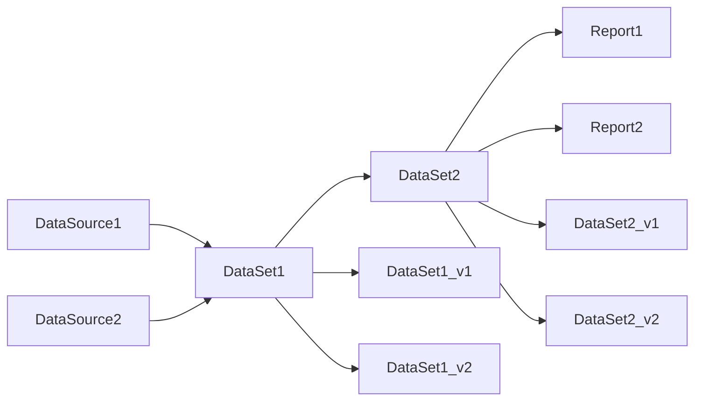

# 数据版本管理与数据谱系原理与代码实战案例讲解

作者：禅与计算机程序设计艺术 / Zen and the Art of Computer Programming

关键词：数据版本管理、数据谱系、数据血缘、数据版本控制、数据溯源、元数据管理

## 1. 背景介绍
### 1.1 问题的由来
在当今大数据时代,企业每天都会产生和处理海量的数据。这些数据可能来自不同的源系统、经过多次转换和加工,最终流向各个业务系统。然而,如何有效地管理和追踪这些纷繁复杂的数据流动,成为了一个亟待解决的问题。传统的数据管理方式难以应对数据规模的急剧膨胀和数据处理流程的日益复杂,导致数据管理成本高昂、数据质量难以保证、数据问题难以定位等一系列挑战。

### 1.2 研究现状
近年来,学术界和工业界都在积极探索数据版本管理和数据谱系技术,以期从根本上解决上述数据管理难题。一些知名的开源项目如Apache Atlas、LinkedIn DataHub、Amundsen等都在这一领域进行了有益的尝试。各大云厂商也纷纷推出了自己的数据治理和数据目录服务,如AWS Glue、Azure Purview等。但总的来说,当前的研究还处于起步阶段,在理论框架、技术实现、应用实践等方面都有待进一步深入和完善。

### 1.3 研究意义
数据版本管理和数据谱系作为数据治理的核心环节,对保障数据资产安全、提升数据价值都有重要意义:

1. 全面掌控数据资产,提高数据管理效率
2. 快速定位数据质量问题,保障数据应用安全
3. 梳理数据血缘关系,促进数据价值挖掘
4. 支撑数据合规和审计,满足监管要求

因此,深入研究数据版本管理与数据谱系的理论与实践,对于推动数据治理体系建设、夯实数字化转型根基具有重要价值。

### 1.4 本文结构
本文将从以下几个方面对数据版本管理与数据谱系展开系统性探讨:

1. 介绍数据版本管理与数据谱系的核心概念和内在联系
2. 剖析数据版本管理与数据谱系的核心算法原理和关键实现步骤 
3. 建立数据版本演进和数据血缘分析的数学模型,并结合案例详细讲解
4. 给出数据版本管理与数据谱系的代码实例,并进行逐行解释说明
5. 总结数据版本管理与数据谱系的典型应用场景及实践经验
6. 梳理数据版本管理与数据谱系领域的学习资源、开发工具等
7. 展望数据版本管理与数据谱系技术的未来发展趋势和面临的挑战
8. 归纳数据版本管理与数据谱系的常见问题,并给出参考答案

## 2. 核心概念与联系
数据版本管理和数据谱系是两个紧密相关又相对独立的概念。

数据版本管理(Data Version Control)是指以版本化的方式管理数据的变更历史,包括记录每次数据变更的时间、变更人、变更内容、变更原因等,并能方便地查询和回滚到任意历史版本。它的核心诉求是保障数据的可追溯性和可复原性。

数据谱系(Data Lineage)又称数据血缘,它关注的是数据的来龙去脉,即数据从产生到消亡的整个生命周期中,经过了哪些加工转换、参与了哪些计算逻辑、影响了哪些其他数据、被哪些下游应用所使用等。数据谱系的核心诉求是理清数据资产的内在联系,便于开展影响分析、溯源分析等。

从概念定义可以看出,数据版本管理和数据谱系分别从时间维度和空间维度刻画了数据的演变轨迹。二者相辅相成,缺一不可:
- 数据谱系图中的每个数据节点,都可能有多个版本,需要通过数据版本管理来记录其变更历史。反过来,每次数据变更,除了记录变更的元信息外,还需要更新数据谱系图中的边和节点。
- 数据谱系图是开展数据版本跟踪和比对的重要依据。利用数据谱系图,可以清晰地展示出某个数据版本与其他版本的差异;同时当需要回滚数据时,数据谱系图可以帮助分析回滚操作的影响范围,防止出现数据不一致。

下面是一个简单的数据版本管理与数据谱系的示意图:



在该图中,`DataSource1`和`DataSource2`是原始数据源,`DataSet1`和`DataSet2`是经过加工处理后的数据集,`Report1`和`Report2`是由`DataSet2`生成的报表。箭头代表了数据流动方向,体现了数据谱系关系。

同时,`DataSet1`和`DataSet2`分别有两个版本`v1`和`v2`,反映了它们的变更历史。通过数据版本管理,可以方便地追踪和比对每个数据集的不同版本,并在需要时进行回滚。

## 3. 核心算法原理 & 具体操作步骤
### 3.1 算法原理概述
数据版本管理和数据谱系的核心是元数据管理,即如何有效地采集、存储、计算数据资产的各种元信息,包括数据的业务属性、技术属性、血缘关系、版本变更等。目前主流的技术方案有:
1. 日志解析:通过分析应用程序、调度工具、数据库等系统的日志,提取元数据。
2. 语义分析:通过解析SQL、代码等,推断数据之间的语义关联。
3. 数据指纹:通过求取数据集的哈希签名,比对不同版本的差异。
4. 人工标注:通过可视化界面,供用户手动录入、管理元数据。

以上方法通常会组合使用,形成一套完整的元数据采集和管理方案。在元数据的存储方面,通常采用图数据库,以便于表达复杂的数据血缘关系。

### 3.2 算法步骤详解
下面以日志解析+语义分析为例,详细说明数据版本管理和数据谱系的实现步骤。

**步骤一:日志收集**
- 在数据处理流程的各个环节(如数据采集、ETL、数据分发等),嵌入日志收集器,实时记录下任务执行的时间、输入输出数据集、调用参数等信息。
- 日志通常会先缓存在消息队列,再异步写入日志分析引擎。

**步骤二:日志解析**
- 日志分析引擎从消息队列中读取日志,按照预定义的解析规则提取关键元数据,如任务的调用关系、数据的产生和消费关系等。
- 将解析出的元数据发送到元数据管理系统,通常是图数据库。

**步骤三:语义分析**
- 在任务执行时,将SQL、代码等传递给语义分析引擎。
- 语义分析引擎通过词法分析、语法分析等技术,推断出数据表、字段之间的语义关联,如JOIN、UNION等。 
- 将分析出的语义关联写入元数据管理系统。

**步骤四:谱系图构建**
- 元数据管理系统基于采集到的元数据,构建数据谱系图。
- 谱系图通常包含数据表、字段、任务、血缘边等。
- 当元数据发生变化时(如任务的重跑、数据表的新增),谱系图也要实时更新。

**步骤五:版本管理**
- 当数据发生变更时,触发新版本的生成。
- 利用哈希算法等技术,比对新旧版本的差异,并记录下版本号、变更时间、变更人等信息。
- 变更元数据写入元数据管理系统,谱系图中相应的边和节点也要更新。

**步骤六:可视化展示**
- 利用图可视化技术,为用户提供数据谱系和版本的可视化浏览界面。
- 用户可以在界面上检索数据资产,浏览谱系关系,追溯数据版本,比对版本差异等。

### 3.3 算法优缺点
上述"日志解析+语义分析"的元数据采集方案,具有如下优点:
1. 覆盖全面:可采集任务调度、数据流动等各环节的元数据。
2. 实时性好:通过日志实时采集,元数据可以快速更新。
3. 自动化程度高:除了日志解析规则需要人工配置外,其他环节皆可自动完成。

但它也存在一些局限性:
1. 日志解析规则难以统一,针对不同的日志格式需要定制开发,工作量大。
2. 语义分析只能提取数据的结构化血缘,难以分析业务语义。
3. 缺少用户参与,难以应对复杂的业务逻辑。

因此,实践中通常需要将该方案与人工标注等方法相结合,以构建全面准确的元数据知识库。

### 3.4 算法应用领域
数据版本管理和数据谱系作为数据治理的基础设施,在以下领域有广泛应用:
1. 数据质量管理:通过数据谱系,快速定位和追溯数据质量问题。
2. 数据安全合规:利用谱系关系,开展数据溯源和影响分析,满足合规要求。
3. 数据资产盘点:借助版本管理和谱系管理,全面盘点和梳理数据资产。
4. 元数据管理:谱系图是组织和管理元数据的重要工具。

总之,在当前复杂的数据环境下,数据版本管理与谱系已成为了数据治理不可或缺的利器。

## 4. 数学模型和公式 & 详细讲解 & 举例说明
### 4.1 数学模型构建
我们可以用一个有向无环图(DAG)来刻画数据资产之间的血缘关系。设图$G=(V, E)$,其中:
- $V$表示顶点集,每个顶点代表一个数据资产(如数据库、数据表、字段、报表等)
- $E$表示有向边集,如果数据资产$v_i$经过加工处理生成了$v_j$,则存在一条有向边$e_{ij}$

对于$V$中的每个顶点$v_i$,引入以下属性:
- $v_i.id$:唯一标识数据资产的ID
- $v_i.type$:数据资产的类型,如`table`、`field`等
- $v_i.name$:数据资产的名称
- $v_i.version$:数据资产的版本号
- $v_i.owner$:数据资产的所有者
- $v_i.update\_time$:数据资产的更新时间

对于$E$中的每条边$e_{ij}$,引入以下属性:
- $e_{ij}.id$:唯一标识血缘关系的ID
- $e_{ij}.type$:血缘关系的类型,如`derive`(数据派生)、`compose`(数据组装)等
- $e_{ij}.expression$:数据加工逻辑的表达式,如SQL语句
- $e_{ij}.operator$:数据操作人
- $e_{ij}.operate\_time$:数据操作时间

### 4.2 公式推导过程
基于上述数学模型,我们可以推导出一些常用的数据谱系和影响分析公式。

**公式一:数据溯源**

给定数据资产$v_i$,如何找到其所有上游数据资产(即数据来源)?

令$S_i$表示$v_i$的上游数据资产集合,初始时$S_i=\emptyset$。
```math
\begin{aligned}
S_i &= S_i \cup \{v_j | e_{ji} \in E\} \\
&= S_i \cup \{v_j | \exists e_{ji}\} \\
&= \{v_j | \exists \text{path}