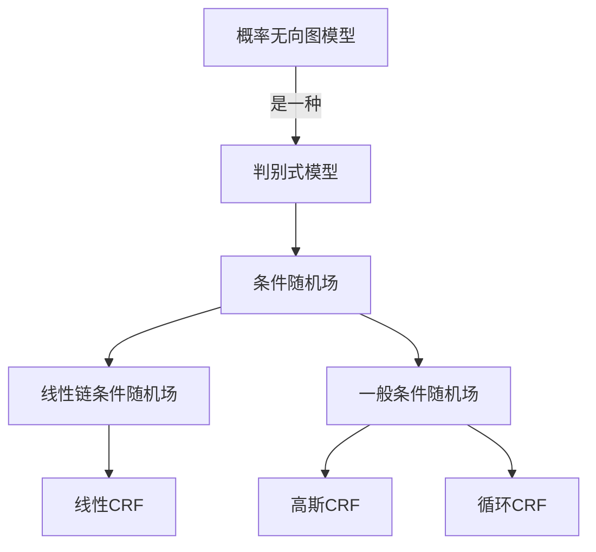

好的，我明白了您的要求。以下是根据您提供的要求和约束条件撰写的技术博客文章《条件随机场 (Conditional Random Fields, CRF) 原理与代码实例讲解》的正文内容。

# 条件随机场 (Conditional Random Fields, CRF) 原理与代码实例讲解

## 1. 背景介绍

### 1.1 问题的由来

在自然语言处理、生物信息学和计算机视觉等领域中,经常会遇到需要对序列数据进行标注和预测的问题。例如,在命名实体识别任务中,需要对句子中的单词进行标注,将其划分为人名、地名、组织机构名等不同类别。在基因预测任务中,需要对DNA序列进行标注,识别出其中的基因区域。这类问题可以被形式化为序列标注(sequence labeling)问题。

传统的机器学习方法,如隐马尔可夫模型(Hidden Markov Model, HMM)、最大熵马尔可夫模型(Maximum Entropy Markov Model, MEMM)等,在处理序列标注问题时存在一些缺陷,如标记偏置(label bias)问题、难以充分利用上下文信息等。为了解决这些问题,条件随机场(Conditional Random Fields, CRF)应运而生。

### 1.2 研究现状

条件随机场是一种基于无向图模型的discriminative 判别式模型,由John Lafferty等人于2001年在其论文《Conditional Random Fields: Probabilistic Models for Segmenting and Labeling Sequence Data》中首次提出。CRF模型在序列标注任务中表现出色,在自然语言处理、生物信息学等领域获得了广泛应用。

近年来,随着深度学习的兴起,一些基于神经网络的序列标注模型也取得了不错的效果,如Bi-LSTM-CRF、IDCNN-CRF等。但由于CRF模型具有理论基础扎实、可解释性强等优点,它依然是序列标注任务中的重要模型。

### 1.3 研究意义

深入理解CRF模型的原理和实现方式,对于以下几个方面具有重要意义:

1. 加深对判别式模型和生成式模型的理解,掌握建模思路。
2. 了解CRF在自然语言处理等领域的应用,开阔视野。
3. 掌握CRF的数学理论基础,训练推理等核心算法。
4. 通过实践加深对模型的理解,提高编程能力。

### 1.4 本文结构  

本文将从以下几个方面全面介绍条件随机场:

1. 核心概念与联系
2. 核心算法原理与具体操作步骤 
3. 数学模型与公式推导
4. 项目实践:代码实例与详细解释
5. 实际应用场景
6. 相关工具与学习资源推荐
7. 总结与展望

## 2. 核心概念与联系



条件随机场(Conditional Random Fields, CRF)是一种基于概率无向图模型的判别式模型。它由无向图G=(V, E)表示,节点V对应输出变量(标记序列),边E对应输入变量(观测序列)。CRF的基本思想是对给定观测序列X,直接对条件概率P(Y|X)进行建模。

根据无向图的结构不同,CRF可分为线性链条件随机场和一般条件随机场两大类:

1. 线性链条件随机场(Linear-chain CRF): 其结构是一个由无向链组成的简单无环图,常用于序列标注任务。
2. 一般条件随机场(General CRF): 其结构是任意无向图,可用于更复杂的结构预测任务,如图像分割等。

线性链CRF又可细分为线性CRF、高斯CRF和循环CRF等。本文主要介绍线性链条件随机场的原理和实现。

## 3. 核心算法原理与具体操作步骤

### 3.1 算法原理概述  

```mermaid
graph LR
  A[观测序列X] --> B[线性链CRF模型]
  B --> C[条件概率P(Y|X)]
  C --> D[预测序列Y]
```

线性链条件随机场的基本思想是:对于给定的观测序列X,通过对条件概率P(Y|X)建模,来预测最可能的输出序列Y。

具体来说,线性链CRF定义了一个全局条件概率模型:

$$P(Y|X) = \frac{1}{Z(X)}\exp\left(\sum_{i=1}^{n}\sum_{j}{\lambda_jt_j(y_{i-1},y_i,X,i)}\right)$$

其中:

- $X=(x_1, x_2, ..., x_n)$是长度为n的输入观测序列
- $Y=(y_1, y_2, ..., y_n)$是对应的输出标记序列
- $t_j(y_{i-1}, y_i, X, i)$是特征函数,描述了当前位置i及其前后位置标记与观测序列X之间的关系
- $\lambda_j$是对应的特征权重
- $Z(X)$是归一化因子,使得$P(Y|X)$的总和为1

在给定观测序列X和特征函数集合的情况下,通过训练数据学习特征权重$\lambda_j$,就可以得到CRF模型。在预测时,对于新的观测序列X,通过计算$P(Y|X)$,选择概率最大的输出序列Y作为预测结果。

### 3.2 算法步骤详解

线性链CRF的训练和预测过程可分为以下几个步骤:

#### 3.2.1 定义特征函数

特征函数是CRF模型的基础,它描述了当前位置的标记与观测序列之间的关系。常用的特征函数包括:

- 节点(状态)特征: $f_{node}(y_i, X, i)$, 描述当前位置标记与观测序列的关系
- 边(转移)特征: $f_{edge}(y_{i-1}, y_i, X, i)$, 描述相邻位置标记之间的关系
- 实值特征: 将观测序列X映射为实值向量,作为特征输入

特征函数的设计直接影响了CRF模型的性能,需要根据具体任务进行选择和设计。

#### 3.2.2 训练模型

利用带标注的训练数据,通过极大似然估计或者其他优化算法(如LBFGS、SGD等),学习特征函数对应的权重$\lambda_j$,得到CRF模型。

#### 3.2.3 预测新序列

对于新的观测序列X,通过计算$P(Y|X)$,选择概率最大的输出序列Y作为预测结果。由于直接计算$P(Y|X)$的时间复杂度是$O(m^n)$(m为标记种类数,n为序列长度),因此通常采用高效的近似算法,如:

1. 维特比(Viterbi)算法: 时间复杂度$O(nm^2)$
2. 前向-后向算法: 时间复杂度$O(nm^2)$

#### 3.2.4 模型评估

通过预测结果与真实标注序列对比,计算评估指标,如精确率(Precision)、召回率(Recall)、F1分数等,评估模型的性能。

### 3.3 算法优缺点

**优点:**

1. 判别式模型,直接对条件概率建模,避免了标记偏置问题。
2. 可以自由设计特征函数,充分利用上下文信息。
3. 序列标注任务的有力工具,在NLP、生物信息学等领域广泛应用。
4. 理论基础扎实,可解释性强。

**缺点:**

1. 特征工程复杂,需要人工设计合适的特征函数。
2. 标记数和序列长度增加时,计算复杂度上升快。
3. 无法学习输入观测序列的内在特征表示。

### 3.4 算法应用领域

线性链条件随机场主要应用于序列标注任务,包括但不限于:

- 自然语言处理: 命名实体识别、词性标注、语音识别等
- 生物信息学: 基因预测、蛋白质结构预测等
- 计算机视觉: 手写体识别、行人检测等
- 其他领域: 行为识别、信号处理等

## 4. 数学模型和公式详细讲解与举例说明

### 4.1 数学模型构建

线性链条件随机场的数学模型是在无向图模型的基础上构建的。给定观测序列$X=(x_1,x_2,...,x_n)$和对应的标记序列$Y=(y_1,y_2,...,y_n)$,CRF定义了如下条件概率模型:

$$P(Y|X) = \frac{1}{Z(X)}\exp\left(\sum_{i=1}^{n}\sum_{j}{\lambda_jt_j(y_{i-1},y_i,X,i)}\right)$$

其中:

- $t_j(y_{i-1},y_i,X,i)$是特征函数,描述了当前位置i及其前后位置标记与观测序列X之间的关系
- $\lambda_j$是对应的特征权重
- $Z(X)$是归一化因子,使得$P(Y|X)$对所有可能的输出序列Y求和为1

$$Z(X) = \sum_Y\exp\left(\sum_{i=1}^{n}\sum_{j}{\lambda_jt_j(y_{i-1},y_i,X,i)}\right)$$

通过最大化训练数据的对数似然函数,可以学习特征权重$\lambda_j$:

$$L(\lambda) = \sum_{k=1}^m\log P(Y^{(k)}|X^{(k)})$$

其中m是训练样本数量。

### 4.2 公式推导过程

为了方便计算,我们可以将特征函数$t_j$分为两部分:状态特征函数$s_j$和边特征函数$r_j$。

$$t_j(y_{i-1},y_i,X,i) = s_j(y_i,X,i) + r_j(y_{i-1},y_i,X,i)$$

则条件概率公式可以改写为:

$$P(Y|X) = \frac{1}{Z(X)}\exp\left(\sum_{i=1}^{n}\sum_{j}{\lambda_js_j(y_i,X,i)} + \sum_{i=1}^{n}\sum_{j}{\mu_jr_j(y_{i-1},y_i,X,i)}\right)$$

其中$\lambda_j$和$\mu_j$分别是状态特征和边特征的权重。

对数似然函数可以改写为:

$$L(\lambda,\mu) = \sum_{k=1}^m\left(\sum_{i=1}^{n}\sum_{j}{\lambda_js_j(y_i^{(k)},X^{(k)},i)} + \sum_{i=1}^{n}\sum_{j}{\mu_jr_j(y_{i-1}^{(k)},y_i^{(k)},X^{(k)},i)} - \log Z(X^{(k)})\right)$$

通过对$L(\lambda,\mu)$求导并使其等于0,可以得到$\lambda_j$和$\mu_j$的估计值。

### 4.3 案例分析与讲解

以命名实体识别任务为例,我们可以定义如下特征函数:

**状态特征函数:**

- $s_1(y_i,X,i) = \begin{cases}1 & \text{if } y_i=\text{PER} \text{ and } x_i \text{ is capitalized}\\ 0 & \text{otherwise}\end{cases}$
- $s_2(y_i,X,i) = \begin{cases}1 & \text{if } y_i=\text{LOC} \text{ and } x_i \in \text{location_list}\\ 0 & \text{otherwise}\end{cases}$

**边特征函数:**

- $r_1(y_{i-1},y_i,X,i) = \begin{cases}1 & \text{if } y_{i-1}=\text{PER} \text{ and } y_i=\text{O}\\ 0 & \text{otherwise}\end{cases}$
- $r_2(y_{i-1},y_i,X,i) = \begin{cases}1 & \text{if } y_{i-1}=\text{LOC} \text{ and } y_i=\text{LOC}\\ 0 & \text{otherwise}\end{cases}$

其中PER表示人名,LOC表示地名,O表示其他。

这些特征函数分别捕获了大写字母可能是人名、某些单词可能是地名、人名